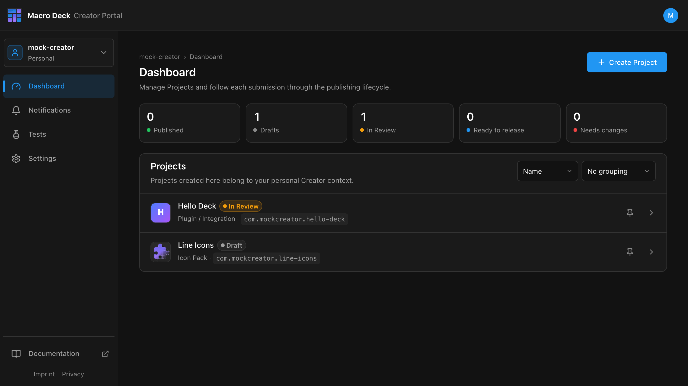

The Creator Portal is where you publish to the Macro Deck Store. Sign in with your Macro Deck account.



## What you can publish

| Project type | Published from | Guide |
| --- | --- | --- |
| Plugin / Integration | A build that a GitHub release uploads | [Publish a plugin](/creator-portal/publish-plugin/) |
| Icon Pack | A `.macroDeckIconPack` you upload | [Publish an icon pack](/creator-portal/publish-icon-pack/) |

## How it fits together

```text
Create Project  ->  Version  ->  Submit for Review  ->  Approved  ->  Store
                     ^
                     plugin: started from a build
                     icon pack: the uploaded file
```

- Every change goes through a review: new versions, but also the Display Name, the Store listing
  text and the images.
- An approved version cannot be changed. Fixes ship as a new version.
- The Store signs what it publishes. You never need a signing key or a secret.

## Pages

- [Projects and Store listing](/creator-portal/projects/): create a Project, fill in what the Store shows.
- [Publish a plugin](/creator-portal/publish-plugin/): repository, release workflow, builds, versions.
- [Publish an icon pack](/creator-portal/publish-icon-pack/): versions and package upload.
- [Review and release](/creator-portal/review/): what happens after you submit.
- [Testers](/creator-portal/testers/): let people install a plugin before it is reviewed.
- [Release workflow reference](/creator-portal/release-workflow/): inputs and error messages.
