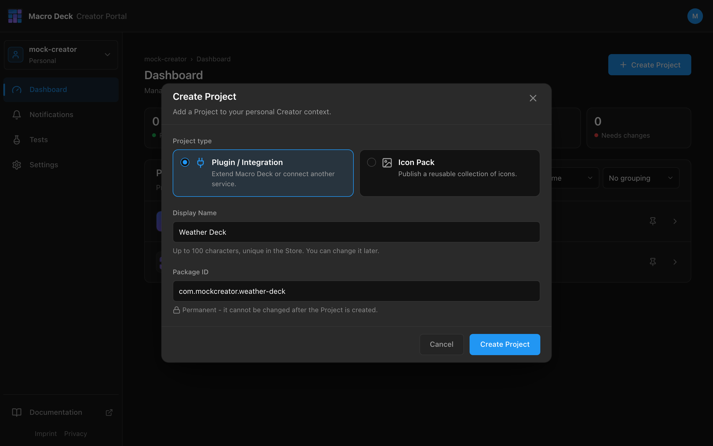
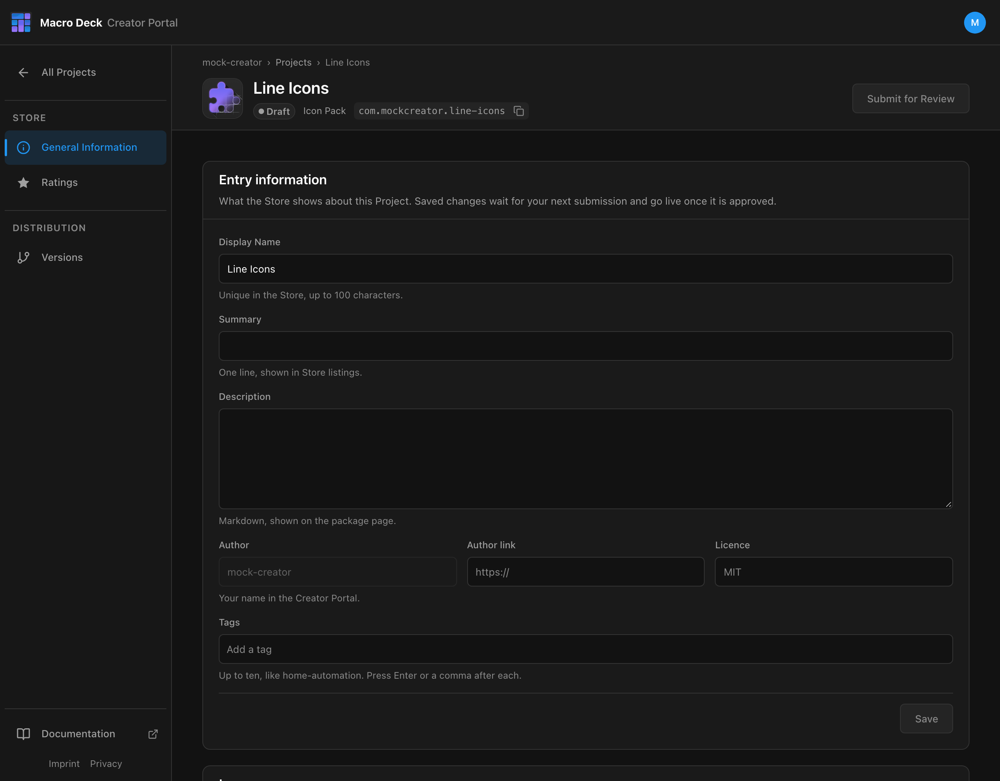
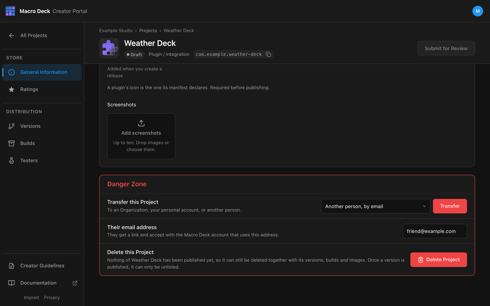
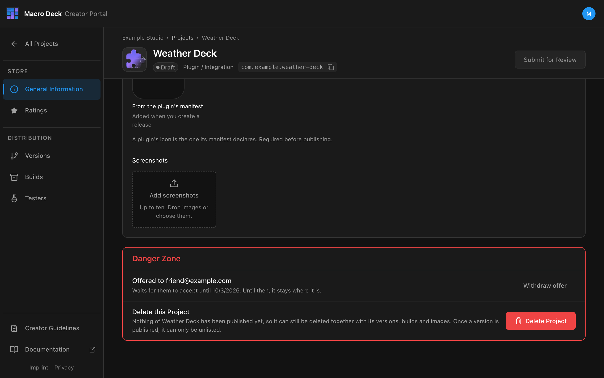
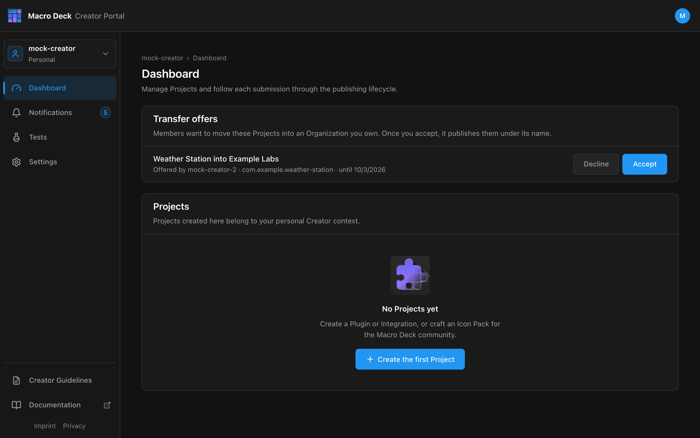
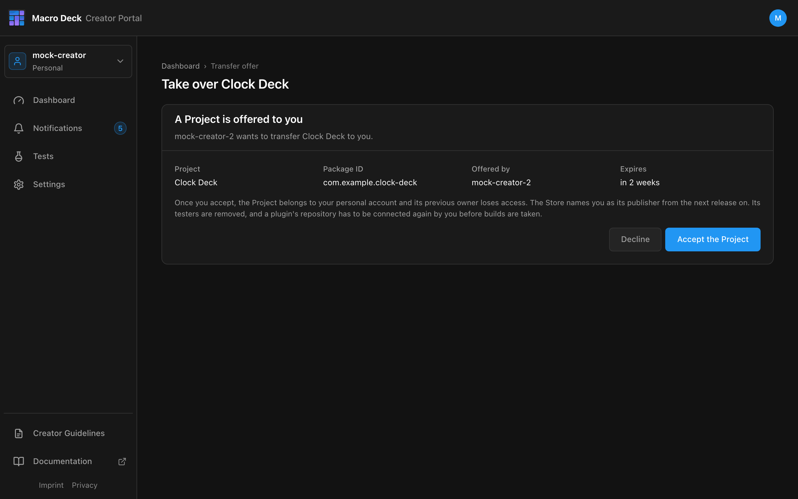

## Create a Project

On the **Dashboard**, select **Create Project**.

| Field | Example | Notes |
| --- | --- | --- |
| Project type | Plugin / Integration | Cannot be changed later. |
| Display Name | `Weather Deck` | Up to 100 characters, unique in the Store. Can be changed later. |
| Package ID | `com.example.weather-deck` | Permanent. For a plugin it must equal the `id` in its `manifest.json`. |

A Project starts as **Draft**. Nothing is public until a review is approved.

## Store listing

**General Information** holds what the Store shows about the Project.

| Field | Example |
| --- | --- |
| Summary | `Buttons that greet your deck.` |
| Description | Markdown, shown on the package page |
| Author link | `https://github.com/example` |
| Licence | `MIT` |
| Tags | `utilities`, `home-automation` (up to ten) |

- **Save** stages the changes. They go live with your next approved submission.
- A plugin's description, publisher and licence come from its `manifest.json`, so the portal only asks
  for the Summary and Tags.
- The Store listing falls back to the Display Name when there is no Summary.

## Images

| Image | Plugin | Icon pack |
| --- | --- | --- |
| Icon | From `manifest.json`, added when you create a release | Uploaded under **Images** |
| Screenshots | Up to ten | Up to ten |

A Project cannot be submitted without an icon. New images wait for review like the listing text.
Reordering screenshots that were already approved takes effect immediately.

## Transfer a Project

Under **General Information**, the **Danger Zone** transfers a Project to another publisher. Only its
owner can do this: you for your own Projects, the Owner for an Organization's. Choose where it goes,
select **Transfer**, and confirm with the Project's Display Name. The confirmation spells out what
changes.

| Where to | What happens |
| --- | --- |
| An Organization you own | It moves at once. |
| Your personal account (from an Organization you own) | It moves at once. |
| An Organization you are a Member of | Its Owner has to accept. Once they do, the Owner decides over the Project; you keep working on it as a Member. |
| Another person, by email | They get a link and accept with the Macro Deck account that uses this address. You lose access once they do. |

Until an offer is answered, the Project stays where it is and the Danger Zone shows it. **Withdraw
offer** takes it back. An offer expires after 14 days, and you are notified when it is accepted or
declined.

After a transfer:

- The Package ID stays the same, so installed copies keep updating.
- The Store shows the new publisher from the next release on, and releases are signed with the new
  publisher's key.
- For a plugin, the next build must name the new publisher as `publisher.name` in its `manifest.json`.
- It leaves the previous context. Everyone with access there, an Organization's Members included, loses it.

A transfer is refused while a review is in progress, an approved version waits to be released, or a
Store change is still running.

### Receiving a Project

An Owner finds offers for their Organization on the **Dashboard** under **Transfer offers**, where
they **Accept** or **Decline** them.

An offer to a person arrives as an email with a link. It only works for the Macro Deck account whose
verified email address it was sent to, and that account needs a Creator profile.

When a Project comes to you from another person, nothing of theirs comes along:

- Its testers and open tester invitations are removed.
- A plugin's repository has to be [connected again](/creator-portal/publish-plugin/#change-the-repository)
  by you, with your own GitHub access, before builds are taken from it. If the repository is not yours on GitHub yet,
  have its previous owner transfer it to you there first.
- Builds uploaded before the transfer cannot become your version; upload a new one.
- It cannot be transferred to a person while a version is in preparation.

## Delete or unlist

- **Delete Project** works until a version has been published. It removes the versions, builds and
  images.
- After that, a Project can only be unlisted: it disappears from the Store, but installed copies keep
  working and the Package ID stays taken. You can list it again later.
