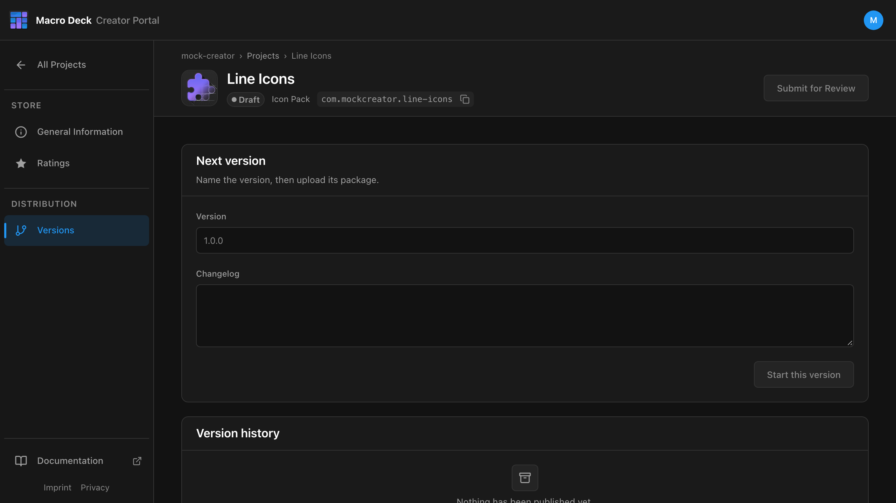
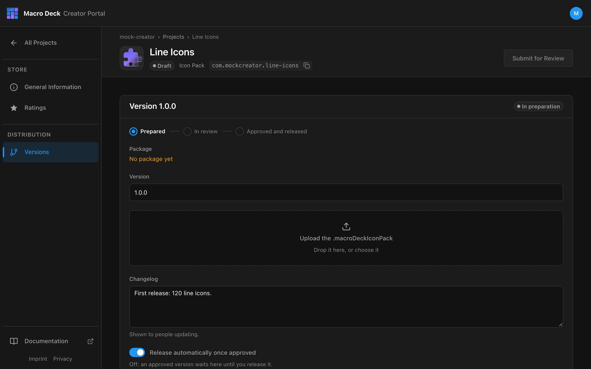

An icon pack needs no repository. The version is the file you upload.

```text
Start this version  ->  upload .macroDeckIconPack  ->  Add to submission  ->  Submit for Review
```

## 1. Export the pack

In Macro Deck, open **Icon packs**, open the pack's menu and select **Export pack**. You get a
`.macroDeckIconPack` file.

Before you export, open the pack's menu, select **Edit pack** and set **AI-created icons**. The setting is
saved in the exported pack's `pack.json` as the same [`ai` declaration](/reference/manifest/#ai) plugins
use. **Not declared** is never treated as free of AI.

### Size limits

A pack holds at most 29,996 files, `pack.json` included, and a `pack.json` of at most 32 MiB minus 64 KiB. Every icon takes one file,
its master image, and `pack.json` lists each icon and each file. The two limits apply separately: icons with
long non-Latin names fill `pack.json` well before the file limit.

The smaller sizes a deck shows are not part of the pack: the Macro Deck that installs it creates them from each
master the first time an icon is shown at that size. Packs exported by Macro Deck 3.0.0-beta.13 and older also
carry a file per downscaled size; they still import, and Macro Deck ignores those files and creates its own.
Macro Deck 3.0.0-beta.13 and older do not create sizes, so they show the full master of a pack, profile or
widget exported by a newer version at every size. On a device, a large animated icon can then be too big to
show.

Macro Deck refuses to export a pack above either limit, so split a larger collection into several packs.
The limits leave room for the certificate files and the signature that the Store adds when it signs the pack,
so the signed pack stays within 30,000 files and 32 MiB, which is what Macro Deck imports. The room assumes
`pack.json` as Macro Deck writes it; a `pack.json` edited by hand can grow when it is signed.
`IconPackArchiveLimits` in `MacroDeck.Plugin.Packaging` carries these numbers for tools.

Macro Deck 3.0.0-beta.13 and older import at most 10,000 files per pack.

## 2. Create the Project

Create a Project of type **Icon Pack** and fill in [General Information](/creator-portal/projects/#store-listing).
Upload the **Icon** under **Images**; an icon pack cannot be submitted without one.

## 3. Start a version

Open **Versions**.



| Field | Example |
| --- | --- |
| Version | `1.0.0` |
| Changelog | `First release: 120 line icons.` |

Select **Start this version**. Only one version can be open at a time.

## 4. Upload the package



Drop the `.macroDeckIconPack` on the upload area or choose it. The portal checks size, checksum and
contents before the version can be submitted. Until it is submitted, you can replace the file.

## 5. Submit

Select **Add to submission**, then **Submit for Review** in the Project header. Continue with
[Review and release](/creator-portal/review/).

## Release an update

Export the pack again, then **Start this version** with a higher version, for example `1.1.0`, upload
and submit. A declined version stays editable: replace the file and submit it again.
