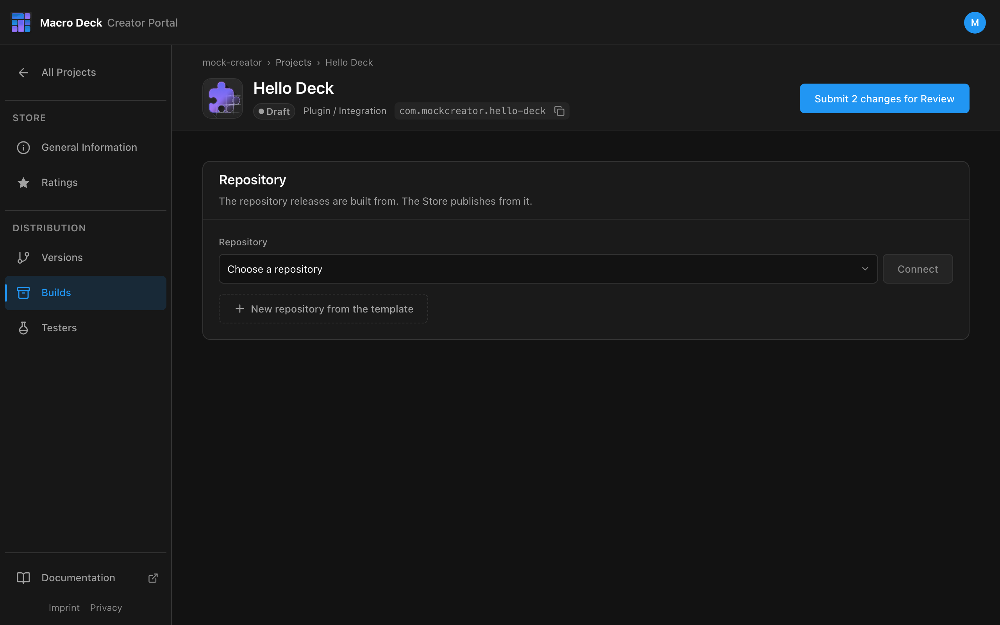
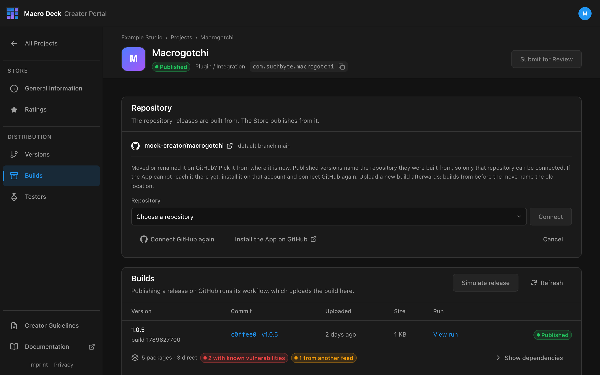
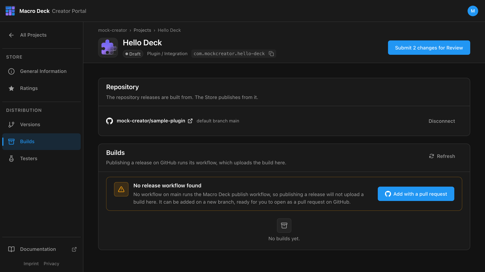
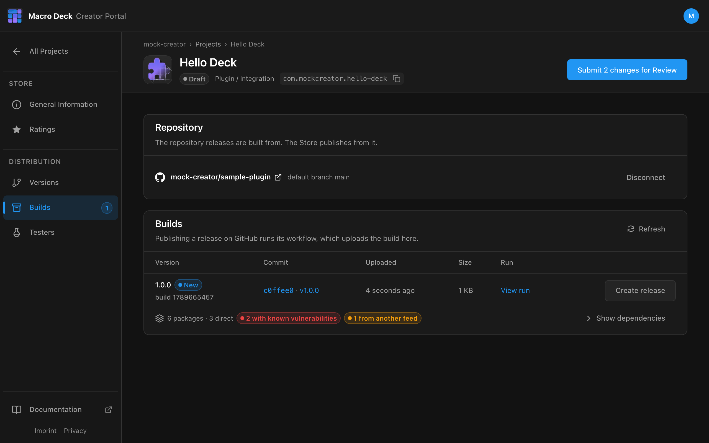
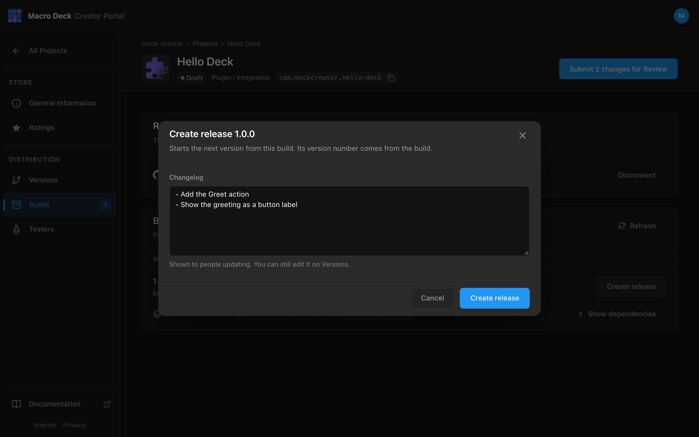
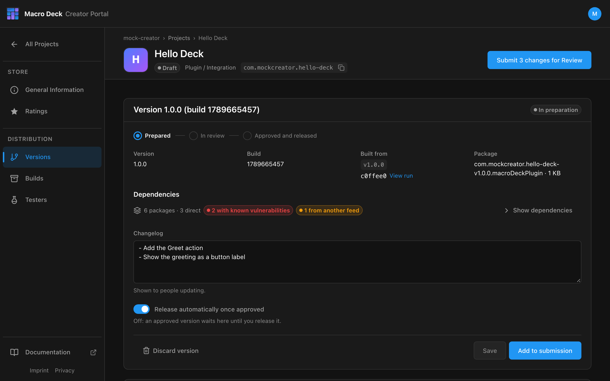
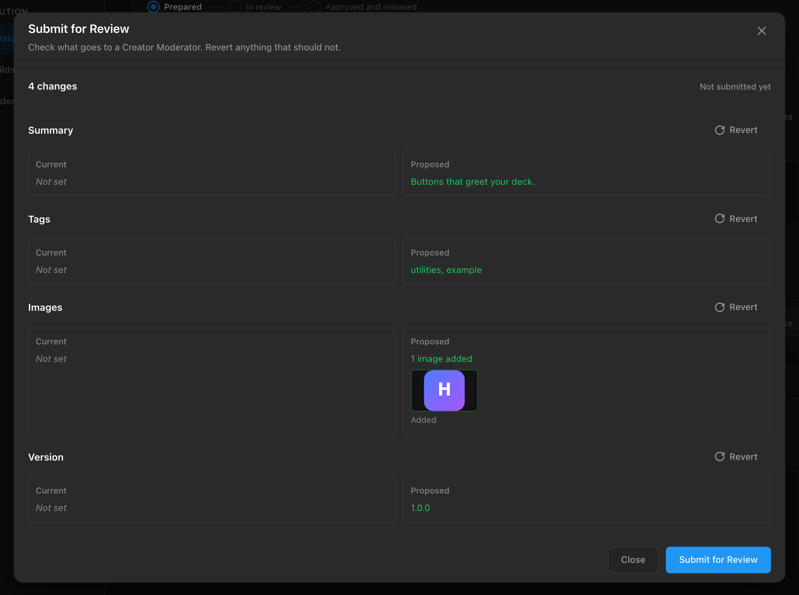

A plugin reaches the Store from a GitHub release. The release runs the Macro Deck publishing workflow,
which uploads a build to the Creator Portal. You pick the build there and submit it.

```text
GitHub release v1.0.0  ->  build in Builds  ->  Create release  ->  Add to submission  ->  Submit for Review
```

Before you start:

- A [Project](/creator-portal/projects/) of type **Plugin / Integration**.
- A **public** GitHub repository with the plugin. The `id` in `manifest.json` must equal the Project's
  Package ID.

## 1. Connect the repository

Open **Builds** and select **Connect GitHub**. Install the Macro Deck Platform App on your account or
organization if GitHub asks for it.



- **Choose a repository** and select **Connect**, or
- **New repository from the template** creates a public repository from the plugin template.

One repository per Project, one Project per repository. Private repositories are not offered.

### Change the repository

Select **Change** next to the connected repository to pick it again, for example after you moved it to
a GitHub organization or renamed it.



- If the repository moved to another account, install the Macro Deck Platform App there and select
  **Connect GitHub again** first, so the picker offers it.
- Once a version is published, only the same GitHub repository can be connected: moved or renamed is
  fine, a different repository is refused. **Disconnect** is no longer offered.
- Upload a new build afterwards. Builds from before the move name the old location in their
  `manifest.json` and do not pass review.
- After a Project was [transferred to you](/creator-portal/projects/#transfer-a-project) by another
  person, builds are refused until you connect its repository again here.

## 2. Add the release workflow

While there are no builds, the portal checks the default branch for the workflow.



**Add with a pull request** commits the workflow to the branch `macro-deck/release-workflow`. Open the
pull request on GitHub and merge it.

Or add it yourself as `.github/workflows/release.yml`:

```yaml
name: Release

on:
  release:
    types: [published]

jobs:
  publish:
    uses: Macro-Deck-App/GitHub-Actions/.github/workflows/publish-plugin.yml@v1
    permissions:
      contents: read
      id-token: write
    with:
      version: ${{ github.event.release.tag_name }}
      source: src/HelloDeck
      changelog: ${{ github.event.release.body }}
```

`source` is the directory with `manifest.json` and `macrodeck-build.json`. No secrets are needed: the
workflow signs in with the token GitHub issues for the run. All inputs are in the
[release workflow reference](/creator-portal/release-workflow/).

## 3. Publish a GitHub release

```bash
gh release create v1.0.0 --title "1.0.0" --notes "- Add the Greet action"
```

Or use **Draft a new release** on GitHub with the tag `v1.0.0`.

- The version comes from the tag. One leading `v` is dropped; the rest must be a semantic version.
- The version in your repository is ignored. The workflow writes the tag's version into
  `manifest.json`.
- The release notes become the default changelog.

When the run finishes, the build appears under **Builds**.



Each build shows the commit and tag it came from, a link to the workflow run and the NuGet packages it
restored, including known vulnerabilities.

## 4. Create a release

Select **Create release** on the build.



The version number comes from the build and cannot be changed. The changelog can still be edited on
**Versions**.

## 5. Submit for review

On **Versions**, check the release and select **Add to submission**.



- **Release automatically once approved**: turn it off to publish the approved version yourself later.
- **Discard version** removes the release. The build stays in the library.

Then select **Submit for Review** in the Project header. The dialog lists every change that goes to the
moderator; **Revert** removes one.



Submitting needs the current Creator Guidelines accepted; the portal asks when they are not. Continue with
[Review and release](/creator-portal/review/).

## Release an update

```bash
gh release create v1.1.0 --notes "- Fix the greeting on light themes"
```

Then **Create release** on the new build and submit again. The version must be higher than the last
published one.

- Re-running a workflow uploads a new build. It never replaces one.
- While a submission is in review, uploads are refused. Withdraw the submission first.
- Builds that no Version was started from are removed when a newer build arrives.

## Troubleshooting

| Problem | Fix |
| --- | --- |
| No build appears | Open the workflow run on GitHub. The upload step prints why it was refused. |
| `403`, repository does not match | The repository connected to the Project is not the one the workflow ran in, or `manifest.json` has a different `id`. |
| `409`, not a tag | The workflow ran from a branch. Trigger it with a published release. |
| `409`, in review | Withdraw the submission, then re-run the workflow. |
| Repository no longer offered | It is private. Only public repositories can publish. |

See all refusals in the [release workflow reference](/creator-portal/release-workflow/#errors).
