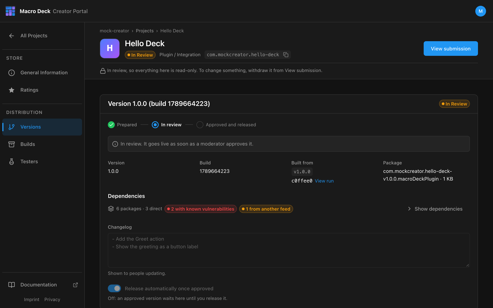

A Creator Moderator reviews every submission before anything reaches the Store.

## Statuses

| Status | Meaning | What you can do |
| --- | --- | --- |
| In Review | Waiting for a moderator. The Project is read-only. | **View submission** and withdraw it |
| Needs changes | The moderator asked for changes. | Read the feedback, change, submit again |
| Declined | Not accepted. | Fix the version and submit again |
| Ready to release | Approved, with automatic release turned off. | Release the version |
| Published | In the Store. | Start the next version |

You are notified in the portal under **Notifications**, and by email for decisions.

## Before the moderator decides

The portal runs automated checks on every submission and shows the findings in the review:

- the commit the build came from still exists in the repository,
- the repository is public and reachable,
- the package is unchanged since upload,
- `manifest.json` can be read and signed.

A check that could not run, for example because GitHub was unavailable, is a warning, never an error.

## Changes requested

The submission comes back to you with the moderator's feedback. The version is editable again.
Change what was asked, then **Submit for Review**. The same submission keeps its history.

## Withdraw a submission

Open **View submission** and withdraw it. Use this to fix something before the moderator gets to it,
or to upload a new plugin build.

## Release by hand

Turn off **Release automatically once approved** before submitting. After approval the version waits
as **Ready to release**; release it from **Versions** when you are ready.

## After publishing

- The Store signs the package. Macro Deck verifies it before installing and before every launch.
- Users see the update when the Store version is higher than the installed one.
- An approved version is final. Ship fixes as a new version.

## Repository checks after publishing

The portal checks a published plugin's repository every few hours.

| Repository | Result |
| --- | --- |
| Private, deleted or App access removed | Email with a deadline. After 14 days the plugin is unlisted. |
| Reachable again | The plugin is listed again automatically. |

A renamed or transferred repository is followed and needs nothing from you.

## Unlist

Unlisting removes a published Project from the Store. Installed copies keep working and the Package ID
stays yours. List it again at any time.
