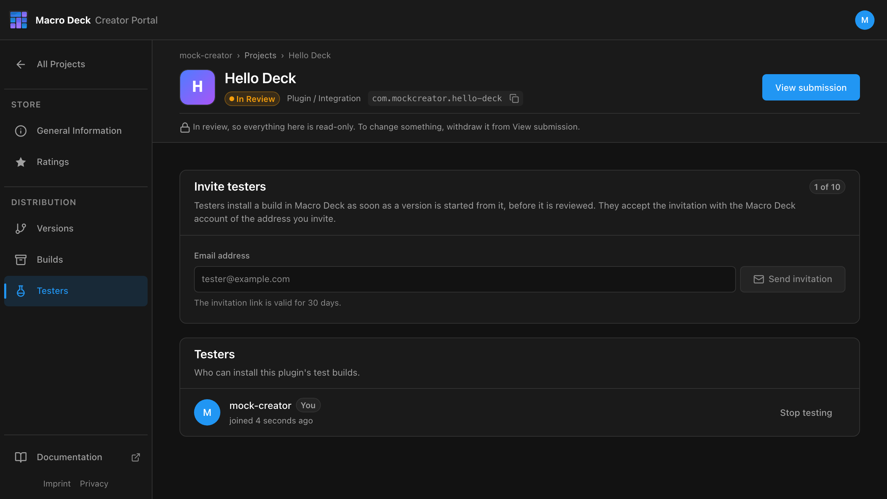

Testers install a plugin build before it is reviewed or published. Only plugins can have testers.



## Invite a tester

Open **Testers**, enter the address and select **Send invitation**.

```text
tester@example.com
```

- Up to **10 testers**. Pending invitations count too.
- The link is valid for 30 days.
- The invitation can only be accepted by the Macro Deck account with that verified email address.
  Forwarding the link does not work.

## What testers get

- Every build you **Create release** from becomes installable for testers, even if you discard the
  version later.
- The five newest of those builds stay available.
- Testers find them under **Tests** in the Creator Portal.

Test builds were never reviewed. Only invite people you trust with that.
