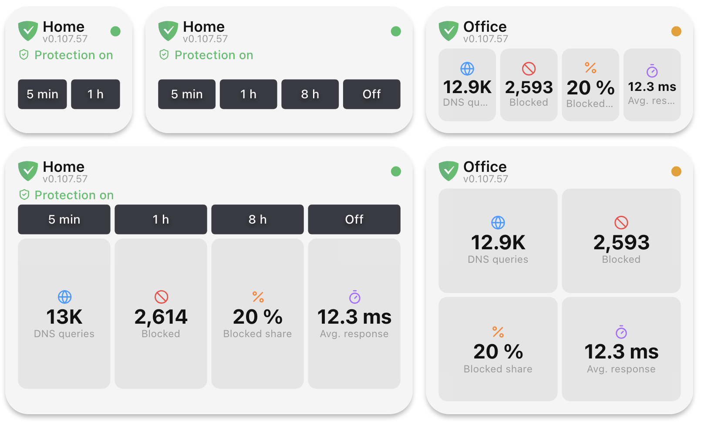

Macro Deck talks to the web interface of AdGuard Home, so it works with every AdGuard Home that you can open
in a browser. You can add as many servers as you like, for example one at home and one on a VPS.

## Adding a server

Open **Integrations**, choose **AdGuard Home** and add a configuration:

- **Configuration name**: how the server is called in actions and widgets, for example `Home` or `Office`.
- **Address**: the address you open the AdGuard Home web interface with, including the port, for example
  `http://192.168.1.2:3000`. If AdGuard Home is behind a reverse proxy under a path, enter that path too.
- **Username** and **Password**: the account you sign in to AdGuard Home with. Leave both empty if your
  AdGuard Home does not ask for a sign-in.
- **Accept a self-signed certificate**: only for an `https://` address whose certificate your computer does
  not trust. Macro Deck then no longer checks who it is talking to, so leave it off when you can.

Macro Deck checks the connection before it saves the configuration and tells you when the address is wrong,
the server cannot be reached or does not answer in time, the sign-in is rejected, or the server does not
answer like AdGuard Home. The password is stored encrypted and is never sent to the deck or a browser.

The list of configurations shows for each server whether it is connected. A server whose sign-in is rejected
shows that it needs to be set up again.

## Actions

Every action has an **Instance** field for the server it controls.

| Action | What it does |
| --- | --- |
| Enable protection | Turns protection on, also ending a pause |
| Disable protection | Turns protection off until you turn it on again |
| Toggle protection | Turns protection on when it is off, and off when it is on. A button with it lights up while protection is on |
| Disable protection temporarily | Turns protection off for 5, 15 or 30 minutes, 1, 2, 8 or 24 hours, or a custom duration of up to 7 days. AdGuard Home turns it back on by itself |
| Enable filtering, Disable filtering, Toggle filtering | Turns blocking by filter lists on or off. The other protection settings stay as they are |
| Update filter lists | Downloads the latest version of every blocklist and allowlist |

An action fails with a message when the server cannot be reached, rejects the sign-in, or does not support
the request.

## The AdGuard Home widget

Add the **AdGuard Home** widget to a folder and choose in its settings:

- **Instance**: the server it shows. When you leave it empty, it shows the first one.
- **Display name**: a name to show instead of the configuration name.
- **View**: **Protection controls**, **Statistics**, or **Controls and statistics**.
- **Pause buttons**: the durations offered while protection is on, in the order you list them.
- **Statistics**: the values to show, in the order you list them.
- Whether it shows the AdGuard Home version and the status indicator.

While protection is on, the widget shows a green shield and the pause buttons. Pressing one pauses
protection for that long; **Turn off** disables it until you turn it on again. While protection is paused or
off, the widget shows when it resumes and an **Enable protection** button.

A larger widget shows more: a widget one cell wide shows the first two pause buttons or statistics, a wider
or taller one shows more of them, and **Controls and statistics** adds the statistics below the buttons once
the widget is at least two cells wide and two cells tall.

The statistics cover the period AdGuard Home keeps statistics for, 24 hours unless you changed it there:

| Statistic | What it counts |
| --- | --- |
| DNS queries | All DNS queries |
| Blocked | Queries blocked by filter lists |
| Blocked share | Blocked queries as a share of all queries |
| Avg. response | The average time AdGuard Home took to answer |
| Malware blocked | Queries blocked by browsing security |
| Adult blocked | Queries blocked by parental control |
| Safe search | Searches switched to safe search |

When the server cannot be reached, rejects the sign-in or does not answer like AdGuard Home, the widget says
so and shows no numbers, so it never shows old values as if they were current. It updates again by itself
once the server is back.

Pressing a widget button does nothing while your computer is locked.

## Variables

Each server gets its own variables, named after the configuration name it had when you added it, for example
`adguard_home_home_protection_enabled`. Renaming the configuration later keeps the names, so your buttons and
scripts keep working. A very long configuration name is shortened in the variable names; the **Variables**
page shows the exact names.

| Variable | Contains |
| --- | --- |
| `…_is_reachable` | Whether Macro Deck can currently reach the server |
| `…_protection_enabled` | Whether protection is on |
| `…_protection_disabled_until` | When a pause ends, as an ISO 8601 time, or empty |
| `…_dns_queries`, `…_blocked_queries` | DNS queries and queries blocked by filter lists |
| `…_blocked_percentage` | Blocked queries as a share of all queries, in percent |
| `…_avg_processing_time` | The average response time in milliseconds |
| `…_safebrowsing_blocked`, `…_parental_blocked`, `…_safesearch_enforced` | The browsing security, parental control and safe search counts |
| `…_version` | The AdGuard Home version |

While a server cannot be reached or rejects the sign-in, `…_is_reachable` is `false` and its other variables
are marked as unavailable until the server answers again.

## How often Macro Deck asks

Macro Deck asks each server for its status every 5 seconds and for its statistics every 30 seconds, and
every widget and variable of that server uses the same answers. Adding more widgets does not add requests.
After an action, the status is read again right away. While a server cannot be reached, Macro Deck tries
again every 30 seconds.
