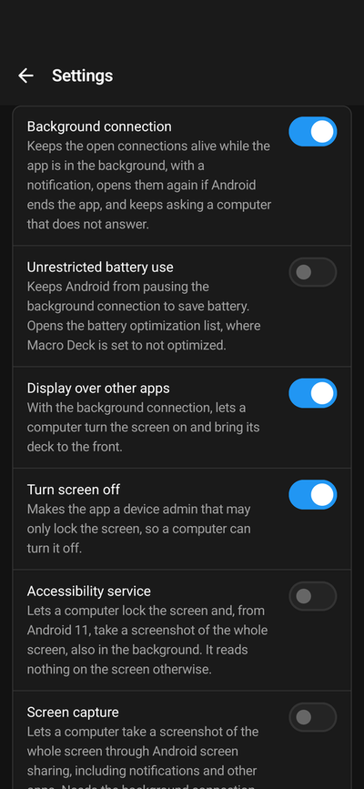
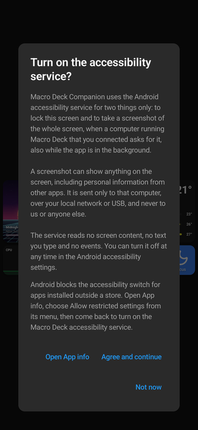

The Android app runs on Android 6 or later, on phones and tablets, including devices without Google Play.

## Two versions

| | Google Play | Without Google Play services |
| --- | --- | --- |
| Where from | [Google Play](https://play.google.com/store/apps/details?id=app.macrodeck.companion) | Macro Deck installs it over ADB, or you save the APK; see [Install the Android app from Macro Deck](/guide/companion-app/install-over-adb/) |
| Runs on | Devices with Google Play | Any Android 6 device, such as Amazon Fire tablets |
| Updates | Google Play | Macro Deck, over ADB |
| License | Buy in the app, or from your computer | Only from your computer; see [License and trial](/guide/companion-app/license/#the-android-version-without-google-play) |

Both are the same app with the same settings. They cannot update each other: to switch, uninstall the one on
the device first. Uninstalling removes the saved connections, so add your computers again afterwards.

## Full screen

The app hides Android's status and navigation bars, so a deck uses the whole screen. Swipe in from the edge of
the screen to show them for a moment. The system back gesture leaves a deck.

## Device control

Macro Deck can do more with an Android device than show a deck: turn its screen on and off, bring the deck to the
front, and take a screenshot of the whole screen. Android asks for a permission for each of these. Turn them on
in the app's settings under **Device control**; the app also asks by itself the first time Macro Deck needs one,
in the app or with a notification such as **Streaming Computer wants to turn off the screen**.

| Setting | What it allows | Needed for |
| --- | --- | --- |
| Background connection | Keeps the connections alive while the app is in the background, with a notification. Reopens them if Android ends the app, and keeps asking a computer that does not answer. | **Turn screen on**, **Bring to front**, and anything else while the app is not in front |
| Unrestricted battery use | Stops Android from pausing the background connection to save battery. | A reliable background connection |
| Display over other apps | With the background connection, lets a computer turn the screen on and bring its deck to the front. | **Turn screen on**, **Bring to front** |
| Turn screen off | Makes the app a device admin that may only lock the screen. | **Turn screen off** |
| Accessibility service | Locks the screen and, from Android 11, takes screenshots of the whole screen, also in the background. It reads nothing on the screen otherwise. | **Turn screen off** (Android 9 or later), **Take screenshot** of the full screen |
| Screen capture | Screenshots of the whole screen through Android's screen sharing. Needs the background connection. | **Take screenshot** of the full screen, without the accessibility service |
| Wi-Fi name | Reports the name of the Wi-Fi network while the app is in front. Android treats this as location access. | The **Network name** variable |

**Turn screen off** needs either the device admin or the accessibility service; one is enough.

Turning the screen on does not unlock the device. If it has a screen lock, the deck asks you to unlock the device
before you can use it.

### The accessibility service

The first time a deck opens, the app explains what its accessibility service is for and asks whether to turn it
on. **Not now** skips it; you can turn it on later under **Device control**.

Android blocks this switch for apps installed outside a store, such as the version without Google Play. Open
**App info** for Macro Deck, choose **Allow restricted settings** from its menu, and turn the service on again.

## Brightness

When Macro Deck sets the brightness, it applies to the Macro Deck app while it is in front; the rest of the
system keeps its own brightness. **Brightness > Follow system** in the connection settings returns to the system
brightness.

## Home screen

- **Shortcuts:** long-press the app icon to open one of your saved computers directly.
- **Widget:** the **Macro Deck host** widget opens the deck of the computer you choose for it.

## USB

Android devices can connect over a USB cable in two ways: with USB debugging through ADB, or without USB
debugging as a USB accessory. See [Connect over USB](/guide/usb-connection/).

## Devices without Google Play

Amazon Fire tablets and other devices without Google Play services run the
[version without Google Play](/guide/companion-app/install-over-adb/). For devices that work well as a deck, see
[Recommended devices](/guide/recommended-devices/).
