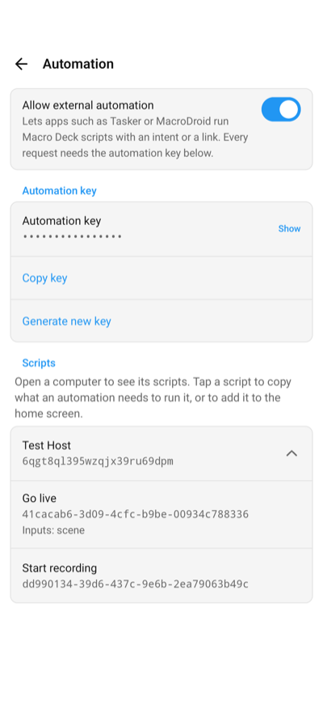
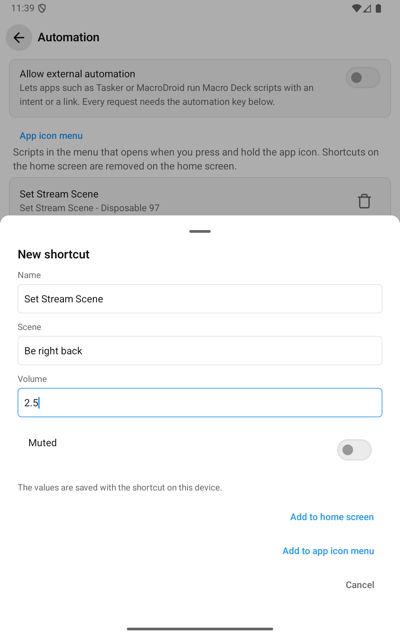
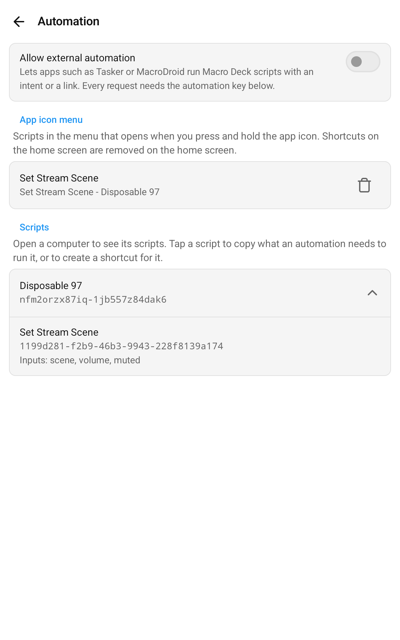
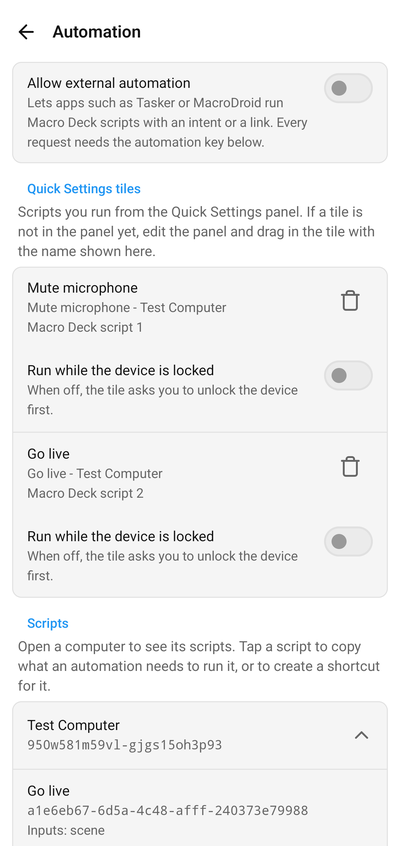
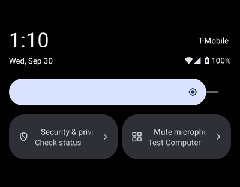
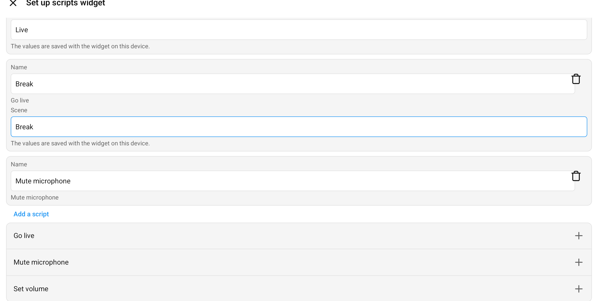
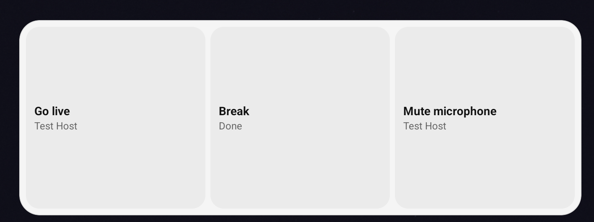

The Companion app can run a Macro Deck [script](/guide/concepts/#scripts-and-automations) on one of your computers when another app asks
for it: an automation app such as Tasker or MacroDroid on Android, or any app that can open a link on iPhone and
iPad. On iPhone and iPad, the **Run Script** action in Shortcuts does the same without any setup; see
[Shortcuts and Siri](/guide/companion-app/ios/#shortcuts-and-siri).

A script runs the same way it does from Shortcuts: it needs a license or a running trial, the computer reachable
over the network, and the computer unlocked. Scripts cannot run over a USB cable this way. Only scripts that do
not run on a widget are offered.

## Turn it on

1. Open the app settings and choose **Automation**.
2. Turn on **Allow external automation**. The app creates an **automation key**.
3. Open one of your computers to see its scripts, and tap a script to copy what an automation needs to run it.



Every request from another app has to carry the automation key. An app that does not have it cannot run
anything, and learns nothing about your computers or scripts. Keep the key private like a password:

- **Generate new key** replaces it and shows the new key, so you can copy it right away. Every automation that
  uses the old key stops working until you give it the new one. Do this if a key or a link with the key was ever
  shared.
- If the device would not keep the new key, the app says so instead of showing one. Until a key is stored, no
  request runs. Choose **Generate new key** again to retry.
- Turning **Allow external automation** off stops every request at once and keeps the key for later.

On Android, a run can start while the phone is locked, so an automation can run a script when you arrive home or
at a set time.

## Android: send an intent

Send a broadcast intent to the app:

| Field | Value |
| --- | --- |
| Action | `app.macrodeck.companion.action.RUN_SCRIPT` |
| Package | `app.macrodeck.companion` |
| Target | Broadcast receiver |

Always set the package. Android only delivers the intent to the app when the package is set.

The intent takes these extras, all as text:

| Extra | Value |
| --- | --- |
| `host` | The computer's ID, shown under its name in the **Automation** settings. |
| `hostName` | Instead of `host`: the computer's name as the Connections screen shows it. Letter case does not matter. |
| `script` | The script's ID, shown under its name in the **Automation** settings. |
| `scriptName` | Instead of `script`: the script's name. Letter case does not matter. |
| `input.<name>` | The value of one input, such as `input.scene` = `Live`. Add one extra per input. |
| `inputs` | Instead of single inputs, or together with them: a JSON object such as `{"scene":"Live"}`, or one `name=value` per line. A single `input.<name>` wins over the same name here. |
| `key` | The automation key. |

An ID never changes. A name stops working when you rename the computer or the script, and when two computers or
two scripts have the same name the app does not guess and runs nothing. Input values are checked by Macro Deck:
a number input takes `3` or `2.5`, a true or false input takes `true` or `false`.

**Copy intent details** in the **Automation** settings copies all of it for one script, with the key.

### Tasker

1. Add the action **System > Send Intent**.
2. Set **Action** to `app.macrodeck.companion.action.RUN_SCRIPT`, **Package** to `app.macrodeck.companion` and
   **Target** to **Broadcast Receiver**.
3. Add the extras as `name:value`, one per **Extra** field, such as `host:3f2a9c`, `script:go-live` and
   `key:<your key>`. Use `input.scene:Live` for an input.

### MacroDroid

1. Add the action **Connectivity > Send Intent**.
2. Choose **Broadcast**, set **Action** to `app.macrodeck.companion.action.RUN_SCRIPT` and **Package** to
   `app.macrodeck.companion`.
3. Add the extras `host`, `script` and `key`, and one `input.<name>` per input.

### What happens

- When the script ran, nothing is shown.
- When it did not run, for example because the computer was off, a notification says why. A request with a
  missing or wrong key, or while **Allow external automation** is off, shows nothing.
- An app that sends an ordered broadcast gets the result back: `RESULT_OK` when the script ran, with the extras
  `success`, `finished`, `problem` and `message`. `finished` is `false` while the script is still running on the
  computer. `problem` is one of `offline`, `host_locked`, `license_required`, `not_found`, `invalid_inputs`,
  `no_answer`, `no_result`, `sign_in_required`, `not_saved`, `unsupported`, `host_needs_update`, `failed`,
  `wrong_key`, `key_unavailable`, `disabled`, `missing_host`, `missing_script`, `ambiguous_host` or
  `ambiguous_script`.

The app waits up to 25 seconds for the computer. A script that takes longer keeps running on the computer.

While the phone is idle, Android can hold back the network to save battery. A script then does not run, and the
notification says the computer did not answer. If this happens, exclude Macro Deck from battery optimization, or
run the automation while the screen is on.

## Link

Both platforms open this link:

```text
macrodeck-companion://run-script?host=<computer ID>&script=<script ID>&key=<key>&input.scene=Live
```

It takes the same fields as the Android intent, as query parameters. Encode spaces and special characters, for
example `input.scene=Big%20Scene`. **Copy link** in the **Automation** settings copies the link of a script with
the key.

The app shows whether the script ran. On Android, the link only works from apps that open it directly, such as
Tasker's **Browse URL** or an NFC tag app, and not from a web page. Set the package `app.macrodeck.companion` when
an app lets you, so the link cannot reach another app. On iPhone and iPad, any app or web page can open the link,
so the key is what protects it. Another app could also claim the `macrodeck-companion` link for itself and receive
the key: generate a new key if you ever suspect that.

## Android: shortcuts

Tap a script in the **Automation** settings and choose **Create shortcut**. The sheet asks for:

- **Name:** what the shortcut is called. It starts as the script's name. Give two shortcuts of the same script
  different names when you run them with different values.
- **The script's inputs:** one field for each, such as a scene name, a number or a switch. An input with a default
  starts with it. An input the script requires needs a value. An input you leave empty uses the script's own
  default. A number takes `3`, `2.5` or `2,5`.



Then choose where it goes:

- **Add to home screen:** a shortcut icon on the home screen. This needs Android 8 or later and a launcher that
  supports pinned shortcuts.
- **Add to app icon menu:** a line in the menu that opens when you press and hold the Macro Deck icon, above your
  saved computers. This needs Android 7.1 or later. The menu holds at most half of the lines your launcher allows,
  often two, so your computers keep their place there. When it is full, remove a script under **App icon menu** in
  the **Automation** settings first.

Tapping a shortcut runs the script with the values you set, without opening Macro Deck, and a short message says
whether it ran. If the computer is off, unreachable or locked, the message says so and the script does not run.

The values are saved with the shortcut on your device. Do not put a password or a token into an input. To change
the values, remove the shortcut and create it again. Remove a home screen shortcut on the home screen, and a line
of the app icon menu in the **Automation** settings. A home screen copy that was dragged out of the app icon menu
stops running when you remove the line.



A shortcut is yours, so it works without the key and with **Allow external automation** turned off.
If you remove the computer from the app, its shortcuts say so and stop running.

## Android: Quick Settings tiles

A Quick Settings tile runs a script from the panel you pull down from the top of the screen, without opening the
app. This needs Android 7 or later. You can have up to five tiles.

1. Open the app settings and choose **Automation**.
2. Open one of your computers, tap a script and choose **Add to Quick Settings**.
3. Give the tile a name, fill in the script's input values if it has any, and tap **Add to Quick Settings**.



On Android 13 and later, Android then asks whether to add the tile to the panel. On older versions, or if you
declined, edit the Quick Settings panel and drag the tile in yourself. In the list of available tiles it is called
**Macro Deck script** with a number from 1 to 5; the **Automation** settings show that name under each of your
tiles. Some devices, such as Fire tablets, do not let you add tiles to the panel.



Tap the tile to run the script. The tile shows **Running** until the computer answers, and then **Done**, or why
the script did not run, such as **Offline** or **Computer locked**. When you open the panel, a tile whose computer
does not answer already says **Offline** under its name. You can still tap it. On Android 7 to 9 a tile has no
second line, so it says how a run went in place of its name until you close the panel, and shows nothing before you tap.

A tile is yours, so it works without the key and with **Allow external automation** turned off. Because the
panel can be opened on the lock screen, a tile asks you to unlock the device first. To let a tile run while the
device is locked, turn on **Run while the device is locked** for that tile, when you add it or later under
**Quick Settings tiles** in the **Automation** settings.

To remove a tile, tap the bin next to it under **Quick Settings tiles**. It leaves the panel, and its input values
are deleted. If you remove the computer from the app, its tiles are removed as well.

## Android: scripts widget

The **Macro Deck scripts** widget puts several scripts on the home screen, each one a button that runs it. A widget
holds up to eight scripts of one computer, and you can place as many widgets as you like.

1. Touch and hold an empty spot on the home screen, choose **Widgets** and add **Macro Deck scripts**.
2. Choose the computer. The app then lists its scripts.
3. Tap a script to add it. Change its name if you like, and fill in its input values if it has any. You can add the
   same script again with different values, such as one button per scene.
4. Tap **Save**.





Tap a button to run its script. The button shows **Running** until the computer answers, and then **Done** or why
the script did not run, such as **Offline**, **Computer locked** or **Connect first**, and a few seconds later it shows
the computer's name again. You can tap it again at any time.

The widget follows its size: the wider it is, the more columns it has, and the taller it is, the more rows. When the
widget is too small for all its scripts, the last button says how many more there are, such as **+3 more**. Make the
widget larger to see them.

The computer's name under a button is replaced by **Offline** or **Computer locked** when the computer does not
answer. That is only a hint, taken when you place the widget, when the phone starts and about every 30 minutes, so
the app contacts the computer now and then in the background even while it is closed. After the computer is back, the
hint can stay for up to 30 minutes. You can still tap the button, which always tries to run the script, and a script
that ran clears the hint at once.

To change a widget's scripts, touch and hold it and choose the settings on Android 12 or later. On older versions
remove the widget and place it again. If you remove the computer from the app, its widgets say so, and tapping one
lets you choose another computer.

A widget is yours, so it works without the key and with **Allow external automation** turned off. The input values
are saved with the widget on this device. The widget shows only whether a script ran: a script that switches
something on or off does not make the button show that state.
