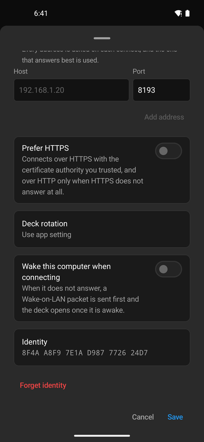

A deck in the app has no buttons around it: you move around with gestures, and everything else is on the
Connections screen.

## Gestures

| Gesture | Does |
| --- | --- |
| One finger sideways | The folder next to this one, among the folders at the same level. |
| One finger up or down | Up to the parent folder, or back down into the folder you came from. |
| Two fingers sideways | The next profile. |
| Three fingers sideways | The next computer this device is connected to. |
| One finger from the edge of the screen | Back to the Connections screen. On Android, the system's back gesture does this. |

A tap on a widget always counts as a press; a swipe only starts once your finger moves. If you would rather
use folder buttons only, turn off **Navigation gestures** in the [app settings](/guide/companion-app/settings/).

Each press vibrates briefly, unless you turn off **Haptic feedback**. iPads have no vibration motor.

## Several computers at once

Leaving a deck does not close its connection. Every computer you opened stays connected while the app runs,
shows **Connected** in the list, and opens again instantly. Swipe sideways with three fingers to switch
between them without going back to the list.

**Connect on opening** in the app settings chooses which computer opens by itself when you start the app: the
first one in your list that answers. With only one saved computer, the app opens it.

## Connection settings

Each connection has its own settings. On Android, open the **⋮** menu of the connection and choose
**Settings**; on iPhone and iPad, swipe the connection to the left. There you also find **Remove**, on Android
**Disconnect**, and **Wake** for a computer that can be woken over the network. Removing a connection also
deletes its saved sign-in from this device.

| Setting | Does |
| --- | --- |
| Name | The name in the list. |
| Addresses | Every address the computer can be reached at. The app tries all of them each time and uses the one that answers best, for example the LAN address at home and a VPN address elsewhere. **Add address** adds one. |
| Prefer HTTPS | Connects over HTTPS with the certificate authority you trusted, and over HTTP only when HTTPS does not answer at all. |
| Deck rotation | Portrait, landscape or automatic for this computer's deck, or **Use app setting**. |
| Brightness | Appears once Macro Deck set this device's brightness. **Follow system** gives the brightness back to the device. |
| Wake this computer when connecting | Sends a Wake-on-LAN packet first when the computer does not answer, and opens the deck once it is awake. The computer and its network card must support Wake-on-LAN. |
| Identity | The computer's identity, to compare with **Identity** in Macro Deck. **Forget identity** makes the app ask again next time. |

## What the computer controls

Macro Deck decides a few things for each device, under **Settings > Devices** on the computer:

- **Startup profile** and **Open profile on device**: which profile the device shows.
- **Screensaver**: after the device sits idle for a while, it shows a clock or what is playing. The first
  touch brings the deck back. **Start now** shows it right away.
- **Log out**: signs the device out, and it shows **Sign in again**.

Automations and buttons can also act on the device itself: change its brightness, rotate it, vibrate it, take a
screenshot and, on Android, turn the screen on and off. See [Tips and automations](/guide/companion-app/tips/).

## When the computer is locked

While the computer running Macro Deck is locked, the deck shows a lock screen and the connection reads
**Locked on the computer**. The deck comes back by itself once you unlock the computer. To keep the deck
visible instead, turn off **Lock clients when this computer is locked** in **Settings > Security**; Macro
Deck still runs no actions from a device while the computer is locked. See
[Troubleshooting](/guide/troubleshooting/#buttons-do-nothing-and-devices-show-a-lock-screen).

## When the connection drops

If Macro Deck quits or the network goes away, the deck says it is reconnecting and keeps trying. It comes
back on its own once the computer answers again. On Android, the **Background connection** keeps trying even
while the app is in the background; see [Android](/guide/companion-app/android/).
