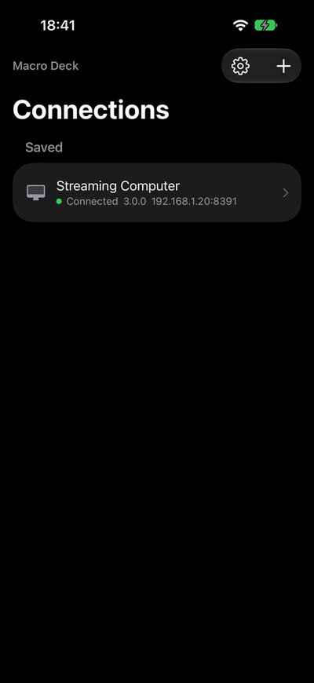
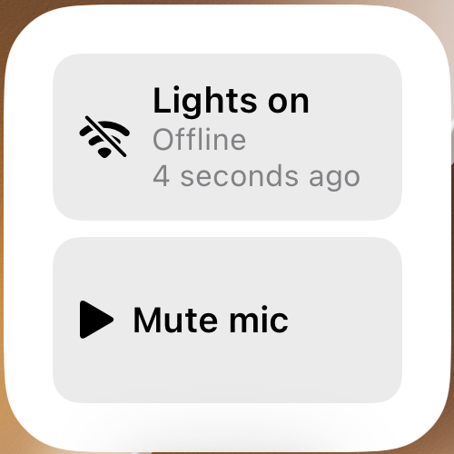

The app runs on iPhone and iPad with iOS or iPadOS 15 or later, in portrait and landscape. Shortcuts and Siri
need iOS 16, and the script widget needs iOS 17.

## Shortcuts and Siri

The app adds three actions to the Shortcuts app. You can use them in your own shortcuts and automations, or ask
Siri:

| Action | Does | Ask Siri |
| --- | --- | --- |
| **Open Macro Deck** | Opens the app on the Connections screen or in the settings (**Area**). | "Open Macro Deck" |
| **Connect to Host** | Opens the deck of one of your saved computers (**Host**). | "Connect to *Streaming Computer* in Macro Deck" |
| **Run Script** | Runs a Macro Deck script on its computer, without opening the app. **Input Values** takes the script's inputs as a dictionary, or one `name=value` per line. | "Run a script in Macro Deck" |

**Run Script** lists every script of your saved computers that does not run on a widget. It needs a license or a
running trial, the device unlocked, and the computer reachable over the network: scripts cannot run over a USB
cable from Shortcuts. If the computer is locked, the script does not run. When a script takes longer, Shortcuts
says it started and is still running.

With the Shortcuts app's own automations, a script can run when you arrive home, at a time of day, when a Focus
turns on or when you tap an NFC tag, for example to start your stream setup on the computer.

Other apps can run a script with a `macrodeck-companion://run-script` link once you allow it in the settings under
**Automation**. See [Run scripts from other apps](/guide/companion-app/automation/).

## Home Screen and Lock Screen

- **Quick actions:** touch and hold the app icon to open one of up to four saved computers directly.
- **Macro Deck host widget:** in small and medium size, it opens the deck of the computer you choose for it. Touch
  and hold the widget and choose **Edit Widget** to pick the computer.
- **Macro Deck scripts widget:** runs scripts of one saved computer with a tap, without opening the app. It needs
  iOS 17.

### Macro Deck scripts widget

Add **Macro Deck scripts** to the Home Screen in small or medium size, or to the Lock Screen as a circular or
rectangular widget, then touch and hold it and choose **Edit Widget**:

1. Choose the **Host**. Only computers you saved are offered, and not those connected over USB.
2. Choose **Script 1** to **Script 4**. Each list holds the scripts of that computer.
3. If a script takes inputs, write their values in **Input Values** beside it, one `name=value` per line. Leave it
   empty to use the script's own defaults.

A small widget shows two scripts, a medium one four, a circular Lock Screen widget the first script and a
rectangular one the first two. Scripts that do not fit are left out, and a small note counts them.

Tapping a script runs it through the Macro Deck app in the background, the same way the **Run Script** action of
Shortcuts does. It needs a license or a running trial, and the computer reachable over the network. The script
shows **Running**, then **Done**, or **Started** when the computer took it and it is still running.

If a script did not run, it says why: **Offline**, **No answer**, **Computer locked**, **Sign in needed**,
**License needed**, **Update host**, **Script missing** or **Check values**, and how long ago that was. This is what
the app found out the last time it contacted the computer, not a live check: the widget never contacts your
computer itself. A computer that went offline while you never opened the app still looks fine until you tap a
script. Tapping always tries again.

The widget offers the scripts the app last listed for each computer. The app refreshes them when you open it, at
most once an hour for each computer. If a computer has never answered, the editor says **open Macro Deck to load its
scripts**. Input values are saved in the widget's settings on your phone and are not a place for secrets.

## Differences from Android

- **Automation apps use a link.** Android automation apps send an intent, and Android can put a script on the home
  screen. On iPhone and iPad, use the **Run Script** action in Shortcuts, or the run-script link; see
  [Run scripts from other apps](/guide/companion-app/automation/).
- **The screen cannot be turned on or off by Macro Deck.** iOS does not allow apps to do this, so the **Turn screen
  on**, **Turn screen off** and **Bring to front** actions do not work on iPhone and iPad. Full-screen screenshots
  are not possible either; **Take screenshot** captures the deck.
- **The app connects only while it is open.** When it goes to the background, iOS ends its connections, and the
  app reconnects when you return. The **In focus** variable tells Macro Deck whether the app is in front.
- **Brightness:** when Macro Deck sets the brightness, iOS changes the screen brightness while the deck is open,
  and the app restores your previous brightness when you leave the deck.
- **USB:** an iPhone or iPad connects over a cable without any setup on the phone, as long as the app is open and
  in front. See [Connect over USB](/guide/usb-connection/#iphone-and-ipad).
- **Vibration:** iPads have no vibration motor, so **Vibrate** and haptic feedback do nothing there.
- **CPU usage:** only the iOS app reports the device's CPU usage as a variable.
- **Low Power Mode** slows down network activity, which can make a deck feel slow. The settings say when it is on.

## Keep the screen on

**Keep screen on** in the app settings stops iOS from locking the screen, while a deck is open or always. For a
wall-mounted iPad, combine it with **Guided Access** (Settings > Accessibility > Guided Access) to keep the
iPad in the app.

## Macro Deck 2 app

The earlier Macro Deck 2 app for iPhone and iPad is a different app. If you bought it, see
[License and trial](/guide/companion-app/license/#if-you-bought-the-macro-deck-2-app).
