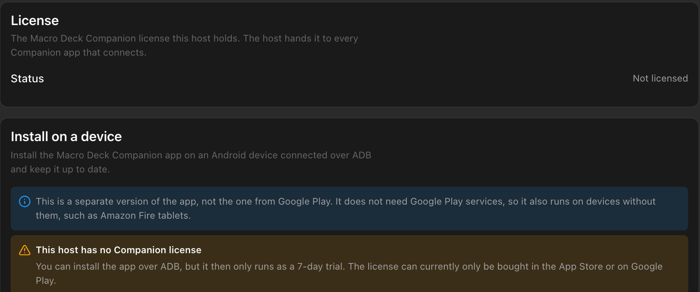
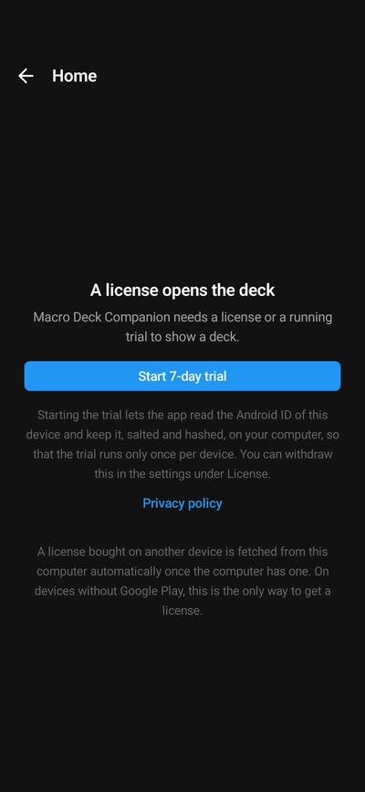

The Companion app needs a license to open a deck. Every device can try it for free for 7 days first, and one
purchase covers all your phones and tablets.

## One purchase for all your devices

The license is a one-time purchase in the App Store or on Google Play, with no subscription. It does not stay
on the phone you bought it on: the app hands it to your computer, and **Macro Deck gives it to every Companion
app that connects**. Your other phones and tablets get it from there, whether they run Android or iOS, and
also the [Android version without Google Play](#the-android-version-without-google-play), which cannot buy
one itself.

1. Buy the license in the app on one device: tap **Buy license** on the paywall, or in the
   [settings](/guide/companion-app/settings/#license).
2. Open a deck of your computer on that device. Macro Deck turns the purchase into a license with the Macro
   Deck servers, which needs an internet connection on the computer.
3. Every other device that connects to this computer receives the license within moments.

**Settings > Companion App** in Macro Deck shows whether the computer holds a license, and where it came from.

When you are signed in under **Settings > Account**, Macro Deck also saves the license to your Macro Deck
account, and your other computers signed in to it receive it within about a minute. If a license does not show
up, see [The Companion app stays unlicensed after a purchase](/guide/troubleshooting/#the-companion-app-stays-unlicensed-after-a-purchase).

### Giving the license to another computer

A licensed device that connects to a computer without a license asks **Transfer license to this computer?** and
shows the computer's identity, as in Macro Deck's network panel. **Transfer** gives the computer the license, so
it can pass it on; **Not now** asks again the next time you open that connection.

Only transfer the license to your own Macro Deck installations, never to someone else's. A license passed on to
others can be revoked, and the terms of service apply.

## The 7-day trial

Each device can try the app for 7 days. On the paywall, tap **Start 7-day trial**.

- Starting the trial is your consent to a trial ID for this device: on Android the app keeps the Android ID
  salted and hashed on your computer, on iPhone and iPad a random ID from the device's keychain. It makes the trial
  run only once per device, also after reinstalling the app.
- The trial runs on your computer's clock, so changing the date on the phone does not extend it.
- The Connections screen shows the days left. After 7 days, decks show the paywall again until a license
  arrives; your connections and settings stay.
- **Remove trial ID** in the settings withdraws the consent. A trial that is running keeps running.

The trial needs Macro Deck to answer first, so the button waits a moment after connecting.

## Restore a purchase

**Restore purchase** (iPhone and iPad: **Restore Purchases**) gets back a license bought with the same store
account, for example after reinstalling the app. Usually you do not need it: a device that connects to a
computer with a license gets it from there anyway.

A purchase that is refunded before any computer turned it into a license is removed from the device again.

## The Android version without Google Play

Macro Deck can [install a version of the Android app that needs no Google Play services](/guide/companion-app/install-over-adb/),
for devices such as Amazon Fire tablets. This version cannot buy anything: it gets its license only from a
computer that already has one, so buy the license once on any phone or tablet with the App Store or Google Play,
and open a deck of that computer with it. Until then the app runs as a 7-day trial, as the install section in
**Settings > Companion App** says.

## If you bought the Macro Deck 2 app

Bought the earlier Macro Deck 2 app for iPhone or iPad? You do not need to buy again. See
[The Companion app stays unlicensed after a purchase](/guide/troubleshooting/#the-companion-app-stays-unlicensed-after-a-purchase)
for how to transfer the purchase.

## For support

Quote the **License ID** from the app's license details or from **Settings > Companion App** in Macro Deck. It is
safe to share. Never post receipts, order numbers or email addresses in public issues.
