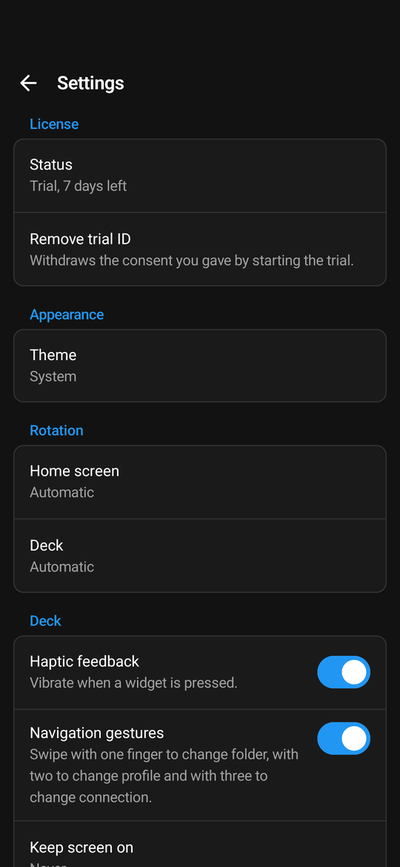

Open the settings with the gear on the Connections screen. Settings for a single computer are in its
[connection settings](/guide/companion-app/deck/#connection-settings) instead.

## License

| Setting | Does |
| --- | --- |
| Status | **Licensed**, **Trial** with the days left, **Trial ended** or **Not licensed**. Tap it for the license details, such as the **License ID** support asks for. |
| Buy license, Restore purchase | Buy the license in the store, or get back one you bought with the same store account. Not shown in the Android version without Google Play services. |
| Remove trial ID | Withdraws the consent you gave by starting the trial. A trial that is running keeps running. |

See [License and trial](/guide/companion-app/license/).

## Appearance and rotation

| Setting | Does |
| --- | --- |
| Theme | **System**, **Light** or **Dark** for the app's own screens. The deck itself looks as it is set up in Macro Deck. |
| Home screen | Rotation of the Connections screen: automatic, portrait or landscape. |
| Deck | Rotation of every deck, unless a connection sets its own **Deck rotation**. |

## Deck

| Setting | Does |
| --- | --- |
| Haptic feedback | Vibrates when you press a widget. On by default. |
| Navigation gestures | Swipe with one finger to change folder, with two to change profile and with three to change computer. On by default. |
| Keep screen on | **Never**, **While a deck is open** or **Always**. **Never** is the default. The app warns about burn-in first: on OLED screens a deck that never changes can leave a permanent ghost image. A dark theme and lower brightness reduce the risk. |
| Icon resolution | The size deck icons are loaded in: **Automatic**, **128 px**, **256 px** or **512 px**. **Automatic** is the default and picks the size from how large each icon is drawn, so a phone usually gets 128 px and a tablet or a large widget 256 px or 512 px. A smaller size loads faster, a larger one looks sharper. With **Automatic** the row shows the sizes the deck you last opened used. Only icons change, not artwork such as album covers. A Macro Deck version without this feature always sends 256 px. |

## Device

**Device name** is the name this phone or tablet has in Macro Deck's **Settings > Devices** and in the device
list of automations. A computer shows the new name the next time this device signs in to it.

## Connections

| Setting | Does |
| --- | --- |
| Find hosts on the network | Looks for Macro Deck on the local network and lists it under **Found on this network**. Without it, you add a computer by QR code or address. |
| Detect USB connection | Lets the app reach Macro Deck through a USB cable. See [Connect over USB](/guide/usb-connection/). |
| Connect on opening | The computers the app opens by itself when it starts, in order: it opens the first that answers. **USB connection** can be one of them. |

## Automation

| Setting | Does |
| --- | --- |
| Allow external automation | Lets other apps run your scripts with an Android intent or a run-script link. Off by default. |
| Automation key | The key every request has to carry. **Show**, **Copy key** and **Generate new key**, which stops every automation that uses the old key. |
| Scripts | Each computer's scripts with their IDs. Tap a script to copy its link or, on Android, its intent details, or to create a shortcut for it or add it to Quick Settings. |
| App icon menu | Android only: the scripts you added to the menu of the app icon, each with a button to remove it. Shown once there is one. |
| Quick Settings tiles | On Android, the scripts you put in the Quick Settings panel, shown once you added one. Each has **Run while the device is locked**, off by default, and can be removed here. |

See [Run scripts from other apps](/guide/companion-app/automation/).

## Only on Android: Device control

These let Macro Deck control the phone or tablet beyond the deck. Each one asks Android for a permission; see
[Android](/guide/companion-app/android/#device-control) for what each is for.

- **Background connection**
- **Unrestricted battery use**
- **Display over other apps**
- **Turn screen off**
- **Accessibility service**
- **Screen capture**
- **Wi-Fi name**

## Only on iPhone and iPad: Battery

While Low Power Mode is on, the settings say so: iOS then reduces performance and network activity, which can
slow a deck down. Turn Low Power Mode off in Control Center or under **Battery** in the Settings app.

## Feedback, About and Legal

- **Discord** and **GitHub Issues**: ask the community and report bugs.
- **Share diagnostics**: shares recent connection events and the addresses of your computers, for a bug report.
  It never contains passwords or tokens.
- **About**: version, build and **Open source licenses**.
- **Legal**: imprint, privacy policy and terms of service.
