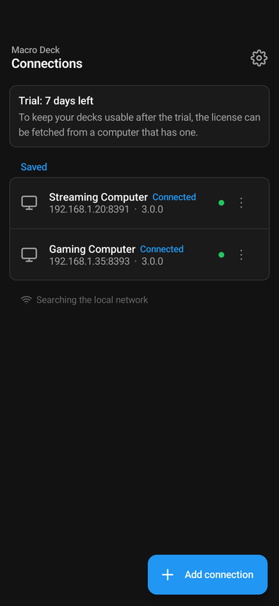
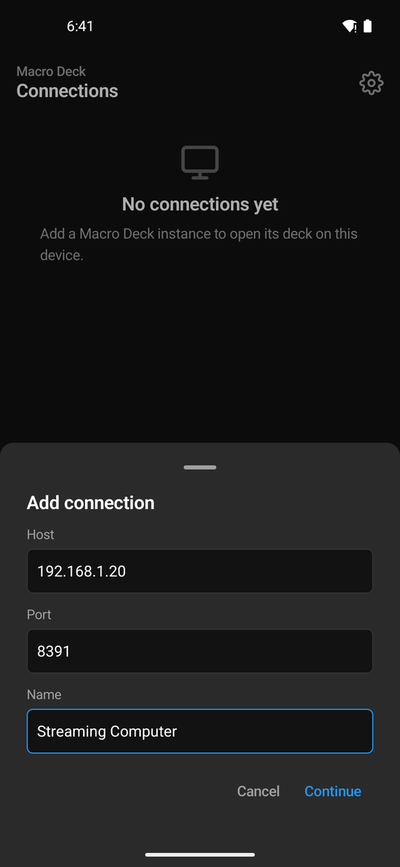
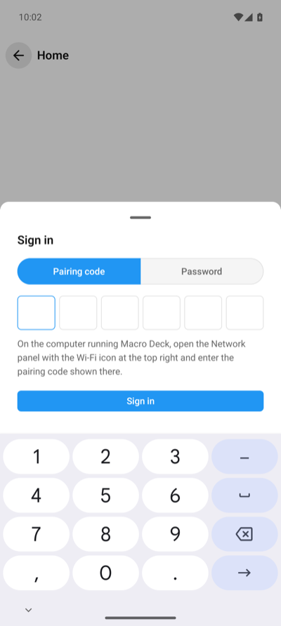
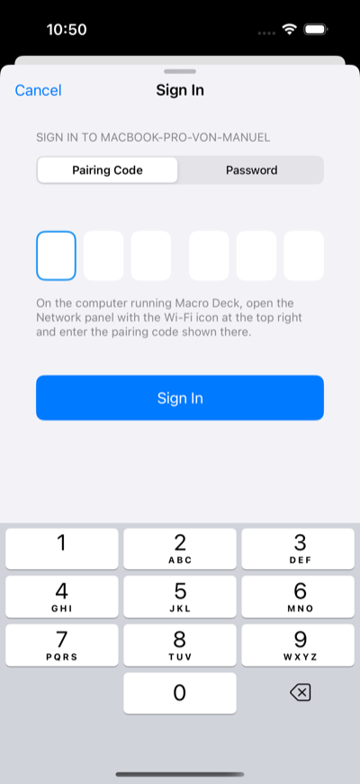

The app keeps a list of your computers under **Connections**. Add each computer running Macro Deck once;
after that, tap it to open its deck.

On first start the app says that Macro Deck 3 is in beta and where to report bugs. It asks for no
permissions up front. On iPhone and iPad it asks for access to the local network the first time it looks
for computers, and for the camera the first time you scan a code.

## Add a computer

Tap **Add connection** (on iPhone and iPad, **+**). There are four ways:

### Scan the QR code

The quickest way, and the one that needs no password.

1. In Macro Deck on the computer, open the network panel with the network icon at the top right. It shows a
   QR code, **Scan with the Macro Deck app**.
2. In the app, choose **Scan QR code** and point the camera at the code. The phone's own camera app works
   too: the code opens the Macro Deck app.

The code carries the computer's name, its addresses, a short-lived pairing code and its identity, so the app
signs in by itself and needs no identity check. A pairing code is valid for 15 minutes; if the app says
**That code has expired**, open the panel again for a new code. When Macro Deck offers both, the app asks
whether to connect over HTTPS or HTTP; choose **HTTPS (recommended)**.

A device without a camera, such as some desk displays, cannot scan. Enter the address instead.

The QR code of Macro Deck 2 does not work: the app says Macro Deck 2 is not supported. Update Macro Deck on the
computer to Macro Deck 3 first; see [Does the app work with Macro Deck 2?](/guide/companion-app/faq/#does-the-app-work-with-macro-deck-2).

### Pick it from the network

Computers that show themselves on the network appear under **Found on this network** on the Connections
screen. Tap one to add it. This needs **Show on the local network** turned on in **Settings > Network** in
Macro Deck, and **Find hosts on the network** in the app's settings. Networks that isolate their devices,
such as many guest networks, hide the computer.

### Enter the address

Choose **Enter address** and type the computer's address, the port and a name for the connection.
**Settings > Network** in Macro Deck and the network panel list the addresses; the port is the **Listening
port** there. Tap **Continue**.

### Plug in a USB cable

A phone or tablet can also reach Macro Deck through a USB cable, with or without USB debugging. The app then
shows a **USB connection** row by itself. See [Connect over USB](/guide/usb-connection/).

## Sign in

A computer added by address or from the network asks you to sign in. The sign-in form opens on
**Pairing code**:

1. In Macro Deck on the computer, open the network panel with the network icon at the top right. It shows
   the pairing code next to the QR code.
2. Type the six digits into the boxes. The app signs in as soon as the sixth digit is in; **Sign in** is
   there for another try. Pasting the code, or the code your keyboard suggests, works too.

A code is valid for 15 minutes and works once. If the app says **That code is wrong or has expired**, check
the code in the network panel and type it again. After five wrong codes Macro Deck stops accepting codes for
a while and shows a new one; the app says **Too many failed attempts**, so wait a moment before trying again.

To sign in with your account instead, choose **Password** and enter the user name and password you created in
Macro Deck on the computer. If you forgot the password, reset it on the computer under
**Settings > Security**.

A device signed out in Macro Deck under **Settings > Devices** shows **Sign in again**.

## Check the identity

Every Macro Deck has an identity: six groups of four characters, shown as **Identity** in the network panel and
in **Settings > Network**. When the app cannot tie the computer to a scanned code, for example for an address you
typed, a computer found on the network or a new computer on the cable, it shows the identity it received and
asks you to compare it. Tap **Fingerprints match** only if all six groups are the same as on the computer.

The identity protects you from signing in to a different machine that pretends to be yours. The app keeps it
and warns you if it ever changes. After reinstalling Macro Deck the identity is new: the app asks whether to
replace the one it knew, and Macro Deck asks you to scan its QR code again on every paired device.

If you add a computer that is already in the list under another address, the app asks **Same computer?** and
offers to add the new address to the existing connection.

## Open the deck

Tap the computer. The first time, the app shows the paywall: start the free 7-day trial or buy the license.
See [License and trial](/guide/companion-app/license/). Once your computer has a license, every device that
connects to it gets it, and the deck opens straight away.

Which profile a device opens with, and its screensaver, are set per device in Macro Deck under
**Settings > Devices**.

## If it does not connect

When a computer cannot be reached, the app shows **Cannot reach this computer** and goes through the usual
causes one at a time: both devices in the same network, Macro Deck running, the firewall, Wi-Fi isolation and
VPNs. See also [Troubleshooting](/guide/troubleshooting/).
