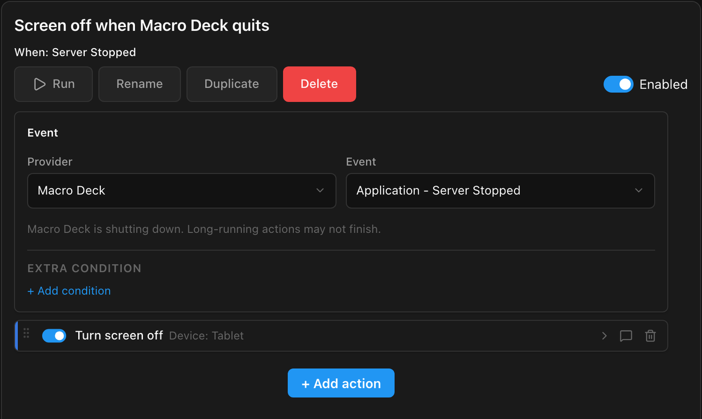
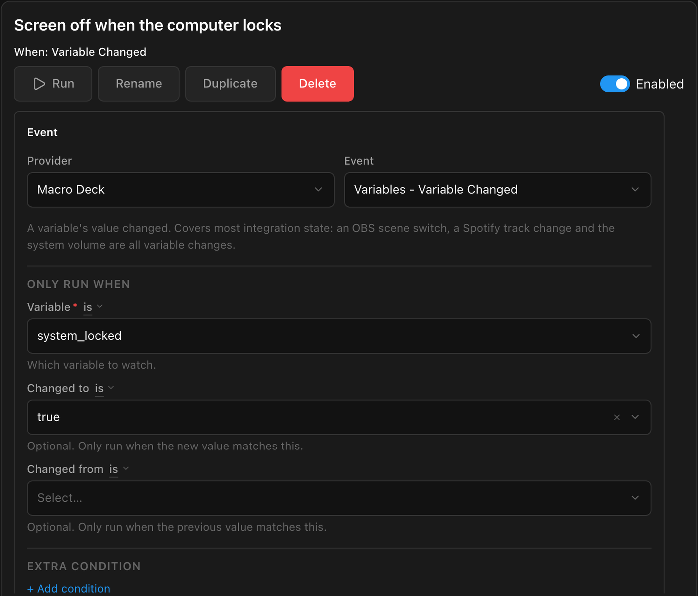

Every phone or tablet running the Companion app appears in Macro Deck as a device of the **Macro Deck
Companion** integration. Automations and buttons can then act on it, and its state is available as variables.

## What Macro Deck can do with a device

| Action | Android | iPhone, iPad |
| --- | :---: | :---: |
| **Set screen brightness** | ✅ | ✅ |
| **Set orientation**: automatic, portrait or landscape | ✅ | ✅ |
| **Vibrate** | ✅ | iPhone only |
| **Take screenshot** of the deck, into a **Folder** on the computer | ✅ | ✅ |
| **Take screenshot** of the full screen | ✅ | ➖ |
| **Turn screen on** and show this Macro Deck | ✅ | ➖ |
| **Turn screen off** | ✅ | ➖ |
| **Bring to front**: show this Macro Deck's deck | ✅ | ➖ |

On Android, turning the screen on and off and bringing the deck to the front need the permissions under
**Device control** in the app settings; see [Android](/guide/companion-app/android/#device-control). Each action
asks for the device first: choose it from the list, where it appears once it connected.

The device's variables are **Battery level**, **Charging**, **Orientation**, **Screen brightness**, **Model**,
**Platform**, **App version**, **In focus**, **Network type**, **Metered network**, **Internet access**,
**Network name** (Android, needs the Wi-Fi name permission), **CPU usage** (iOS) and **Memory usage**. Use them in
labels, conditions and automations like any other variable.

## Turn the screen off when Macro Deck quits

A tablet that only serves as a deck does not need its screen on while Macro Deck is not running. On Android:

1. In the app, turn on **Turn screen off** (or the **Accessibility service**) under **Device control**.
2. In Macro Deck, create an automation with the event **Macro Deck > Server Stopped**.
3. Add the action **Macro Deck Companion > Turn screen off** and choose the tablet.

Macro Deck waits about two seconds for these actions before it closes its connections, which is enough for
a device that is connected at that moment. It works when Macro Deck quits normally, for example with **Quit** in
the tray menu, but not when Macro Deck is killed or crashes.

## Turn the screen off while the computer is locked

The **System** integration's **Locked** variable (`system_locked`) is `true` while the computer is locked. Two
automations turn the tablet off when you lock the computer and on again when you unlock it:

| Automation | Event | Only run when | Action |
| --- | --- | --- | --- |
| Screen off when the computer locks | **Macro Deck > Variable Changed** | **Variable** `system_locked`, **Changed to** `true` | **Turn screen off** |
| Screen on when the computer unlocks | **Macro Deck > Variable Changed** | **Variable** `system_locked`, **Changed to** `false` | **Turn screen on** |

**Turn screen on** needs **Background connection** and **Display over other apps** in the app, so the tablet
stays connected while its screen is off. Automations keep running while the computer is locked, even though
buttons on the deck do not.

## Turn the screen on when Macro Deck starts

When Macro Deck starts, the tablet is not connected yet, so **Server Started** is too early for it. Use the
moment the app is back instead:

| Automation | Event | Only run when | Action |
| --- | --- | --- | --- |
| Screen on when the tablet is back | **Macro Deck Companion > Device Ready** | **Device** set to the tablet | **Turn screen on** |

**Device Ready** runs each time the app has connected and can take commands, also after a short loss of the
network. An automation on **Macro Deck > Client Connected** works as well: a Companion action there waits a
few seconds for the app to be ready.

## More ideas

- **Brightness by time of day:** a **Schedule** event at 22:00 runs **Set screen brightness** at 20%, another one at
  08:00 sets it back. Macro Deck's brightness applies while the deck is open; **Brightness > Follow system** in the
  [connection settings](/guide/companion-app/deck/#connection-settings) hands it back to the device.
- **A deck per orientation:** **Profile Changed** runs **Set orientation**, for example landscape for a gaming
  profile with many buttons and portrait for a music profile.
- **Battery at a glance:** show the tablet's **Battery level** in a widget label, for example on the deck of your
  phone, so you see when the tablet on the wall needs charging.
- **Screenshots for sharing:** a button with **Take screenshot** saves the deck as a PNG file on the computer,
  and **Save path to variable** puts the file's path into a variable for the next action.
- **Burn-in:** a deck that is always on shows the same picture for hours. With **Keep screen on**, also set up a
  **Screensaver** for the device in **Settings > Devices**, a dark theme and a lower brightness.
- **Wake the computer:** turn on **Wake this computer when connecting** for a connection, and the app wakes the
  computer with Wake-on-LAN when you open its deck.
- **Several computers:** open the decks of all your computers once, then switch between them with a three-finger
  swipe.
- **iPhone and iPad:** run Macro Deck scripts from the Shortcuts app, from Siri or from a Shortcuts automation,
  such as an NFC tag on your desk. See [iPhone and iPad](/guide/companion-app/ios/#shortcuts-and-siri).
