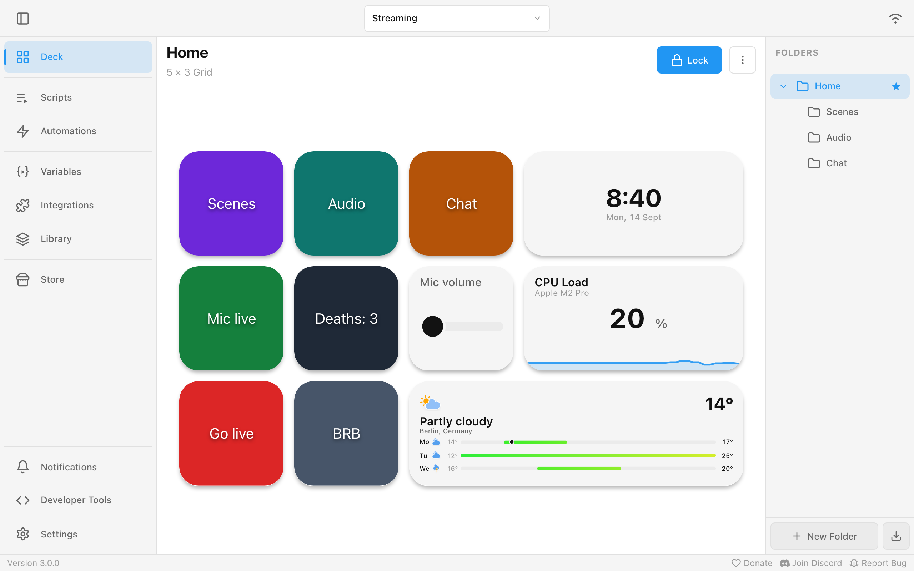
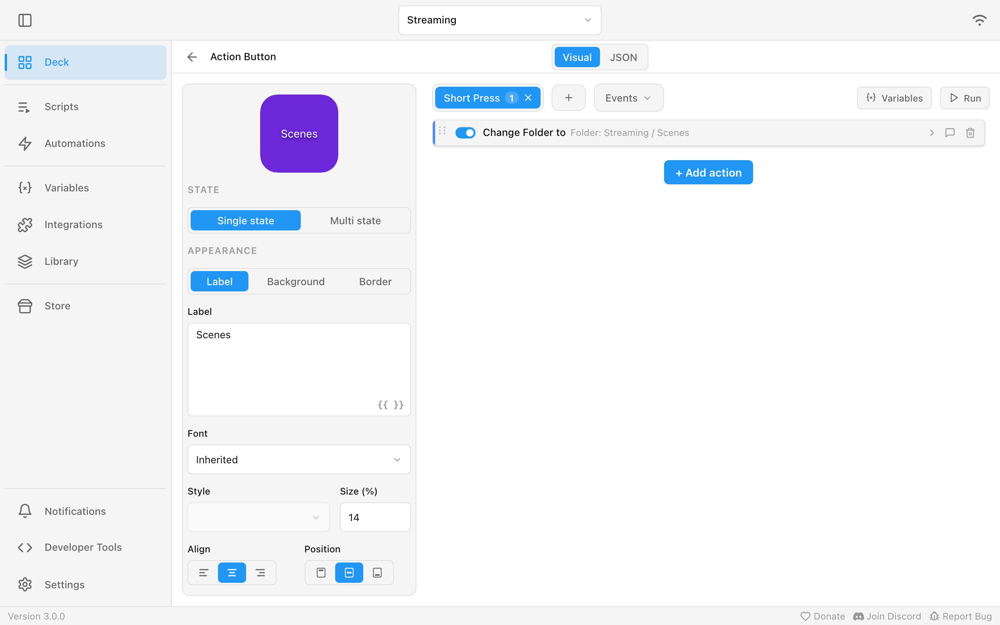
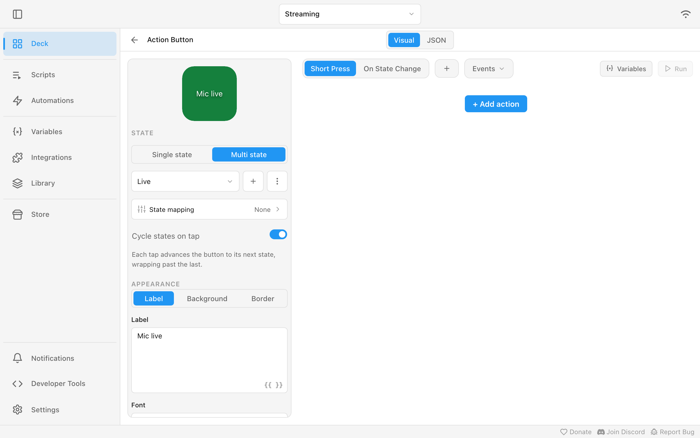
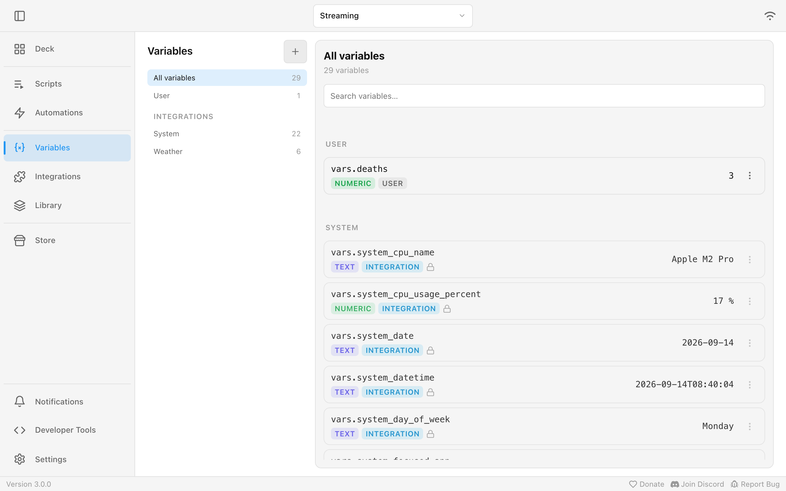
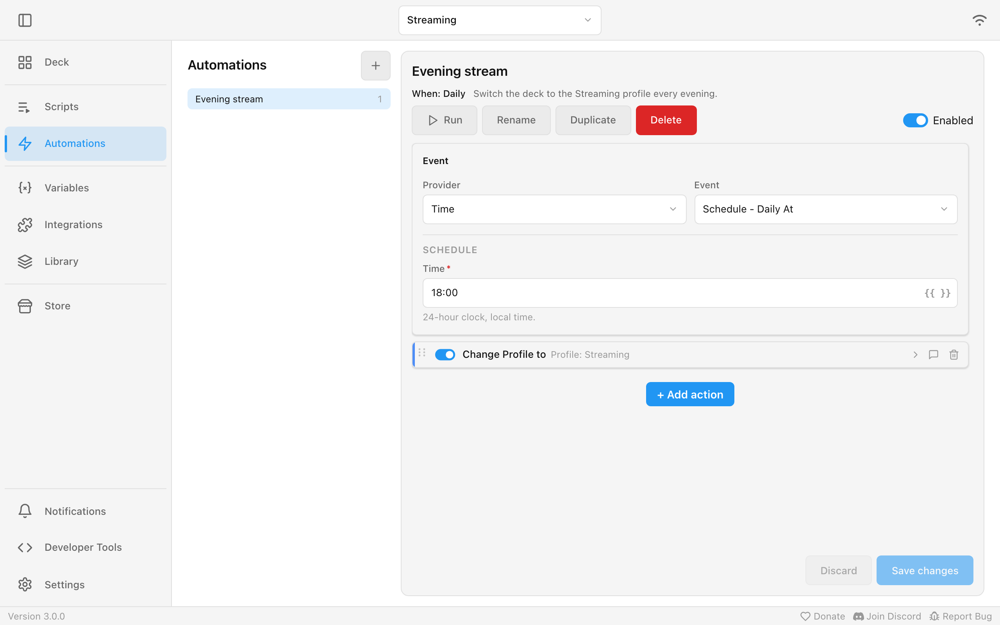
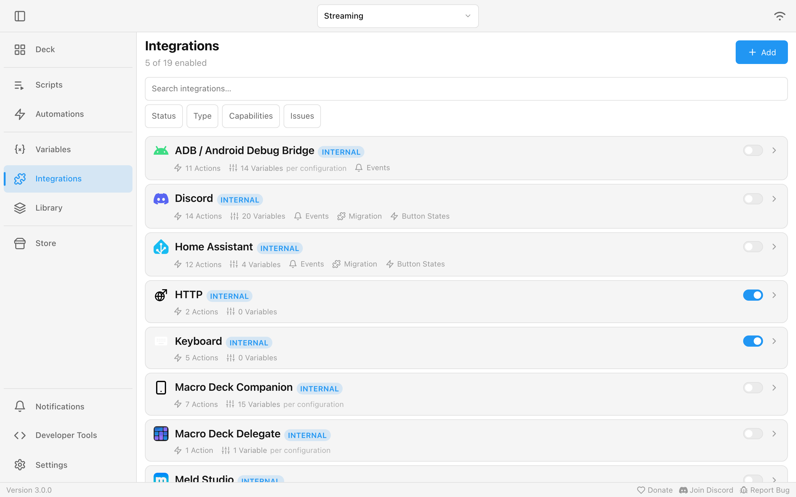

A streaming setup, built up piece by piece.

## Profiles

One profile per use: **Streaming**, **Work**, **Gaming**. A profile holds all its folders and
widgets. Switch between them at the top. Each device can open with its own profile.

## Folders

Inside **Streaming**: a start folder **Home** with **Scenes**, **Audio** and **Chat** subfolders,
listed on the right. A button with **Change Folder to** opens a subfolder, **Go Back** returns.

## Widgets

The tiles in a folder:

| Widget | Example |
| --- | --- |
| Action Button | **Scenes**, **Go live**, **BRB** |
| Slider | Mic volume |
| Clock | The current time and date |
| History Graph | CPU load over the last minutes |
| Weather | Today and the next days for your city |
| Music Player | What Spotify is playing, with play and skip |

## Actions and triggers

What a widget does, and when. The **Scenes** button runs **Change Folder to** on a short press:

| Trigger | Example action |
| --- | --- |
| Short Press | Switch OBS scene |
| Long Press | Start the stream |
| Double Tap | Mute all audio |
| Event | Turn the mic slider's accent red when OBS reports **Streaming Started** |

Every widget with actions, sliders included, can add event triggers next to its press triggers.

Actions run top to bottom. **If / Else**, **Repeat** and **Wait** build longer flows, for example:
*mute the mic, wait 3 seconds, switch the scene*. **Run** tries them out right away.

## Button states

The **Mic** button has two states, **Live** and **Muted**, each with its own label and color. Every
tap switches to the next one.

With **State mapping**, the state follows a variable instead, for example Discord's **Self Muted**.
The button then shows the truth even when you mute in Discord itself.

## Variables

Values you can show and use anywhere:

- **Integration variables:** the CPU load, the date, the weather, the current OBS scene.
- **User variables:** your own, for example a `deaths` counter.

Show one in a label with `{{ vars.deaths }}`, like the **Deaths: 3** button above.

Every speaker and microphone gets its own volume and mute variable, named after the device, for
example `system_audio_input_usb_mic_volume_percent`. An unplugged device keeps its variables; they
read as unavailable until it is back. The volume actions can control the default output, the default
input or one specific device.

Some integrations, such as Home Assistant, offer far more values than they list up front. Pick the
integration in the variable browser and search for an entity by name or variable name, then open it
to see its state and attributes. If you know the entity id, for example `light.office_lamp` or
`light.office_lamp/brightness`, type it under **Enter a resource ID** instead.

## Scripts and automations

- **Script:** actions you reuse, for example *Go live* used by three buttons.
- **Automation:** actions that run on an event without belonging to a widget. **Evening stream**
  switches the deck to the **Streaming** profile every day at 18:00:

Other events: a device connects, a variable changes, OBS reports **Streaming Started**, a song
starts playing.

## Integrations and the Store

Integrations connect Macro Deck to other apps: OBS, Home Assistant, Voicemeeter, Spotify, Twitch,
Discord and more. Turn on the ones you use under **Integrations**.

The **Store** for more plugins and icon packs is not available to everyone yet. Everything published
there will be reviewed and signed first. Members of the Store tester programme can already use it:
sign in with your Macro Deck account under **Settings > Account**. A change to your tester access
can take up to a day to show up. If you were signed in before your Macro Deck version supported
testers, sign out and in once.

**Refresh** on the Store page fetches the latest catalog and opens a log of each step as it happens.
Macro Deck also refreshes on its own about once an hour. While a refresh runs, the button says
**Refreshing…** in every window, and pressing it opens the log of that refresh instead of starting a
second one.

## Devices

Every phone, tablet or browser that connects shows up in **Settings > Devices**. Choose there which
profile each device opens with.
