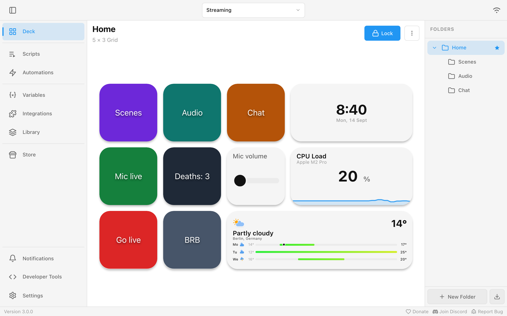
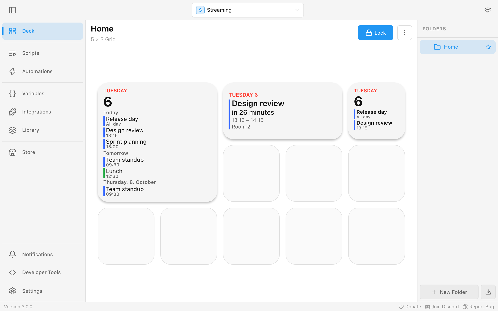
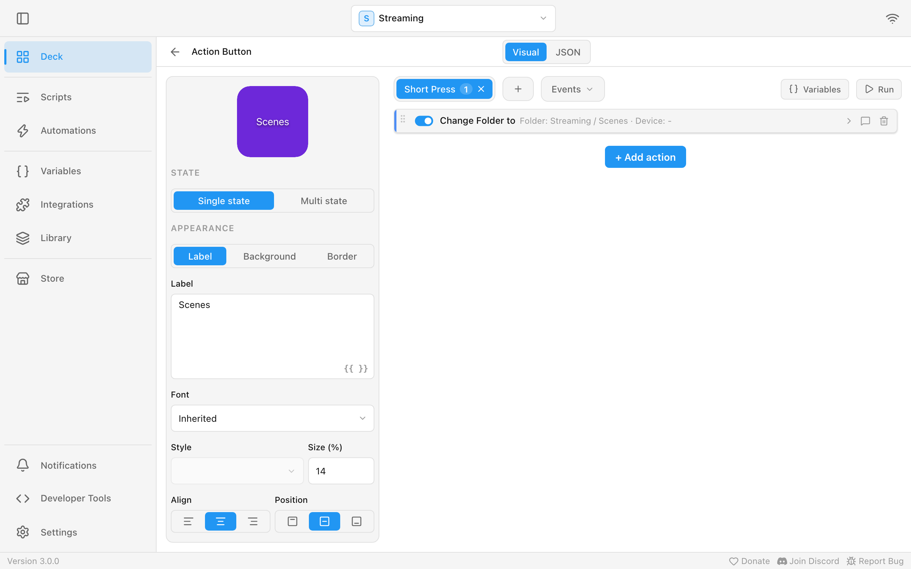
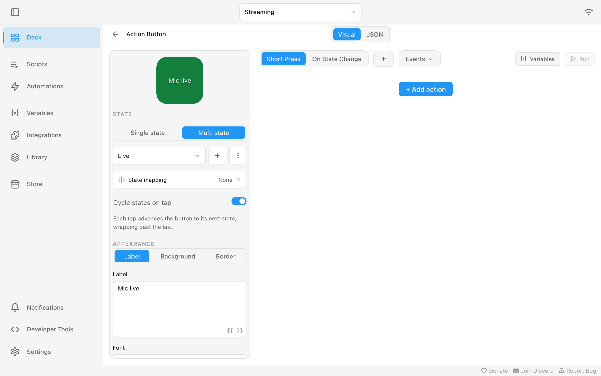
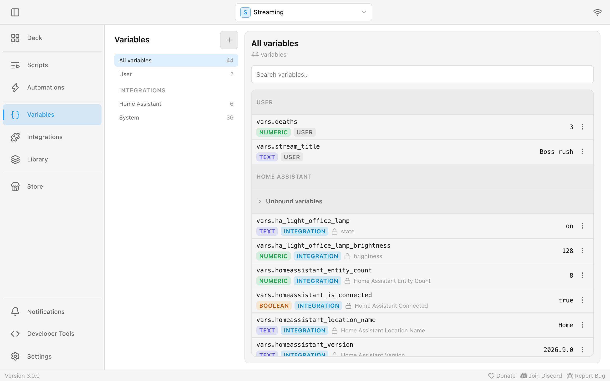
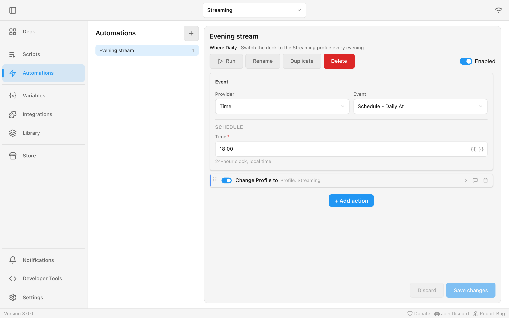
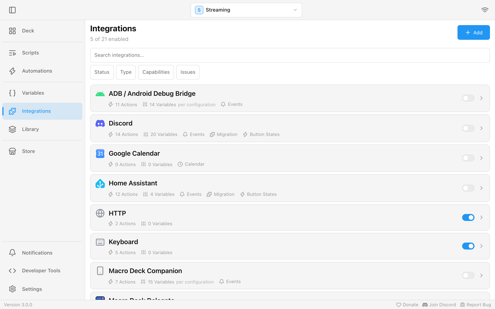

A streaming setup, built up piece by piece.

## Profiles

One profile per use: **Streaming**, **Work**, **Gaming**. A profile holds all its folders and
widgets. Switch between them at the top. Each device can open with its own profile.

To build a variant, for example a second streaming layout, duplicate a profile from the profile
menu. The copy gets every folder, widget and setting, and is named like **Streaming (copy)**.
Automatic activation stays with the original, so set it up again for the copy if you want it.

Edit a profile from the profile menu to set its default grid size, widget spacing and corner radius.
Turn **Widget shadows** off there for a flat deck, which also looks cleaner with very small spacing.

To change the order of your profiles, open the profile menu and drag a profile by its handle, or choose
**Move Up** or **Move Down** from its **More actions** menu. A device without a profile of its own opens
the first one, and the Companion app's two-finger swipe follows this order once the app reconnects.

## Folders

Inside **Streaming**: a start folder **Home** with **Scenes**, **Audio** and **Chat** subfolders,
listed on the right. A button with **Change Folder to** opens a subfolder, **Go Back** returns.

**Change Folder to**, **Change Profile to**, **Go to Parent Folder** and **Go Back** have an optional
**Device** setting. A button pressed on a device only moves that device. An automation has no device
behind it, so with **Device** empty it moves every connected device. Pick a device there to move only
that one. If it is not connected at that moment, the action reports an error instead of moving the others.

## Widgets

The tiles in a folder:

| Widget | Example |
| --- | --- |
| Action Button | **Scenes**, **Go live**, **BRB** |
| Slider | Mic volume. Turn on **Color thresholds** to color it by the range its value is in |
| Clock | The current time and date |
| History Graph | CPU load over the last minutes, green under 50 % and red above 90 % with **Color thresholds** |
| Gauges | CPU, RAM and GPU load side by side as rings with an icon, like a battery overview. **Color thresholds** color each ring by its value instead of a single warning |
| Weather | Today and the next days for your city. Press it for the full details |
| Calendar | Today's date with your next meetings, the next few days on a larger widget, or your next meeting and how long until it starts. Press it for the details |
| Music Player | What Spotify is playing, with play and skip. Some players offer extra settings for each widget below the player choice |
| Twitch Chat | Your channel's chat with emotes and badges, offered once a Twitch account is connected |
| Twitch Stream Stats | Whether you are live, your viewers, chatters, followers and subscribers, the stream title, category and uptime, and a small graph, in a style you choose, offered once a Twitch account is connected |
| YouTube Chat | Your live stream's chat, offered once a [YouTube channel](/guide/youtube/) is connected |
| YouTube Stream Stats | Whether you are live, your viewers, likes and subscribers, the stream title and uptime, and a small graph, in a style you choose, offered once a YouTube channel is connected |
| Countdown | A pizza timer that counts down and alerts you when it runs out |
| Stopwatch | How long the current segment of your stream has been running |

Labels and text use the fonts installed on your computer, plus any you import under
[Library > Fonts](/guide/fonts/).

### Moderating from the chat widgets

Press the **Twitch Chat** or **YouTube Chat** widget to open the chat in a larger dialog. It stays at the newest message while
you are at the bottom. Scroll up to read, and the chat stops moving; **Jump to latest** takes you back.

Tap a message to delete it, time out its sender for 1 minute, 10 minutes or 1 hour, ban or unban them. A ban
asks you to confirm first. The dialog says whether the action worked, or why Twitch or YouTube refused it:

- **Twitch did not grant Macro Deck the permission for this action**: reconnect the Twitch account in
  **Integrations** to grant the moderation permissions.
- **Twitch did not allow this**: reconnect the Twitch account in **Integrations** and try again.
- **The host is locked**: unlock the computer running Macro Deck, as for any other action.

On YouTube, **Unban** only lifts bans you made through Macro Deck during the current broadcast; lift other bans
in YouTube Studio. See [YouTube](/guide/youtube/#moderating-youtube-chat).

Your channel's own messages, and messages that reach your chat from another channel's Shared Chat, offer no
actions; moderate those on Twitch. Anyone who can use your deck can moderate through the dialog. To only
show the chat, turn off **Allow moderation in the chat dialog** in the widget's settings. Widgets that a
plugin places in its own profiles open the chat without moderation. The dialog opens on the device you
pressed the widget on, so a press on a hardware deck does not open it.

On a small device or a large widget, change **Size (%)** in the widget's settings to make the chat text bigger or
smaller. 100 is the default and values from 25 to 300 are accepted. The size applies to the widget; the chat
dialog keeps its own.

To make the chat easier to read on your background, pick a **Message color** for the chat text. Pick a
**Name color** to show every chatter's name in that one color instead of each chatter's own color. Reset
either one to go back to the theme's text color or the chatters' own colors. The widget's title and its
status notices keep the theme's text color. Like the size, both colors apply to the widget; the chat dialog
is not affected.

### The Stream Stats widgets

The **Twitch Stream Stats** and **YouTube Stream Stats** widgets work the same way. Pick what the widget shows with **Style** in its settings. Each style names the size it is designed for, and
keeps the same content at any other size, only larger or smaller:

| Style | Shows |
| --- | --- |
| **Overview (3x2)** | Your channel name and live status, the stream thumbnail, title, category and uptime, and a row of stat tiles |
| **Stats row (3x1)** | A row of stat tiles |
| **Live status row (3x1)** | The live status and category, with one number beside them |
| **Single value with graph (2x2)** | One number, the live status and a graph of that number |
| **Single value (1x1)** | One number with a live dot |

For the Overview and the Stats row, **Stats** chooses which tiles appear and in which order: drag a row or use
its arrows. Twitch offers viewers, chatters, followers and subscribers, with the first three on by default.
YouTube offers viewers, likes and subscribers, all on by default. Four tiles fit best in a widget one column wider than the style's size. The Overview also has
**Stream details**, which chooses and orders the title, category (Twitch only) and uptime next to the thumbnail, and
**Show thumbnail**. For the other three styles, **Value** chooses the number they show.

The graph follows the chosen number. It starts when the widget is first shown and begins again after Macro
Deck restarts, so it fills over time; followers and subscribers change slowly, so their graph often stays
flat. Offline, viewers and chatters show a dash, while followers and subscribers stay. Subscribers also show a
dash while Twitch does not report them to Macro Deck. On YouTube, viewers and likes show a dash offline, and
viewers and subscribers also while you hide those counts on YouTube. The Live status row shows the stream title
instead of the category.

Everything the widget shows is also a regular variable of the Twitch integration, named
`twitch_<account>_viewer_count`, `twitch_<account>_chatter_count`, `twitch_<account>_follower_count`,
`twitch_<account>_subscriber_count`, `twitch_<account>_display_name`, `twitch_<account>_stream_title`,
`twitch_<account>_stream_category`, `twitch_<account>_uptime_seconds`, `twitch_<account>_is_live` and
`twitch_<account>_stream_thumbnail_url`. Use them in your own widgets, actions
and conditions. The chatter count is everyone in your chat, including you and bots, and needs one more
permission: if **Integrations** shows that the account lacks it, reconnect the Twitch account. The YouTube
variables are listed on the [YouTube](/guide/youtube/#what-you-can-use) page.

### Countdown and Stopwatch

A **Countdown** counts down from a duration you set in its settings. Tap it to start, tap again to pause
and again to continue; hold it to reset it. When the time runs out the widget turns red with a pulsing
ring until you tap it, which also resets it.

Set **When started** to **Ask for the duration** to choose the time each time instead. Tapping the idle
countdown then opens a dialog with quick choices from 1 minute to 1 hour, or hours, minutes and seconds
to set yourself. After a reset, or once a finished countdown was tapped, the next tap asks again. The
dialog opens on the device you tapped. A hardware deck cannot show it, so a press there starts the
duration entered last and does nothing until one was entered.

A **Stopwatch** starts on a tap, pauses on the next and continues on the one after. Hold it to set it back
to zero. Its ring goes round once a minute.

Both widgets offer their own triggers in the widget editor, so actions can run when something happens:

| Widget | Triggers |
| --- | --- |
| Countdown | **Started** (also when it continues), **Paused**, **Reset**, **Time's Up**, **Dismissed** |
| Stopwatch | **Started** (also when it continues), **Paused**, **Reset** |

They also keep variables of their own, which the widget's own actions can use, for example in **If / Else**
or a **Set Variable** that copies the time into one of your variables:

| Widget | Variables |
| --- | --- |
| Countdown | `countdown_remaining_seconds`, `countdown_running`, `countdown_finished` |
| Stopwatch | `stopwatch_elapsed_seconds`, `stopwatch_running` |

These change every second while a timer runs, so an automation on **Variable Changed** without a filter
runs every second too. A running countdown or stopwatch starts over when Macro Deck restarts. On a
hardware deck, the key shows the widget's label and colors but not the time.

### Calendar widget

The **Calendar** widget shows the events of the calendars you connected under **Integrations**, for
example [Google Calendar](#connect-google-calendar) or [Outlook Calendar](#connect-outlook-calendar). Until a calendar is connected it says **No calendar
connected**. Each event is marked in its calendar's color. Its **Layout** decides what it shows:
**Agenda**, the default, lists your upcoming events, and **Next event** counts down to the next one. The
settings change with the layout, so you only see the ones that apply.

With **Show date** on, which it is by default, the widget looks like a calendar on a phone's home screen:
the weekday in small red capitals above a large day of the month, in Macro Deck's language. On a 1x1 **Agenda**, the date sits above the next two events, each with its title and time; when
nothing is left today it says **No more events today**, or **No upcoming events** if its **Days** reach past
today and nothing is planned. A 2x1 Agenda puts the date on the left and up to four events on the right, and
from 2x2 on the date heads a section for each day. A **Next event** layout shows the weekday and date in a
small red line on top. Turn **Show date** off for the plain list.

Without the date, an **Agenda** smaller than 2x2 lists the next events within its **Days**, up to four,
with the day in front of events after today; one cell wide, the time sits above each title. From 2x2 on, it
shows a section for each day, headed **Today**, **Tomorrow** and then the weekday and date, with up to six
events a day. Events that have ended leave the list. The widget's settings:

| Setting | What it does |
| --- | --- |
| **Layout** | **Agenda** or **Next event**. |
| **Calendars** | The calendars to show, each listed with its account and provider. Leave it empty for every calendar, including ones you connect later. |
| **Days** | How many days ahead, from 1 to 7, the agenda looks, picked from a list. Agenda only. |
| **Event Starts Soon lead time** | How long before an event starts the widget's own **Event Starts Soon** trigger runs, from 1 minute to 1 hour, picked from a list. 15 minutes by default. |
| **Show date** | Shows today's weekday and date. On by default. |
| **Show all-day events** | Lists all-day events, such as holidays or a day off. A new widget starts with it on for an Agenda and off for Next event; once saved, it keeps its value when you change the layout. |
| **Show time**, **Show location**, **Show calendar name** | What each event shows besides its title. Agenda only. |

The **Next event** layout shows the next event's title, how long until it starts, for example *in 25
minutes* or *in 5 days*, and its time and location; one cell wide, it shows only the title and how long
until it starts. It adds **When an event has started**: **Keep showing it until it ends** shows **Now** for
the running event, while **Show the next event** moves on as soon as an event starts.

The details dialog shows when an event is, its calendar, account and provider, the location, the
description and who is invited, with their answers. A very long description is shortened, and the
dialog lists the first 100 people invited. **Join meeting** opens the meeting link on the
computer running Macro Deck, not on the device you pressed. While that computer is locked, Macro Deck
refuses to open the link. The dialog opens on the device you pressed.

Press a calendar widget in the **Next event** layout to open the details of the event it shows. Press an
**Agenda** to open a dialog that lists its upcoming events by day, for its **Calendars**, **Days** and **Show all-day
events**; press an event there to see its details in the same dialog, and **Back** to return to the list.
The list shows up to 50 events and says how many more are coming up after them.
The list follows your calendars while it is open, and says **This calendar widget no longer exists.** once
the widget is deleted. Give the widget a **Short Press** action of your own and yours runs instead.

The widget takes actions in the widget editor like a button, in either layout, on **Short Press**, **Long Press**, **Touch
Start**, **Touch End** and **Double Tap**, and offer three triggers of their own under **Add trigger**:

| Trigger | Runs |
| --- | --- |
| **Event Starts Soon** | The widget's **Event Starts Soon lead time** before an event starts. |
| **Event Started** | When an event starts. |
| **Event Ended** | When an event ends. |

They run for the events in the widget's **Calendars**, all-day events only with **Show all-day events**
on, and follow the same rules as the [Calendar triggers](#calendar-triggers-and-join-meeting): each runs
once per event, and an event that started or ended while Macro Deck was off, or more than a few minutes
ago, does not run them afterwards. Their actions can use the event's values with the same names, such as
`{{ event.title }}`. The **Calendar** events under **+ Add event trigger** are the general Calendar
triggers instead: they ignore the widget's calendars and lead time and have their own **Account**,
**Calendar** and **Lead time**.

The **Show Calendar Details** action, under **Calendar**, opens the same dialog as a press, for example
on a **Long Press**: the details of the event the **Next event** layout shows, or an Agenda's list of
events. It works in a calendar widget's own actions only. In the Next event layout it fails with **The
widget shows no event right now.** when there is none; an Agenda without upcoming events still opens its list, which says
**No events**.

The widget also keeps variables of its own about the event it shows: the event of the Next event layout,
or the first event an Agenda lists, so they change when you switch the layout. The widget's own actions can use them, for example in **If / Else**:

| Variable | Holds |
| --- | --- |
| `calendar_next_title` | The event's title. |
| `calendar_next_start`, `calendar_next_end` | Date and time in the local time of the computer running Macro Deck, such as `2026-10-05T09:00:00.0000000+02:00`. |
| `calendar_next_countdown` | How long until it starts, as the widget says it, such as *in 30 minutes*, or *Now* while it runs, in the language Macro Deck is set to. |
| `calendar_next_minutes` | Minutes until it starts, rounded up, and `0` while it runs. |
| `calendar_next_running` | Whether it is running. |
| `calendar_next_location`, `calendar_next_meeting_url` | Its location and meeting link. Empty when the event has none. |
| `calendar_next_calendar` | The name of its calendar. |

While the widget shows no event, these variables do not exist, so a condition can check them with **is
not available**. The countdown and the minutes change once a minute while an event is coming up, so an
automation on **Variable Changed** without a filter runs every minute too.

A hardware deck has no screen for these dialogs, so pressing a calendar widget there runs only your
own press actions and does nothing without them. To join a meeting from a key, give it the
[**Join Meeting**](#calendar-triggers-and-join-meeting) action.

Macro Deck reads your calendars every five minutes, so a new event can take a moment to appear; the
**Refresh Calendars** action, under **Calendar**, reads them right away and fails with **Some calendars
couldn't be updated** when an account cannot be read. It reads
about a week ahead, from yesterday through the day a week from today: the Next event layout says **No
upcoming events** when nothing is planned in that time, even if a later event exists. When an
account cannot be read, the widgets keep its last events and say **Some calendars couldn't be updated**;
check that account's integration under **Integrations**.

Everything these widgets show, including the descriptions and participants in the details dialog, can be
seen on every device connected to your Macro Deck. Keep calendar widgets off profiles that devices you
don't trust use.

A profile with calendar widgets that you import into a Macro Deck version without calendar support shows
those widgets as not available.

### Gauges

A **Gauges** widget shows up to eight numbers as rings, each with an icon in the middle and its value and an
optional name below. A new one starts with CPU and RAM. The rings arrange themselves for the tile: four of
them sit in two rows on a square tile and in one row on a wide one.

In the widget's settings, pick the ring to edit from the list under **Gauges**. **Add gauge** adds an empty
one, **Delete** removes the one you picked, and **Presets** add a ready ring for CPU, RAM or GPU. A full
widget hides the presets. For the ring you picked:

- Choose a **Variable** with a number and a **Name**. The name can include variables, for example the
  processor's model under its CPU ring.
- **Icon** opens the icon picker. Macro Deck ships the read-only **Included** pack with icons for CPU,
  memory, graphics card, drives, network, battery, temperature, fans, audio and more; any other icon pack
  works too. **Icon Color** recolors the icon.
- **Minimum** and **Maximum** set the values of an empty and a full ring. With **Maximum** at 0 the ring
  uses the variable's own maximum, otherwise the minimum plus 100.
- **Ring color** colors the ring; without one it follows your accent color. **Warning** turns the ring red
  at or above, or at or below, a **Threshold**, for example a CPU that runs hot or a battery that runs low.

**Style** draws every ring of the widget as a full **Ring** or as an open **Arc**.

## Actions and triggers

What a widget does, and when. The **Scenes** button runs **Change Folder to** on a short press:

| Trigger | Example action |
| --- | --- |
| Short Press | Switch OBS scene |
| Long Press | Start the stream |
| Double Tap | Mute all audio |
| Event | Turn the mic slider's accent red when OBS reports **Streaming Started** |

Some widgets already do something on a short press before you add anything: pressing a **Weather** widget
opens its details, and a **Calendar** widget its list of events or the details of its next event. Give such
a widget a Short Press action of your own and yours runs instead. A hardware deck has no screen for these
details, so these widgets do nothing there until you add an action.

Every widget with actions, sliders included, can add event triggers next to its press triggers. Give an
event trigger a **Name** to tell several of them apart in the **Events** list.

Once a widget has a Double Tap action, its Short Press waits a moment to see whether a second tap follows,
so a single tap runs slightly later. A double tap runs only the Double Tap action. On a slider, a double tap
still moves the level with each tap, and the tile flashes like a pressed button once the double tap is
recognised.

Actions run top to bottom. **If / Else**, **Switch**, **Repeat** and **Wait** build longer flows, for example:
*mute the mic, wait 3 seconds, switch the scene*. **Run** tries them out right away.

**Switch** picks one path by a value, so a single block replaces a chain of **If / Else** blocks. Put the value
to look at in **Switch on**, usually a variable, then add a **Case** for each value you care about and the
actions to run for it. The cases are checked from top to bottom and only the first match runs. **Otherwise**
runs when no case matches or the variable you picked has no value. Matching works like **If / Else** with *is*: text must match exactly, so
`all` does not match `All`, while numbers compare by value.

## Button states

The **Mic** button has two states, **Live** and **Muted**, each with its own label and color. Every
tap switches to the next one.

With **State mapping**, the state follows a variable instead, for example Discord's **Self Muted**.
The button then shows the truth even when you mute in Discord itself.

Some actions know their own state, for example **Mute / Unmute** or OBS's scene actions. The action list
marks them, and each one gets a button to let it drive this button's states. When you add such an action,
the editor offers this right away. The action then decides which states exist, and you still style each of
them. The **×** next to *Provided by* brings your own states back. Plugin actions that supply an icon work the same
way for the button's icon.

## Icon appearances

An icon can have more than one appearance: a light and a dark version, or an animated icon and a still
version of it. It stays one icon in **Library > Icon Packs** and in the icon picker, and Macro Deck shows the
appearance that fits:

- **Light** or **Dark** follows the theme of the screen showing the deck: the Macro Deck app, the deck you
  open in a browser and the Companion app. With the theme set to **System**, each of them follows its own
  device's setting.
- **Static** is shown where the system asks for reduced motion, and **Animated** everywhere else. In the
  Companion app that is **Remove animations** on Android and **Reduce Motion** on iPhone and iPad. An animated
  icon without a static appearance keeps playing.
- A device that can't play animations, such as some stream controllers, shows the **Static** appearance when
  there is one.
- When no appearance fits, the icon's own image, the **Default**, is shown.

Icons with appearances have a layered mark in the corner. Double-click an icon, or right-click it and choose
**Appearances…**, to see them. There you add an appearance from an image file, replace or remove one, or use an
existing icon from the same pack as an appearance. That icon then disappears from the pack, and buttons and
actions that used it switch to the icon it became part of. Appearances of icons in Store and plugin packs come
with the pack and can't be changed.

To always show one appearance on a button or slider, pick it under **Icon appearance** next to the icon.
**Automatic** goes back to choosing by theme and motion. A flow can switch it with the **Set Icon Appearance**
action.

When you import images, files named like `play.png`, `play.dark.png` and `play.static.gif` in the same folder
become one icon `play` with a dark and a static appearance. The words `light`, `dark`, `static` and `animated`
work this way, also combined, as in `play.dark.static.png`. Other names import as separate icons as before.

Appearances travel with the icon when you export a pack or a profile. A Macro Deck version without
appearances shows only the default images, and if you go back to such a version, its icon packs lose their
appearances.

## Variables

Values you can show and use anywhere:

- **Integration variables:** the CPU load, the date, the weather, the current OBS scene.
- **User variables:** your own, for example a `deaths` counter.

Show one in a label with `{{ vars.deaths }}`, like the **Deaths: 3** button above.

A user variable is **Text**, **Numeric**, **Boolean** or **Color**. A Color variable holds a color such as
`#3366ff` that widgets, folder backgrounds and the accent color can follow, see
[Colors from a variable](/guide/tips/#colors-from-a-variable).

Every speaker and microphone gets its own volume and mute variable, named after the device, for
example `system_audio_input_usb_mic_volume_percent`. An unplugged device keeps its variables; they
read as unavailable until it is back. Macro Deck remembers up to 64 devices; after that, the oldest
unplugged device makes room. The volume actions can control the default output, the default
input or one specific device.

Every disk gets numbered variables too: `system_disk_0_*` is the system disk (the drive Windows runs
from, or `/` on macOS and Linux), and the others follow, up to eight. Each disk has:

| Variable | Shows |
| --- | --- |
| `system_disk_0_name`, `_mount_point`, `_file_system` | The disk's name, where it is mounted (for example `C:\` or `/Volumes/Backup`) and its file system. |
| `system_disk_0_total_bytes`, `_used_bytes`, `_free_bytes`, `_usage_percent` | Its size, the space in use, the space still free for you, and how full it is. The numbers match Finder and Explorer: space the system keeps in reserve counts as used. |
| `system_disk_0_read_bytes_per_second`, `_write_bytes_per_second` | How fast it is reading and writing right now. |
| `system_disk_0_read_usage_percent`, `_write_usage_percent` | How busy it is with reading and with writing. A fast SSD handling many requests at once reaches 100 % quickly. |

A disk you plug in while Macro Deck runs gets the lowest free number within a few seconds. A disk you
remove keeps its variables; they read as unavailable until a disk takes its number again. After a
restart the numbering starts over, so a removable disk can end up with a different number. Network
drives and hidden system volumes are left out. On macOS, read and write figures come
from the physical disk, so all volumes on one disk show the same activity. Linux shows no activity
for ZFS pools.

Some integrations, such as Home Assistant, offer far more values than they list up front. These wait
in a collapsed **Unbound variables** group at the top of the integration's variables, on the Variables
page, in every variable picker and on the integration's own page. Open the group, or search for an
entity by name or variable name, then open an entity to see its state and attributes and choose
**Bind** on the one you want: it becomes a normal variable. If you know the entity id, for example
`light.office_lamp` or `light.office_lamp/brightness`, pick the integration in the variable browser and
type it under **Enter a resource ID** instead.

A Slider can control Home Assistant too. In the slider's **Variable** field, open **Unbound variables**
under Home Assistant, then the entity, and pick the value to adjust:

| Entity | Value to pick |
| --- | --- |
| Light | `brightness_pct`, the brightness in percent, or `color_temp_kelvin` |
| Fan | `percentage` |
| Cover, valve | `current_position`, and `current_tilt_position` for a cover |
| Media player | `volume_level` |
| Thermostat, water heater | `temperature` |
| Thermostat, humidifier | `humidity` |
| Number, number helper | `state` |

The slider shows the value Home Assistant reports and sends the new one when you let go. Dragging a
light to zero turns it off, and dragging a light that is off turns it on. An entity with nothing to
adjust right now, such as a media player in standby, ignores the slider. A value you bound before as
**Text** is not offered: remove that variable and bind the value again.

A user variable can also **read from a file**, like OBS's *Read from file*: choose **Read from file** as
its source when you create it and pick the file. The variable shows the file's content and follows every
change another program or script makes to it. A trailing line break is ignored, and a number or true/false
variable needs content of that kind. While the file is missing, unreadable or does not fit, the variable
reads as unavailable.

Such a variable is read-only. Turn on **Allow write-back** to let changes made in Macro Deck, for example
with a slider or **Set Variable**, go into the file too. **File settings** in the variable's menu changes
the file or write-back later. When you export widgets, a variable that reads from a file travels as an
empty variable: neither its path nor the file's content goes into the archive. Macro Deck watches the file
for changes; a file on a network share may not report them.

To save any variable's value on demand, use the **Write Variable to File** action. It replaces the file's
content with the current value, creates the file if needed, and needs a full path whose folder exists.

Only your own variables can read from a file. To keep a file up to date with any other variable, for
example the current OBS scene or `system_cpu_usage_percent`, create an automation: the event
**Variable Changed** watching that variable runs **Write Variable to File** for the same variable.
Every change then lands in the file.

### Template variables

A **template variable** combines other variables, text and filters into a new variable. Choose
**From template** as the source when you create a variable, pick its type and write the template in the
same syntax labels use, for example `CPU: {{ vars.system_cpu_usage_percent }}%` or
`{{ vars.weather_temperature }} °C - {{ vars.weather_condition }}`. Below the field you see the value the
variable would get. The `{{ }}` button opens the template editor, which lists your variables, filters
and logic blocks to insert and previews the result. While you type there, it suggests variables after
`{{` or `vars.`, filters after `|` and logic blocks such as `if` or `for` after `{%`.

The value follows every change to the variables the template reads, including other template variables:
with `template_status` reading `template_temperature_text`, which reads `weather_temperature`, a new
temperature updates both. A template variable announces a change, for example to **Variable Changed**,
only when its value really changes. **Template settings** in the variable's menu changes the template or
the decimal places later; to change the type, create the variable again.

The type is checked: a **Numeric** variable needs a number with a dot as the decimal separator, a
**Boolean** variable needs `true`, `false`, `1` or `0`, a **Color** variable a color such as `#FF8800`. While the template produces something else or
cannot be rendered, the variable reads as unavailable and its row says why. A template that reads its
own variable, directly or through other template variables, is refused, and if a later change closes
such a loop, the variables in it read as unavailable until the loop is gone.

Some things to know:

- A template variable is read-only: **Set Variable**, sliders and plugins cannot write to it.
- Templates are rendered again only when a variable they read changes. A template with the current time
  does not tick on its own.
- After a start, a template that reads a plugin's variables shows empty values until the plugin is
  ready, and then updates.
- An automation that writes a variable whenever a template variable reading it changes is a loop
  Macro Deck cannot see. Avoid it.
- When you export widgets, a template variable travels as its template and renders again after import.

### Share variables with another Macro Deck

With **Macro Deck Delegate**, one Macro Deck can use the variables of another one, for example to show
on your streaming PC whether OBS on your gaming PC is live. Both sides have to agree:

1. On the Macro Deck that has the variable, open the variable's menu on the **Variables** page and
   choose **Share with other Macro Decks**. Any global variable can be shared, your own and integration
   variables alike. Shared variables are marked **Shared**; **Stop sharing** in the same menu takes it
   back.
2. On the other Macro Deck, add or edit the **Macro Deck Delegate** connection to it and turn on
   **Import shared variables**. It is off by default.

The shared variables then appear there under the other computer's name, so
`obs_streaming` shared by a computer called *Gaming-PC* becomes `{{ vars.gaming_pc_obs_streaming }}`.
Sharing and unsharing show up within a few seconds, without a restart. While the other Macro Deck is off
or cannot be reached, its variables read as unavailable; once it is back, they catch up within a few
minutes at most. If a name is already taken by another variable, or is longer than 64 characters with the
computer's name in front, that variable is left out, and the connection shows a warning listing it.

A shared variable that can be changed on its own Macro Deck can be changed from the other one too, for
example with a slider or **Set Variable**, so anyone who can change variables on the importing Macro
Deck can change it. A Macro Deck from before variable sharing simply shares nothing.

## Scripts and automations

- **Script:** actions you reuse, for example *Go live* used by three buttons.
  Any device signed in to Macro Deck can also list and run every script that does not run on a widget,
  with its own input values. Macro Deck Companion does this from Shortcuts or Siri on iOS.
- **Automation:** actions that run on an event without belonging to a widget. **Evening stream**
  switches the deck to the **Streaming** profile every day at 18:00:

Other events: a device connects, a variable changes, OBS reports **Streaming Started**, a song
starts playing.

### Calendar triggers and Join Meeting

Three events from **Calendar** run actions around your meetings, in an automation or as an event trigger
on a widget. The Calendar widget also has [triggers of its own](#calendar-widget)
with the same names, which follow the widget's calendars and lead time:

| Event | Runs |
| --- | --- |
| **Event Starts Soon** | A set time before an event starts. Set it with **Lead time**, 15 minutes by default. |
| **Event Started** | When an event starts. |
| **Event Ended** | When an event ends. |

Each can be limited to one **Account** or one **Calendar**; left empty, it runs for the events of every
connected calendar. All-day events start and end at midnight. Each runs once per event.

**Event Starts Soon** also runs for an event Macro Deck first sees inside its lead time, such as one
created or moved a few minutes before it starts, or when Macro Deck starts during that time, as long as
the event has not started yet. **Event Started** and **Event Ended** only run while Macro Deck is running:
an event that started while it was off does not run its actions afterwards. An event added shortly
before it starts, while Macro Deck runs, still runs them when Macro Deck next reads your calendars, a few
minutes late at most. A start or end that is more than a few minutes ago is never caught up, also not
for a trigger you create later. If the
same invitation is in two connected accounts, limit the trigger to one **Account** so it runs only once.

The actions they run can use the event's values, such as `{{ event.title }}` in a text field:

| Value | Holds |
| --- | --- |
| `title`, `location`, `meetingUrl` | The event's title, location and meeting link. Empty when the event has none. |
| `start`, `end` | Date and time in the local time of the computer running Macro Deck, such as `2026-10-05T09:00:00.0000000+02:00`. |
| `allDay` | Whether it is an all-day event. |
| `calendar`, `account`, `provider` | The names of its calendar, account and provider, such as *Work*, *you@example.com* and *Google Calendar*. |
| `eventId`, `calendarId`, `accountId` | Ids, for conditions that compare them. |

The **Join Meeting** action opens the meeting link of the event that is running or starts within
**Starts within**, 15 minutes by default, on the computer running Macro Deck. When several qualify, it
picks the one starting closest to now. **Calendar** limits it to one calendar. All-day events and events
without a meeting link are skipped, and when nothing qualifies, the action fails with **No event with a
meeting link is running or starting soon**. Like the button in the details dialog, it does not open the
link while the computer is locked. Put it on a key of a hardware deck, or run it from an automation on
**Event Starts Soon** with a short lead time to join meetings automatically.

Meeting links come from invitations, and anyone can send you an invitation, so an automation that joins
every meeting can open a link from a stranger. Limit such a trigger to the **Calendar** or **Account** your
meetings are in, or add a condition, for example on `{{ event.title }}`, so it joins only the meetings
you expect.

## Integrations and the Store

Integrations connect Macro Deck to other apps: OBS, Home Assistant, Voicemeeter, Spotify, Twitch,
[YouTube](/guide/youtube/), Discord, Google Calendar, Outlook Calendar and more. Turn on the ones you use under **Integrations**.

The **Store** offers more plugins and icon packs. Everything published there is reviewed and signed
first.

Plugins and icon packs in the Store are made by the community. The first time you open the Store, a notice
explains that the creator of an item is responsible for it when something fails or doesn't work: rate the item,
open an issue in its repository or report it, using the links on its page, and don't open issues about Store items
in the Macro Deck repository. Everything in the Store is subject to the **Store guidelines**; the notice and the
bottom of every Store page open them, next to the imprint and privacy policy. **Got it** hides the notice for good.

**Discover** opens with a search box and a chip for each kind of item (**All**, **Plugins**, **Icon packs**)
with how many there are. Under those, a chip for each Store category that has items of that kind, such as
**Music** or **Streaming**, lists only that category; choose it again to see everything. Below it, every item
is listed as a card showing its kind, rating, installs and whether it is **New** (published in the last 30
days) or recently **Updated**. The list is sorted by **Most popular** unless you pick another order or search.
Once the Store has enough items, rows for **Featured**, **Popular** and **New & updated** appear above the
list, each item in at most one row. Searching also finds items by their tags. **Only available for this
platform** hides items that do not run on your computer, and it stays on until you turn it off; a note says
how many items it hides, with **Show all** next to it. Going back from an item's page returns to the list as
you left it: the same search, kind, category, order and scroll position.

The **⋮** menu at the top right of the Store has **Refresh Store** and **Store settings**. **Refresh Store**
fetches the latest catalog and opens a log of each step as it happens. Macro Deck also refreshes on its own
a few seconds after it starts and then once an hour. While a refresh runs, the Store header says
**Refreshing…** in every window, and choosing **Refresh Store** again opens the log of that refresh instead of
starting a second one. If the store registry is being updated while a refresh runs, the log says so and Macro
Deck tries again a few times over about five minutes before it reports a failure. **Store settings** opens
**Settings > Store**.

**Installed** at the top of the Store lists the Store's plugins and icon packs you have installed, with their
version and any update waiting for them. While updates are waiting, **Installed** shows how many. Update one
at a time from its card, or all at once with **Update all**. After an update downloads, the card shows
**Installing…** while Macro Deck backs up, installs and restarts the plugin, then the version that is now
installed. See [Updates](/guide/updates/#extension-updates) for update notifications and automatic updates.

Icon packs from the Store are read-only on the **Icon Packs** page. You can use their icons on your buttons
and export the pack, but you can't rename, import, or delete icons in it, or edit its name and details.
Deleting the pack there uninstalls it from the Store. To change the icons, export the pack and import the
copy as a pack of your own.

An exported pack has a size limit: at most 29,995 icons, and only so much text
for the icons' names and details. When a pack is larger, Macro Deck tells you it is too large to export; split
it into smaller packs.

An item's page shows its screenshots, description, what changed in the latest version and, in the details
beside it, whether it runs on your platform. It lists **Links** its creator provides, such as its **Homepage**,
the source repository, documentation or a place to report an issue. They open in your browser.

An item in a Store category lists it under **Categories**, and any other tags its creator gave it under
**Tags**; select one to see every item in that category or with that tag.
At the bottom, **You might also like** suggests items you have not installed that run on your computer: first
those that share tags with it, then others from the same creator and of the same kind. Going back from a suggestion
returns to the item you opened it from.

Under **AI**, the page shows what the creator declares about artificial intelligence: whether the item lets
you interact with an AI system, generates content with AI, or contains images, sounds or texts created with
AI, and which AI services it uses. Next to its name, an item that uses AI is marked **Uses AI**, and one that
only contains content created with AI, such as an icon pack with AI-created icons, is marked **Made with AI**. If the
creator has not declared anything, the page says so; that does not mean the item uses no AI.

For your own icon packs, select **Edit** on the pack under **Library > Icon Packs** (or **Edit pack** in its
menu) and set **AI-created icons**. The setting is saved in the exported pack. When you merge a pack that
contains AI-created icons into one of yours, your pack is marked as containing them too.

To install an older version, pick it under **Version** next to the install button. The latest version is
selected by default. The button then says **Install**, **Update to** or **Downgrade to** that version, and a
downgrade asks you to confirm first. Versions that cannot be installed on your computer stay in the list but
cannot be selected. Whether a version works with your Macro Deck version is only known once it is downloaded:
if it needs a newer Macro Deck, the Store says so and offers **Check for updates** instead of **Retry**.
**All versions** under **What's new** lists every version with its release notes. See
[Updates](/guide/updates/#extension-updates) for how an older version affects automatic updates.

Select the publisher's name on a card or an item's page to see everything that publisher offers. An installed
plugin's page has **Open settings**, which opens its integration; its back arrow returns to the Store page. An
installed icon pack's page has **Open in Library**. The other way round, a plugin's page under
**Integrations** and a Store icon pack under **Library > Icon Packs** have **View in Store**, for the
description and release notes. An installed plugin is uninstalled from the **General** details of its page
under **Integrations**, or from its Store page. Uninstalling a plugin also removes the variables it provided.

A `macrodeck://` link to an item opens its page in Macro Deck, and a message appears if the item is no longer
in the Store. See [Store links](/reference/store-links/) for the details, including the AppImage limitation.

The Store footer links to the **Creator Portal**, where you can publish your own plugins and icon packs, and to
the imprint and privacy policy.

Store items show their star rating and how many times they have been installed. The install count
leaves out updates and repairs, and appears once an item has been installed at least once. An item's
page lists its **Ratings and reviews**, which anyone can read. When the creator has answered a review,
their reply appears under it as a **Developer response**. To rate or review an item yourself, sign in
with Macro Deck Connect under **Settings > Account** and install the item first: only items you have
installed can be rated. When you sign in, and whenever you install something while signed in, Macro
Deck records your installed Store items for your account so you can rate them. If ratings or install
counts cannot be reached, the Store keeps working without them.

While you are signed in, Macro Deck occasionally asks you to rate one of your installed Store items. The
dialog shows the item and five stars; choose a star and **Submit** to send the rating, or add a written
review if you like. **Not now** closes it without rating, and the item can come up again later. Macro
Deck only asks about items you installed at least 7 days ago and have not rated yet, asks about one
item at a time, and waits at least 5 days after a prompt was shown before it asks again. Updating an
item does not restart the 7 days. Turn the prompt off with **Ask me to rate installed extensions** in
**Settings > Store**.

To report a Store item, open its page and choose **Report this item** below the details.
To report a review, choose **Report** next to it. Pick a reason and, if you like, add details;
**Other** needs a short description. Reporting needs a Macro Deck Connect sign-in, and each review
can be reported once per account. Reports go to the Macro Deck moderators and do not hide
anything on their own: the item or review stays visible until a moderator has looked at it. Reporting
Store items only works once the Store supports it; until then, Macro Deck tells you it is not
available.

### Tests

A plugin creator can invite you to test a plugin before it is reviewed. The invitation arrives by
email; accept it in the Creator Portal with the same Macro Deck account you use in Macro Deck. While
you are signed in under **Settings > Account**, **Tests** appears at the top of the Store next to
**Installed**, listing every plugin you test. Each plugin starts collapsed and shows how many test
builds it has; select it to see its builds, newest first.

Test builds are not reviewed or signed by Macro Deck: they come straight from the creator and may be
unstable. Choosing **Install** or **Install test build** asks you to confirm that first. A test build
replaces the version of the plugin you have installed, including one from the Store, and the build
that is currently installed shows as **Installed**.

While a test build is installed, the plugin is marked **Test build** under **Tests**, **Installed** and
**Discover**. If the plugin is also published in the Store, **Return to Store version** installs its
current Store release in place of the test build.

### Withdrawn versions

The Store can withdraw a single version of an item, for example when that version turned out to be unsafe.
A withdrawn version is marked **Withdrawn** under **Version** and cannot be installed; the other versions
stay available. If the version you have installed is withdrawn, its card is marked **Version withdrawn**, its
page says why and may name a suggested replacement, and Macro Deck shows a warning notification. Update to
the latest version from its card, or open its page to go back to the latest version with **Downgrade to**
when the latest version is older than yours, or uninstall it.

When the latest version of an item is withdrawn, the item disappears from the Store and can no longer be
installed or updated. If you have it installed, it stays under **Installed**, marked **Removed from the
Store**, and its page says why; you can still uninstall it there.

### The Included icon pack

Macro Deck ships its own icon pack, **Included**, with simple line icons for hardware, network, battery,
weather and audio, for example for the rings of a **Gauges** widget. It appears under **Library > Icon
Packs** and in the icon picker like any other pack and works on every widget. Like a Store pack it is
read-only and can't be deleted. The icons are grey so they read on dark and light tiles; use **Icon Color**
on a widget to recolor them.

### Icon packs from plugins

A plugin can bring its own icon packs, for example the logos of the services it controls. They appear under
**Library > Icon Packs** and in the icon picker as soon as the plugin is installed, marked **Plugin**; hover
the mark to see which plugin provides the pack. Use their icons on any button, not only on the plugin's own.

These packs are read-only, like icon packs from the Store, and you can't delete them yourself. They update
together with the plugin: an update replaces the icons that changed, and buttons keep showing the icon they
use.

When you uninstall the plugin, or an update no longer includes one of its packs, the pack is deleted. If a
button or an automation still uses one of its icons, the pack stays instead, becomes an ordinary icon pack you
can edit or delete, and Macro Deck shows a notification that says why it was kept. An icon that is only
chosen in a plugin's own settings does not count as used. When the plugin later brings
the same pack back, for example after a reinstall, it takes the pack over again: the pack becomes read-only
once more and any changes you made to it in the meantime are replaced by the plugin's icons.

While a plugin developer runs a plugin from its project, its packs appear the same way. If that plugin is never
installed, the packs stay as ordinary icon packs after the developer stops it.

### Connect Google Calendar

Macro Deck reads Google Calendar through an OAuth client of your own in Google Cloud. Setting it up is
free and needed once; the setup in Macro Deck walks you through it and links to the right pages.

1. Under **Integrations**, open **Google Calendar** and start its setup.
2. In the [Google Cloud Console](https://console.cloud.google.com/apis/credentials), create or pick a
   project and enable the **Google Calendar API** for it.
3. Set up the OAuth consent screen and set its publishing status to **In production**. While it stays in
   **Testing**, Google ends every sign-in after 7 days, and you would have to connect the account again
   every week.
4. Create an OAuth client ID with the application type **Desktop app**. The setup shows the **Redirect
   URI** Google sends the sign-in back to, such as `http://127.0.0.1:8193/api/integrations/oauth/callback`;
   a Desktop app client accepts it without adding it anywhere.
5. Copy the client's **Client ID** and **Client Secret** into the setup and continue. Your browser opens
   the Google sign-in.
6. Google warns that it has not verified the app. That is expected for a client of your own: choose
   **Advanced**, continue to your app and allow access to your calendars.

Macro Deck asks Google only for read access to your calendars and for your email address, which names the
account. Calendars you hid in Google Calendar's list are left out of Macro Deck too; show them there to
see their events. The client secret is stored encrypted and only ever sent to Google.

To connect another Google account, choose **Add configuration** on the Google Calendar page and sign in
with that account; the same OAuth client works for all of them. If you connect an account that is already
connected, **Integrations** shows **Google account connected twice**: remove the older configuration. When
Google asks you to sign in again, see [Troubleshooting](/guide/troubleshooting/#google-calendar-asks-you-to-sign-in-again).

### Connect Outlook Calendar

**Outlook Calendar** reads the calendars of a personal Microsoft account (Outlook.com, Hotmail, Live) or of a
Microsoft 365 work or school account.

1. Under **Integrations**, open **Outlook Calendar** and start its setup.
2. Choose **Continue**. Your browser opens the Microsoft sign-in: sign in and allow Macro Deck to read your
   calendars.
3. Choose the calendars Macro Deck should use. Your own calendars and calendars others shared with you are
   listed; a shared one shows who shares it.

Macro Deck asks Microsoft only for read access to your calendars and for your name and email address, which
name the account. Recurring meetings show each occurrence, and a Teams meeting's link is the event's meeting
link for **Join Meeting**. Only the calendars you chose reach widgets and triggers. A calendar you create or
that someone shares with you later is not added on its own: choose **Edit connection** next to the account,
sign in again and pick it. Some organizations only let an administrator allow apps; then the sign-in asks
for an administrator's approval.

#### Use an app of your own

The sign-in goes through Macro Deck's app at Microsoft. If your organization does not allow it, you can
register an app of your own and enter it under **Advanced** in the setup. Microsoft only lets you register
apps in a Microsoft Entra directory: a personal Microsoft account needs one first, for example from a free
Azure account.

1. In the [Azure portal](https://portal.azure.com/#view/Microsoft_AAD_RegisteredApps/ApplicationsListBlade),
   open **App registrations** and register a new application. Under **Supported account types**, choose the
   accounts it should accept.
2. Under **Authentication**, add the platform **Mobile and desktop applications** with the **Redirect URI**
   the setup shows, such as `http://127.0.0.1:8193/api/integrations/oauth/callback`. Do not add it under
   **Web**: that platform expects a client secret, and Macro Deck uses none.
3. Under **API permissions**, add the delegated Microsoft Graph permission **Calendars.Read**.
4. In the setup, open **Advanced** and enter the app's **Application (client) ID**. If the app accepts only
   the accounts of one organization, enter that organization's tenant ID or domain as **Tenant**.

To connect another Microsoft account, choose **Add configuration** on the Outlook Calendar page and sign in
with that account. If you connect an
account that is already connected, **Integrations** shows **Microsoft account connected twice**: remove the
older configuration. When Microsoft asks you to sign in again, see
[Troubleshooting](/guide/troubleshooting/#outlook-calendar-asks-you-to-sign-in-again).

## Managing OBS recordings

Besides starting and stopping a recording, the OBS Studio integration can manage one while it runs:

- **Split Recording File** starts a new file and keeps recording.
- **Create Recording Chapter** adds a chapter marker, optionally with a name. OBS supports chapters only for
  the **Hybrid MP4** format.
- **Set Recording Directory** changes the folder OBS saves new recordings to. Enter the path as OBS sees it:
  when OBS runs on another computer, that is a folder on that computer.

Split and chapter only work while OBS is recording. Otherwise the action fails and says that OBS is not
recording. If OBS refuses a request, for example a chapter in a format without chapter support or a folder it
cannot use, the action fails and shows OBS's reason.

Use the events **Recording File Changed** (when a recording starts, moves to a new file or stops) and
**Screenshot Saved** as triggers, for example to move a finished file or to send yourself a notification. Both
carry the file's path. The variables **Last Recording File** and **Last Screenshot** hold the latest of these
paths. They keep their value across splits and when OBS disconnects, and start empty again when Macro Deck
restarts or you edit the OBS configuration.

## Devices

Every phone, tablet or browser that connects shows up in **Settings > Devices**. Choose there which
profile each device opens with. If you delete the profile a device is showing, the device switches to
the profile it opens with, or to your first profile if that one is gone too.

For a deck in a browser, choose **Hide settings button** in its menu there to take the settings button
off its screen, and **Show settings button** to bring it back. The deck's own settings have the same
**Hide settings button** switch under **Display**, and both change the same setting. The device then
reaches its settings with a swipe in from the left edge of the screen, which slides in a panel with the
settings button. The swipe can start a little in from the edge, which helps where the system uses a
swipe from the left edge for Back, such as Android gesture navigation or a Safari tab. Hiding the button
is not a lock: anyone at the device can still swipe.

When you are signed in under **Settings > Account**, a Companion app license this computer got from a
purchase is saved to your Macro Deck account, and your other computers signed in to it that have no
license yet receive it within about a minute (see
[The Companion app stays unlicensed after a purchase](/guide/troubleshooting/#the-companion-app-stays-unlicensed-after-a-purchase)).

## Open source licenses

Macro Deck is built on open source software. **Settings > About > Open source licenses** lists every
third-party component it includes, with its license and the full license text; search by name or license.
On a phone or tablet, the web client's settings offer the same list under **Open source licenses**. The
files `LICENSE`, `NOTICE` and `THIRD-PARTY-NOTICES` also sit next to the Macro Deck host in the installation
folder, and the Linux AppImage adds a notices file for the system libraries it bundles.
