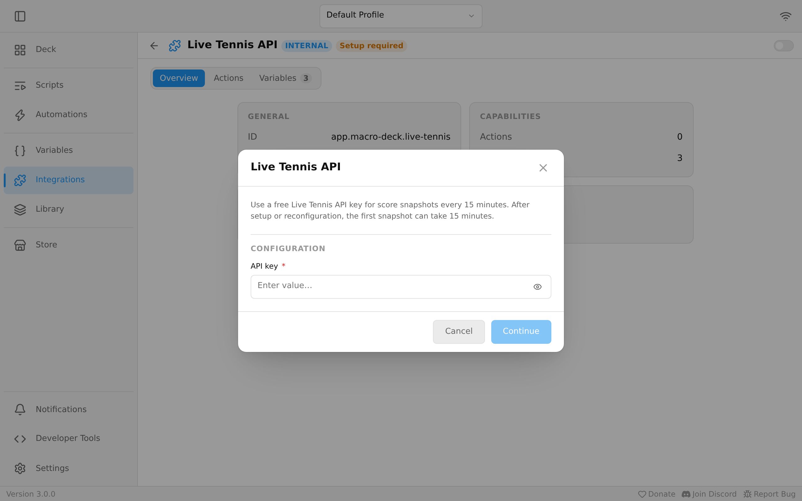

Enable **Live Tennis API** in **Integrations** and enter your own
[free API key](https://livetennisapi.com/subscribe/free). The key is stored as a secret.

The first snapshot can take 15 minutes after setup or reconfiguration. Further snapshots
are requested at most once every 15 minutes, shared across all labels and variables.
Errors also count toward this interval. This uses at most 96 requests per day from the
free tier's 100-request allowance on one installation. Other applications or installations
using the same key share that allowance.

| Variable | Value |
| --- | --- |
| `tennis_scores` | Score summaries for the first five matches in the snapshot |
| `tennis_match_count` | Number of matches returned in the snapshot, up to 500 |
| `tennis_updated_at` | When the snapshot was fetched, in UTC |

Insert a variable into a label with the variable picker. Include the snapshot time beside
the scores so you can tell when they were retrieved.

Scores such as `6-4 3-4 (30-15)` list each set followed by the current points. Brackets
mark a set currently in a tiebreak: `[6-6] (3-2)` is a regular set tiebreak, while a deciding
match tiebreak may appear as `[10-5] (10-5)`. A `?` means the score is unavailable.

An empty successful snapshot has a match count of zero and an empty score summary.
Until a snapshot arrives, or if a request fails, the variables are unavailable. Removing
the configuration disables access; reconfiguring it starts the initial waiting period again.
