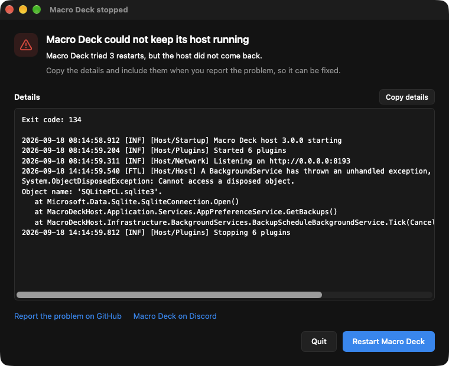

Find your symptom below. If nothing here helps, ask on [Discord](https://discord.macro-deck.app) or
[open an issue on GitHub](https://github.com/Macro-Deck-App/Macro-Deck/issues) and attach your logs.

## Where to find the logs

Macro Deck writes its logs to the `logs` folder inside its data folder:

| System | Data folder |
| --- | --- |
| Windows | `%APPDATA%\MacroDeck` |
| macOS | `~/Library/Application Support/MacroDeck` |
| Linux | `~/.local/share/MacroDeck`, or `$XDG_DATA_HOME/MacroDeck` if that is set |

## A device cannot connect

- **Same network:** your phone, tablet or browser must be on the same network as the computer
  running Macro Deck. A phone on mobile data cannot reach it.
- **Client isolation:** many routers can stop devices on the same Wi-Fi from reaching each other,
  often called AP isolation, client isolation or wireless isolation. Guest networks and public
  Wi-Fi almost always have it on. Connect both devices to the main network, or turn the setting
  off in your router.
- **Different subnets:** a mesh system, a second router or separate networks for 2.4 GHz and 5 GHz
  can put the two devices in different subnets that do not route to each other. Compare the first
  parts of both devices' IP addresses, for example `192.168.1.x` and `192.168.0.x`.
- **VPN:** a VPN on either device can send local traffic through the tunnel instead of your
  network. Disconnect it, or allow local network access in the VPN app.
- **Local network permission:** on iPhone and iPad, apps and some browsers such as Chrome need the
  Local Network permission, under **Settings > Privacy & Security > Local Network**.
- **Port:** Macro Deck listens on port `8193` by default, and on `8194` for HTTPS. You can see the
  port it is actually using in **Settings > Network**.
- **Firewall:** allow Macro Deck, or the port above, through the firewall of the computer running it.
- **Wi-Fi driver:** see [the connection drops after a few minutes](#the-connection-drops-after-a-few-minutes).
- **No Wi-Fi at all:** an Android phone can connect over a USB cable instead, see
  [Connect over USB](/guide/usb-connection/).

## The connection drops after a few minutes

Devices connect at first, then disconnect or stop responding after a few minutes, often while the
deck sits idle.

- **Wi-Fi driver of the computer:** some Wi-Fi adapter drivers, especially in laptops, drop clients
  that have been idle for a few minutes. Update the driver from the laptop or adapter manufacturer.
  Do not fall back to a much older driver instead: it can make the adapter unstable on newer
  hardware.
- **Power saving:** in Windows, open **Device Manager**, open the Wi-Fi adapter's properties and turn
  off **Allow the computer to turn off this device to save power** on **Power Management**.
- **Wired connection:** connect the computer running Macro Deck to the router with a cable. An
  Android phone can also [connect over USB](/guide/usb-connection/).

## Macro Deck is not listening on its port

If another program already uses the port, Macro Deck starts without it and devices cannot connect.
**Settings > Network** then says the port could not be used. Choose a different port there and
restart Macro Deck.

## Buttons do nothing and devices show a lock screen

Macro Deck does not run actions while the computer it runs on is locked. Unlock the computer and try
again.

Connected devices show a lock screen for as long as the computer is locked. You can keep the deck
visible instead by turning off **Lock clients when this computer is locked** in
**Settings > Security**. Actions stay blocked either way.

## The Companion app stays unlicensed after a purchase

When a Companion app that was bought connects, Macro Deck exchanges the purchase for a license with the
Macro Deck servers. **Settings > Companion license** shows the progress:

- **Your purchase is being turned into a license:** the computer running Macro Deck needs an internet
  connection. Macro Deck keeps trying on its own, first after a few seconds and then less often, at
  least every 30 minutes, also after a restart. The page shows when the next attempt runs. A purchase
  the store is still processing can take a while.
- **Licensed:** Macro Deck hands the license to every Companion app that connects to it.
- **Not licensed, nothing pending:** the store did not confirm the purchase, for example after a
  refund or for a test purchase. Macro Deck asks again at most once a day, and never again for a
  refunded, cancelled or revoked purchase. Check the purchase in the Google Play or App Store account
  the app was bought with, and ask on Discord if it looks right there.

If you bought the Macro Deck 2 app for iPhone or iPad, you do not need to buy the Companion app again. Open
the Macro Deck 2 app on the same network, choose **Transfer my purchase** and confirm that the identity it
shows matches **Identity** in Macro Deck's connection panel. Macro Deck then turns the purchase into a license
like any other, and the page above shows its progress. A download from the time the app was still free is
not a purchase and cannot be transferred. If the app reports that the purchase could not be verified, the
Macro Deck servers may not accept these purchases yet; try again a day later.

When you are signed in under **Settings > Account**, Macro Deck saves a license it got from a purchase to
your Macro Deck account, and the page says so. Your other computers signed in to the same account that
have no license yet receive it within about a minute, and hand it to their Companion apps. Macro Deck
shows a notification whenever it receives a license from a device or downloads one from your account. A
license a computer only received from someone else's Companion app is not saved to your account; a
license that was already on the computer before it could save licenses to accounts is treated like one
from a purchase. If a computer already has a different working license, it keeps it; a revoked license is
replaced by the working one.

For support, quote the **License ID** shown on that page. It is safe to share; the license itself is
never shown.

## Macro Deck does not open a second time

Only one Macro Deck can run on a computer at a time. If it is already running, starting it again
does not open a second copy. Look for the running Macro Deck in the system tray or menu bar.

## Macro Deck stopped

Macro Deck runs its host, the part that talks to your devices and plugins, as a separate process. If
the host stops unexpectedly, Macro Deck restarts it on its own: up to three times, waiting a few
seconds longer before each attempt. Devices reconnect once the host is back, and the log records
every attempt.

If the host does not come back, or does not start at all, Macro Deck shows a **Macro Deck stopped**
window instead:

- **Copy details** copies the exit code and the last lines of the host output. Include them, along
  with your [logs](#where-to-find-the-logs), when you report the problem.
- **Restart Macro Deck** starts Macro Deck again from scratch.
- **Quit**, or closing the window, quits Macro Deck.

If the window says a port is already in use, see
[Macro Deck is not listening on its port](#macro-deck-is-not-listening-on-its-port).

## Plugins show up as dotnet in Task Manager

Most plugins run on the .NET runtime that comes with Macro Deck, so Task Manager and Activity Monitor
list them as `dotnet` or ".NET Host" rather than by the plugin's name. This is expected; ending
Macro Deck ends them too.

## Discord cannot be connected

If the Discord setup says that only a Discord Rich Presence service was found, or Discord stays
disconnected, Macro Deck cannot find the official Discord desktop app. Third-party clients such as
Vesktop, Equibop, Legcord or Dorion can share game activity, but Macro Deck cannot control them.
Start the official Discord desktop app, including the Flatpak or Snap version on Linux, and try
again. The third-party client can keep running alongside it.

## Installing on Linux

- **The stable APT suite is empty:** there is no stable release of Macro Deck 3 yet. Use the beta
  suite as described in [Installation](/guide/installation/#debian-and-ubuntu).
- **Macro Deck is not in the AUR:** that is expected for now. Use the RPM package or the AppImage.
