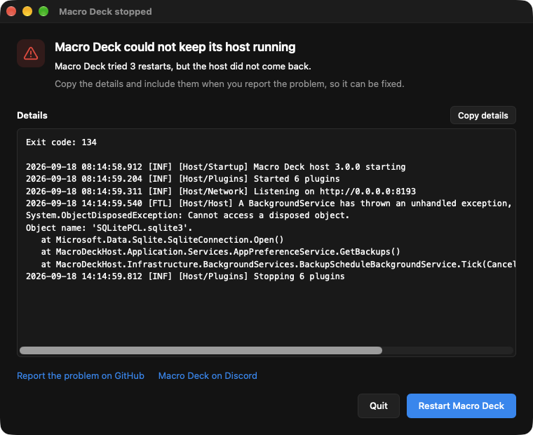

Find your symptom below. If nothing here helps, ask on [Discord](https://discord.macro-deck.app) or
[open an issue on GitHub](https://github.com/Macro-Deck-App/Macro-Deck/issues) and attach your logs.
A problem with a plugin or icon pack from the Store belongs to its creator: use the links on the item's Store
page to open an issue in its repository or report it.

## Where to find the logs

Macro Deck writes its logs to the `logs` folder inside its data folder:

| System | Data folder |
| --- | --- |
| Windows | `%APPDATA%\MacroDeck` |
| macOS | `~/Library/Application Support/MacroDeck` |
| Linux | `~/.local/share/MacroDeck`, or `$XDG_DATA_HOME/MacroDeck` if that is set |

## A device cannot connect

- **Same network:** your phone, tablet or browser must be on the same network as the computer
  running Macro Deck. A phone on mobile data cannot reach it.
- **Client isolation:** many routers can stop devices on the same Wi-Fi from reaching each other,
  often called AP isolation, client isolation or wireless isolation. Guest networks and public
  Wi-Fi almost always have it on. Connect both devices to the main network, or turn the setting
  off in your router.
- **Different subnets:** a mesh system, a second router or separate networks for 2.4 GHz and 5 GHz
  can put the two devices in different subnets that do not route to each other. Compare the first
  parts of both devices' IP addresses, for example `192.168.1.x` and `192.168.0.x`.
- **VPN:** a VPN on either device can send local traffic through the tunnel instead of your
  network. Disconnect it, or allow local network access in the VPN app.
- **Local network permission:** on iPhone and iPad, apps and some browsers such as Chrome need the
  Local Network permission, under **Settings > Privacy & Security > Local Network**.
- **Port:** Macro Deck listens on port `8193` by default, and on `8194` for HTTPS. You can see the
  port it is actually using in **Settings > Network**.
- **Firewall:** allow Macro Deck, or the port above, through the firewall of the computer running it.
- **Wi-Fi driver:** see [the connection drops after a few minutes](#the-connection-drops-after-a-few-minutes).
- **No Wi-Fi at all:** a phone or tablet can connect over a USB cable instead, see
  [Connect over USB](/guide/usb-connection/).

## The connection drops after a few minutes

Devices connect at first, then disconnect or stop responding after a few minutes, often while the
deck sits idle.

- **Wi-Fi driver of the computer:** some Wi-Fi adapter drivers, especially in laptops, drop clients
  that have been idle for a few minutes. Update the driver from the laptop or adapter manufacturer.
  Do not fall back to a much older driver instead: it can make the adapter unstable on newer
  hardware.
- **Power saving:** in Windows, open **Device Manager**, open the Wi-Fi adapter's properties and turn
  off **Allow the computer to turn off this device to save power** on **Power Management**.
- **Wired connection:** connect the computer running Macro Deck to the router with a cable. A phone
  or tablet can also [connect over USB](/guide/usb-connection/).

## Macro Deck is not listening on its port

If another program already uses the port, Macro Deck starts without it and devices cannot connect.
**Settings > Network** then says the port could not be used. Choose a different port there and
restart Macro Deck.

## A device says the deck needs an update

After Macro Deck is updated, connected devices load the new version of the deck by themselves. If a device
keeps the old version, it shows **This deck needs an update** instead of the deck.

- Select **Update now**. The device drops the copy of the deck it kept and loads the current one.
- If the screen comes back, clear the website data for Macro Deck's address in the browser settings. If you
  added the deck to your home screen, remove it and add it again.

The desktop app shows **Macro Deck needs to refresh** for the same situation. Select **Refresh**, or quit
Macro Deck completely and open it again.

## Macro Deck was not updated completely

Macro Deck shows **Macro Deck was not updated completely** when some of its files are missing or do not
match the version that is installed. This happens when an update was interrupted, for example when
antivirus software held back some of Macro Deck's files while they were being installed. Devices and the
desktop app show it when the files for the interface are affected, and the desktop app also shows it as a
notification when Macro Deck checks its own files on startup. Clearing the browser cache does not help here.

1. Download the latest version of Macro Deck and install it again over the existing installation. Your
   decks and settings stay in the [data folder](#where-to-find-the-logs), which the installation does not
   replace.
2. If your antivirus software reported a Macro Deck file during the update, allow that file, then repeat
   the installation.
3. Select **Retry** on the device.

Both screens show the build of the interface and the build of Macro Deck on the computer. Include them
when you ask for help.

If the notification appears in the desktop app, install Macro Deck again the same way: select **Open
download page** in the notification, install the download over the existing installation, and start
Macro Deck again. **Open logs** lists the files that were missing or did not match. If Macro Deck no
longer starts at all, the **Macro Deck stopped** window says the same and links to the download page.

If you installed Macro Deck with a Linux package manager (APT, the DEB or RPM package, or the AUR), install
it again with that package manager instead, for example `sudo apt install --reinstall macro-deck`.

## Buttons do nothing and devices show a lock screen

Macro Deck does not run actions while the computer it runs on is locked. Unlock the computer and try
again.

Connected devices show a lock screen for as long as the computer is locked. You can keep the deck
visible instead by turning off **Lock clients when this computer is locked** in
**Settings > Security**. Actions stay blocked either way.

## A dialog says it cannot be shown

Some buttons ask a question first, for example a countdown that asks for its duration. If that dialog
could not be opened, or was closed before it showed anything, it says **This dialog cannot be shown**
and an error code instead. Close it and press the button again; the action that asked is cancelled,
not left waiting.

If it keeps happening, report it with the error code and your [logs](#where-to-find-the-logs). The log
records which dialog was refused and why.

## The Companion app stays unlicensed after a purchase

When a Companion app that was bought connects, Macro Deck exchanges the purchase for a license with the
Macro Deck servers. **Settings > Companion App** shows the progress:

- **Your purchase is being turned into a license:** the computer running Macro Deck needs an internet
  connection. Macro Deck keeps trying on its own, first after a few seconds and then less often, at
  least every 30 minutes, also after a restart. The page shows when the next attempt runs. A purchase
  the store is still processing can take a while.
- **Licensed:** Macro Deck hands the license to every Companion app that connects to it.
- **Not licensed, nothing pending:** the store did not confirm the purchase, for example after a
  refund or for a test purchase. Macro Deck asks again at most once a day, and never again for a
  refunded, cancelled or revoked purchase. Check the purchase in the Google Play or App Store account
  the app was bought with, and ask on Discord if it looks right there.

If you bought the Macro Deck 2 app for iPhone or iPad, you do not need to buy the Companion app again. Open
the Macro Deck 2 app on the same network, choose **Transfer my purchase** and confirm that the identity it
shows matches **Identity** in Macro Deck's connection panel. Macro Deck then turns the purchase into a license
like any other, and the page above shows its progress. A download from the time the app was still free is
not a purchase and cannot be transferred. If the app reports that the purchase could not be verified, the
Macro Deck servers may not accept these purchases yet; try again a day later.

When you are signed in under **Settings > Account**, Macro Deck saves a license it got from a purchase to
your Macro Deck account, and the page says so. Your other computers signed in to the same account that
have no license yet receive it within about a minute, and hand it to their Companion apps. Macro Deck
shows a notification whenever it receives a license from a device or downloads one from your account. A
license a computer only received from someone else's Companion app is not saved to your account; a
license that was already on the computer before it could save licenses to accounts is treated like one
from a purchase. If a computer already has a different working license, it keeps it; a revoked license is
replaced by the working one.

For support, quote the **License ID** shown on that page. It is safe to share; the license itself is
never shown.

## Macro Deck does not open a second time

Only one Macro Deck can run on a computer at a time. If it is already running, starting it again
does not open a second copy. Look for the running Macro Deck in the system tray or menu bar.

## Macro Deck stopped

Macro Deck runs its host, the part that talks to your devices and plugins, as a separate process. If
the host stops unexpectedly, Macro Deck restarts it on its own: up to three times, waiting a few
seconds longer before each attempt. Devices reconnect once the host is back, and the log records
every attempt.

If the host does not come back, or does not start at all, Macro Deck shows a **Macro Deck stopped**
window instead:

- **Copy details** copies the exit code and the last lines of the host output. Include them, along
  with your [logs](#where-to-find-the-logs), when you report the problem.
- **Restart Macro Deck** starts Macro Deck again from scratch.
- **Quit**, or closing the window, quits Macro Deck.

If the window says a port is already in use, see
[Macro Deck is not listening on its port](#macro-deck-is-not-listening-on-its-port).

If the host does not start although nothing seems to use the port, a host left over from an earlier
Macro Deck may still be running and can no longer be taken over. End the **Macro Deck Host** process in
Task Manager or Activity Monitor, then choose **Restart Macro Deck**.

## Plugins show up as dotnet in Task Manager

Most plugins run on the .NET runtime that comes with Macro Deck, so Task Manager and Activity Monitor
list them as `dotnet` or ".NET Host" rather than by the plugin's name. This is expected; ending
Macro Deck ends them too.

## A plugin in the Store shows Certificate revoked

Macro Deck revoked the certificate that signed the installed version of this plugin, or the certificate
that vouches for it. The installed version keeps working, but Macro Deck refuses to install or update
anything signed with that certificate. Wait for an update signed with a new certificate, or uninstall the
plugin if you no longer trust it. Installing or updating it from the Store fails with the message that
Macro Deck could not verify who published the package.

## A reverse proxy or firewall blocks a connection to a service

Some reverse proxies and anti-bot protections reject requests they take for automated traffic, so an
integration such as Home Assistant behind a proxy cannot connect. Macro Deck identifies itself to the
services its built-in integrations talk to with a `User-Agent` of `MacroDeck/` followed by the running
version. If your proxy blocks it, open **Settings > Advanced > HTTP** and enter a value the proxy accepts
under **HTTP User-Agent**. **Restore default** puts the standard value back.

- A change applies to new requests and new connections. A connection that is already open, such as a
  Home Assistant WebSocket, keeps the old value until it reconnects.
- The setting covers the built-in integrations only. Plugins from the Store set their own `User-Agent`.
- The integrations for OBS Studio and the Twitch API do not send this header, so the setting has no effect
  on them.

## Discord cannot be connected

If the Discord setup says that only a Discord Rich Presence service was found, or Discord stays
disconnected, Macro Deck cannot find the official Discord desktop app. Third-party clients such as
Vesktop, Equibop, Legcord or Dorion can share game activity, but Macro Deck cannot control them.
Start the official Discord desktop app, including the Flatpak or Snap version on Linux, and try
again. The third-party client can keep running alongside it.

## Google Calendar asks you to sign in again

**Integrations** shows **Google sign-in expired** for an account, and calendar widgets say **Some
calendars couldn't be updated** while they keep showing that account's last known events.

- **Every 7 days:** the OAuth consent screen of your Google Cloud client is still in **Testing**, and
  Google ends every sign-in after 7 days. In the Google Cloud Console, set its publishing status to **In
  production**, then sign in again as below. After that, Google no longer ends the sign-in after 7 days.
- **Sign in again** with **Edit connection** or **Reconfigure** next to the account on the Google Calendar
  page. That keeps the account, so widgets and triggers set to its calendars keep working. If you add it
  with **Add configuration** instead, **Integrations** then shows **Google account connected twice**:
  remove the older configuration, and pick the account's calendars again where you had chosen them.
- **Access removed:** if you removed Macro Deck's access in your Google account, or deleted the OAuth
  client in Google Cloud, sign in again, with a new client if needed.
- **Google did not grant lasting access** while connecting: remove the app's access in your Google
  account, then connect again.

## Outlook Calendar asks you to sign in again

**Integrations** shows **Microsoft sign-in expired** for an account, and calendar widgets say **Some
calendars couldn't be updated** while they keep showing that account's last known events.

- **Sign in again** with **Edit connection** or **Reconfigure** next to the account on the Outlook Calendar
  page, and confirm its calendars. That keeps the account, so widgets and triggers set to its calendars keep
  working. If you add it with **Add configuration** instead, **Integrations** then shows **Microsoft account
  connected twice**: remove the older configuration.
- **Access removed:** if you removed the app's access in your Microsoft account, your organization revoked it,
  or the app registration of your own app was deleted or its permissions changed, sign in again.

## Some calendars of an Outlook account can't be read

**Integrations** shows **Some calendars of** your account **can't be read**: Microsoft no longer returns a
calendar you chose for that account, because it was deleted, its owner stopped sharing it, or it moved. The
account's other calendars keep working. Choose **Edit connection** next to the account, sign in again and pick
its calendars anew.

## Outlook Calendar sign-in fails

- **The sign-in asks for an administrator's approval:** your organization lets only administrators allow
  apps. Ask an administrator to allow Macro Deck, or to grant the **Calendars.Read** permission of an
  [app of your own](/guide/concepts/#use-an-app-of-your-own), then connect again.
- **The Azure portal does not let you register an app** with a personal Microsoft account: Microsoft only
  allows app registrations in a Microsoft Entra directory. Create one first, for example with a free Azure
  account, or sign in through Macro Deck's app by leaving **Advanced** empty.

With an app of your own:

- **Microsoft's sign-in page says the app is not configured for your account type** (AADSTS50194 or a
  similar message): the app's **Supported account types** do not include your account. For personal and
  work accounts, choose **Accounts in any organizational directory and personal Microsoft accounts**; for an
  app of a single organization, enter that organization's tenant under **Advanced** in the setup.
- **Microsoft says the application was not found** (AADSTS700016): check the **Application (client) ID**, and
  that you sign in with an account the app accepts.
- **The setup says Microsoft expects a client secret:** the redirect URI was added under the **Web**
  platform. Remove it there and add it under **Mobile and desktop applications**.
- **The browser cannot return to Macro Deck:** the redirect URI in the app registration must be exactly the
  one the setup shows, apart from the port.

## Google sign-in does not come back to Macro Deck

The browser shows an error from Google, or a page that cannot be reached, instead of returning to
Macro Deck after you allowed access.

- Check that the OAuth client's application type is **Desktop app**. Other types only accept redirect
  addresses you register yourself.
- When Macro Deck only accepts HTTPS, the **Redirect URI** in the setup starts with `https://`. Google may
  not accept a secure local address for a Desktop app client, and the browser may not trust Macro Deck's
  certificate for it. If signing in fails this way, set **Listener mode** in **Settings > Network** to
  **Use additional HTTPS port**, or turn HTTPS off while you connect the account, then start the setup
  again.

## Jellyfin does not connect or a button does nothing

- **Jellyfin server unreachable** under **Integrations**: check the address in the configuration, including
  the port and, behind a reverse proxy, the path such as `/jellyfin`. Macro Deck keeps retrying on its own.
- **Jellyfin sign-in rejected**: the API key was deleted or the password changed. Edit the configuration and
  enter a new API key, or the password to sign in again.
- **A press fails**: the Jellyfin client may not support that command, or nothing plays on it. Browser tabs
  usually cannot change the volume or mute. Try the Jellyfin app on that device.
- **A device is missing from the list**: Macro Deck learns a device when it first sees it connected while
  it can be remote-controlled. A client that cannot be controlled appears only in the variables, once it
  plays something. With a username and password, Macro Deck only sees the sessions of that account; use
  an API key to see everyone's.

## A variable that reads from a file stays unavailable

Check that the file exists at the exact path in the variable's **File settings**, and that it holds
what the variable's type expects: a number for a number variable, `true`, `false`, `1` or `0` for a
true/false one. Files larger than 256 KB are not read.

On macOS, files in **Documents**, **Desktop** and **Downloads** need permission. If macOS asked and
the request was declined, allow Macro Deck under **System Settings > Privacy & Security > Files and
Folders**, or keep the file in another folder.

## A video stream does not play

A video stream in a widget or a folder view shows a short message instead of the picture when it cannot
play:

- **This video stream cannot be played on this device**: the plugin serves the stream only as HLS, which
  many desktop browsers cannot play. Try a phone or tablet, Safari, or another device, and ask the plugin's
  creator to also offer MJPEG, which every device plays.
- **This video stream is unavailable right now** or **This video stream no longer exists**: the source is
  offline, or the plugin or its integration is not running. Check the integration's settings; the picture
  comes back on its own once the source is.
- **The picture stops after a moment and starts again**, or freezes on a camera that shows a still scene:
  Macro Deck disconnects a stream that sends nothing for 30 seconds, and the widget reconnects on its own.
  If it keeps happening, ask the plugin's creator to keep sending frames.
- **Some streams are blank while others play**, when many live video widgets are visible at once in a web
  browser: a browser loads only a few things at a time from Macro Deck over plain http. Show fewer live
  videos on one page, or open the web client over https.

## An animated icon shows a still image

What decides whether an animated icon, such as a GIF, plays is how large the animation is at the button's
size, not how long it runs. That is why one long GIF plays while a shorter, more detailed one does not:

- On Macro Deck's own buttons and sliders, an icon from an icon pack that would be larger than 8 MB plays
  at a smaller resolution instead. Only an animation too large even at the smallest resolution shows its
  first frame.
- Widgets from plugins, images an action draws itself for a button, and action icons on hardware devices
  keep a limit of 2 MB, so the same GIF can animate on one button and show a still image on another.

To make a large animation play, shorten it, crop it to the part that matters, lower its frame rate, or
reduce its colors before importing it again.

## Installing on Linux

- **The stable APT suite is empty:** there is no stable release of Macro Deck 3 yet. Use the beta
  suite as described in [Installation](/guide/installation/#debian-and-ubuntu).
- **Macro Deck is not in the AUR:** that is expected for now. Use the RPM package or the AppImage.
