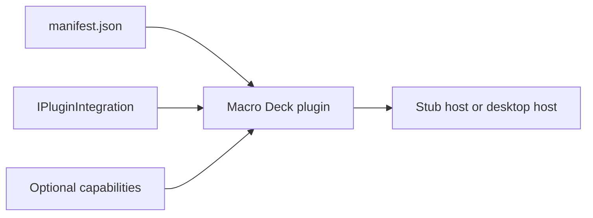
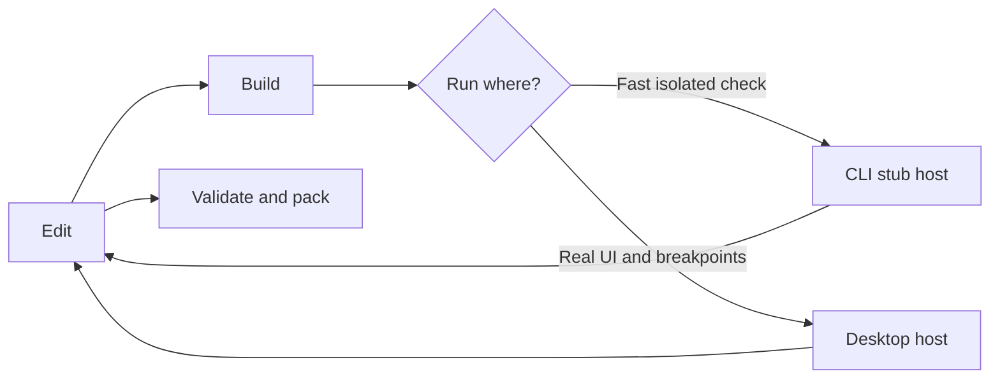

Macro Deck is extended with **integrations**. For third-party development, you normally ship one
integration as an out-of-process **plugin**: a small application that Macro Deck can install, start
and communicate with. The plugin SDK handles that communication, so a .NET plugin author works with
regular C# interfaces rather than HTTP or WebSocket messages.

If you want the fastest route to a running plugin, go straight to the
[five-minute quickstart](/introduction/quickstart/). You do not need to understand the host's
registries, wire protocol or package format first.

## Choose what you are building

| Goal | Start here |
| --- | --- |
| Build a third-party plugin from the supported template | [Quickstart](/introduction/quickstart/) |
| Add and trigger the first button action | [Your first action](/introduction/first-action/) |
| Assemble the project files yourself | [Create a plugin manually](/introduction/manual-setup/) |
| Set breakpoints and run against the desktop app | [Debugging plugins](/guides/debugging/) |
| Learn from complete implementations | [Samples and template](/introduction/samples-and-template/) |
| Add an integration that ships inside Macro Deck itself | [Contributing an integration](https://github.com/Macro-Deck-App/Macro-Deck/blob/main/engineering/development/contributing-integrations.md) - a contribution to the Macro Deck repository, not a plugin |

The last option is for contributors to the Macro Deck host. A normal plugin is installed separately
and does not require changes to the Macro Deck repository.

## The three pieces of a plugin

### `manifest.json`

The manifest is the plugin's identity and installation metadata: id, name, version, icon and the
executable for each supported platform. The host reads it before the plugin process starts. See the
[manifest reference](/reference/manifest/) when you need fields beyond the minimal example.

### The plugin application

A .NET plugin is a normal `net10.0` console application built with
`MacroDeck.Plugin.Hosting`. Its `Program.cs` registers one `IPluginIntegration`; the hosting SDK
loads the manifest, connects to the host, handles authentication and reconnection, and exposes health
and diagnostics endpoints.

### Capabilities

The integration opts into features by implementing small SDK contracts. Every plugin can contribute
actions. Optional capability interfaces add variables, events, configuration flows, weather
stations, music players, virtual profiles, issues and other surfaces. Start with only the capability
you need; the [SDK reference](/reference/sdk-packages/) and [capability guide](/features/) cover
the complete set later.

## The development loop

Use the developer CLI to get a production-like launch against a disposable stub host without
installing Macro Deck. Use a direct IDE launch against the desktop host when you want to press real
buttons and stop on breakpoints. Both run the same plugin application.

Once the behaviour is ready, the CLI validates and packs the build output into a
`.macroDeckPlugin` artifact. The package and conformance commands deliberately live in the
[packaging guide](/cli/) rather than in the first-run tutorial.

## Read the architecture when you need it

The deeper contracts are still documented, but they are not prerequisites for the quickstart:

- [Plugin hosting](/reference/plugin-hosting/) explains dependency injection, registration modes, process
  supervision and the environment supplied by the host.
- [Capability parity](/reference/capability-parity/) records where an out-of-process plugin differs
  from an integration compiled into the host.
- [Plugin protocol](/reference/protocol/) and [WebSocket reference](/reference/websocket/) are for
  alternate-language SDKs and protocol-level troubleshooting.
- [Compatibility](/policies/compatibility/) describes the backwards-compatibility promise for
  published SDK and wire contracts.

For most .NET plugins, the [quickstart](/introduction/quickstart/) is the right next page.
