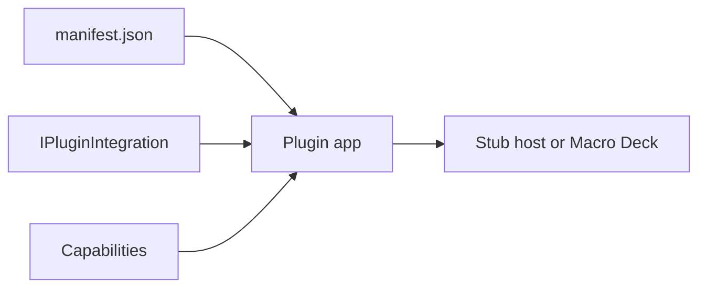

A plugin is a small .NET console app that Macro Deck starts and talks to. It is made of a
`manifest.json` (identity, icon, one executable per platform), the plugin app itself, and the
capabilities its integration implements - actions, variables, events and more.



## Prerequisites

- The [.NET 10 SDK](https://dotnet.microsoft.com/download/dotnet/10.0). It includes the ASP.NET Core
  shared framework the CLI and the plugin need.
- Macro Deck is **not** required for this page.

## 1. Install the CLI

```bash
dotnet tool install --global MacroDeck.Plugin.Cli --prerelease
```

`--prerelease` is required until a stable 3.0 build ships. See [Plugin CLI](/cli/).

## 2. Create a plugin

```bash
macrodeck-plugin new --name "Acme Light Control" --id com.acme.light-control \
  --publisher "Acme" --project-name Acme.LightControl --yes
```

```text
Created plugin project at '~/src/Acme.LightControl'.
Manifest: ~/src/Acme.LightControl/src/Acme.LightControl/manifest.json
Build configuration: ~/src/Acme.LightControl/src/Acme.LightControl/macrodeck-build.json
warning publication-metadata-missing: 'repository' is required to publish to the Macro Deck plugin ecosystem. It is not required to develop or run this plugin locally.
```

Run `macrodeck-plugin new` without options for a wizard instead. The warning only matters when you
publish. See [`new`](/cli/new/) for every option.

```bash
cd Acme.LightControl
dotnet build
dotnet test
```

```text
Build succeeded.
Passed!  - Failed:     0, Passed:     7, Skipped:     0, Total:     7
```

## 3. Look at what you got

```text
Acme.LightControl/
  Acme.LightControl.slnx
  src/Acme.LightControl/
    manifest.json            # id, name, version, icon, entrypoints per platform
    macrodeck-build.json     # how `build` builds each platform
    Program.cs               # registers the integration and runs the plugin
    PluginIntegration.cs     # the capabilities your plugin offers
    LogMessageAction.cs      # an example action
    Localization/Strings.resx  # every user-facing string
    Assets/icon.svg          # replace with your icon
  tests/Acme.LightControl.Tests/
    PluginIntegrationTests.cs
```

`Program.cs` builds and runs the plugin:

```csharp
var plugin = MacroDeckPlugin.CreatePlugin(args)
	.UseMacroDeckLogging()
	.UseLocalization(Strings.LocalizationCatalog)
	.RegisterIntegration<PluginIntegration>()
	.Build();

await plugin.RunAsync();
```

`PluginIntegration.cs` lists the actions and opts into other capabilities by implementing their
interfaces:

```csharp
public sealed class PluginIntegration : IPluginIntegration
{
	public PluginIntegration(ILogger logger)
	{
		_logger = logger.ForContext<PluginIntegration>();
		Actions = [new LogMessageAction(logger)];
	}

	public IReadOnlyList<IActionDefinition> Actions { get; }

	public Task InitializeAsync(IIntegrationContext context) { ... }

	public Task ShutdownAsync() => Task.CompletedTask;
}
```

## 4. Run it

```bash
macrodeck-plugin run --project src/Acme.LightControl --stub-host
```

```text
Started a disposable stub host at http://127.0.0.1:52091.
Started process 25405 (mode: SelfRegistering, host: http://127.0.0.1:52091). Press Ctrl-C to stop.
...
[plugin]       Registered with the host as '"com.acme.light-control"'.
Session established (negotiated plugin protocol v3).
[plugin] info: Acme.LightControl.PluginIntegration[0]
[plugin]       Initialized.
```

`Session established` means it works. The stub host is a real, disposable in-process host using the
same registration, session and WebSocket code as Macro Deck. Press <kbd>Ctrl</kbd>+<kbd>C</kbd> to stop.

To run against the Macro Deck app instead, drop `--stub-host` and approve the pairing prompt - or
press F5 in your IDE, see [Debugging plugins](/guides/debugging/).

## 5. Package it

```bash
cd src/Acme.LightControl
macrodeck-plugin build --output ../../artifacts
```

```text
Building linux-x64...
Building osx-arm64...
Building win-x64...
Built linux-x64, osx-arm64, win-x64.
Packed com.acme.light-control 1.0.0 -> ../../artifacts/com.acme.light-control-1.0.0.macroDeckPlugin (1041 entries, 342566335 bytes uncompressed).
```

`build` needs the directory holding `manifest.json`. Add
`--rid osx-arm64` to build one platform only.

```bash
macrodeck-plugin validate --artifact ../../artifacts/com.acme.light-control-1.0.0.macroDeckPlugin
```

```text
...
com.acme.light-control 1.0.0: 0 error(s), 2 warning(s).
```

`build` already packs. Use [`pack`](/cli/pack/) only for a payload you built another way. To publish
the artifact, see [Publishing to the Store](/guides/publishing/).

## Next steps

- [Your first action](/introduction/first-action/) - add an action with a parameter and show its state
  on the button.
- [Features](/features/) - variables, events, button states, setup flows and more.
- [UI](/ui/) - build configuration and widget UI.
- [Plugin CLI](/cli/) - every command and option.
- [Troubleshooting](/guides/troubleshooting/) - if you never see `Session established`.
