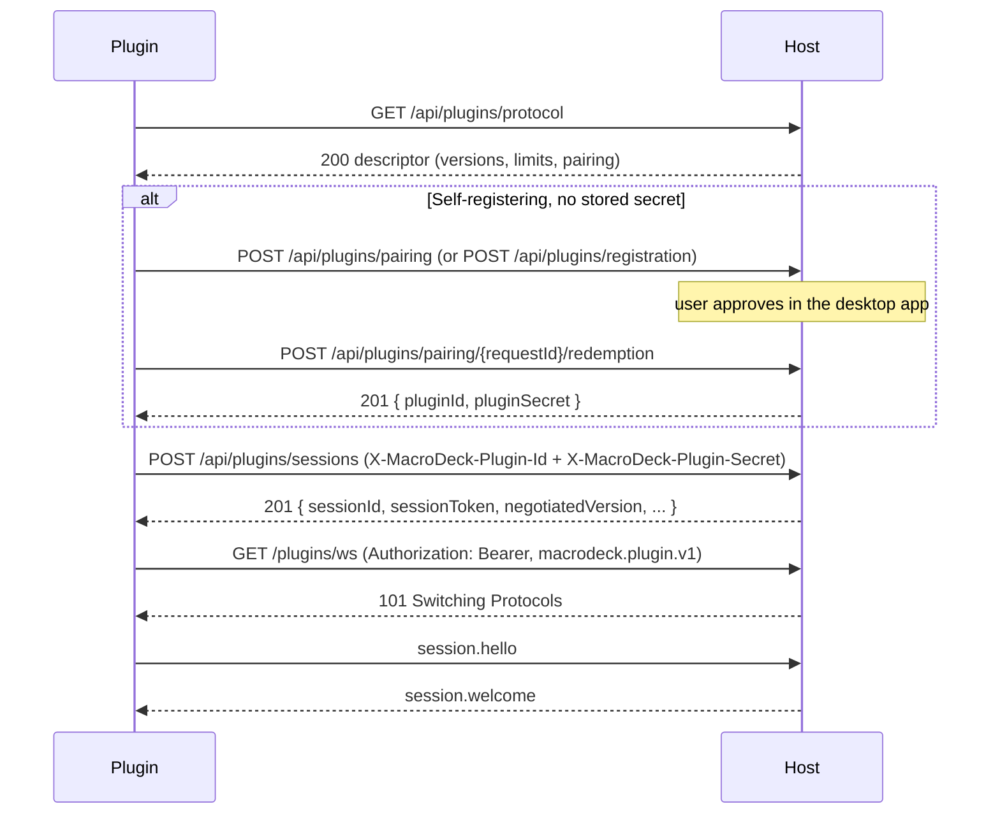

A plugin presents a **credential** once to buy a session, then a **session token** on every request and on the WebSocket upgrade.

`MacroDeck.Plugin.Hosting` does all of this for you. Read this page when you implement the protocol in
another language, when the handshake fails, or when you need to know what a credential grants. The
reasoning is in [ADR 0028](https://github.com/Macro-Deck-App/Macro-Deck/blob/main/engineering/decisions/0028-plugin-credentials-and-pairing.md).

## At a glance



1. Read the descriptor. It needs no credential.
2. Hold a credential: a launch token (managed), or a stored per-plugin secret (self-registering),
   obtained once through pairing or a Developer token.
3. Exchange it for a session token at `POST /api/plugins/sessions`.
4. Present `Authorization: Bearer <session-token>` on the WebSocket upgrade and on every REST call.

## The credential kinds

| Credential | Held by | Obtained from | Lifetime | Presented on |
| --- | --- | --- | --- | --- |
| Launch bootstrap token | Managed plugin | Injected by the supervisor as `MACRO_DECK_PLUGIN_SECRET`, minted per launch | 2 minutes while unused | `POST /api/plugins/sessions` |
| Per-plugin secret | Self-registering plugin | Pairing redemption, or `POST /api/plugins/registration` with a Developer token | No independent expiry | `POST /api/plugins/sessions` |
| Pairing request + PKCE verifier | Self-registering plugin, first run | `POST /api/plugins/pairing` | Host-advertised, short | Pairing endpoints only |
| Developer token | User, for headless setups | Desktop app, **Developer Tools → Plugin development → Credentials** | Optional expiry, none by default | `POST /api/plugins/registration` only |
| Session token | Any plugin | `POST /api/plugins/sessions` | 15 minutes | WebSocket upgrade, every session-authenticated REST call |

The registration mode decides which credential a plugin holds. It is taken from `UseRegistrationMode`
if called, then from `MacroDeck:Plugin:Mode` (`MACRO_DECK_PLUGIN_MODE`), and is otherwise inferred: an
id and a secret both present means the host supplied them, so the mode is `Managed`. See
[registration modes](/reference/plugin-hosting/#registration-modes).

### Managed: the launch bootstrap token

```sh
MACRO_DECK_PLUGIN_MODE=Managed
MACRO_DECK_PLUGIN_HOST_URL=http://127.0.0.1:<port>
MACRO_DECK_PLUGIN_ID=com.example.ref-probe
MACRO_DECK_PLUGIN_SECRET=<launch-token>
MACRO_DECK_PLUGIN_INSTANCE_ID=<fresh-instance-id>
MACRO_DECK_PLUGIN_LAUNCH_ID=<launch-id>
MACRO_DECK_PLUGIN_DATA_DIRECTORY=<data-directory>
```

The supervisor mints a cryptographically random token for one launch and injects it with the plugin
id, host URL and a fresh instance id. The host keeps it in memory only, never persisted. It is valid for
**two minutes while unused**; once acquired, the expiry stops mattering, so a plugin that connects
promptly and runs for days is unaffected. A managed plugin never calls the registration endpoint and
persists nothing.

`MACRO_DECK_PLUGIN_LAUNCH_ID` is diagnostic and log-correlation only: the host never reads it back and
it is never asserted on the wire.

## Self-registering: interactive pairing

The default for a self-registering plugin with no stored secret: press F5, approve a prompt in the
desktop app, done. There is no credential for the developer to create or copy.

### 1. Create a request

```http
POST /api/plugins/pairing HTTP/1.1
Content-Type: application/json

{
  "pluginId": "com.example.ref-probe",
  "displayName": "Ref Probe",
  "codeChallenge": "<base64url(SHA-256(code-verifier))>",
  "codeChallengeMethod": "S256",
  "client": { "executablePath": "/path/to/RefProbe", "processId": 4242, "sdkVersion": "3.0.0" }
}
```

```http
HTTP/1.1 201 Created
Content-Type: application/json

{ "requestId": "<request-id>", "expiresAt": "2026-09-12T10:28:08+00:00", "pollIntervalSeconds": 1 }
```

`codeChallenge` is the PKCE shape OAuth uses: the plugin keeps a high-entropy `codeVerifier` to itself
and the host stores only the challenge. The approval prompt shows the plugin id, display name and the
`client` fields, labelled **self-reported and unverified**. Whether the request arrived on the public
listener is verified by the host and shown as such.

| Rule | Result |
| --- | --- |
| No authentication header | Pairing is gated by loopback reachability and **Developer Mode** instead |
| Developer Mode off | `403`, `details.reason: "developer_mode_disabled"` |
| A live request already exists for this plugin id | `429` - the visible request is never replaced |
| Global pending-request cap reached | `429` with `Retry-After` |
| Identity already registered | `409` `PLUGIN_ALREADY_REGISTERED` |
| Creation and redemption | Each separately rate-limited |

### 2. Poll

```http
GET /api/plugins/pairing/<request-id> HTTP/1.1
```

```http
HTTP/1.1 200 OK
Content-Type: application/json

{ "status": "approved", "expiresAt": "2026-09-12T10:28:08+00:00" }
```

`status` is `pending`, `approved`, `rejected` or `expired`. An unknown or pruned `requestId` answers
`200` with `expired`, never `404`, so polling has one state machine and the endpoint is not an
existence oracle.

### 3. Redeem

```http
POST /api/plugins/pairing/<request-id>/redemption HTTP/1.1
Content-Type: application/json

{ "codeVerifier": "<code-verifier>" }
```

```http
HTTP/1.1 201 Created
Content-Type: application/json

{ "pluginId": "com.example.ref-probe", "pluginSecret": "<plugin-secret>" }
```

- The secret is minted **at redemption, never at approval**: an approval nobody redeems leaves any
  existing working credential untouched.
- A wrong verifier does not consume the request, so a retry with the right one succeeds. A successful
  redemption consumes it permanently; replaying fails.
- Unknown, expired, unapproved, already-redeemed and wrong-verifier all answer the same `401`.
- Developer Mode is a continuous condition: turning it off invalidates redemption of a request that was
  already approved.
- Pending and approved requests live in memory only; a host restart discards them regardless of their
  remaining time.

**Replacing a lost credential.** If the host holds an active registration for the plugin id but the
local secret is gone (state directory deleted, different machine), the prompt offers to **replace the
development credential**, with a confirmation separate from a plain approval. Redemption then rotates
the secret in place and terminates the plugin's live sessions, so the old and new secret never both
authenticate. This is the supported recovery for a missing local credential.

### Where the secret is stored

`<state>/<pluginId>/credentials.json`, same file for both self-registering paths.

| OS | Default `<state>` |
| --- | --- |
| Windows | `%LOCALAPPDATA%\MacroDeck\plugins` |
| macOS | `~/Library/Application Support/MacroDeck/plugins` |
| Linux | `$XDG_STATE_HOME/macro-deck/plugins`, else `~/.local/state/macro-deck/plugins` |

The file is written to a temporary file made owner-only **before** anything is written, then moved into
place: never readable by others, never half-written. On Windows the per-user profile ACL is the
protection. **Nothing is encrypted at rest.** The SDK persists the secret before first use and never
discards a persisted secret automatically.

### Discovery: the pairing block

```json
{
  "supportedVersions": [1, 2, 3],
  "pairing": { "supported": true, "requestLifetimeSeconds": 30, "pollIntervalSeconds": 1 }
}
```

(Abridged `GET /api/plugins/protocol` response, captured from the CLI's stub host, which does not report
`developerModeEnabled`. The full response is under [Discovery](#discovery).)

| Field | Meaning |
| --- | --- |
| `pairing` absent | Host predates pairing. The SDK tells the developer to use a Developer token |
| `pairing.supported` | The host implements pairing at all |
| `pairing.developerModeEnabled` | Whether a request would be accepted **right now**. The only field that changes at runtime. Absent means "not reported", not `false` |
| `enrollment.developerModeEnabled` | The same switch, for `POST /api/plugins/registration` |

### What the SDK does

- Creates a pairing request at most once per process lifetime. Rejection, expiry and an unsupported
  host are **fatal**, never silently re-prompted. See [Debugging plugins](/guides/debugging/).
- If the descriptor reports `developerModeEnabled: false`, it creates no request, keeps retrying on its
  reconnect backoff, and pairs as soon as Developer Mode is enabled, with no restart.
- If the host does not report the field, the SDK must attempt the request; that refusal stays fatal,
  because every refused attempt counts against a rate limit shared by all plugins.

| Option | Environment variable | Default |
| --- | --- | --- |
| `MacroDeck:Plugin:PairingEnabled` | `MACRO_DECK_PLUGIN_PAIRING` | `true` |
| `MacroDeck:Plugin:PairingTimeout` | `MACRO_DECK_PLUGIN_PAIRING_TIMEOUT` | Unset: the host's `requestLifetimeSeconds` |

`PairingEnabled: false` with no stored credential and no Developer token is a fatal startup condition:
"This plugin has no stored credentials, and interactive pairing is disabled."

## Developer token: headless enrolment

For CI and other unattended setups with nobody to approve a prompt.

```http
POST /api/plugins/registration HTTP/1.1
Content-Type: application/json
X-MacroDeck-Enrollment-Token: <developer-token>

{ "pluginId": "com.example.ref-probe", "displayName": "Ref Probe" }
```

```http
HTTP/1.1 201 Created
Content-Type: application/json

{ "pluginId": "com.example.ref-probe", "pluginSecret": "<plugin-secret>" }
```

- A user creates the token in the desktop app under **Developer Tools → Plugin development →
  Credentials**, with a name and an optional expiry. Scope `plugin:enroll`, the only Developer-token
  scope defined today.
- The plaintext token is shown exactly once; the host stores only its hash. So is the returned
  `pluginSecret`.
- The plugin reads it from `MACRO_DECK_PLUGIN_ENROLLMENT_TOKEN`, enrols on first start, persists the
  secret before using it, and enrols again only if it is gone.
- SDK credential precedence: stored credential, then an explicit enrollment token, then pairing. That
  is what lets automated runs skip the prompt.
- Minting a token is an admin operation the desktop app performs against `api/plugin-tokens`. Not a
  plugin-facing endpoint; the CLI has no command for it.
- An identity that is already registered answers `409` `PLUGIN_ALREADY_REGISTERED`.

## Discovery

```http
GET /api/plugins/protocol HTTP/1.1
```

```json
{
  "supportedVersions": [1, 2, 3],
  "capabilityKinds": ["actions", "events", "variables", "icons", "config-flow", "music-player", "weather", "virtual-profiles", "issues", "ui", "localization", "device-provider", "layout-provider", "folder-view-provider", "migration", "widget-type-provider"],
  "limits": { "maxMessageBytes": 262144, "maxSessionsPerPlugin": 1 },
  "timeouts": { "handshake": "00:00:10", "sessionResumeWindow": "00:01:00" },
  "pairing": { "supported": true, "requestLifetimeSeconds": 30, "pollIntervalSeconds": 1 }
}
```

Unauthenticated on purpose, so a plugin can decide whether and how to register before it holds a
credential. `limits` and `timeouts` are abridged here; the full set is in the
[WebSocket reference](/reference/websocket/#limits-and-timeouts). Paths are unversioned: the protocol
version is negotiated over `POST /api/plugins/sessions`, never encoded in a URL.

## The session exchange

```http
POST /api/plugins/sessions HTTP/1.1
Content-Type: application/json
X-MacroDeck-Plugin-Id: com.example.ref-probe
X-MacroDeck-Plugin-Secret: <plugin-secret>

{
  "requestedVersion": { "minimum": 1, "maximum": 3 },
  "capabilities": [
    { "kind": "actions", "localId": "ref-probe", "versionRange": { "minimum": 1, "maximum": 1 } }
  ],
  "declaredName": "Ref Probe",
  "declaredVersion": "1.0.0",
  "sdk": { "sdkVersion": "3.0.0", "deprecatedApis": [] }
}
```

```http
HTTP/1.1 201 Created
Content-Type: application/json

{
  "sessionId": "01a09528-913a-7c20-950b-708c5a22707a",
  "sessionToken": "<session-token>",
  "negotiatedVersion": 3,
  "capabilities": [{ "kind": "actions", "accepted": true, "negotiatedVersion": 1 }],
  "limits": { "maxMessageBytes": 262144, "maxSessionsPerPlugin": 1 },
  "timeouts": { "handshake": "00:00:10", "sessionResumeWindow": "00:01:00" }
}
```

One endpoint serves both credential kinds: the host tries the launch-token store, then the
registration store. Negotiation happens here, once, authoritatively.

| Response field | Meaning |
| --- | --- |
| `sessionId` | Canonical lowercase dashed UUIDv7 |
| `sessionToken` | Bearer token for this session: a host-signed JWT with scope claim `plugin`, the plugin id and the session id |
| `negotiatedVersion` | The one protocol version both sides speak |
| `capabilities` | Per-kind result, including rejections (`accepted: false`, `rejectionReason`) |
| `limits`, `timeouts` | What this host enforces. Read them, never hard-code them |
| `compatibility` | Optional deprecation report - see [deprecations](/policies/deprecations/) |

Scope `plugin` is authorised on its own policy: a plugin session token grants no client or admin
access, and neither an admin nor a client token is accepted where a plugin token is required. See
[ADR 0003](https://github.com/Macro-Deck-App/Macro-Deck/blob/main/engineering/decisions/0003-loopback-trust-token-scopes-and-device-identity.md).

A development credential (from pairing or a Developer token) is refused with `403` and
`details.reason: "developer_mode_disabled"` while Developer Mode is off. A managed plugin's launch token
is never gated.

## Presenting the token

```http
GET /plugins/ws HTTP/1.1
Host: 127.0.0.1:<port>
Connection: Upgrade
Upgrade: websocket
Sec-WebSocket-Version: 13
Sec-WebSocket-Key: <random-key>
Sec-WebSocket-Protocol: macrodeck.plugin.v1
Authorization: Bearer <session-token>
```

```http
HTTP/1.1 101 Switching Protocols
Sec-WebSocket-Protocol: macrodeck.plugin.v1
```

The host checks loopback, rate limit, subprotocol and token **before** accepting the upgrade. A failure
is an HTTP response with a `ProtocolError` body, never an accepted socket that closes afterwards.

| Upgrade problem | Response |
| --- | --- |
| Not loopback, or browser-shaped | `403` `UNAUTHENTICATED` |
| Throttled | `429` `RATE_LIMITED`, `Retry-After` |
| Not a WebSocket request, or `macrodeck.plugin.v1` not offered | `400` `INVALID_PAYLOAD` |
| Missing or invalid token | `401` `UNAUTHENTICATED` |

The first message, `session.hello`, carries **no credential**; it only asserts the negotiated version
and session id. See [the handshake](/reference/protocol/#the-handshake).

The token goes in the `Authorization` header and nowhere else: never a cookie (a browser cannot set
`Authorization` on a WebSocket handshake, so a cookie would be only accidentally safe against
cross-site WebSocket hijacking), never the query string (it lands in logs).

### Header vocabulary

| Header | Used on |
| --- | --- |
| `X-MacroDeck-Enrollment-Token` | `POST /api/plugins/registration` only |
| `X-MacroDeck-Plugin-Id` | `POST /api/plugins/sessions` only |
| `X-MacroDeck-Plugin-Secret` | `POST /api/plugins/sessions` only - never on the WebSocket upgrade |
| `Authorization: Bearer <session-token>` | The WebSocket upgrade and every session-authenticated request |

Pairing carries no credential header: `codeChallenge` and `codeVerifier` travel in the body, and
`requestId` in the URL because it authorises nothing on its own.

## The endpoints

| Endpoint | Authenticated by | Success |
| --- | --- | --- |
| `GET /api/plugins/protocol` | Nothing | `200` descriptor |
| `POST /api/plugins/pairing` | Nothing (loopback + Developer Mode) | `201 { requestId, expiresAt, pollIntervalSeconds }` |
| `GET /api/plugins/pairing/{requestId}` | Nothing | `200 { status, expiresAt }` |
| `POST /api/plugins/pairing/{requestId}/redemption` | PKCE `codeVerifier` in the body (+ Developer Mode) | `201 { pluginId, pluginSecret }` |
| `POST /api/plugins/registration` | `X-MacroDeck-Enrollment-Token` (+ Developer Mode) | `201 { pluginId, pluginSecret }` |
| `POST /api/plugins/sessions` | `X-MacroDeck-Plugin-Id` + `X-MacroDeck-Plugin-Secret` (+ Developer Mode for a development credential) | `201` session response |
| `GET /plugins/ws` | `Authorization: Bearer <session-token>` | `101 Switching Protocols` |
| `DELETE /api/plugins/sessions/{sessionId}` | `Authorization: Bearer <session-token>` | `204`, session non-resumable at once |
| `DELETE /api/plugins/registration/{pluginId}` | Admin bearer token | `204` - revocation of a compromised credential |

Developer Mode is a live switch, off by default, in the desktop app's settings. Turning it off
disconnects development plugins already connected; turning it on makes them workable again without
restarting Macro Deck. Stored credentials survive either way. Full schemas:
[OpenAPI spec](/specs/openapi.yaml), rendered under [REST API](/reference/rest/).

## Lifetime and renewal

| Thing | Lifetime |
| --- | --- |
| Launch bootstrap token | 2 minutes while unused; irrelevant once acquired |
| Pairing request | Host-advertised `expiresAt`; memory-only, discarded on host restart |
| Per-plugin secret | No expiry. Revoked on uninstall or by `DELETE /api/plugins/registration/{pluginId}`. A secret from a Developer token also stops working when that token expires or is revoked; a paired secret has no such dependency |
| Developer token | Optional expiry, none by default. Expiry or revocation stops every registration it minted from opening a new session |
| Session token | 15 minutes |
| Session resume window | 60 seconds after the socket drops |

**There is no refresh endpoint, deliberately.** The resume window (a minute) is always shorter than
the token (fifteen), so a reconnect too late to resume opens a new session and gets a new token anyway.
To renew, run the session exchange again.

The host re-checks the live session registry on every request, so terminating a session takes effect
immediately even though its token stays cryptographically valid for the rest of its 15 minutes.

The SDK reconnects with full-jitter exponential backoff (1 s initial, 30 s maximum, factor 2), resumes
inside the window, and tolerates `MacroDeck:Plugin:MaxAuthenticationFailures` (default 3) consecutive
authentication failures on the socket before treating them as fatal.

## Reachability

Every plugin endpoint is served on both the public and the private loopback listener, but accepts only a
**loopback remote address**. A LAN caller gets `403` whichever port it used, and so does a request that
looks like it came from a browser. A self-registering plugin must run on the same machine as the host.

## What a plugin must never do

- **Send the plugin secret anywhere but `POST /api/plugins/sessions`** - not on the WebSocket upgrade,
  not in a query string, not in a log line.
- **Put the session token in a cookie or a URL.** The `Authorization` header only.
- **Persist a plaintext Developer token.** It is shown once to be pasted into configuration; a caller
  that displays it should discard it.
- **Assert identity on the wire and expect trust.** The host checks the credential against its own
  record, never against a claim. `MACRO_DECK_PLUGIN_LAUNCH_ID` is yours to log and nothing more.
- **Treat a managed launch token as reusable state.** It is per launch; the managed credential store
  refuses to save it.
- **Send the PKCE `codeVerifier` anywhere but the redemption call.** Treat it like any other secret in
  transit.

## Authentication errors

```http
HTTP/1.1 401 Unauthorized
Content-Type: application/json

{ "code": "UNAUTHENTICATED", "message": "Authentication failed.", "retryable": false }
```

```http
HTTP/1.1 403 Forbidden
Content-Type: application/json

{ "code": "UNAUTHENTICATED", "message": "Authentication failed.", "details": { "reason": "developer_mode_disabled" }, "retryable": false }
```

```http
HTTP/1.1 429 Too Many Requests
Retry-After: 12
Content-Type: application/json

{ "code": "RATE_LIMITED", "message": "Too many requests; retry after the given delay.", "details": { "retryAfterSeconds": "12" }, "retryable": true }
```

Every authentication failure is one byte-identical `401`: no `details`, `retryable: false`. An unknown
plugin id, a wrong secret, a spent or expired bootstrap token, a revoked registration, an unknown or
expired Developer token and a missing header are indistinguishable by design. Pairing redemption
follows the same rule. `403` reuses `UNAUTHENTICATED`: the wire vocabulary has no "forbidden" code.

| Code | HTTP / close | Meaning | What the SDK does |
| --- | --- | --- | --- |
| `UNAUTHENTICATED` | `401` | Any credential failure | Fatal on the REST handshake |
| `UNAUTHENTICATED` | `403` | Non-loopback or browser caller, or a token naming a different session | Fatal |
| `UNAUTHENTICATED` + `reason: developer_mode_disabled` | `403` | Developer Mode off (pairing, registration, development-credential session) | Reports Developer Mode as the cause; for pairing, waits and retries if the descriptor reported it |
| `PLUGIN_ALREADY_REGISTERED` | `409` | Identity already registered | Reports it, retries on backoff |
| `PROTOCOL_VERSION_UNSUPPORTED` | `422`, close `4001` | No common version; `details.supportedMinimum`/`supportedMaximum` on `422` | Fatal |
| `RATE_LIMITED` | `429` + `Retry-After`, `details.retryAfterSeconds` | Too many attempts | Retries on backoff |
| `SESSION_EXPIRED` | close `4002` | Session gone or session id mismatch | Drops the cached session, opens a new one |
| - | close `4003` | Authentication failed on the socket | Drops the session and retries, up to `MaxAuthenticationFailures`, then fatal |
| `SESSION_REPLACED` | close `4000` | A newer connection took the session | Fatal for this instance |

Rate limits: enrolment shares one bucket; session exchange is per plugin id; pairing creation and
redemption are limited separately.

## See also

- [Debugging plugins](/guides/debugging/) - approve the pairing prompt, or enrol headlessly, then reuse
  the persisted credential from an IDE launch profile.
- [Plugin hosting](/reference/plugin-hosting/) - registration modes and the environment the supervisor
  injects.
- [Plugin protocol](/reference/protocol/) - the wire contract these credentials open.
- [WebSocket reference](/reference/websocket/) - the message catalogue behind the upgrade.
- [Security model](/policies/security/) - the trust boundary and its limits.
- [OpenAPI spec](/specs/openapi.yaml) - the machine-readable REST surface.
