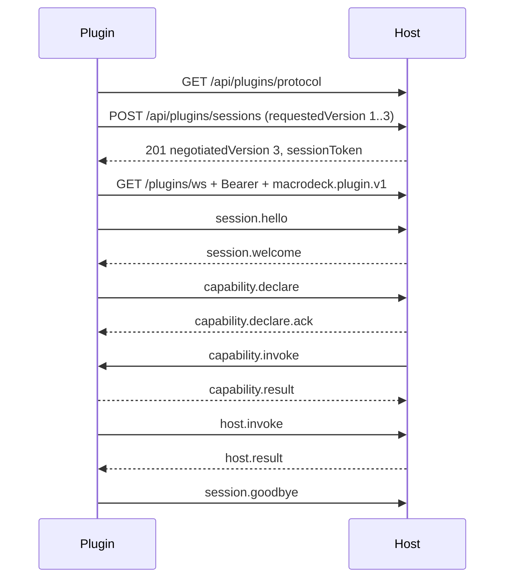

The plugin protocol is a versioned JSON contract over HTTP and WebSocket; implement it directly only when building another runtime or language binding - .NET plugins use `MacroDeck.Plugin.Hosting`.

The machine-readable contracts are authoritative for exact fields: the [OpenAPI spec](/specs/openapi.yaml)
(HTTP bootstrap, registration, sessions, the upgrade) and the [AsyncAPI spec](/specs/asyncapi.yaml)
(envelopes and payloads). The public DTOs and constants live in `MacroDeck.Plugin.Protocol`, which is
independent of the host assemblies. The message catalogue is in the [WebSocket reference](/reference/websocket/).

## At a glance



1. Read the descriptor.
2. Self-registering only: register once, through pairing or a Developer token. Managed plugins receive
   launch credentials instead. See [Authentication](/reference/authentication/) and
   [Plugin hosting](/reference/plugin-hosting/).
3. Exchange the credential for a short-lived session - **this is where the version is negotiated**.
4. Upgrade to `/plugins/ws` with the session token.
5. Send `session.hello`, wait for `session.welcome`.
6. Exchange capability and host-callback messages until the session ends.

## The envelope

```json
{
  "type": "session.hello",
  "id": "01a09528-bb98-798a-bd96-e46f5388cd89",
  "sentAt": "2026-09-12T10:27:49.784Z",
  "protocolVersion": 3,
  "payload": {
    "protocolVersion": 3,
    "sessionId": "01a09528-bb8e-7eb4-a4f0-0aa018202b2b",
    "instanceId": "01a09528-bb9d-7057-8d59-ff9a1d93885a"
  }
}
```

| Field | Type | Required | Notes |
| --- | --- | --- | --- |
| `type` | string | yes | `<domain>.<verb>` |
| `id` | string | yes | UUIDv7, minted by the sender |
| `correlationId` | string | no | The `id` this message answers |
| `sentAt` | string | no | RFC 3339 UTC, informational only |
| `protocolVersion` | integer | no | |
| `deadlineMs` | integer | no | |
| `idempotencyKey` | string | no | At most 128 characters |
| `payload` | object | no | Shaped by `type`; mutually exclusive with `error` |
| `error` | `ProtocolError` | no | See [Errors](#errors) |

Compatibility rules:

- Unknown optional fields are ignored on read and never echoed back.
- An unknown `type` gets `UNKNOWN_MESSAGE_TYPE` with the `id` preserved as `correlationId`, and **does
  not terminate the session**.
- Malformed input (unparseable, oversize, too deep, missing `type` or `id`) gets `MALFORMED_ENVELOPE`,
  never an unhandled parser exception, and does not close the socket either.
- Replies carry the request's `id` as `correlationId`. Correlation, cancellation and idempotency rules
  are in the [WebSocket reference](/reference/websocket/#correlation-and-response-pairing).

## Version negotiation

Request, in `POST /api/plugins/sessions`:

```json
{ "requestedVersion": { "minimum": 1, "maximum": 3 } }
```

Response:

```json
{ "negotiatedVersion": 3, "capabilities": [{ "kind": "actions", "accepted": true, "negotiatedVersion": 1 }] }
```

No overlap:

```http
HTTP/1.1 422 Unprocessable Entity
Content-Type: application/json

{ "code": "PROTOCOL_VERSION_UNSUPPORTED", "message": "The requested protocol version is not supported.", "details": { "supportedMinimum": "1", "supportedMaximum": "3" }, "retryable": false }
```

The version is a single integer major, not semver. Additive changes stay inside the current major;
breaking wire changes need a new major, with earlier majors still served. The host picks the highest
mutually supported version, once. `session.hello` only confirms it.

| Major | Change | Older plugins |
| --- | --- | --- |
| `1` | Baseline | - |
| `2` | `widgets` host-api payload only: a widget appearance change names the states it applies to by stable id, not the old fixed selector | Translated by the host |
| `3` | Descriptor text (action names, parameter labels, config-flow text) may be a `{"$localized":…}` reference instead of a plain string. Below `3` a plugin must send a plain string | Translated by the host |

- The subprotocol `macrodeck.plugin.v1` names the protocol **family**, not the major, and does not
  change between majors.
- Capability versions negotiate independently per kind. An unsupported capability comes back
  `accepted: false` with a `rejectionReason`, without rejecting the whole session.
- See the [migration guide](/policies/migrations/) and the [compatibility policy](/policies/compatibility/).

## The handshake

Captured against the CLI's stub host:

```json
{"type":"session.welcome","id":"01a09528-bb9d-7b67-9659-b7ec73280280","correlationId":"01a09528-bb98-798a-bd96-e46f5388cd89","payload":{"sessionId":"01a09528-bb8e-7eb4-a4f0-0aa018202b2b","resumed":false}}
```

The first message must be `session.hello` (see [the envelope](#the-envelope)) within the handshake
timeout (10 s). It carries no credential.

| `session.hello` field | Required | Meaning |
| --- | --- | --- |
| `protocolVersion` | yes | The negotiated version, asserted |
| `sessionId` | yes | The session from `POST /api/plugins/sessions` |
| `resumeSessionId` | no | Present when resuming a dropped session |
| `instanceId` | no | The connecting process instance, for logs |

| Outcome | Host response |
| --- | --- |
| Timeout, not `session.hello`, or malformed payload | `protocol.error` `INVALID_PAYLOAD`, normal close |
| Session unknown, or `sessionId` does not match the token | `SESSION_EXPIRED`, close `4002` |
| `protocolVersion` differs from the negotiated one | `PROTOCOL_VERSION_UNSUPPORTED`, close `4001` |
| Resume refused | `SESSION_NOT_RESUMABLE`, normal close |
| Success | `session.welcome` with `resumed` |

## Capability operations

```json
{ "type": "capability.invoke", "id": "<id>", "deadlineMs": 30000, "payload": { "…": "…" } }
```

```json
{ "type": "capability.result", "id": "<id>", "correlationId": "<invoke-id>", "payload": { "…": "…" } }
```

A plugin declares the capabilities it serves. The host invokes them with `capability.invoke`; the
plugin answers with `capability.result`, an error, or the cancellation path. The kinds a host supports
are listed in the descriptor's `capabilityKinds`:

`actions`, `events`, `variables`, `icons`, `config-flow`, `music-player`, `weather`,
`virtual-profiles`, `issues`, `ui`, `localization`, `device-provider`, `layout-provider`,
`folder-view-provider`, `migration`, `widget-type-provider`.

- **Do not invent operation names inside an existing kind.** Additions to the operation vocabulary are
  compatibility-sensitive protocol changes. Exact operations and payloads are in the protocol package
  and AsyncAPI.
- `state.update` is an invalidation signal: the peer refreshes that capability's state. It is not a
  second per-capability diff protocol.
- `actions` gained `state`, additively in major `1`, for actions that supply an Action Button's states.
  It is keyed by the action's configured parameters, so the host **polls** it: `state.update` is keyed
  by the declared capability id (the action type) and cannot name which configured instance changed.
- `actions` also gained `icon` and `icon.content`, the same way, for an action whose configured instance
  supplies a widget's icon (`ActionDescriptorDto.ProvidesIcon`). `icon` is polled like `state` and
  answers an identity, not bytes; `icon.content` fetches the bytes only when that identity changes,
  uploaded over the `asset.*` pipeline, never inside the capability reply. The `widgets` host API's
  `invalidate-icon` asks the host to re-read an action sooner than its next poll.

See [capabilities](/features/) and [Capability parity](/reference/capability-parity/).

## Host callbacks

```json
{ "type": "host.invoke", "id": "<id>", "payload": { "…": "…" } }
```

```json
{ "type": "host.result", "id": "<id>", "correlationId": "<host-invoke-id>", "payload": { "…": "…" } }
```

Plugins call host-owned APIs with `host.invoke` and cancel with `host.cancel`. `MacroDeck.Plugin.Hosting`
maps these to `IIntegrationContext`. Some synchronous-looking SDK state is served from the last
`host.state` snapshot, so check [Capability parity](/reference/capability-parity/) before assuming
in-process timing.

A callback can return bytes: an icon from the `devices` api's `icon` operation, or a widget's rendered
action icon from its `widget-icon` operation. These travel over `host.asset.*`, a host-to-plugin
pipeline kept separate from the plugin-to-host `asset.*` types so those keep their major-1 direction.
See [the WebSocket reference](/reference/websocket/#assets).

## Errors

```json
{
  "type": "protocol.error",
  "id": "<id>",
  "correlationId": "<id-of-the-offending-message>",
  "error": { "code": "UNKNOWN_MESSAGE_TYPE", "message": "The message type is not recognised.", "retryable": false }
}
```

On HTTP the same `ProtocolError` object is the whole response body. Protocol failures (malformed input,
unsupported operations or capabilities, authentication, timeouts, cancellation, backpressure) are
protocol outcomes with stable codes, not transport exceptions. `message` is a default English string
keyed by `code`; localise from the code. `details` is a string-to-string map, at most 16 entries.

| Code | Default message |
| --- | --- |
| `PROTOCOL_VERSION_UNSUPPORTED` | The requested protocol version is not supported. |
| `UNKNOWN_MESSAGE_TYPE` | The message type is not recognised. |
| `MALFORMED_ENVELOPE` | The message envelope could not be parsed. |
| `INVALID_PAYLOAD` | The message payload does not match the expected shape. |
| `UNAUTHENTICATED` | Authentication failed. |
| `PLUGIN_ALREADY_REGISTERED` | A plugin is already registered with this identity. |
| `SESSION_EXPIRED` | The session has expired. |
| `SESSION_NOT_RESUMABLE` | The session can no longer be resumed. |
| `SESSION_REPLACED` | The session was replaced by a newer connection. |
| `SESSION_NOT_FOUND` | No session matches that id. |
| `CAPABILITY_UNSUPPORTED` | The capability kind is not supported. |
| `CAPABILITY_UNAVAILABLE` | The capability is not currently available. |
| `PAYLOAD_TOO_LARGE` | The message payload exceeds the allowed size. |
| `ASSET_TOO_LARGE` | The asset exceeds the allowed size. |
| `QUEUE_OVERFLOW` | The message queue overflowed. |
| `RATE_LIMITED` | Too many requests; retry after the given delay. |
| `TIMEOUT` | The operation timed out. |
| `CANCELLED` | The operation was cancelled. |
| `CORRELATION_UNKNOWN` | No in-flight message matches this correlation id. |
| `DUPLICATE_IDEMPOTENCY_KEY` | This idempotency key is already in flight. |
| `INTERNAL_ERROR` | An internal error occurred. |

The list is append-only within a major. A `reason` in `details` (today only `developer_mode_disabled`)
refines a deliberately generic code; a client that does not recognise it handles the code alone.

Closing the socket is reserved for seven conditions; everything else is a `protocol.error` on an open
socket:

| Close | Condition | .NET SDK |
| --- | --- | --- |
| `1013` | `QUEUE_OVERFLOW` (RFC 6455 "Try Again Later") | Reconnects |
| `4000` | `SESSION_REPLACED` | Stops |
| `4001` | `PROTOCOL_VERSION_UNSUPPORTED` | Stops |
| `4002` | `SESSION_EXPIRED` | Opens a new session |
| `4003` | Authentication failed | New session, up to `MaxAuthenticationFailures`, then stops |
| `4004` | Supervisor is stopping a managed plugin - nothing failed | Stops |
| `4005` | Declared capabilities rejected (invalid or duplicated ids, colliding integration id). Terminal: fix the declaration | Stops |

## Delivery and retries

Delivery is **at-most-once**. There are no sequence numbers and no replay log for messages lost during
a disconnect; do not expect the host to replay an unacknowledged event after reconnecting. For a
retryable operation that must not run twice, send an `idempotencyKey`: a repeat while the original is in
flight gets `DUPLICATE_IDEMPOTENCY_KEY`, a repeat after completion gets the cached result. A cancelled
invocation caches nothing, so a retry with its key runs again; an invocation that finished despite the
cancel keeps its result, so a retry replays it instead of running twice.

## Limits

```json
{ "maxMessageBytes": 262144, "maxInboundQueueDepth": 256, "queueHighWatermark": 192, "queueLowWatermark": 64, "maxConcurrentInvocations": 32, "maxSessionsPerPlugin": 1 }
```

Message size, queue depth, concurrency, timeouts and asset sizes are published in the descriptor and
again in the session response (`limits`, `timeouts`). Read them at runtime; do not copy the numbers into
plugin logic. The full current table is in the [WebSocket reference](/reference/websocket/#limits-and-timeouts).
A message over `maxMessageBytes` is `MALFORMED_ENVELOPE`; a payload over a specific cap (UI tree, asset)
is `PAYLOAD_TOO_LARGE` or `ASSET_TOO_LARGE`.

## Backpressure

Sent by the host when its inbound queue reaches the high watermark (192), and lifted at the low
watermark (64):

```json
{ "type": "flow.pause", "id": "<id>", "payload": { "reason": "The host's inbound queue is filling." } }
```

```json
{ "type": "flow.resume", "id": "<id>", "payload": { "reason": "The host's inbound queue has drained." } }
```

| Field | Required | Meaning |
| --- | --- | --- |
| `reason` | yes | Diagnostic text |
| `resumeAfterMs` | no | Hint for when to try again |

While paused, send only the exempt types (replies, pings, cancels, `host.*` calls, errors - the full
list is in the [WebSocket reference](/reference/websocket/#backpressure)). A peer that keeps sending
past `maxInboundQueueDepth` gets one `QUEUE_OVERFLOW` and a `1013` close. Use bounded concurrency and
honour cancellation.

## Reconnection and resume

```json
{ "type": "session.hello", "id": "<id>", "payload": { "protocolVersion": 3, "sessionId": "<session-id>", "resumeSessionId": "<session-id>", "instanceId": "<instance-id>" } }
```

```json
{ "type": "session.welcome", "id": "<id>", "correlationId": "<hello-id>", "payload": { "sessionId": "<session-id>", "resumed": true } }
```

| Situation | Result |
| --- | --- |
| New connection with `resumeSessionId`, inside the 60 s window, session still exists | Resume: `resumed: true` |
| Same, but outside the window or the session is gone | `SESSION_NOT_RESUMABLE` - open a new session |
| New session for a plugin that already has one (`maxSessionsPerPlugin` is 1) | The old connection is closed with `4000` |
| `session.goodbye` or `DELETE /api/plugins/sessions/{sessionId}` | Session non-resumable at once |
| No inbound traffic for 60 s (host pings every 20 s) | Host aborts the socket |

A resume keeps the session id, negotiated version, capability map, declared catalogue and the plugin-side
idempotency cache. It drops in-flight invocations, event subscriptions and queued outbound messages. A
fresh session after expiry is not a resume and may need capability state and lifecycle
re-initialisation. Reconnect with full-jitter exponential backoff: 1 s initial, 30 s maximum, factor 2.
`MacroDeck.Plugin.Hosting` does all of this for .NET plugins.

## Security

Plugin endpoints need plugin-specific credentials and accept only local callers. Browser cookies are
not a plugin WebSocket authentication mechanism. Never log plugin secrets, session tokens, enrolment
credentials, OAuth credentials or authorisation headers. See [Security](/policies/security/) and
[Authentication](/reference/authentication/).

## SDK compatibility metadata

```json
{ "sdk": { "sdkVersion": "3.0.0", "deprecatedApis": [], "truncated": false } }
```

Sent in `POST /api/plugins/sessions`. `deprecatedApis: null` means "not reported"; `[]` means "reported,
none used". The host can return a `compatibility` report without making older plugins unable to
deserialise the session response. See [Deprecations](/policies/deprecations/).

## Implementing the protocol yourself

The specs and `MacroDeck.Plugin.Protocol` are the source of truth; this page does not duplicate every
field, timeout, operation or message type. Test at least negotiation, authentication, unknown-message
tolerance, cancellation, idempotency and retry, reconnect and resume, backpressure, and capability
payload compatibility. The [conformance suite](/reference/conformance/) runs these against a plugin.

## See also

- [WebSocket reference](/reference/websocket/) - every message type and payload.
- [Authentication](/reference/authentication/) - credentials and the session token.
- [Plugin hosting](/reference/plugin-hosting/)
- [Capability parity](/reference/capability-parity/)
- [Manifest](/reference/manifest/)
- [Conformance suite](/reference/conformance/)
- [Compatibility policy](/policies/compatibility/)
