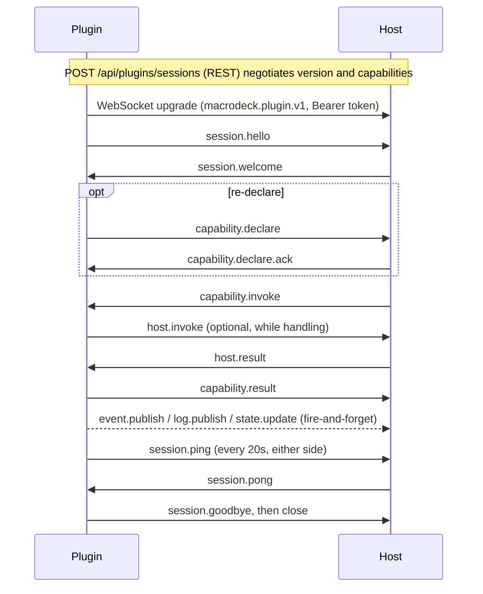

Every message on the plugin WebSocket, with a real frame for each; the narrative lives on [the protocol page](/reference/protocol/), the machine-readable contract in [asyncapi.yaml](/specs/asyncapi.yaml) (AsyncAPI 3.0.0), and the C# types in [`protocol/src/MacroDeck.Plugin.Protocol/`](https://github.com/Macro-Deck-App/Macro-Deck/blob/main/protocol/src/MacroDeck.Plugin.Protocol/), kept in step by drift tests.

## At a glance

```http
GET /plugins/ws HTTP/1.1
Upgrade: websocket
Sec-WebSocket-Protocol: macrodeck.plugin.v1
Authorization: Bearer <session-token>
```



The frames on this page were captured from the .NET SDK talking to the `MacroDeck.Plugin.Testing` stub host, except where a section says the example is built from the schema.

## Connecting

| | |
| --- | --- |
| Path | `/plugins/ws`, loopback remote addresses only |
| Subprotocol | `macrodeck.plugin.v1`, offered through `Sec-WebSocket-Protocol` - required |
| Authentication | `Authorization: Bearer <sessionToken>`, scope `plugin`, checked before the upgrade is accepted |
| Encoding | JSON, camelCase, `application/json` |

See [authentication](/reference/authentication/) for how the session token is obtained.

## The envelope

```json
{
  "type": "host.invoke",
  "id": "01a09528-bc61-7dea-be36-6c143daa1395",
  "sentAt": "2026-09-12T10:27:49.98595+00:00",
  "protocolVersion": 3,
  "deadlineMs": 30000,
  "payload": { "api": "variables", "operation": "list" }
}
```

Every message, in either direction, is one `ProtocolEnvelope`.

| Field | Type | Required | Meaning |
| --- | --- | --- | --- |
| `type` | string | yes | `<domain>.<verb>`, e.g. `capability.invoke`. |
| `id` | string | yes | UUIDv7, minted by the sender. |
| `correlationId` | string | no | The `id` of the message this one answers. |
| `sentAt` | string | no | RFC 3339 UTC; **informational only**, clocks differ between the processes. |
| `protocolVersion` | integer | no | The sender's protocol version. |
| `deadlineMs` | integer | no | The request deadline. |
| `idempotencyKey` | string | no | At most 128 characters, scoped to `(sessionId, key)`. |
| `payload` | object | no | Shaped by `type`. |
| `error` | `ProtocolError` | no | Set instead of `payload` on failure. |

- `payload` and `error` are **mutually exclusive**.
- Unknown optional fields are ignored on read and never echoed back - there is no extension-data slot.
- Deadline, idempotency key and correlation live on the envelope only; no payload repeats them.
- Strict serialisation: camelCase, case-sensitive, no comments, no trailing commas. A number sent as a string (`"deadlineMs": "30000"`) is a hard failure. Maximum nesting depth is `maxJsonDepth` (32).

### `ProtocolError`

```json
{
  "type": "capability.result",
  "id": "01a09528-bc76-73cb-9d15-b0dc9c05eada",
  "correlationId": "01a09528-bc76-758e-a190-263c3254b26f",
  "protocolVersion": 3,
  "error": {
    "code": "CAPABILITY_UNAVAILABLE",
    "message": "No action 'does-not-exist' is registered in this plugin.",
    "details": {},
    "retryable": false
  }
}
```

| Field | Type | Required | Meaning |
| --- | --- | --- | --- |
| `code` | string | yes | Stable error code - see [Error handling](#error-handling). |
| `message` | string | yes | Default English text keyed by `code`, **not copy to render**; localise from the code. |
| `details` | map of string to string | no | Extra diagnostic context. |
| `retryable` | boolean | yes | Whether retrying can succeed. |

## Message catalogue

Twenty-eight message types. Direction is enforced by the transport: a message arriving from the wrong side is rejected.

| Family | Types |
| --- | --- |
| [Session](#session) | `session.hello`, `session.welcome`, `session.goodbye`, `session.ping`, `session.pong` |
| [Capabilities](#capabilities) | `capability.declare`, `capability.declare.ack`, `capability.invoke`, `capability.result`, `capability.cancel` |
| [Host callbacks](#host-callbacks) | `host.invoke`, `host.result`, `host.cancel`, `host.state` |
| [Events, logs and state](#events-logs-and-state) | `event.publish`, `log.publish`, `state.update` |
| [Assets](#assets) | `asset.begin`, `asset.chunk`, `asset.commit`, `asset.ack`, `host.asset.begin`, `host.asset.chunk`, `host.asset.commit`, `host.asset.ack` |
| [Flow control and errors](#flow-control-and-errors) | `flow.pause`, `flow.resume`, `protocol.error` |

### Session

```json
{"type":"session.hello","id":"01a09528-bc4b-7500-8673-1df7313e68c9","protocolVersion":3,
 "payload":{"protocolVersion":3,"sessionId":"01a09528-bc42-7dc7-bf63-3d18ff4880c9","instanceId":"54292"}}
```

```json
{"type":"session.welcome","id":"01a09528-bc53-7099-817f-88ae70b8c334",
 "correlationId":"01a09528-bc4b-7500-8673-1df7313e68c9",
 "payload":{"sessionId":"01a09528-bc42-7dc7-bf63-3d18ff4880c9","resumed":false}}
```

| Type | Direction | Payload |
| --- | --- | --- |
| `session.hello` | plugin → host | `protocolVersion` (int, required), `sessionId` (required), `resumeSessionId`, `instanceId` |
| `session.welcome` | host → plugin | `sessionId` (required), `resumed` (bool, required) |
| `session.goodbye` | both | `reason` |
| `session.ping` | both | none - `payload` is omitted; an empty object is also valid |
| `session.pong` | both | none - `payload` is omitted; an empty object is also valid |

- `session.hello` asserts the version and session id already negotiated over REST; it never re-negotiates. A mismatch is `PROTOCOL_VERSION_UNSUPPORTED` and closes with `4001`.
- `resumeSessionId` distinguishes a resume from a replacement: presented inside the resume window, the session resumes; absent, the new connection **replaces** the prior session, which is closed with `4000`.
- `session.goodbye` is voluntary teardown and makes the session non-resumable at once. A plugin sends it to end its own session; the host sends it to a managed plugin the supervisor is stopping, immediately before a `4004` close.
- Either side may send `session.ping`; the reply is a `session.pong` correlated to it. Interval 20s, timeout 60s.

```json
{"type":"session.pong","id":"01a09529-55ae-752b-98d2-983ca3e8d859",
 "correlationId":"01a09528-c000-7000-8000-000000000001","protocolVersion":3}
```

### Capabilities

```json
{"type":"capability.invoke","id":"01a09528-bc6e-7610-94f6-f7a6d537ad16",
 "payload":{"kind":"variables","localId":"temperature","operation":"get"}}
```

```json
{"type":"capability.result","id":"01a09528-bc71-789e-bcff-8de629047430",
 "correlationId":"01a09528-bc6e-7610-94f6-f7a6d537ad16","protocolVersion":3,
 "payload":{"data":{"value":{"kind":"number","number":21.5}}}}
```

| Type | Direction | Payload |
| --- | --- | --- |
| `capability.declare` | plugin → host | `capabilities` (array of `DeclaredCapability`, required, ≤ 512 items) |
| `capability.declare.ack` | host → plugin | `capabilities` (array of `CapabilityNegotiationResult`, required) |
| `capability.invoke` | host → plugin | `kind`, `localId`, `operation` (all required), `arguments` |
| `capability.result` | plugin → host | `data` - the **success value only**; a failure sets the envelope's `error` instead |
| `capability.cancel` | host → plugin | `reason` - best-effort, see [Correlation](#correlation-and-response-pairing) |

Capabilities are first declared on the `POST /api/plugins/sessions` request; `capability.declare` re-declares on the open socket. It is **complete, not a delta**: it replaces what the session knows. Built from the schema:

```json
{"type":"capability.declare","id":"<uuid-v7>",
 "payload":{"capabilities":[
   {"kind":"actions","localId":"toggle-light","versionRange":{"minimum":1,"maximum":1},"displayName":"Toggle light"},
   {"kind":"weather","localId":"provider","versionRange":{"minimum":1,"maximum":1}}]}}
```

```json
{"type":"capability.declare.ack","id":"<uuid-v7>","correlationId":"<declare id>",
 "payload":{"capabilities":[
   {"kind":"actions","accepted":true,"negotiatedVersion":1},
   {"kind":"weather","accepted":false,"rejectionReason":"<reason>"}]}}
```

| Shape | Field | Type | Required | Meaning |
| --- | --- | --- | --- | --- |
| `DeclaredCapability` | `kind` | string | yes | One of the eighteen kinds below. |
| | `localId` | string | yes | The capability's id within the plugin. |
| | `versionRange` | `{minimum, maximum}` | yes | Integer capability versions the plugin serves. |
| | `displayName` | string | no | Human-readable name. |
| `CapabilityNegotiationResult` | `kind` | string | yes | The kind negotiated. |
| | `accepted` | boolean | yes | Whether the session will use it. |
| | `negotiatedVersion` | integer | no | The agreed capability version. |
| | `rejectionReason` | string | no | Why it was rejected. |

Negotiation fails **non-fatally**: an unsupported or unknown kind comes back rejected with a reason, and the session proceeds degraded.

The eighteen `kind` values: `actions`, `events`, `variables`, `icons`, `config-flow`, `music-player`, `weather`, `virtual-profiles`, `issues`, `ui`, `localization`, `device-provider`, `layout-provider`, `folder-view-provider`, `migration`, `widget-type-provider`, `screensaver-provider`, `messaging`. `operation` comes from a fixed vocabulary per kind - see [capability operations](/reference/protocol/#capability-operations). Two more captured invokes:

```json
{"type":"capability.invoke","id":"01a09528-bc57-7b85-bed4-952327ffedcd",
 "payload":{"kind":"actions","localId":"toggle-light","operation":"execute","arguments":{"parameters":{}}}}
```

```json
{"type":"capability.result","id":"01a09528-bc76-7445-bb11-c953c477af93",
 "correlationId":"01a09528-bc72-7432-bc32-be05ca2bbbf3","protocolVersion":3,
 "payload":{"data":{"providerName":"com.example.lights","hasDynamicEventOptions":false,
   "events":[{"localId":"light-toggled","name":"Light toggled","deliveryKind":"Push",
     "configurationParameters":[],"payloadParameters":[]}]}}}
```

#### `localization`

Hands the plugin's own strings to the host instead of baking resolved text into its UI. Both operations are `capability.invoke`.

| Operation | Arguments | Result | Meaning |
| --- | --- | --- | --- |
| `describe` | none | `scope`, `defaultCulture`, `cultures` | Declares the plugin's scope (`plugin:<plugin-id>`) and shipped cultures, so the host can reject a plugin claiming a scope it does not own. |
| `catalog` | `culture` | `culture`, `entries` (key to template) | One culture's strings; nothing for that culture is an empty map, not a failure - the host's fallback chain decides. |

The host asks for one culture at a time (bounded per culture, not across them). Bounded by `maxLocalizationCultures`, `maxLocalizationEntries`, `maxLocalizationKeyLength`, `maxLocalizationValueLength`. See [Localization](/features/localization/) and `MacroDeck.Plugin.Protocol.Capabilities.Localization`.

#### `variables`

The only kind that is **item-shaped and provider-shaped at once**. The eager half declares one capability per variable at that variable's local id, as `actions` does; the catalog half declares nothing and carries resource ids in each operation's arguments, keeping large providers under `maxDeclaredCapabilities`.

| Operation | Arguments | Result | Meaning |
| --- | --- | --- | --- |
| `describe` | none | `variables`, `declaredVariables`, `variablesDependOnConfiguration`, `supportsCatalog`, `supportsPush`, `supportsSearch`, `catalogName` | Eager definitions and whether a catalog is also served. |
| `get` | none | `value`, `min`, `max`, `step` | One variable's value and volatile attributes, or unavailable. |
| `set` | `value` | `status`, `message` | Applies a value; only invoked for a definition that declared `write`. A refused write is a `status`, not a failed operation. |
| `discover` | `parentId`, `search`, `continuationToken`, `pageSize` | `items`, `continuationToken` | One page of browsable catalog resources (`pageSize` ≤ 200). |
| `resolve` | `id` | `definition` (nullable) | Resolves any catalog id, including one never returned by `discover`; `null` means invalid, not unavailable. |
| `subscribe` | `ids` (array) | `values` (array) | Replaces the catalog working set wholesale (empty is "watch nothing", ≤ 1024 ids) and returns current values. |

`get` and `set` address the variable through the invoke's own `localId`; `describe` and the catalog operations ignore it. A definition's `materialization` (`eager` or `on-demand`) is validated against the operation it arrived on. See [Variables](/features/variables/).

### Host callbacks

```json
{"type":"host.invoke","id":"01a09528-bc61-7dea-be36-6c143daa1395","protocolVersion":3,"deadlineMs":30000,
 "payload":{"api":"variables","operation":"list"}}
```

```json
{"type":"host.result","id":"01a09528-bc69-7d06-a0dd-85ed3c5e4c69",
 "correlationId":"01a09528-bc61-7dea-be36-6c143daa1395","payload":{"data":[]}}
```

| Type | Direction | Payload |
| --- | --- | --- |
| `host.invoke` | plugin → host | `api`, `operation` (required), `arguments` - the reverse of `capability.invoke` |
| `host.result` | host → plugin | `data` - success value only |
| `host.cancel` | plugin → host | `reason` - best-effort cancellation of a `host.invoke` |
| `host.state` | host → plugin | `api` (required), `data` - the list a plugin's synchronous members serve from |

APIs: `variables`, `user-variables`, `config`, `deck`, `scripts`, `widgets`, `notifications`, `action-interactions`, `ui`, `devices`, `variable-values`, `layouts`, `folder-views`, `widget-types`, `screensavers`, `adb`, `messaging`, and the push-only `event-bindings`. There is no `events` api; use `event.publish`. A plugin ignores a `host.state` api it does not know.

`host.state` for `config` has no `data`: it means "your config changed, re-read it". Built from the schema:

```json
{"type":"host.state","id":"<uuid-v7>","payload":{"api":"config"}}
```

| API | Special rule |
| --- | --- |
| `action-interactions` | `show-modal` answers with a modal id as soon as the modal opens; the user's answer arrives later as a `ui`/`modal.result` `capability.invoke` naming that modal. Exactly one result per modal. |
| `widgets` | Payload differs by protocol major - see below. |
| `ui` | Not charged to the per-plugin callback throttle. `snapshot`, `patch` and `fault` are bounded per session by `maxUiUpdatesPerSecond` / `maxUiUpdateBurst`; `register-resource` and `remove-resource` have their own per-plugin rate limit. |
| `variable-values` | Data-carrying push for the catalog half only; eager variables are always polled via `variables`/`get`. |
| `event-bindings` | Push-only `host.state`, no `host.invoke` operations. `data` lists the triggers bound to this plugin's own events, each an `eventId` and `parameters` keyed by name (`value`, absent for a state operator, and `operator`). Sent on registration and whenever that list changes. |
| `adb` | Gated per plugin, runs off the session's dispatch loop, at most 4 calls in flight per plugin - see [`adb`](#adb). |
| `messaging` | Needs the `messaging` capability kind; own rate limit instead of the per-plugin callback throttle; `send` and `request` run off the session's dispatch loop - see [`messaging`](#messaging). |

#### `widgets` by major

| | Major `1` | Major `2` |
| --- | --- | --- |
| `widgets`/`apply` arguments | `state`: integer selector (`0` current, `1` on, `2` off, `3` both) | `stateIds`: stable state ids or the `$current` / `$all` sentinels |
| `host.state` for `widgets` | each entry has `hasOnOffStates` | each entry has `states` (`{id, label}`) and `currentStateId` |

For a major `1` session the host translates rather than refuses: `off`/`on` map to the states with those literal ids, falling back to the first and second state; `both` reaches every state, including a third and beyond. See the [migration guide](/policies/migrations/).

#### `ui`

```json
{"type":"host.invoke","id":"<uuid-v7>",
 "payload":{"api":"ui","operation":"patch","arguments":{"sessionId":"<ui-session-id>","patch":{"fromRevision":1,"toRevision":2,"operations":[{"op":"set-properties","nodeId":"title","properties":{"text":"Hello"}}]}}}}
```

| Operation | Arguments | Meaning |
| --- | --- | --- |
| `snapshot` | `sessionId`, `tree` | The full current tree; send one for every `session.snapshot` the host invokes. |
| `patch` | `sessionId`, `patch` | One patch; `fromRevision` / `toRevision` are read from the patch itself. |
| `fault` | `sessionId`, `code`, `message` | The session can no longer be served; the host ends it and tells clients, without relaying your text. |
| `register-resource` | `name`, `contentHash`, `mediaType` | Registers bytes as a UI resource under a plugin-chosen name and answers a `resource` (`resourceId`, `contentHash`, `mediaType`, `byteLength`), or `uploadRequired: true` when the host does not hold those bytes for this plugin yet. |
| `remove-resource` | `name` | Removes the named resource. An unknown name is not an error. |

`tree` and `patch` are opaque JSON: bounded, then forwarded byte-for-byte (unknown members, member order, number formatting survive). A refused snapshot or patch is an error on its own `host.result`: `PAYLOAD_TOO_LARGE`, `RATE_LIMITED`, `INVALID_PAYLOAD`, `SESSION_NOT_FOUND`. See [Serving a view](/ui/views/sessions/).

To register a resource, call `register-resource` first. On `uploadRequired`, send the bytes as an `asset.*` upload of kind `ui-resource` with the same media type, then call `register-resource` once more; a second `uploadRequired` means the upload was lost, not that you should loop. Registering a name again replaces its bytes: the `resourceId` stays, the `contentHash` changes. Registering unchanged bytes under the same name answers the existing handle without an upload. Resources belong to the plugin session: they survive a resumed session, are released when the session ends or is replaced, and are gone after the host restarts. A refused registration is `INVALID_PAYLOAD` (name, media type, or a type that differs from the upload's), `UI_RESOURCE_QUOTA_EXCEEDED` (`maxUiResourceBytesPerPlugin` or `maxUiResourcesPerPlugin`; what the name held is unchanged), `RATE_LIMITED`, or `SESSION_NOT_FOUND` from a session that has been replaced. A host that predates the operations answers `CAPABILITY_UNSUPPORTED` before any bytes are sent. See [Resources](/ui/reference/resources/#registering-your-own-images).

#### `devices`

| Operation | Arguments | Meaning |
| --- | --- | --- |
| `register` | a `DeviceDescriptor` | Registers a device, or re-registers a known provider-local id as the same device. |
| `update` | a `DeviceDescriptor` | Refreshes a registered device's metadata. |
| `presence` | `deviceId`, `presence` | Reports whether the device is reachable. |
| `unregister` | `deviceId` | Withdraws the device from this session; the device is retained. |
| `interaction` | `sessionId`, `kind`, `widgetId`, `controlIndex`, `value`, `surfaceRevision`, `data` | Reports a hardware interaction; returns a `DeviceInteractionResult`. |
| `icon` | `sessionId`, `iconId`, `size`, `knownETag` | Fetches icon bytes for the current surface; the bytes arrive over `host.asset.*`. |
| `close` | `sessionId` | Closes an open device session at the provider's request. |

`register`, `update`, `presence`, `unregister` need no session, are keyed by provider-local `deviceId`, and are available to every `device-provider` plugin. `interaction`, `icon`, `close` are keyed by the `sessionId` from `session.open`, apply only to an opened session (capability version 2), and are the reverse of the capability's `session.open` / `session.surface` / `session.close` invokes. See [Device providers](/features/devices/).

#### `variable-values`

| Operation | Arguments | Meaning |
| --- | --- | --- |
| `value` | `values` (array of `{id, reading}`) | Publishes values for ids in the most recently subscribed set; other ids are dropped, not faulted. ≤ `maxVariableValuesPerBatch` per call. |
| `invalidate` | none | The resource set changed. Accepted and recorded but not acted on today - nothing re-queries `discover`. |

See [Push instead of poll](/features/variables/#push-instead-of-poll).

#### `adb`

```json
{"type":"host.invoke","id":"<uuid-v7>","deadlineMs":90000,
 "payload":{"api":"adb","operation":"shell","arguments":{"serial":"R58M123","command":"getprop ro.build.version.release"}}}
```

Operations on the Android devices the host's own adb server sees. Every operation names the device by
`serial`. Argument and result shapes are in
[`AdbInvokeArguments.cs`](https://github.com/Macro-Deck-App/Macro-Deck/blob/main/protocol/src/MacroDeck.Plugin.Protocol/Callbacks/AdbInvokeArguments.cs).

| Operation | Arguments | Result `data` |
| --- | --- | --- |
| `shell` | `serial`, `command` | `exitCode`, `standardOutput`, `standardError`, `truncated` |
| `battery` | `serial` | `level`, `isCharging`, `status`, `health` |
| `push` | `serial`, `localPath`, `remotePath` | none |
| `pull` | `serial`, `remotePath`, `localPath` | none |
| `install` | `serial`, `apkPath` | none |
| `uninstall` | `serial`, `packageName` | none |
| `package-installed` | `serial`, `packageName` | `installed` |
| `connect` | `address` (`host:port`) | `serial` |

- **Access is per plugin.** An installed plugin needs `host:adb` in its manifest; a self-registered
  session does not. ADB must be enabled and the user must allow plugins to use it. A refused call fails
  with `ADB_NOT_ENABLED` or `ADB_NOT_ALLOWED`. See [Android devices](/features/android-devices/#who-decides).
- **A non-zero shell exit code is a result.** `command` must not start with `-` and gets no standard
  input. `truncated` is `true` when the host cut the output to fit one message.
- **Local paths** (`localPath`, `apkPath`) are absolute paths on the host's machine, read and written with
  the host's identity. **Device paths** are absolute.
- **At most 4 calls in flight per plugin.** A fifth is refused at once with a retryable `RATE_LIMITED`.
  Calls also count toward the per-plugin callback throttle. Other host APIs keep flowing while an `adb`
  call runs.
- **`host.cancel` ends an in-flight call.** It then gets exactly one `host.result`, with `CANCELLED`.
- **`connect`** runs `adb connect` for a host name or IPv4 address with a port and answers with the serial
  the device has from then on, which is its address. The device reaches every plugin through the `adb`
  `host.state` push. adb reporting that it could not connect is `ADB_FAILED` with `adb_command_failed`.
- **While the host is locked**, `shell`, `push`, `pull`, `install`, `uninstall` and `connect` fail with a retryable
  `CAPABILITY_UNAVAILABLE` and `details.reason: "host_locked"`. `battery` and `package-installed` still
  answer.
- **A failure of adb or the device** is `ADB_FAILED`, refined by `details.reason`: `adb_executable_not_found`,
  `adb_server_unreachable`, `adb_device_not_found`, `adb_device_offline`, `adb_device_unauthorized`,
  `adb_timeout`, `adb_command_failed`, `adb_invalid_argument`, `adb_unsupported`. Treat an unknown reason as
  `ADB_FAILED` alone.
- **The host's own time limit** is ten seconds for `battery` and `package-installed`, twenty seconds for
  `connect`, one minute for `shell` and `uninstall`, and five minutes for `push`, `pull` and `install`. It ends in `ADB_FAILED` with
  `adb_timeout`. Wait longer than that before giving up on the `host.result`, as the .NET SDK does.

The `adb` `host.state` push is per plugin, sent on registration and whenever this plugin's access or the
device list changes. Its shape is
[`AdbStateDto`](https://github.com/Macro-Deck-App/Macro-Deck/blob/main/protocol/src/MacroDeck.Plugin.Protocol/Callbacks/AdbStateDto.cs):

```json
{"type":"host.state","id":"<uuid-v7>","payload":{"api":"adb","data":{"access":"available","revision":7,
 "devices":[{"serial":"R58M123","state":"online","model":"SM-G991B","manufacturer":"samsung","product":"o1s"}]}}}
```

`access` is `available`, `adb-not-enabled` or `adb-not-allowed`; `devices` is empty unless it is
`available`, and a device that left is simply absent. A device's `state` is `online`, `connecting`,
`offline` or `unauthorized`. `revision` follows the same rule as the `deck` push: apply a push only when
its revision is higher than the last one applied in this session. A host without this api never pushes it
and answers every `adb` invoke with `CAPABILITY_UNSUPPORTED`.

#### `messaging`

```json
{"type":"host.invoke","id":"<uuid-v7>","deadlineMs":10000,
 "payload":{"api":"messaging","operation":"request","arguments":{"topic":"obs.scene.current","payload":{"format":"short"}}}}
```

Plugins and integrations talking to each other by topic, brokered by the host. A plugin states what it
listens to with `subscriptions`; the host delivers to it as `capability.invoke` of the
[`messaging` capability kind](#the-messaging-capability-kind), which it declares at local id `provider`. Argument
and result shapes are in
[`MessagingInvokeArguments.cs`](https://github.com/Macro-Deck-App/Macro-Deck/blob/main/protocol/src/MacroDeck.Plugin.Protocol/Callbacks/MessagingInvokeArguments.cs).
The SDK side is [Messaging between plugins](/features/messaging/).

| Operation | Arguments | Result `data` | Meaning |
| --- | --- | --- | --- |
| `publish` | `topic`, `payload` | none | An event for every subscription whose pattern matches, including the publisher's own. Answers once accepted, before delivery. |
| `send` | `topic`, `payload` | none | A command for the topic's one handler. Answers once the handler finished. |
| `request` | `topic`, `payload` | `payload` | A request for the topic's one handler; `payload` is its reply. |
| `subscriptions` | `events`, `commands`, `requests` (arrays of strings) | `rejected` (array) | Replaces everything this plugin listens to. Complete, not a delta. |

- **Topics** are two or more dot-separated segments of `[a-z0-9]`, `-` and `_`, starting and ending with
  a letter or digit, at most 128 characters. `events` entries may instead be a prefix followed by `.*`,
  which matches every topic below the prefix. A malformed topic is `INVALID_PAYLOAD` with reason
  `messaging_invalid_topic`, or a `rejected` entry with that reason.
- **Payloads** are any JSON value, at most 64 KiB serialized (`PAYLOAD_TOO_LARGE`). The host stamps
  the sender; a plugin cannot name one.
- **One handler per command or request topic.** A `subscriptions` entry for a topic another participant
  already handles comes back in `rejected` with `kind` (`event`, `command` or `request`), `topic`,
  `reason` `messaging_topic_handled` and `owner`, that participant's integration id. Each list holds at
  most 256 entries; more is `INVALID_PAYLOAD`.
- **`deadlineMs` bounds the handler.** For `send` and `request` the host waits for the handler for
  `deadlineMs`, at most and by default 30 seconds, and then answers `TIMEOUT` itself. Wait a little longer
  than that for the `host.result`.
- **Failures** of `send` and `request` are `CAPABILITY_UNAVAILABLE` refined by `details.reason`:
  `messaging_no_handler`, `messaging_handler_unavailable` (retryable: the handler's plugin is
  reconnecting) or `messaging_handler_failed`. Treat an unknown reason as a failed handler.
- **Declare the kind first.** A session that did not declare the `messaging` capability kind gets
  `CAPABILITY_UNAVAILABLE` with reason `messaging_not_declared` for every operation. A `subscriptions`
  call from a session that has since been replaced is `SESSION_NOT_FOUND`: send it again from the new
  session.
- **Limits.** `publish`, `send` and `request` share a per-plugin budget of 100 calls, refilled at 50 a
  second, separate from the callback throttle; `subscriptions` is not rate-limited. At most 16 `send`
  and `request` calls per plugin wait at once, and a handler receives at most 8 at once; beyond either is
  a retryable `RATE_LIMITED`, never queued. `host.cancel` ends a waiting `send` or `request`.
- **Lifetime.** A plugin's `subscriptions` survive a resume and are removed when its session is replaced
  or pruned. Send them again after every new session.

A host without this api answers every `messaging` invoke with `CAPABILITY_UNSUPPORTED`, and does not list
`messaging` in the descriptor's `capabilityKinds`.

##### The `messaging` capability kind

The host delivers through it:

```json
{"type":"capability.invoke","id":"<uuid-v7>","deadlineMs":10000,
 "payload":{"kind":"messaging","localId":"provider","operation":"request",
   "arguments":{"topic":"obs.scene.current","sender":"com.example.deck","messageId":"<id>","sentAt":"2026-09-22T10:00:00+00:00","payload":{"format":"short"}}}}
```

| Operation | Arguments | Result `data` |
| --- | --- | --- |
| `event` | `topic`, `sender`, `messageId`, `sentAt`, `payload` | none |
| `command` | same | none |
| `request` | same | `payload`, the reply |

A plugin answers a topic it does not handle with `CAPABILITY_UNAVAILABLE` and reason
`messaging_no_handler`, and a handler that failed with reason `messaging_handler_failed`. The kind has no
`describe`.

### Events, logs and state

```json
{"type":"event.publish","id":"01a09528-bc5f-72ca-90a1-15f8c2ff9d17","protocolVersion":3,
 "payload":{"eventId":"light-toggled","parameters":{"on":true}}}
```

All three are plugin → host and **fire-and-forget** - no reply message.

| Type | Field | Type | Required | Meaning |
| --- | --- | --- | --- | --- |
| `event.publish` | `eventId` | string | yes | Unqualified id; the host qualifies it with the authenticated plugin id. |
| | `parameters` | object | no | Parameter values; a nested object or array reaches triggers and templates as its JSON text. |
| `log.publish` | `events` | array of `LogEventDto` | yes | A batch of structured log events (≤ 64). |
| | `dropped` | integer | no | Events the plugin's sink dropped since the previous batch. |
| `state.update` | `kind` | string | yes | The kind whose snapshot is stale - re-describe it. Not data-carrying. |
| | `localId` | string | no | The capability that changed. |
| | `reason` | string | no | Diagnostic reason. |

Built from the schema:

```json
{"type":"log.publish","id":"<uuid-v7>","payload":{"dropped":0,"events":[
  {"timestamp":"2026-09-12T10:27:50.1+00:00","level":"Warning","messageTemplate":"Bridge {Host} slow",
   "renderedMessage":"Bridge 10.0.0.2 slow","sourceContext":"Lights.Bridge","properties":{"Host":"10.0.0.2"}}]}}
```

| `LogEventDto` field | Type | Required | Meaning |
| --- | --- | --- | --- |
| `timestamp` | string | yes | RFC 3339. |
| `level` | string | yes | A `LogLevels` value. |
| `messageTemplate` | string | yes | The unrendered template. |
| `renderedMessage` | string | yes | The rendered text. |
| `sourceContext` | string | no | Logger category. |
| `properties` | map of string to string | no | Flat, pre-rendered - not a nested tree. |
| `exception` | `{type, message, stackTrace?, inner?}` | no | Structured exception; `inner` nests. |

`LogEventDto` carries nothing identifying (no plugin id, integration id, version or process id); the host has all four from the session. Under load the host drops log traffic rather than reporting `QUEUE_OVERFLOW`. See [logging](/features/logging/).

### Assets

Built from the schema:

```json
{"type":"asset.begin","id":"<uuid-v7>","payload":{"assetId":"icon-42","kind":"<asset-kind>","mimeType":"image/png","totalBytes":90112,"contentHash":"<content-hash>"}}
{"type":"asset.ack","id":"<uuid-v7>","correlationId":"<begin id>","payload":{"assetId":"icon-42","accepted":true}}
{"type":"asset.chunk","id":"<uuid-v7>","payload":{"assetId":"icon-42","index":0,"data":"iVBORw0KGgo..."}}
{"type":"asset.ack","id":"<uuid-v7>","correlationId":"<chunk id>","payload":{"assetId":"icon-42","index":0,"accepted":true}}
{"type":"asset.commit","id":"<uuid-v7>","payload":{"assetId":"icon-42"}}
```

| Type | Direction | Payload |
| --- | --- | --- |
| `asset.begin` | plugin → host | `assetId`, `kind`, `mimeType`, `totalBytes`, `contentHash` (all required) |
| `asset.chunk` | plugin → host | `assetId`, `index`, `data` (all required); `data` is base64 |
| `asset.commit` | plugin → host | `assetId` (required) |
| `asset.ack` | host → plugin | `assetId`, `accepted` (required), `index` - acknowledges any of the three |
| `host.asset.begin` | host → plugin | same as `asset.begin`; the host's answer to a `devices`/`icon` call |
| `host.asset.chunk` | host → plugin | same as `asset.chunk` |
| `host.asset.commit` | host → plugin | same as `asset.commit` |
| `host.asset.ack` | plugin → host | same as `asset.ack` |

- `totalBytes` is checked against `maxAssetBytes` before a byte is buffered; each chunk's pre-encoding size is bounded by `maxAssetChunkBytes`.
- The `kind` values are `icon`, `artwork`, `action-icon` and `ui-resource`. A `ui-resource` upload is also refused at `asset.begin` when it is empty, larger than `maxUiResourceBytes` (`ASSET_TOO_LARGE`), or not `image/png`, `image/jpeg`, `image/webp` or `image/gif` (`INVALID_PAYLOAD`). Its bytes are held in memory for the `ui`/`register-resource` call that follows and are never written to the host's on-disk asset cache.
- One unacknowledged step in flight at a time, never a burst.
- `index` must equal the next expected index: no reordering, gaps or duplicates.
- `asset.commit` verifies the final byte count and a recomputed content hash against `asset.begin`.
- A resumed session never resumes an in-flight transfer; it restarts from `asset.begin` / `host.asset.begin`.
- `host.asset.*` is a **separate type set**, not `asset.*` with the direction flipped: the four `asset.*` types stay fixed at plugin → host (`asset.ack` the host → plugin reply). All the rules above apply mirrored.

### Flow control and errors

```json
{"type":"flow.pause","id":"<uuid-v7>","payload":{"reason":"<reason>","resumeAfterMs":500}}
```

| Type | Direction | Payload |
| --- | --- | --- |
| `flow.pause` | both | `reason` (required), `resumeAfterMs` - asks the peer to stop sending non-exempt types |
| `flow.resume` | both | `reason` (required), `resumeAfterMs` - lifts a prior pause |
| `protocol.error` | both | none; the envelope's `error` carries the `ProtocolError` |

```json
{"type":"protocol.error","id":"01a09529-55ae-7b9e-add8-25515c13d6ac",
 "correlationId":"01a09528-c000-7000-8000-000000000002","protocolVersion":3,
 "error":{"code":"UNKNOWN_MESSAGE_TYPE","message":"The message type is not recognised.","retryable":false}}
```

## Correlation and response pairing

A reply sets `correlationId` to the `id` it answers. Five types **require** one: `capability.result`, `capability.declare.ack`, `asset.ack`, `host.result`, `host.asset.ack`. `protocol.error` is excluded: it correlates only when it answers a specific message.

| Situation | Outcome |
| --- | --- |
| A reply type with no `correlationId` | `MALFORMED_ENVELOPE` |
| A non-reply type with no `correlationId` | Accepted |
| A correlation that already timed out | **Dropped silently** - never reported |
| A correlation the receiver does not recognise | Dropped and logged as `CORRELATION_UNKNOWN` |
| A known, live correlation | Accepted |

- Cancellation is best-effort both ways. `capability.cancel` / `host.cancel` against an unknown correlation is a no-op, never an error (no reply at all).
- The receiver of a cancel still emits exactly one `capability.result` with a cancelled outcome, unless it had already replied.
- Delivery is at-most-once: no sequence numbers, no replay buffer. Retry safety comes from `idempotencyKey` only.
- A repeat key while the original is in flight fails with `DUPLICATE_IDEMPOTENCY_KEY`; after completion it returns the cached result. A cancelled invocation caches nothing, so a retry runs again; one that finished despite the cancel keeps its result. The cache is plugin-side and survives a resume; a restarted plugin process re-executes.

## Backpressure

`flow.pause` asks the peer to stop sending; `flow.resume` lifts it. Fourteen types stay exempt during a pause because they drain the peer's queue:

`capability.result`, `capability.declare.ack`, `asset.ack`, `host.asset.ack`, `host.result`, `session.ping`, `session.pong`, `session.goodbye`, `flow.pause`, `flow.resume`, `capability.cancel`, `protocol.error`, `host.invoke`, `host.cancel`.

`host.invoke` and `host.cancel` are exempt because a capability handler blocked on `host.result` would otherwise live-lock. Ignoring a pause past `maxInboundQueueDepth` earns one `QUEUE_OVERFLOW` and a `1013` close.

## Error handling

A protocol-level failure sets `error` instead of `payload`. Default messages are in [the protocol page](/reference/protocol/#errors). The twenty-five codes, append-only within a protocol major (removing or renaming one requires a version advance):

`PROTOCOL_VERSION_UNSUPPORTED`, `UNKNOWN_MESSAGE_TYPE`, `MALFORMED_ENVELOPE`, `INVALID_PAYLOAD`, `UNAUTHENTICATED`, `PLUGIN_ALREADY_REGISTERED`, `SESSION_EXPIRED`, `SESSION_NOT_RESUMABLE`, `SESSION_REPLACED`, `SESSION_NOT_FOUND`, `CAPABILITY_UNSUPPORTED`, `CAPABILITY_UNAVAILABLE`, `PAYLOAD_TOO_LARGE`, `ASSET_TOO_LARGE`, `QUEUE_OVERFLOW`, `RATE_LIMITED`, `TIMEOUT`, `CANCELLED`, `CORRELATION_UNKNOWN`, `DUPLICATE_IDEMPOTENCY_KEY`, `INTERNAL_ERROR`, `ADB_NOT_ENABLED`, `ADB_NOT_ALLOWED`, `ADB_FAILED`, `UI_RESOURCE_QUOTA_EXCEEDED`.

### Close codes

Closing the socket is reserved for exactly seven conditions:

| Code | Condition |
| --- | --- |
| `1013` | `QUEUE_OVERFLOW` - RFC 6455 "Try Again Later", not a Macro Deck code |
| `4000` | `SESSION_REPLACED` |
| `4001` | `PROTOCOL_VERSION_UNSUPPORTED` |
| `4002` | `SESSION_EXPIRED` |
| `4003` | Authentication failed |
| `4004` | `SupervisorShutdown` - the supervisor is stopping a managed plugin; not an error, nothing failed |
| `4005` | `RegistrationRejected` - invalid or duplicated declared ids, or a colliding integration id; terminal, not a resumable drop |

### The unknown-message-type rule

```json
{"type":"protocol.error","id":"01a09529-55af-781e-b95f-246ba3c16d1e","protocolVersion":3,
 "error":{"code":"MALFORMED_ENVELOPE","message":"The message envelope could not be parsed.","retryable":false}}
```

- An unrecognised `type` produces `UNKNOWN_MESSAGE_TYPE`, with the parsed `id` as its `correlationId` (see the example under [Flow control and errors](#flow-control-and-errors)).
- A malformed envelope - oversize input, depth violation, missing `type`, a string where a number belongs - produces `MALFORMED_ENVELOPE`.
- **Neither closes the connection.** Together with "unknown fields are ignored", this makes every additive change backward-compatible, so a protocol version bump only ever means *breaking*.

## Limits and timeouts

Advertised at runtime in the protocol descriptor and again in the session response - read them rather than hard-coding. Values today:

| Limit | Value |
| --- | --- |
| `maxMessageBytes` | 256 KiB |
| `maxAssetBytes` | 8 MiB |
| `maxAssetChunkBytes` | 64 KiB |
| `maxInboundQueueDepth` / `maxOutboundQueueDepth` | 256 |
| Queue high / low watermark | 192 / 64 |
| `maxConcurrentInvocations` | 32 |
| `maxDeclaredCapabilities` | 512 |
| `maxIdempotencyKeyLength` | 128 |
| `maxJsonDepth` | 32 |
| `maxSessionsPerPlugin` | 1 |
| `maxLocalizationCultures` | 64 |
| `maxLocalizationEntries` | 2000 |
| `maxLocalizationKeyLength` | 128 |
| `maxLocalizationValueLength` | 4096 |
| `maxVariableValuesPerBatch` | 128 |
| `maxUiTreeBytes` | 192 KiB |
| `maxUiPatchBytes` | 64 KiB |
| `maxUiNodesPerTree` | 2000 |
| `maxUiUpdatesPerSecond` / `maxUiUpdateBurst` | 30 / 90 |
| `maxUiResourceBytes` | 2 MiB |
| `maxUiResourceBytesPerPlugin` / `maxUiResourcesPerPlugin` | 16 MiB / 256 |
| `maxUiAttachmentsPerSession` | 16 |
| `maxUiSessionsPerProvider` | 8 |

The `maxUi*` limits are optional in the descriptor; a host predating the `ui` capability omits them.

| Timeout | Value |
| --- | --- |
| Handshake | 10s |
| Default request | 30s |
| Capability invoke | 30s |
| Asset upload | 60s |
| Keep-alive interval | 20s |
| Keep-alive timeout | 60s |
| Session resume window | 60s |
| Graceful close | 5s |

## See also

- [Plugin protocol](/reference/protocol/) - negotiation, host callbacks, the asset pipeline, reconnection and resume.
- [asyncapi.yaml](/specs/asyncapi.yaml) - this page, machine-readable.
- [openapi.yaml](/specs/openapi.yaml) - the REST surface that precedes the upgrade.
- [Authentication](/reference/authentication/) - how the upgrade's session token is obtained.
- [Plugin hosting](/reference/plugin-hosting/) - the .NET client that implements all of this.
