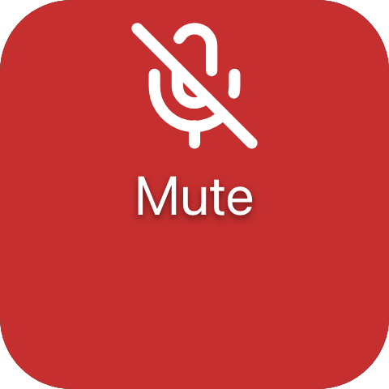
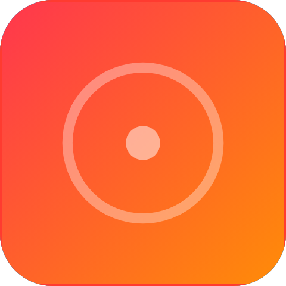

A tile the user presses. It lays out its children exactly as `ui.stack` does, and adds artwork behind
them, a ring around the edge, and the press itself.

`ui.button`

## Example

```csharp
new UiButton
{
    Key = "mute",
    Justify = UiComponentJustify.Center,
    Background = UiValue.From(() => state.Value.Face),
    Source = UiValue.From(() => state.Value.Icon),
    Fit = UiComponentImageFits.Cover,
    Events = [UiEventHandler.On(UiComponentEvents.Press, () => ToggleMute())],
    Children = [new UiTextRun { Key = "label", Text = UiText.Of("Mute"), Size = 0.14 }],
}
```



A tile with an icon covering its face and a centred label; a completed press calls `ToggleMute`.

## Handling a press

```csharp
Events =
[
    UiEventHandler.On(UiComponentEvents.Press, () => Run()),
    UiEventHandler.On(UiComponentEvents.LongPress, () => OpenOptions()),
],
```

Declare only the names you handle. Declaring just `Press` is how you say the button has no long-press
behaviour. A button with no events is still drawn, but accepts nothing - there is no disabled property.
Use `PressStart` and `PressEnd` to drive something for as long as the finger is down.

## Artwork and ring

```csharp
Source = UiValue.From(() => state.Value.Artwork),
Fit = UiComponentImageFits.Cover,
Zoom = 1.2,
Brightness = UiValue.From(() => state.Value.Paused ? 0.6 : 1.0),
BorderStyle = UiComponentBorderStyles.Breathing,
BorderColor = "#ff3b30",
```



The artwork fills the whole box behind the children, so swapping the face is a property patch rather than
a rebuilt subtree. `hue-shift` and `rgb` rings cycle their own colours and ignore `BorderColor`.

## Filling the tile

```csharp
new UiButton { Key = "backdrop", Fill = true, Corner = UiComponentButtonCorners.Tile, /* ... */ }
```

A button that is the whole tree already takes the tile's corner. A nested full-bleed button asks for it
with `Corner = Tile`; otherwise it rounds itself by a share of its own height and cuts an arc across the
tile.

## Properties

| Property | Values | Default (absent) | Meaning |
|---|---|---|---|
| `Direction` (`direction`) | `vertical`, `horizontal` | `vertical` | The layout axis for children. |
| `Justify` (`justify`) | `UiComponentJustify` | `start` | How free space is distributed on the main axis. |
| `Align` (`align`) | `UiComponentAlignments` | `stretch` | How children align on the cross axis. |
| `Gap` (`gap`) | length | No gap | The gap between children. |
| `Padding` (`padding`) | length | No padding | Inner padding on every edge. |
| `Background` (`background`) | `#rrggbb` | The reader's own accent colour | The button's face - unlike a stack, a button always has one. |
| `Source` (`source`) | resource | None | Artwork drawn across the whole box behind the children. |
| `Transition` (`transition`) | `crossfade` | The new artwork replaces the old | How a change of `Source` is drawn. |
| `Fit` (`fit`) | `contain`, `cover` | `contain` | How the artwork fills the box. |
| `Zoom` (`zoom`) | `0.1..4` | `1` | Scales the artwork about its own centre. |
| `OffsetX` (`offsetX`) | `-1..1` | `0` | Shifts the artwork across by a fraction of the element's width, after `Zoom`. |
| `OffsetY` (`offsetY`) | `-1..1` | `0` | Shifts the artwork down by a fraction of the element's height, after `Zoom`. |
| `Opacity` (`opacity`) | `0..1` | Fully opaque | How opaque the artwork is drawn. |
| `Brightness` (`brightness`) | `0..2` | `1` | Multiplies the artwork's luminance. |
| `Saturation` (`saturation`) | `0..2` | `1` | Multiplies the artwork's saturation. |
| `BorderStyle` (`borderStyle`) | `static`, `heartbeat`, `breathing`, `blink`, `comet`, `ants`, `hue-shift`, `rgb` | No ring - no value spells "off" | How the ring is drawn. |
| `BorderColor` (`borderColor`) | `#rrggbb` | The style's own colour | The ring's tint, ignored by `hue-shift` and `rgb`. |
| `Corner` (`corner`) | `tile` | `0.12` of the button's own height | How round the button's own corners are. |

Enum values live in `UiComponentImageFits`, `UiComponentImageTransitions`, `UiComponentBorderStyles` and
`UiComponentButtonCorners`. For `background`'s default see [Colours and text](/ui/concepts/theming/).

## Events

| Event | Fires when | Payload |
|---|---|---|
| `press` (`UiComponentEvents.Press`) | The user completed a press without holding it | None |
| `long-press` (`UiComponentEvents.LongPress`) | The press was still held after 600 ms | None |
| `press-start` (`UiComponentEvents.PressStart`) | The press began | None |
| `press-end` (`UiComponentEvents.PressEnd`) | The press ended, however it ended | None |

## Children

Any elements, any number, laid out as `ui.stack` lays out its children along `direction`.

## Layout

Identical to `ui.stack`: `direction`, `justify`, `align`, `gap` and `padding` divide the button's content
box among its children. On its parent's main axis a button follows the ordinary rule - `MainSize` or
`Fill` if declared, otherwise its content extent. See [Sizing](/ui/concepts/sizing/).

## Reader behaviour

- **Interaction only where declared.** A button with no events is drawn but accepts nothing.
- **`press` is primary.** A reader that implements one press name implements `press`. It never infers
  `press` from a `press-start`/`press-end` pair, never sends `press` in an interaction where `long-press`
  already fired, and never sends a name the node did not declare.
- **`press-end` always follows `press-start`**, including when the pointer left the element or the gesture
  was cancelled.
- **Press feedback is local and immediate:** tint the whole element white at `0.2` alpha, fade in over
  `20 ms`, out over `140 ms`, visible at least `60 ms`. Never wait for the producer before painting.
- **Paint order:** `background`, artwork, children, press feedback, ring.
- **Ring:** a fixed `2` device-independent units along the inner edge, following the corner radius - the
  one length not relative to the basis. Looping styles are phase-locked to Macro Deck's shared clock and
  keep animating regardless of the viewer's reduced-motion preference.
- **Corner:** absent means `0.12` of the button's own height, except a button that is the whole widget tree,
  which takes the tile's corner. An older reader ignores `corner` and paints its own corner.
- The button conformance fixtures in `ui-model/fixtures/component-profile/` pin the exact event ordering.

## See also

- [Events](/ui/concepts/events/)
- [State and bindings](/ui/concepts/state-and-bindings/)
- [Stack and layer](/ui/components/stack-and-layer/)
