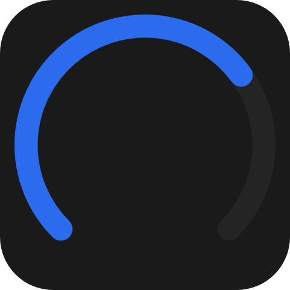
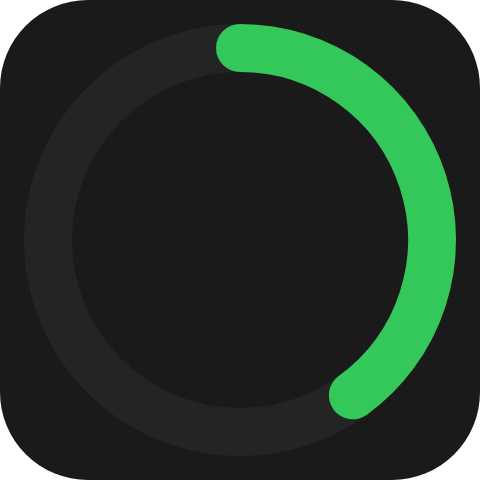

A read-only level drawn along an arc - a speedometer, a CPU load, a battery ring. It holds a fraction of the
sweep in `0..1`, not a value in your own units.

`ui.gauge`

## Example

```csharp
new UiGauge
{
    Key = "cpu",
    Level = UiValue.From(() => cpu.Value / 100.0),
    Thickness = 0.08,
    LevelColor = "#2b6cee",
    Fallback = new UiRangeBar { Key = "cpuBar", Start = 0, End = UiValue.From(() => cpu.Value / 100.0), StartColor = "#2b6cee", EndColor = "#2b6cee" },
}
```



The default sweep runs from `-135` to `135` degrees: three quarters of a turn, open at the bottom.

## Rings

```csharp
new UiGauge { Key = "battery", Level = 0.4, StartAngle = 0, EndAngle = 360, Thickness = 0.1, LevelColor = "#34c759" }
```



Angles are degrees clockwise from twelve o'clock. The sweep is `EndAngle - StartAngle`, so an end before the
start runs counterclockwise; its size is clamped to one full turn.

## Properties

| Property | Values | Default (absent) | Meaning |
|---|---|---|---|
| `Level` (`level`) | `0..1` | `0` | The filled fraction of the sweep. |
| `StartAngle` (`startAngle`) | `double`, degrees | `-135` | Where the arc begins, clockwise from twelve o'clock. |
| `EndAngle` (`endAngle`) | `double`, degrees | `135` | Where the arc ends. |
| `LevelColor` (`levelColor`) | `#rrggbb` | The reader's own accent colour | The filled arc's colour. |
| `Thickness` (`thickness`) | length | Left to the reader | The arc's width. |
| `MainSize` (`mainSize`), `Fill` (`fill`) | - | - | Shared with every leaf - see [Sizing](/ui/concepts/sizing/). |

`LevelColor` is a literal colour, not a theme role - see [Colours and text](/ui/concepts/theming/).

## Events

None. `ui.gauge` is never interactive - use [`ui.dial`](/ui/components/dial/) for the same picture the user
can turn.

## Children

None. `ui.gauge` is a leaf. Put a `ui.text` over it in a [layer](/ui/components/stack-and-layer/) to show
the reading in the middle.

## Layout

A gauge has no content extent: on its parent's main axis it takes `MainSize` or `Fill`, and without either
it is `0` long. The arc is drawn in the largest centred square the box allows. See
[Sizing](/ui/concepts/sizing/).

## Reader behaviour

The geometry is normative; see the [`UiGauge`](https://github.com/Macro-Deck-App/Macro-Deck/blob/main/ui-model/src/MacroDeck.Ui/Components/UiElements.cs)
remarks.

- The sweep is `endAngle - startAngle`, signed, with its magnitude clamped to `360`.
- The arc is centred in the box, `thickness` wide, with a centreline radius of
  `(min(width, height) - thickness) / 2` and fully rounded caps.
- The track covers the whole sweep in the reader's tertiary surface colour. The filled arc runs from the
  start over `level` of the sweep in `levelColor` or the accent colour; `level` is clamped to `0..1`, and `0`
  paints no filled arc.
- A reader that does not know `ui.gauge` draws the node's `fallback`, typically a `ui.range-bar` at the
  same level:

```json
{
  "type": "ui.gauge",
  "properties": { "level": 0.7, "thickness": { "basis": 0.08 }, "levelColor": "#2b6cee" },
  "fallback": {
    "type": "ui.range-bar",
    "properties": { "start": 0, "end": 0.7, "startColor": "#2b6cee", "endColor": "#2b6cee" }
  }
}
```

## See also

- [Dial](/ui/components/dial/)
- [Range bar](/ui/components/range-bar/)
- [Transform](/ui/components/transform/) - a needle over your own artwork
