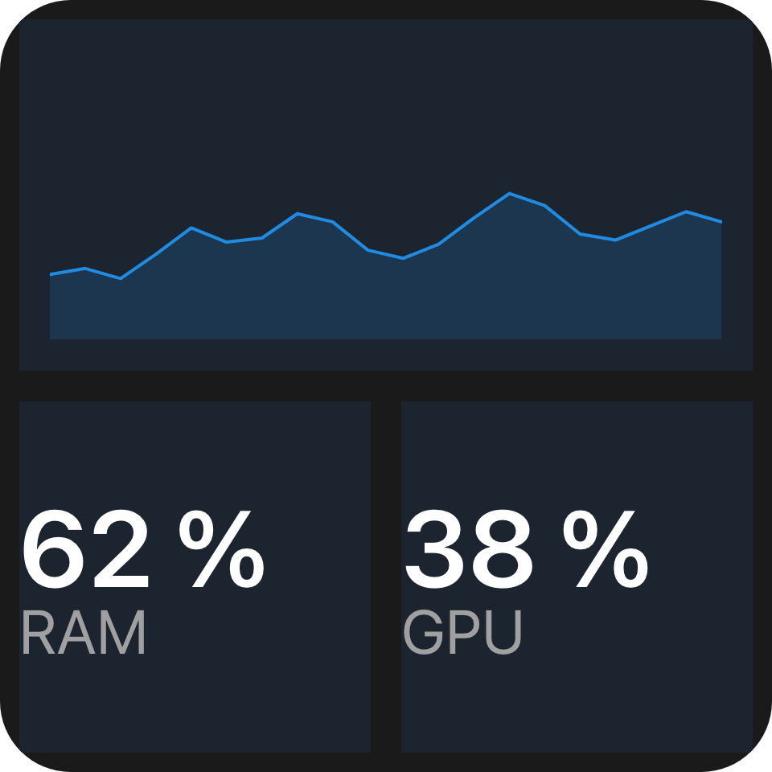

Lays its children out in equal columns and rows - a keypad, a set of stats, a dashboard with one wide
cell - without nesting stacks.

`ui.grid`

## Example

```csharp
new UiGrid
{
    Key = "stats",
    Columns = 2,
    Gap = 0.04,
    Padding = 0.06,
    Children =
    [
        new UiStack { Key = "cpu", Background = "#1c2430", ColumnSpan = 2, Children = [cpuChart] },
        new UiTextRun { Key = "ram", Text = UiText.From(() => $"{ram.Value:0} %") },
        new UiTextRun { Key = "gpu", Text = UiText.From(() => $"{gpu.Value:0} %") },
    ],
    Fallback = new UiStack { Key = "statsFallback", Children = [cpuRow, ramAndGpuRow] },
}
```



A wide chart across the top and two readings beneath it.

## Placement

Children are placed in declaration order. Each takes the first position, scanning row by row from the top
left, where its whole `ColumnSpan` by `RowSpan` block is free:

```
Columns = 3; children A (ColumnSpan 2), B (RowSpan 2), C, D

  +-----+-----+-----+
  |  A        |  B  |
  +-----+-----+     +
  |  C  |  D  |     |
  +-----+-----+-----+
```

A later small child can fill a hole an earlier large one left, so the order on screen can differ from the
order of the children.

## Spans and rows

`ColumnSpan` and `RowSpan` sit on every element and mean something only under a grid; any other parent
ignores them. A span below `1` counts as `1`, and a column span wider than the grid is clamped to `Columns`.

Leave `Rows` absent and the grid has as many rows as placement needs. Set it and a child that does not fit
in those rows is not drawn.

## Properties

| Property | Values | Default (absent) | Meaning |
|---|---|---|---|
| `Columns` (`columns`) | `int` | `1` | The column count; below `1` means `1`. |
| `Rows` (`rows`) | `int` | As many as needed | The row count; children that do not fit are not drawn. |
| `Gap` (`gap`) | length | No gap | The gap between columns and between rows. |
| `Padding` (`padding`) | length | No padding | Inner padding on every edge. |
| `MainSize` (`mainSize`), `Fill` (`fill`), `Answer` (`answer`) | - | - | Shared with every container - see [Stack and layer](/ui/components/stack-and-layer/). |

On a grid's children:

| Property | Values | Default (absent) | Meaning |
|---|---|---|---|
| `ColumnSpan` (`columnSpan`) | `int` | `1` | How many columns the child covers; clamped to `Columns`. |
| `RowSpan` (`rowSpan`) | `int` | `1` | How many rows the child covers. |

## Events

None of its own.

## Children

Any element, any number.

## Layout

The content box minus padding is divided into equal column and row tracks separated by `gap`, and each child
is drawn across its block. A child's `mainSize` and `fill` mean nothing here, because the grid decides the
block. Lengths inside a child keep resolving against the widget basis, not the cell, so text is the same
size in a grid as anywhere else. On its own parent's main axis a grid has no content extent: give it
`MainSize` or `Fill`. See [Sizing](/ui/concepts/sizing/).

## Reader behaviour

- Treat an absent or below-`1` `columns`, `columnSpan` or `rowSpan` as `1`; clamp `columnSpan` to
  `columns`.
- Place children with the dense row-major rule above; with `rows` present, skip a child whose block does
  not fit and keep placing the ones after it.
- Draw each child across its block, ignoring its `mainSize` and `fill`; keep the widget basis unchanged.
- Hold `columns`, `rows`, `columnSpan` and `rowSpan` to at most 64.
- Where the parent leaves the grid's height open - inside a vertical [list](/ui/components/list/) - make
  every row as tall as a column is wide, and the grid as tall as its rows need.
- A reader that does not know `ui.grid` draws the node's `fallback`, typically nested `ui.stack` rows:

```json
{
  "type": "ui.grid",
  "properties": { "columns": 2, "gap": { "basis": 0.04 } },
  "children": [
    { "type": "ui.text", "properties": { "text": "A" } },
    { "type": "ui.text", "properties": { "text": "B" } }
  ],
  "fallback": {
    "type": "ui.stack",
    "properties": { "direction": "horizontal", "gap": { "basis": 0.04 } },
    "children": [
      { "type": "ui.text", "properties": { "text": "A", "fill": true } },
      { "type": "ui.text", "properties": { "text": "B", "fill": true } }
    ]
  }
}
```

## See also

- [Stack and layer](/ui/components/stack-and-layer/)
- [Sizing](/ui/concepts/sizing/)
