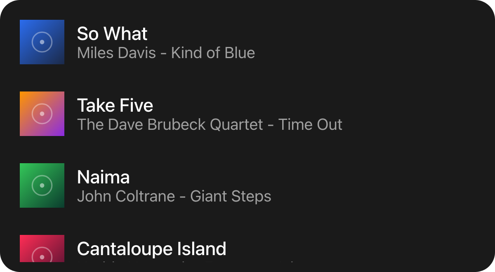

A container that scrolls, and tells you when the user reaches the end of what it holds. It is for the
**dialog** surface: a deck tile is a fixed box, and a list in one would hide content behind a gesture the
deck itself uses.

`ui.list`

## Example

```csharp
new UiList
{
    Key = "results",
    Fill = true,
    Gap = UiSize.FromBasis(0.015),
    Events = [UiEventHandler.On(UiComponentEvents.Reveal, OnRevealed)],
    Children =
    [
        new UiRepeat<CatalogItem>
        {
            Key = "rows",
            Items = UiValue.From<IReadOnlyList<CatalogItem>>(() => items.Value.Take(window.Value).ToList()),
            KeySelector = item => item.Id,
            Template = (item, _) => Row(item),
        },
    ],
}
```



A windowed result list, adapted from the built-in music picker: it starts with a few rows and grows as the
user scrolls.

## Loading more items

```csharp
void OnRevealed(UiEventData data)
{
    if (!data.TryGetDouble(out var index)) return;

    var wanted = (int)index + 25;
    if (wanted > window.Value) window.Value = wanted;
}
```

`reveal` carries the index of the furthest child the user has brought into view. Append children, or do
not; there are no page sizes and no "has more" flag. When you run out, append nothing - the reader asks
again only once the user goes further than before.

## Keeping rows stable

```csharp
KeySelector = item => item.Id,
```

Key rows by the item's own id, never its position. Rows are patched in place as the list grows or a filter
narrows it, and a positional key would re-key everything below the change.

## Showing an empty or loading state

```csharp
new UiWhen
{
    Key = "emptyWhen",
    Condition = () => items.Value.Count == 0,
    Content = () => new UiTextRun { Key = "empty", Text = "Nothing found", Role = UiComponentTextRoles.Secondary },
},
```

"Loading" and "empty" are your own state, so express them as ordinary children of the list rather than
properties.

## Scrolling horizontally

```csharp
new UiList
{
    Key = "covers",
    Direction = UiComponentDirections.Horizontal,
    RequiredComponentVersion = 2,
    Fallback = new UiStack { Key = "coversFallback", Children = [firstCover] },
    Children = covers,
}
```

`Horizontal` needs component version 2. A version 1 reader ignores `direction` and scrolls vertically,
so ask for version 2 and carry a `ui.stack` fallback.

## Properties

| Property | Values | Default | Meaning |
|---|---|---|---|
| `Direction` (`direction`) | `UiComponentDirections.Vertical`, `.Horizontal` (`vertical`, `horizontal`) | `vertical` | The scroll axis; `horizontal` needs component version 2. |
| `Gap` (`gap`) | length | No gap | The gap between children. |
| `Padding` (`padding`) | length | No padding | Inner padding on every edge. |
| `Background` (`background`) | `#rrggbb` | Paints nothing behind its children | The list's own fill, a literal colour like every container fill - see [Colours and text](/ui/concepts/theming/). |
| `MainSize` (`mainSize`), `Fill` (`fill`), `Answer` (`answer`) | - | - | Shared with every container - see [Stack and layer](/ui/components/stack-and-layer/). |

## Events

Declared only where `Events` names it - see [Events](/ui/concepts/events/).

| Event | When | Payload |
|---|---|---|
| `UiComponentEvents.Reveal` (`reveal`) | The user has reached the end of what the list currently holds | The index of the furthest child brought into view, as a bare number |

## Children

Any element, any number, one after another along the scroll axis.

## Layout

The main axis - `y` for a vertical list, `x` for a horizontal one - is unbounded: children take their
natural extent along it, and their `mainSize`/`fill` are ignored on that axis. Across it, each child takes
the list's inner extent. On its own parent's main axis a list follows the ordinary container rule:
`mainSize` or `fill` if declared, otherwise its content extent. See [Sizing](/ui/concepts/sizing/).

## Reader behaviour

- Send `reveal` only if the node declares it.
- Send at most two `reveal` events a second, and only for an index beyond the furthest one already sent
  for the same list.
- The payload is a child index, not a page; never assume a page size.
- A version 1 reader ignores `direction` and scrolls vertically - negotiation catches unknown types, not
  unknown values, so producers pair `horizontal` with version 2 and a fallback.
- Ignore children's `mainSize` and `fill` on the scroll axis.

## See also

- [Stack and layer](/ui/components/stack-and-layer/)
- [Text field](/ui/components/text-field/) - the other dialog-only element
- [Events](/ui/concepts/events/)
- [Sizing](/ui/concepts/sizing/)
