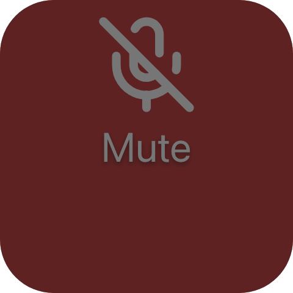
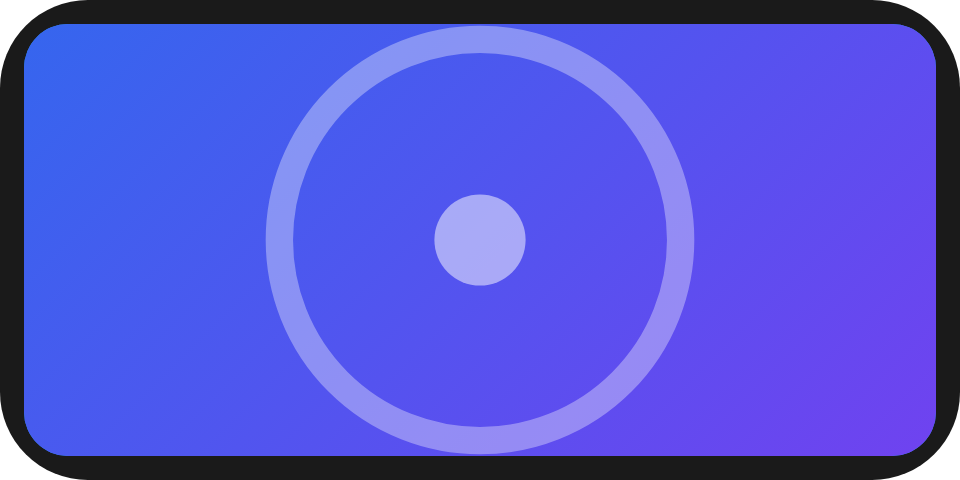
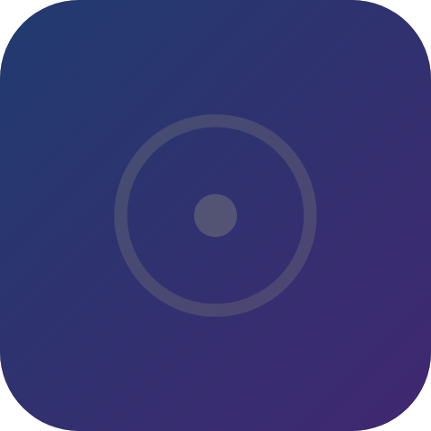
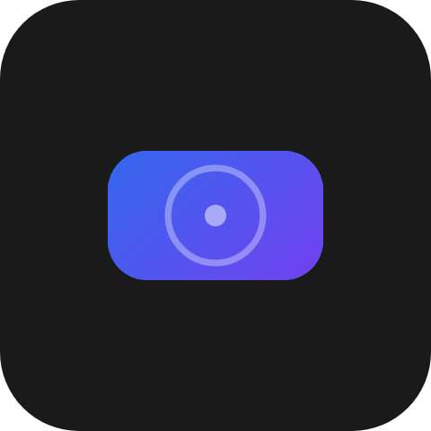
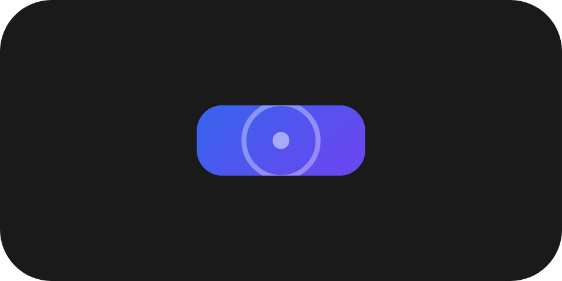

One DSL element, `UiModifier`, decorates the single element it wraps. What reaches the wire depends on
which members you set, because the two halves degrade differently on an older reader:

- **The `modifiers` property** carries the members that change no geometry. It sits on the wrapped node
  itself, and a reader that does not know it ignores it and draws the node plainer.
- **The `ui.modifier` type** carries padding, opacity, clip, mask and frame. Ignoring any of them would
  draw something wrong or move its siblings, so they are a negotiated type: an older reader draws your
  explicit `Fallback`, and there is no default one. Without a fallback, an older reader draws none of the
  wrapped content (Macro Deck's own renderer shows a faint placeholder box in its place) - see
  [The UI model](/ui/concepts/ui-model/#a-node).

`ui.modifier` (component version 1)

## Example

```csharp
new UiModifier
{
    Key = "card",
    Background = UiGradient.Linear(135,
        new UiGradientStop { Offset = 0, Color = "#2b6cee" },
        new UiGradientStop { Offset = 1, Color = "#7a3cf0" }),
    Radius = 0.12,
    Padding = 0.08,
    Child = new UiImage { Key = "icon", Source = icon },
    Fallback = new UiImage { Key = "iconPlain", Source = icon },
}
```


`Padding` makes this a `ui.modifier` node, so the gradient and radius sit on the wrapper and cover the
padding. An older reader draws the plain icon.

## Decorating a node

```csharp
new UiModifier
{
    Key = "roomCard",
    Background = "#1c1c1e",
    Radius = 0.1,
    BorderWidth = UiSize.Capped(2d / UiLength.Cell, 2),
    BorderColor = "#ff9500",
    BorderLine = UiComponentBorderLines.Dashed,
    AccessibilityLabel = UiText.Of(strings.RoomLabel),
    Child = new UiStack { Key = "room", Children = [/* ... */] },
}
```

```json
{ "id": "room", "type": "ui.stack", "properties": { "modifiers": { "background": "#1c1c1e", "radius": { "basis": 0.1 }, "borderWidth": { "basis": 0.0167, "maxOfCell": 0.0167 }, "borderColor": "#ff9500", "borderLine": "dashed", "accessibilityLabel": {"$localized":…} } }, "children": [] }
```


With only these members set, the modifier adds no node: the members land on the child's `modifiers`
object and the id stays the child's. The child must then build to exactly one component node - a `UiWhen`,
`UiRepeat` or fragment child is rejected when the view is built. Nested modifiers of this kind merge onto
the same node; setting the same member twice on one node is rejected. Because it produces no node of its
own, such a modifier cannot set `MainSize`, `Fill`, `ColumnSpan`, `RowSpan`, `Answer`, `Fallback` or
`RequiredComponentVersion` - set those on the child, or add a wrapper member to make it a `ui.modifier`
node.

## Events on a modifier

```csharp
new UiModifier
{
    Key = "pagerGestures",
    Events = [UiEventHandler.On(UiComponentEvents.Swipe, e => { if (e.TryGetString(out var dir)) Page(dir); })],
    Child = pager,
}
```

A modifier's handlers join the declared events of the node its members land on. When the modifier and the
child both handle a name, both run: the child first, then the modifiers from the inside out.

## Gestures

| Event | Fires | Payload |
|---|---|---|
| `drag` (`UiComponentEvents.Drag`) | While the pointer moves, once it has travelled `0.04` of the basis. At most every `100 ms`. | `{"x":n,"y":n}`, the translation since the gesture began, in basis fractions, `x` right-positive, `y` down-positive |
| `drag-end` (`UiComponentEvents.DragEnd`) | Once on release, only after a `drag` began. Not sent if the node leaves the tree or becomes disabled mid-drag. | As `drag`, the final translation |
| `swipe` (`UiComponentEvents.Swipe`) | On release, when the dominant axis travelled at least `0.2` of the basis within `500 ms`. | `"left"`, `"right"`, `"up"` or `"down"` |
| `pinch` (`UiComponentEvents.Pinch`) | While two pointers move. At most every `100 ms`. | A bare number, the scale since the pinch began |
| `pinch-end` (`UiComponentEvents.PinchEnd`) | Once, when the pinch ends. Not sent if the node leaves the tree or becomes disabled mid-pinch. | As `pinch`, the final scale |

The constants live on `UiComponentModifiers` (`GestureSlop`, `SwipeMinDistance`, `SwipeMaxDurationMs`,
`GestureThrottleMs`). A gesture can be declared on any node, with or without a modifier.

- **Inner controls win.** A pointer that starts inside a descendant that takes a value (a slider, dial,
  toggle, segmented control or text field), declares a gesture of its own, or is a `ui.list` belongs to
  that descendant.
- **An inner press wins until slop.** Once the pointer travels past `0.04` of the basis, the outer gesture
  takes over and the press ends with `press-end` and no `press`.
- **Touch action.** A node declaring a gesture turns off the browser's own panning and zooming for its box.
  A `ui.list` inside it keeps scrolling.
- **On a deck tile, a gesture claims the pointer but not a key.** A tree declaring a gesture takes every
  pointer press on its tile, so the tile's own long-press cannot fire in the middle of a drag. Keyboard and
  physical-control activation cannot drag, so a tree that declares only gestures still runs the tile's own
  flow from a key.
- `pinch` on iOS, and every gesture at the Safari 9 floor, is unverified.

## Disabled

```csharp
new UiModifier { Key = "controlsState", Disabled = UiValue.From(() => !connected.Value), Child = controls }
```

`Disabled` is shorthand for the producer, not a second source of truth: [events stay the
contract](/ui/concepts/events/#interaction-only-where-declared).

- **The DSL strips events.** While `Disabled` is true, no node in the wrapped subtree, and none in its
  fallback, declares an event, and `UiView.Dispatch` answers `Ignored` for any of them.
- **On the wire it is presentation.** `disabled: true` dims the node to `0.4` opacity once - a disabled
  region inside another is not dimmed twice - and marks the subtree `aria-disabled`.
- **Readers refuse events inside a disabled region**, even when a hand-written tree still declares them, and
  a slider, dial, toggle, segmented control or text field inside one cannot be operated.
- **A disabled region absorbs every press on the tile.** If any node in a deck tile's tree is disabled,
  pressing anywhere on the tile runs none of the tile's own flows. `Disabled` therefore means "a control
  that is unavailable"; to fade something that is only decorative, use `Opacity` instead.



An older reader ignores `disabled` and draws the region undimmed. Because the DSL stripped its events, it
offers none of them either, but it does not absorb the tile's press: on a deck tile, the tile's own flows
still run there, as they do from a hardware key today.

Known gaps:

- The web client's keyboard and hardware activation honours the absorption but not the tree's own
  activation.
- The host's hardware path
  ([`DeviceInteractionRouter`](https://github.com/Macro-Deck-App/Macro-Deck/blob/main/host/src/MacroDeckHost.Application/Devices/Surfaces/DeviceInteractionRouter.cs))
  runs a tile's triggers without consulting the tree.

## Properties

### `modifiers` (on any node)

| DSL member (wire member) | Values | Absent | An older reader |
|---|---|---|---|
| `Background` (`background`) | `#rrggbb`, a linear or a radial gradient | No change | Draws the node's own background |
| `Radius` (`radius`) | length | The node's own corner | Draws the node's own corner |
| `BorderWidth` (`borderWidth`) | length | No border | Draws no border |
| `BorderColor` (`borderColor`) | `#rrggbb` | The reader's choice - set it whenever the colour matters | Draws no border |
| `BorderLine` (`borderLine`) | `solid`, `dashed`, `dotted` | `solid` | Draws no border |
| `AccessibilityLabel` (`accessibilityLabel`) | localized text | No label | Omits the label |
| `AccessibilityHint` (`accessibilityHint`) | localized text | No hint | Omits the hint |
| `Disabled` (`disabled`) | `true` | Not disabled | Draws the node undimmed |

A gradient travels as `{"linear":{"angle":deg,"stops":[{"offset":0..1,"color":"#rrggbb"}]}}`, angle in the
CSS convention (`0` towards the top, clockwise), or `{"radial":{"centerX":0..1,"centerY":0..1,"stops":[...]}}`,
with at least two stops; a reader draws no gradient from fewer, or from any stop it cannot read.
Colours are literal, like every data colour - see [Theming](/ui/concepts/theming/#literal-colours). On a
stack, button or list, `background` and `radius` replace the component's own background and corner.

### `ui.modifier`

| DSL member (wire property) | Values | Absent |
|---|---|---|
| `Padding` (`padding`) | length | No padding |
| `Opacity` (`opacity`) | `0..1` | Fully opaque |
| `Clip` (`clip`) | `bounds`, `circle`, `capsule` | Nothing is clipped |
| `Mask` (`mask`) | a linear or radial gradient of `{"offset","opacity"}` stops | No mask |
| `Frame` (`frame`) | `width`, `height`, `minWidth`, `maxWidth`, `minHeight`, `maxHeight` lengths, `aspectRatio` greater than `0` | The box the parent hands it |
| `MainSize` (`mainSize`), `Fill` (`fill`), `Answer` (`answer`) | - | Shared with every container - see [Stack and layer](/ui/components/stack-and-layer/#shared-with-every-container). |

The wrapper node may also carry `modifiers` and `events`. Enum values live in `UiComponentClips` and
`UiComponentBorderLines`.









**Why padding is here.** Padding could have been a plain property, but padding on an arbitrary node
changes that component's own geometry, so a reader ignoring it would lay the siblings out wrongly rather
than just more plainly.

## Children

Exactly one element.

## Layout

The wrapper lays its child out in its own box minus `padding` on every edge. `frame` fixes or clamps the
wrapper's box and, with `aspectRatio`, its shape; a frame smaller than the space it is given is centred in
it. On its parent's main axis the wrapper is its child's content extent plus twice the padding, or the
frame's fixed length, clamped by the frame's minimum and maximum.

Wrapping moves `MainSize` and `Fill` to the wrapper: set them on the `UiModifier`, since a wrapped child
that sets them is rejected when the view is built. A filling wrapper's maximum clamps only its own size;
the surplus is not handed to its siblings. See [Sizing](/ui/concepts/sizing/#frames-and-wrapping).

## Reader behaviour

- **`radius` does not clip.** It rounds the background and border only; to clip content, use `clip` on a
  wrapper. `clip: bounds` rounds by the wrapper's own `modifiers.radius`.
- **`radius` is ignored on the tree root**, because the tile's corner belongs to the surface
  ([ADR 0065](https://github.com/Macro-Deck-App/Macro-Deck/blob/main/engineering/decisions/0065-the-component-profile-authoring-contracts.md#the-corner-radius-is-part-of-the-surface)).
- **The border is drawn inside the edge.** It takes no space, so the node's content and its
  children's boxes are unchanged. On a stack, button, layer, transform, grid, toggle, segmented control or
  `ui.modifier` it is a layer above the content, including a button's artwork; on every other node it is an
  outline, which an older engine may draw with square corners.
- **Opacity** covers the whole wrapper; a disabled wrapper at `opacity: 0.5` shows at `0.2`.
- **A fallback is its own node.** A reader drawing a node's fallback draws the fallback's own `modifiers`,
  not the replaced node's; give the fallback the ones it needs.
- **Accessibility.** `accessibilityLabel` becomes the node's accessible name and `accessibilityHint` its
  description, the latter with weaker support at the Safari 9 floor. A labelled node that claims a press
  gets the button role, other labelled nodes without a native role the group role; a text field keeps its
  own.
- A reader that does not know `ui.modifier` draws the node's `fallback`, negotiated in turn. Without one
  it draws none of the wrapped content (Macro Deck's own renderer shows a faint placeholder box in its
  place), per [The UI model](/ui/concepts/ui-model/#a-node). Give a wrapper a fallback built from the same content under
  its own keys:

```json
{
  "id": "card",
  "type": "ui.modifier",
  "properties": { "padding": { "basis": 0.08 }, "modifiers": { "radius": { "basis": 0.12 } } },
  "children": [{ "id": "icon", "type": "ui.image", "properties": { "source": { "resourceId": "icon" } }, "children": [] }],
  "fallback": { "id": "iconPlain", "type": "ui.image", "properties": { "source": { "resourceId": "icon" } }, "children": [] }
}
```

The shared fixture
[`conformance-modifier-tree.json`](https://github.com/Macro-Deck-App/Macro-Deck/blob/main/ui-model/fixtures/component-profile/conformance-modifier-tree.json)
covers every member, property and event on this page.

## See also

- [Events](/ui/concepts/events/)
- [Sizing](/ui/concepts/sizing/)
- [Theming](/ui/concepts/theming/)
- [Stack and layer](/ui/components/stack-and-layer/)
- [Compatibility](/ui/reference/compatibility/)
