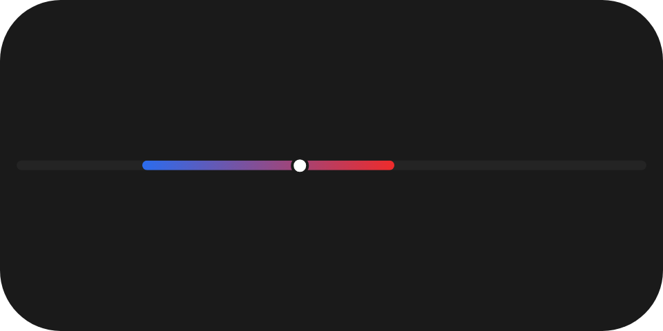
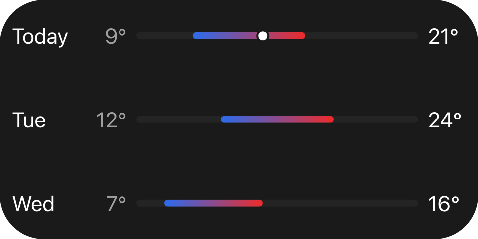

A read-only track carrying one gradient-filled span, with an optional marker for a point inside it -
a forecast's low-to-high span, a level meter, a position on a fixed scale.

`ui.range-bar`

## Example

```csharp
new UiRangeBar
{
    Key = "bar",
    Fill = true,
    Thickness = UiSize.FromBasis(0.03, 0.35),
    Start = 0.2,
    End = 0.6,
    StartColor = "#2b6cee",
    EndColor = "#ee2b2b",
    Marker = UiValue.From(() => state.Value.TodayFraction),
}
```



A forecast row: a blue-to-red span from 20 % to 60 % of the track, with today's temperature marked on it.

## Point marker

```csharp
Marker = isToday ? UiValue.From(() => state.Value.TodayFraction) : UiValue.None<double>(),
```



Leave `Marker` absent and no marker is drawn. The marker is painted in the reader's text colour, not the
gradient, so it stays visible wherever it lands.

## Colours

`StartColor` and `EndColor` are literal colours, not theme roles: they encode data, so a value must look the
same in every theme - see [Colours and text](/ui/concepts/theming/). Use the same colour twice for a solid
span.

## Properties

| Property | Values | Default (absent) | Meaning |
|---|---|---|---|
| `Start` (`start`) | `0..1` | - | Where the filled span begins, as a fraction of the track. |
| `End` (`end`) | `0..1` | - | Where the filled span ends, as a fraction of the track. |
| `StartColor` (`startColor`) | `#rrggbb` | - | The colour at `start`. |
| `EndColor` (`endColor`) | `#rrggbb` | - | The colour at `end`. |
| `Marker` (`marker`) | `0..1` | No marker is drawn | Where the point marker sits, as a fraction of the track. |
| `Thickness` (`thickness`) | length | Left to the reader | The track's thickness on the cross axis. |

## Events

None. `ui.range-bar` is never interactive - use [`ui.slider`](/ui/components/slider/) for the same shape
the user can drag.

## Children

None. `ui.range-bar` is a leaf.

## Layout

The track spans the element's full main-axis extent and is `thickness` tall on the cross axis. The element
follows the ordinary leaf rule on its parent's main axis - `MainSize` or `Fill` if declared, otherwise its
content extent. See [Sizing](/ui/concepts/sizing/).

## Reader behaviour

The geometry is normative; the fixtures in `ui-model/fixtures/component-profile/` resolve it at two sizes.

- The track is centred on the cross axis with fully rounded ends; the unfilled track uses the reader's
  tertiary surface colour.
- The filled span runs from `start` to `end` with a linear gradient from `startColor` to `endColor` along
  the main axis, and keeps fully rounded ends even when it stops short of the track's ends.
- The marker is a filled disc of radius `0.75 * thickness` in the reader's primary text colour, ringed by a
  stroke of width `0.28 * thickness` in the widget's own background colour.
- The marker's centre is inset from both ends by `radius + strokeWidth / 2`; when the track is narrower
  than twice that inset, the marker is centred instead.

## See also

- [Slider](/ui/components/slider/)
- [Progress](/ui/components/progress/)
- [State and bindings](/ui/concepts/state-and-bindings/)
