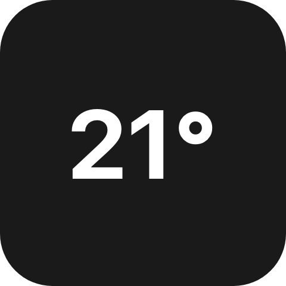
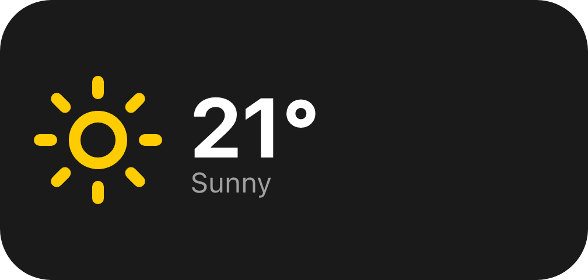
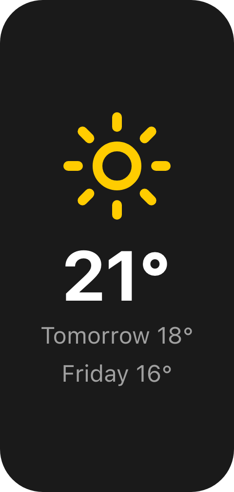

`UiResponsive` holds several layouts for one place in the tree. The reader draws the first one whose
condition holds for the box the node is given, and chooses again whenever that box changes. Your view never
learns the size and never rebuilds when it changes.

`ui.responsive` (component version 1)

## Example

```csharp
new UiResponsive
{
    Key = "weather",
    Default = new UiStack
    {
        Key = "compact",
        Justify = UiComponentJustify.Center,
        Children = [new UiTextRun { Key = "temp", Text = "21°", Size = 0.3 }],
    },
    Variants =
    [
        new UiResponsiveVariant
        {
            MinWidth = 1.5,
            Content = new UiStack
            {
                Key = "wide",
                Direction = UiComponentDirections.Horizontal,
                Children = [icon, details],
            },
        },
        new UiResponsiveVariant
        {
            MaxAspect = 0.67,
            Content = new UiStack { Key = "tall", Children = [icon, temperature, forecast] },
        },
    ],
}
```





One tree, three layouts: the default on one cell, the wide one on 2x1 and the tall one on 1x2. Resizing the
widget on the deck switches between them immediately.

## Conditions

| Member | Holds when |
|---|---|
| `MinWidth` | the box is at least this many cells wide |
| `MaxWidth` | the box is less than this many cells wide |
| `MinHeight` | the box is at least this many cells tall |
| `MaxHeight` | the box is less than this many cells tall |
| `MinAspect` | width over height is at least this |
| `MaxAspect` | width over height is less than this |

- A variant holds when every member you set holds. A variant with none set always holds, so put it last.
- Variants are tried in order and the first that holds wins. `Default` is drawn when none does.
- A minimum includes its value and a maximum excludes it, so `MaxWidth = 2` and `MinWidth = 2` split the
  range with nothing drawn twice. Both are compared with a tolerance of `0.0001`
  (`UiResponsiveSelection.Tolerance`), so a tile that is exactly two cells wide counts as two cells even when
  the reader's scaled pixels round.
- A member that needs a side the reader does not know never holds. `MinAspect` needs both sides.

### What a cell is

On a deck tile, one cell is one grid cell: a 2x1 tile is two cells wide plus the spacing between them, so
it is slightly more than `2`. Spans are exact, so `MinWidth = 2` means "two columns or more" whatever the
folder's spacing.

Anywhere else - a [folder view](/ui/views/folder-views/), a [modal](/ui/views/modal/), a
[screensaver](/ui/views/screensavers/) - a cell is 120 of the reader's own layout units, which are CSS pixels
in Macro Deck's clients. `MinWidth = 6` there means "at least 720 px wide". A measured CSS width can land a
fraction of a pixel either side of a round number, so leave some room around a threshold rather than
putting it exactly on a width you expect.

Aspect conditions mean the same everywhere and are usually the better choice for "landscape" and
"portrait".

## The box it chooses by

The node chooses by its own box, not by the tile's or the window's. As the root of a widget it gets the whole
tile. Inside a stack it gets the slot the stack gives it, so give it `Fill` or `MainSize` like any other
child. The chosen layout is always drawn across the whole box.

`MainSize`, `Fill`, `ColumnSpan` and `RowSpan` go on the `UiResponsive`. A layout that sets them is rejected
when the view is built, and so is a layout that is a `UiWhen`, a `UiRepeat` or a fragment. Put those inside
a layout instead.

## What every layout costs

Every layout is built, kept current and sent to the reader, whichever one is on screen. They all count
toward the tree limits: 2000 nodes, 192 KiB per tree and 64 KiB per patch. Each `UiResponsive` also adds a
level toward the 32-level nesting limit.

Keep the layouts small, and share what they have in common through a helper method rather than a large
subtree repeated in every variant.

Per-client state that lives in the reader, such as a text field's unsent text or a list's scroll position,
is lost when the reader switches to another layout. State in your view is not.

## Older readers

A reader that does not know `ui.responsive` draws the node's `Fallback`. When you set none, `Default` is sent
a second time as the fallback, under ids below `<id>._fallback`, so an older reader draws your default layout.
That copy has consequences:

- It is patched along with the default, so a change inside `Default` is sent twice.
- A `UiResponsive` nested inside another's `Default` is copied again for each level.
- The key `_fallback` is reserved: a layout keyed `_fallback` is rejected.
- The copy's ids are longer. One that would pass the 128-character id limit is rejected with a message that
  names the node.
- A [configuration input](/ui/views/configuration/) cannot sit inside `Default`, because its id would appear
  twice.

In each of these cases, set an explicit `Fallback` and no copy is made.

An older reader also walks every layout when it decides whether the tile's own press belongs to a control in
the tree. Put the controls a tile must never lose in `Default`.

## Presses and hardware keys

A pointer press on a drawn control always reaches that control.

For the tile's own press, a keyboard activation or a hardware key on a device, the reader looks for a control
in the layout it draws. That is exact for a `UiResponsive` at the root of the widget, or reached from the root
only through a `UiLayer`, a `UiTransform` or a `UiModifier` without padding or frame. For one nested deeper, the tile counts
its default layout. A drag or swipe on a control inside a nested layout can therefore also start the tile's
own press.

When the layout at the root is itself a button, it is treated as the whole tile, exactly as a bare button
root would be.

## Testing

`UiTestHost.SetBox(widthCells, heightCells)` picks the layout `ByType`, `SingleByType` and `ByText` see. See
[Custom views](/ui/views/custom/#testing-it).

```csharp
var host = UiTestHost.Render(weather, widgetSurface);
host.SetBox(2.1, 1);
Assert.That(host.ByText("Sunny"), Is.Not.Empty);
```

`UiResponsiveSelection.SelectChild` is the rule itself, over the wire form, for a reader of your own.

## Reference

| Property (`UiResponsive`) | Wire | Meaning |
|---|---|---|
| `Default` | `children[0]` | Drawn when no variant holds, and by an older reader |
| `Variants` | `children[1..]` and `variants` | The conditional layouts in order; `variants[i]` is the condition for `children[i + 1]` |
| `MainSize`, `Fill`, `ColumnSpan`, `RowSpan` | as on any node | The node's slot in its parent |
| `Fallback` | `fallback` | Your own fallback; when absent, a copy of `Default` |

Reader rules:

- Draw the first `children[i + 1]` whose `variants[i]` holds for the node's own box, else `children[0]`.
  Draw only that child, across the whole box.
- Widths and heights are in cells of 120 reference units. A side that is zero, negative or unknown is unknown.
- A condition that is not an object never holds. A member that is not a number is ignored.
- Choose again whenever the box changes.
- A tree root that is a `ui.responsive` hands its root status to the child it draws.

## See also

- [Sizing](/ui/concepts/sizing/) - lengths that scale within one layout
- [Stack and layer](/ui/components/stack-and-layer/)
- [Deck widget views](/ui/views/widget/)
- [ADR 0094](https://github.com/Macro-Deck-App/Macro-Deck/blob/main/engineering/decisions/0094-responsive-layouts-are-chosen-by-the-reader.md)
