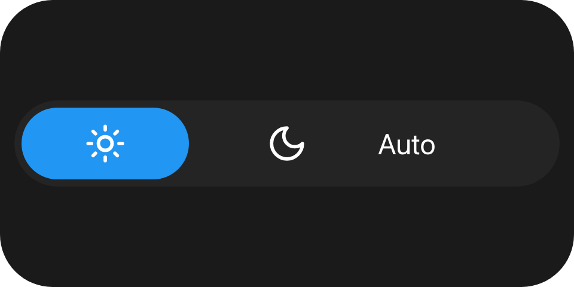

A row of equal segments with one selected - a mode switch, a scene picker. Each child is one segment's
content; the control, not the children, receives the press.

`ui.segmented`

## Example

```csharp
new UiSegmented
{
    Key = "mode",
    Selected = UiValue.From(() => (int)state.Value.Mode),
    Events = [UiEventHandler.On(UiComponentEvents.Change, data => SetMode(data))],
    Children =
    [
        new UiIcon { Key = "sun", Icon = UiIcons.Sun, Size = 0.14 },
        new UiIcon { Key = "moon", Icon = UiIcons.Moon, Size = 0.14 },
        new UiTextRun { Key = "auto", Text = "Auto", Size = 0.1 },
    ],
    Fallback = new UiStack { Key = "modeFallback", Direction = UiComponentDirections.Horizontal, Children = modeButtons },
}
```



## Reading the index

```csharp
UiEventOutcome SetMode(UiEventData data)
{
    if (!data.TryGetDouble(out var index))
    {
        return UiEventOutcome.Rejected("The event payload is not a number.");
    }

    state.Set(state.Value with { Mode = (Mode)(int)index });
    return UiEventOutcome.Accepted;
}
```

`change` carries the zero-based index of the segment the user chose, as a JSON number. Set `Selected` from
it.

## Holding the selection

A completed press on a segment other than the drawn selection moves the face there at once and sends
`change`. The reader holds that selection until your `Selected` changes or one second passes, as a
[toggle](/ui/components/toggle/) holds its state. A press on the segment already selected sends nothing.

## Children are content

The children are drawn, never pressed. A button or slider inside a segment is painted but offers none of its
events, and the deck never treats one as the tile's control.

## Properties

| Property | Values | Default (absent) | Meaning |
|---|---|---|---|
| `Selected` (`selected`) | `int`, zero-based | No face drawn | The selected segment. Out of range also draws no face. |
| `LevelColor` (`levelColor`) | `#rrggbb` | The reader's own accent colour | The selected face's colour. |
| `MainSize` (`mainSize`), `Fill` (`fill`), `Answer` (`answer`) | - | - | Shared with every container - see [Stack and layer](/ui/components/stack-and-layer/). |

## Events

| Event | Fires when | Payload |
|---|---|---|
| `change` (`UiComponentEvents.Change`) | A press completed on a segment other than the selected one | The segment's zero-based index, a JSON number |

## Children

Any element, any number; one segment per child. Their own events are never offered.

## Layout

The width is divided into one equal segment per child, in a row, and each child is laid out over its
segment's box. The element's whole box is the press surface. On its parent's main axis a segmented control
has no content extent: give it `MainSize` or `Fill`. See [Sizing](/ui/concepts/sizing/).

## Reader behaviour

- **Geometry:** a capsule track over the whole box in the tertiary surface colour; the selected segment's
  face is a capsule inset by `0.08` of the box height, in `levelColor` or the accent colour.
- **Interaction only where declared.** Without `change` the control is drawn and cannot be touched.
- **The pointer picks the segment** from its position; children never receive it, and their declared events
  are never sent.
- **Press feedback:** with `change` declared, the reader paints its press tint on touch. The deck tile's own
  pressed state follows the control only when it is the root of the tree, as for a button.
- **A completed press** on a segment other than the drawn selection selects it, sends `change` once with its
  index, and holds it until `selected` changes or 1000 ms pass. A cancelled press sends nothing.
- **Keyboard and hardware:** in the Macro Deck desktop app, activating a tile whose first interactive node
  is a segmented control selects the next segment, wrapping to the first after the last; with nothing
  selected it selects the first. The web client does not activate tree nodes from the keyboard.
- **Activation acts on the producer's value:** it steps from the `selected` the tree last carried, not a
  selection the reader is still holding after a tap, and the face moves when the producer answers.
- A reader that does not know `ui.segmented` draws the node's `fallback`, typically a `ui.stack` of
  `ui.button`:

```json
{
  "type": "ui.segmented",
  "properties": { "selected": 0, "events": ["change"] },
  "children": [
    { "type": "ui.text", "properties": { "text": "Day" } },
    { "type": "ui.text", "properties": { "text": "Night" } }
  ],
  "fallback": {
    "type": "ui.stack",
    "properties": { "direction": "horizontal" },
    "children": [
      { "type": "ui.button", "properties": { "events": ["press"], "fill": true }, "children": [{ "type": "ui.text", "properties": { "text": "Day" } }] },
      { "type": "ui.button", "properties": { "events": ["press"], "fill": true }, "children": [{ "type": "ui.text", "properties": { "text": "Night" } }] }
    ]
  }
}
```

## See also

- [Toggle](/ui/components/toggle/)
- [Button](/ui/components/button/)
- [Events](/ui/concepts/events/)
