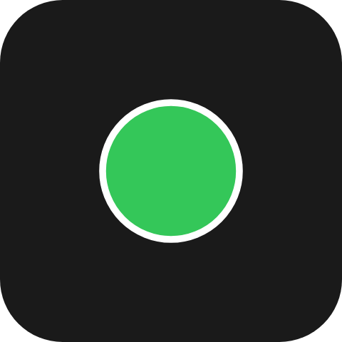
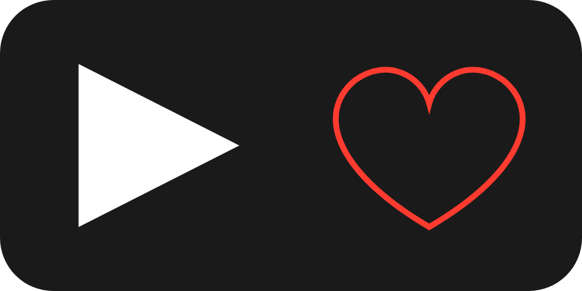

A filled and stroked outline - a status dot, a badge behind a number, a divider, a simple glyph of your own -
drawn without registering any artwork.

`ui.shape`

## Example

```csharp
new UiShape
{
    Key = "status",
    Shape = UiComponentShapes.Circle,
    Color = UiValue.From(() => state.Value.Online ? "#34c759" : "#ff3b30"),
    StrokeColor = "#ffffff",
    StrokeWidth = 0.02,
    MainSize = 0.3,
}
```



A status dot: switching its colour is a `set-properties` patch carrying `color` alone.

## Rounded rectangles and capsules

```csharp
new UiShape { Key = "badge", Shape = UiComponentShapes.RoundedRectangle, CornerRadius = 0.06, Color = "#2b6cee" }
new UiShape { Key = "pill", Shape = UiComponentShapes.Capsule, Color = "#2b6cee" }
```

`CornerRadius` is clamped to half the box's smaller side, so a very large radius on a rounded rectangle
gives a capsule. A capsule always takes that half side and ignores `CornerRadius`.

## Paths

```csharp
new UiShape
{
    Key = "play",
    Shape = UiComponentShapes.Path,
    Path = "M0.3 0.2 L0.8 0.5 L0.3 0.8 Z",
    Color = "#ffffff",
}
```



The coordinates are in a unit box: `0..1` spans the element's own width and height, so the path stretches
with the box while the stroke keeps its width. Only the absolute commands `M L H V C Q A Z` are accepted,
with SVG 1.1's number syntax and implicit repetition. A path with anything else, including relative
(lower-case) commands, draws nothing.

## Properties

| Property | Values | Default (absent) | Meaning |
|---|---|---|---|
| `Shape` (`shape`) | `UiComponentShapes.Rectangle`, `.RoundedRectangle`, `.Circle`, `.Capsule`, `.Path` (`rectangle`, `rounded-rectangle`, `circle`, `capsule`, `path`) | `rectangle` | The outline. |
| `CornerRadius` (`cornerRadius`) | length | Square corners | The corner radius of a `rounded-rectangle`. |
| `Color` (`color`) | `#rrggbb` | No fill | The fill. |
| `StrokeColor` (`strokeColor`) | `#rrggbb` | No stroke | The outline colour. |
| `StrokeWidth` (`strokeWidth`) | length | No stroke | The outline width. |
| `Path` (`path`) | restricted SVG path data | Draws nothing for `path` | The outline of a `path` shape, in the unit box. |
| `MainSize` (`mainSize`), `Fill` (`fill`) | - | - | Shared with every leaf - see [Sizing](/ui/concepts/sizing/). |

The colours are literal colours, not theme roles - see [Colours and text](/ui/concepts/theming/).

## Events

None. `ui.shape` is never interactive; put it inside a [button](/ui/components/button/) to press it.

## Children

None. `ui.shape` is a leaf.

## Layout

A shape has no content extent: on its parent's main axis it takes `MainSize` or `Fill`, and without either
it is `0` long. On the cross axis it follows the parent's alignment. See [Sizing](/ui/concepts/sizing/).

## Reader behaviour

The geometry is normative; see the [`UiShape`](https://github.com/Macro-Deck-App/Macro-Deck/blob/main/ui-model/src/MacroDeck.Ui/Components/UiElements.cs)
remarks.

- `rectangle` fills the box; `rounded-rectangle` fills it with corners of `cornerRadius` clamped to half the
  smaller side; `circle` is inscribed in the smaller side and centred; `capsule` fills the box with corners of
  half the smaller side.
- An absent `color` paints no fill; an absent `strokeColor` or `strokeWidth` paints no stroke. The stroke is
  centred on the outline and never scaled with a path's box.
- A `path` is validated before it is drawn. Anything outside the absolute commands `M L H V C Q A Z`, SVG
  numbers, whitespace and commas, or data not starting with `M`, draws nothing.
- Reject a command whose arguments are not a whole multiple of its arity (two for `M L`, one for `H V`, six
  for `C`, four for `Q`, seven for `A`, none for `Z`); such path data draws nothing.
- A `shape` value the reader does not know draws nothing. A new value raises this type's component version,
  so a producer using one sets `RequiredComponentVersion` and a fallback.
- A reader that does not know `ui.shape` draws the node's `fallback`. Leave it out when the shape is
  decoration; where it carries meaning, a `ui.stack` with the same `background` is the closest match:

```json
{
  "type": "ui.shape",
  "properties": { "shape": "rounded-rectangle", "cornerRadius": { "basis": 0.06 }, "color": "#2b6cee" },
  "fallback": { "type": "ui.stack", "properties": { "background": "#2b6cee" } }
}
```

## See also

- [Stack and layer](/ui/components/stack-and-layer/) - `background`
- [Icon](/ui/components/icon/)
- [Image](/ui/components/image/)
- [Sizing](/ui/concepts/sizing/)
