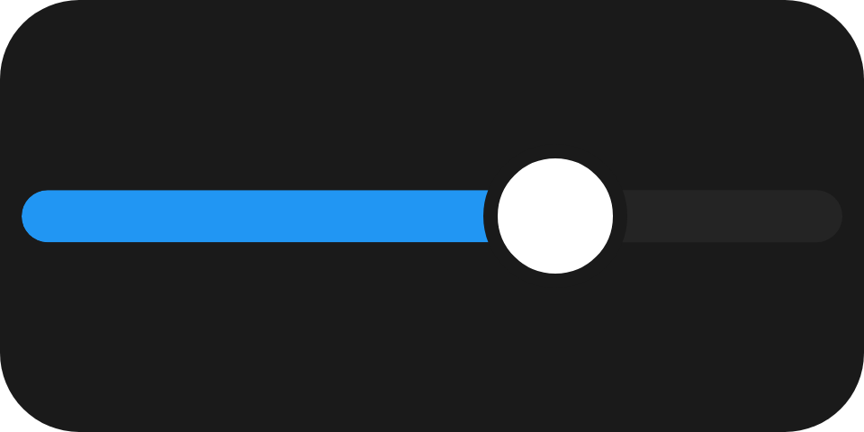

A draggable level: a rounded track carrying a filled span. It holds a fraction of the track in `0..1`,
not a value in your own units.

`ui.slider`

## Example

```csharp
new UiSlider
{
    Key = "volume",
    Fill = true,
    Level = UiValue.From(() => state.Value.Volume / 100.0),
    Step = 0.05,
    Thickness = UiSize.FromBasis(0.12, 0.55),
    Events =
    [
        UiEventHandler.On(UiComponentEvents.Adjust, data => Preview(data)),
        UiEventHandler.On(UiComponentEvents.Change, data => Apply(data)),
    ],
}
```



A horizontal volume track snapping to 5 % steps: `adjust` moves the display while dragging, `change`
commits the level the user landed on.

## Reading the level

```csharp
UiEventOutcome Apply(UiEventData data)
{
    if (!data.TryGetDouble(out var level))
    {
        return UiEventOutcome.Rejected("The event payload is not a number.");
    }

    state.Set(state.Value with { Volume = level * 100 });
    return UiEventOutcome.Accepted;
}
```

Both events carry the level as a bare number. Convert it to your own units yourself; a number beside the
slider is an ordinary `ui.text` you update.

## Adjust or change

Act on `change` alone for anything costly, such as a seek, and let `adjust` just move the level. Acting on
every `adjust` would drag the target through every waypoint; ignoring both would leave a control that does
not move.

## Vertical slider

```csharp
Direction = UiComponentDirections.Vertical,
```


`Direction` is the axis the level travels along, not the element's axis in its parent. Vertical runs
bottom to top - up is more.

## Colour and fallback

```csharp
LevelColor = "#2b6cee",
Fallback = new UiRangeBar { Key = "trackFallback", Start = 0, End = level, StartColor = "#2b6cee", EndColor = "#2b6cee" },
```

A reader without `ui.slider` draws the fallback, here the same level as a read-only range bar.

## Properties

| Property | Values | Default (absent) | Meaning |
|---|---|---|---|
| `Level` (`level`) | `0..1` | `0` | The filled fraction of the track. |
| `Step` (`step`) | fraction of the track | Continuous | The granularity the level snaps to. |
| `LevelColor` (`levelColor`) | `#rrggbb` | The reader's own accent colour | The filled span's colour. |
| `Direction` (`direction`) | `horizontal`, `vertical` | `horizontal` - unlike `ui.stack` | The axis the level travels along. |
| `Thickness` (`thickness`) | length | Left to the reader | The drawn track's thickness on the cross axis. |

`LevelColor` is a literal colour, not a theme role - see [Colours and text](/ui/concepts/theming/).

## Events

| Event | Fires when | Payload |
|---|---|---|
| `adjust` (`UiComponentEvents.Adjust`) | An intermediate level while the user is still working the control | The level, a bare number |
| `change` (`UiComponentEvents.Change`) | The interaction ended, sent once | The level, a bare number |
| `double-press` (`UiComponentEvents.DoublePress`) | A second tap completed shortly after the first, neither one a drag | None |

Declare `double-press` for an action on a double tap, such as resetting to a home level. Each tap is still an
ordinary interaction and sends its own `change` first, so the handler sees the level the second tap set and
replaces it. A reader that predates `double-press` never sends it, and the taps stay plain level changes.

## Children

None. `ui.slider` is a leaf.

## Layout

The element's whole box is the interactive surface; the drawn track is smaller. `Thickness` sizes only the
drawn track, not the element. On its parent's main axis the slider follows the ordinary rule - `MainSize`
or `Fill` if declared, otherwise its content extent. See [Sizing](/ui/concepts/sizing/).

## Reader behaviour

- **Interaction only where declared.** A node with no events carries no `events` property and is drawn as
  a level the user cannot touch; there is no disabled property.
- **The whole box takes input.** A pointer anywhere in it sets the level to its position projected onto
  `direction`, clamped to `0..1`; the cross-axis position is ignored. A pointer that leaves the box
  mid-drag keeps control until release.
- **Snapping:** with `step` present, the level becomes `round(level / step) * step`, clamped to `0..1`,
  before it is painted or sent. A tie rounds up.
- **Paint locally first:** the reader paints the level it computed straight away and reconciles with the
  producer afterwards.
- **Rate and order:** `adjust` at most ten times a second, never after the `change` that ended the
  interaction. Only declared names are sent.
- **Double tap:** with `double-press` declared, a tap released within 400 ms of the previous one and starting
  within 24 px of it, neither moving more than a few pixels, sends `double-press` right after its `change`.
  A drag or a cancelled gesture in between starts over.
- **Geometry is normative:** the track and thumb are implemented exactly; the fixtures in
  `ui-model/fixtures/component-profile/` resolve both at two sizes.

## See also

- [Range bar](/ui/components/range-bar/)
- [Events](/ui/concepts/events/)
- [State and bindings](/ui/concepts/state-and-bindings/)
