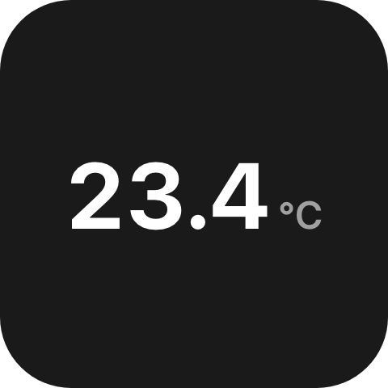

A single run of text, laid out with a line height of exactly one, so its box is exactly its font size.

`ui.text`

## Example

```csharp
new UiStack
{
    Key = "reading",
    Direction = UiComponentDirections.Horizontal,
    Align = UiComponentAlignments.Baseline,
    Gap = 0.02,
    Children =
    [
        new UiTextRun
        {
            Key = "value",
            Text = UiText.From(() => state.Value.Value),
            Size = 0.24,
            Weight = UiComponentTextWeights.Bold,
            Digits = 3,
        },
        new UiTextRun
        {
            Key = "unit",
            Text = "°C",
            Size = 0.1,
            Weight = UiComponentTextWeights.SemiBold,
            Role = UiComponentTextRoles.Secondary,
        },
    ],
}
```



A large live reading with its unit beside it, adapted from the built-in History graph widget.

## Live numeric readouts

```csharp
Text = UiText.From(() => state.Value.Value),
Digits = 2.5,
```

`Digits` reserves room for that many digit widths, so a value that gains or loses a digit does not push
its neighbours sideways. It is a count, not a length, and may be fractional: a decimal separator is
narrower than a digit.

## Shrinking to fit

```csharp
new UiTextRun { Key = "providerName", Text = label, Size = 0.044, MinSize = 0.034 }
```

The run shrinks from `Size` towards `MinSize` until it fits its box. Without `MinSize` it never shrinks
and ellipsizes instead.

## Wrapping

```csharp
new UiTextRun { Key = "label", Text = label, Wrap = UiValue.Of(true), MaxLines = 3 }
```

A run stays on one line unless `Wrap` is true. `MaxLines` caps how many lines it may use before it
ellipsizes.

## Colour

```csharp
Role = UiComponentTextRoles.Muted,        // follows the reader's theme
Color = "#ff8800",                        // a colour the user chose; wins over Role
```

Use `Role` for theme colours and `Color` only for a colour that is data. See
[Colours and text](/ui/concepts/theming/).

## Localized text

```csharp
Text = "Now playing",                     // literal
Text = Strings.NowPlaying(),              // your plugin's generated catalog
```

A localization reference resolves in each reader's own active language.

## Properties

| Property | Values | Default | Meaning |
|---|---|---|---|
| `Text` (`text`) | `UiText`: literal, computed or localized | Nothing is drawn | The content. |
| `Size` (`size`) | `UiSize` length | Left to the reader | The font size, which is also the run's line height. |
| `MinSize` (`minSize`) | `UiSize` length | Never shrinks; ellipsizes | The floor `Size` may shrink to so the run fits. |
| `Weight` (`weight`) | `UiComponentTextWeights`: `regular`, `medium`, `semibold`, `bold` | `regular` | The font weight. |
| `Role` (`role`) | `UiComponentTextRoles`: `primary`, `secondary`, `muted` | `primary` | The semantic colour, ignored when `Color` is set. |
| `Color` (`color`) | `#rrggbb` | `Role` decides | A literal colour that overrides `Role`. |
| `Align` (`align`) | `UiComponentAlignments`: `start`, `center`, `end`, `stretch`, `baseline` | `start` | Alignment within the run's own box. |
| `MaxLines` (`maxLines`) | `int` | One; no limit when `Wrap` is true | How many lines the run may occupy before it ellipsizes. |
| `Wrap` (`wrap`) | `bool` | One line, ellipsized | Whether the run may break across lines at all. |
| `FontFace` (`fontFace`) | Font catalogue identifier | The reader's default face | The typeface, from Macro Deck's font catalogue. |
| `Digits` (`digits`) | `double`, digit widths | Exactly as wide as the content | How many digit widths the run reserves. |
| `MainSize` (`mainSize`), `Fill` (`fill`) | See [Sizing](/ui/concepts/sizing/) | Sized by the reader | The run's extent along the parent stack's main axis. |

`Size` is the font, `MainSize` is the extent along the parent's main axis; setting one does not imply the
other.

## Events

None. `ui.text` is never interactive: a value it shows is patched by its producer, never entered by the
reader.

## Children

None. `ui.text` is a leaf.

## Layout

The cross-axis extent is always the line height - exactly the resolved `size` - whatever the parent
offers. Along the main axis a text takes `mainSize` or `fill` if declared, otherwise the reader's own
measurement.

Measured without a font, a text with neither `mainSize` nor `fill` takes **nothing** along the main axis.
So when a sibling fills a row, give every text in that row its own `mainSize`, or the filling sibling
takes their width too and pushes them out of the box. See [Sizing](/ui/concepts/sizing/).

## Reader behaviour

- Lay the run out with a line height of one; stack gaps are the only vertical spacing.
- Absent `wrap` means one line, ellipsized. A reader that does not know the key does the same, so the run
  stays inside its box.
- Reject any `color` that is not `#rrggbb`, and any `role` outside the listed values, rather than passing
  it through to the styling layer.
- `fontFace`: hold the run back until the face is usable, then reveal it - never draw a fallback face and
  swap. If the face never arrives, or the identifier cannot be resolved, reveal the run in the default face.
- `digits`: draw every digit on the same advance width, and centre the content in the reservation when it
  is narrower.

## See also

- [Colours and text](/ui/concepts/theming/)
- [Sizing](/ui/concepts/sizing/)
- [Time](/ui/components/time/) for clocks and timers that tick on the reader
- [Text field](/ui/components/text-field/) for text the user types
