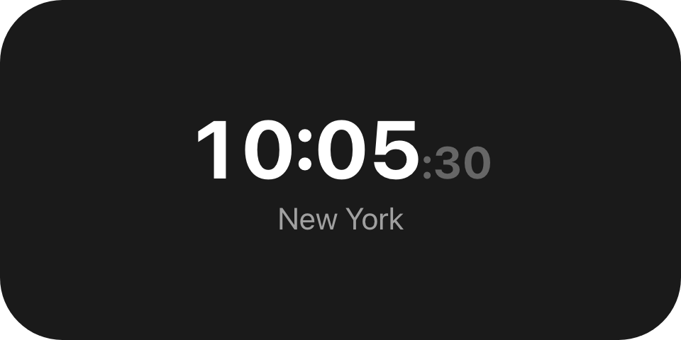
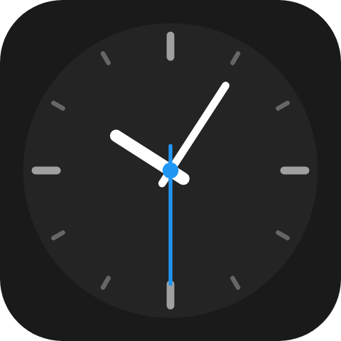

A digital time run and an analogue clock face. Both carry a time reference meaning "now, as the reader
sees it", so the tree is built once and every reader keeps it ticking on its own clock.

`macrodeck.dynamic-text`, `macrodeck.clock-dial`

## Example

```csharp
var reference = UiValue.Of(UiTimeReference.InZone("America/New_York"));

new UiDynamicText
{
    Key = "time",
    Value = reference,
    Format = UiTimeFormats.Time,
    Seconds = true,
    Size = 0.24,
    MinSize = 0.13,
    Weight = UiComponentTextWeights.Bold,
    Align = UiComponentAlignments.Center,
}
```


New York's time in the viewer's own language and hour cycle, with smaller muted seconds - the built-in
Clock widget's face. It costs no patch and keeps running while the connection is down.

## Time zones

```csharp
UiTimeReference.Now()                          // {"$time":{}}
UiTimeReference.InZone("Europe/Berlin")        // {"$time":{"zone":"Europe/Berlin"}}
```

A zone is an IANA id. Absent (or a null or empty id passed to `InZone`) means the reader's own zone.

## Captions for the zone

```csharp
new UiDynamicText { Key = "caption", Value = reference, Format = UiTimeFormats.ZoneName }
```



| Format | `America/New_York` | No zone |
|---|---|---|
| `zone-name` | `New York` | Empty |
| `zone-offset` | `UTC-05:00` in winter, `UTC-04:00` in summer | Empty |

A caption bound to either disappears when the reference has no zone, rather than echoing the reader's
own zone back.

## A 12/24-hour clock

```csharp
new UiDynamicText
{
    Key = "time",
    Value = reference,
    Format = UiTimeFormats.Time24Hour,
    RequiredComponentVersion = 2,
    Fallback = new UiDynamicText { Key = "timeLocalized", Value = reference, Format = UiTimeFormats.Time },
}
```

Pin a face only when the display must look the same on every device, and always through a named format,
never a pattern of your own. Every format except `time`, `date` and `zone-name` needs
`RequiredComponentVersion = 2` and a `time`/`date` fallback: negotiation catches unknown types, not unknown
values, so an older reader would otherwise draw an empty run.

| Format (`UiTimeFormats`) | 14:05 on 31 Dec 2025 |
|---|---|
| `time` (`Time`) | The reader's language and the user's app-wide 12h/24h/system preference |
| `time-12h` (`Time12Hour`) | `2:05 PM` - hour `1`-`12`, the reader's day period |
| `time-12h-padded` (`Time12HourPadded`) | `02:05 PM` - hour `01`-`12` |
| `time-24h` (`Time24Hour`) | `14:05` - hour `00`-`23` |
| `time-24h-unpadded` (`Time24HourUnpadded`) | `14:05`, but `9:05` rather than `09:05` - hour `0`-`23` |

## Dates

| Format (`UiTimeFormats`) | 31 Dec 2025 |
|---|---|
| `date` (`Date`) | Abbreviated weekday, day and month, ordered by the reader's language |
| `date-day-first` (`DateDayFirst`) | `31/12/25` |
| `date-month-first` (`DateMonthFirst`) | `12/31/25` |
| `date-iso` (`DateIso`) | `2025-12-31` |
| `date-long` (`DateLong`) | Full weekday and month names with the day, ordered by the reader's language |

## An analogue face

```csharp
new UiClockDial
{
    Key = "dial",
    Value = reference,
    Seconds = true,
    Fill = true,
    Fallback = new UiDynamicText { Key = "dialFallback", Value = reference, Format = UiTimeFormats.Time },
}
```



A dial degrades to a dynamic text, which in turn degrades to `ui.text`, so a reader that draws no dial
still shows the right time. `Color` tints the ticks and the hour and minute hands; the face, second
hand and hub keep the theme.

## Properties

### `macrodeck.dynamic-text`

| Property | Values | Default | Meaning |
|---|---|---|---|
| `Value` (`value`) | A time reference | Nothing is drawn | The instant to show. |
| `Format` (`format`) | A `UiTimeFormats` value | - | Which derivation to draw; an unknown value draws nothing. |
| `Seconds` (`seconds`) | `true`, `false` | `false` | Whether a `time*` run includes seconds. |
| `Size` (`size`) | A length | Left to the reader | The font size. |
| `MinSize` (`minSize`) | A length | Never shrinks; ellipsizes instead | The floor `size` may shrink to so the run fits. |
| `Weight` (`weight`) | A font weight | `regular` | The font weight. |
| `Role` (`role`) | A text role | `primary` | The semantic colour. |
| `Color` (`color`) | `#rrggbb` | The `role` colour | A literal run colour that overrides `role`. |
| `Align` (`align`) | A `UiComponentAlignments` value | `start` | Alignment within the run's own box. |

### `macrodeck.clock-dial`

| Property | Values | Default | Meaning |
|---|---|---|---|
| `Value` (`value`) | A time reference | Nothing is drawn | The instant the hands show. |
| `Seconds` (`seconds`) | `true`, `false` | `false` | Whether the second hand is drawn. |
| `Color` (`color`) | `#rrggbb` | Every mark keeps the theme | Tints both tick weights and the hour and minute hands. |

## Events

None. Both are read-only.

## Children

None - both are leaves.

## Layout

`macrodeck.dynamic-text` sizes exactly like `ui.text`: its box is its font size, with a line height of
one. `macrodeck.clock-dial` draws in `d`, the largest square that fits its box, centred rather than
stretched. Both follow the ordinary leaf rule on their parent stack's main axis. Full model:
[Sizing](/ui/concepts/sizing/).

## Reader behaviour

These are `macrodeck.*` types because a reader cannot draw them from the tree alone - it must resolve
`$time` against its own clock. The governing contract is
[ADR 0065](https://github.com/Macro-Deck-App/Macro-Deck/blob/main/engineering/decisions/0065-the-component-profile-authoring-contracts.md).

- `{"$time":{"zone":"..."}}` means the current instant on the reader's host-synchronised clock, read in
  that zone. Absent zone means the reader's own zone; an unrecognised zone falls back to the reader's own
  zone rather than failing the tree.
- A `$time` member must be an object and defines only `zone`, a string; anything else is rejected.
  `dynamic-text`'s `value` accepts only a time reference - never a progress reference.
- Separator, digit system, writing direction and day-period position come from the reader's language.
  `time`'s hour cycle follows the user's app-wide preference as supplied by the host, falling back to the
  reader's language; the pinned `time-*` formats ignore it.
- Every `time*` format draws seconds, with the separator before them, at `0.55` of the run's `size` in
  the `muted` role - even when `color` is set.
- Digits are drawn with equal advance width, so the run does not shift as it counts.
- `zone-name` is the last segment of the IANA id with underscores replaced by spaces; `zone-offset` is
  `UTC±hh:mm` at that instant. Both are empty with no zone.
- A reader draws nothing for a `format` it does not know. Only `time`, `date` and `zone-name` are
  guaranteed at component version 1.
- A reader that predates dial `color` draws a themed dial; `color` carries no version requirement.
- A dial re-evaluates at least once a second and computes hand angles from the whole second. No
  sub-second sweep - it is not derivable from the reference.
- Dial lengths are fractions of `d`. The fixtures in `ui-model/fixtures/component-profile/` resolve the
  face, tick and hand geometry and state the three hand angles for one named instant.

## See also

- [Progress](/ui/components/progress/) - the same idea for a playback position
- [Text](/ui/components/text/)
- [Components](/ui/components/)
- [Sizing](/ui/concepts/sizing/)
