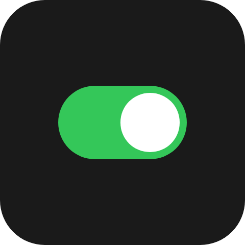

An on/off switch: a capsule track with a knob at one end. The user flips it; you receive the new state.

`ui.toggle`

## Example

```csharp
new UiToggle
{
    Key = "mute",
    On = UiValue.From(() => state.Value.Muted),
    LevelColor = "#34c759",
    Events = [UiEventHandler.On(UiComponentEvents.Change, data => SetMuted(data))],
    Fallback = new UiButton
    {
        Key = "muteFallback",
        Events = [UiEventHandler.On(UiComponentEvents.Press, () => ToggleMuted())],
        Children = [new UiTextRun { Key = "label", Text = UiText.From(() => state.Value.Muted ? "On" : "Off") }],
    },
}
```



## Reading the state

```csharp
UiEventOutcome SetMuted(UiEventData data)
{
    if (!data.TryGetBoolean(out var muted))
    {
        return UiEventOutcome.Rejected("The event payload is not a boolean.");
    }

    state.Set(state.Value with { Muted = muted });
    return UiEventOutcome.Accepted;
}
```

`change` carries the state the user switched to, as a JSON boolean - not a request to invert whatever you
hold. Set `On` from it, and the switch stays where the user put it.

## Holding the flip

A completed press flips the drawn switch at once and sends `change`. The reader holds that state until your
`On` changes or one second passes, the same reconciliation a [slider](/ui/components/slider/) uses. If you
reject the change or never update `On`, the switch returns to your value after that second.

## Properties

| Property | Values | Default (absent) | Meaning |
|---|---|---|---|
| `On` (`on`) | `bool` | Off | Whether the switch is on. |
| `LevelColor` (`levelColor`) | `#rrggbb` | The reader's own accent colour | The track's colour when on. |
| `Size` (`size`) | length | As high as the box allows | The track's height; the track is `1.75` times as wide. |
| `MainSize` (`mainSize`), `Fill` (`fill`) | - | - | Shared with every leaf - see [Sizing](/ui/concepts/sizing/). |

## Events

| Event | Fires when | Payload |
|---|---|---|
| `change` (`UiComponentEvents.Change`) | A press completed on the switch | The new state, a JSON boolean |

## Children

None. `ui.toggle` is a leaf.

## Layout

The element's whole box is the press surface; the drawn track is centred in it. On its parent's main axis
a toggle is `Size` long in a vertical parent and `1.75 * Size` in a horizontal one, unless `MainSize` or
`Fill` says otherwise. See [Sizing](/ui/concepts/sizing/).

## Reader behaviour

- **Geometry:** a capsule track `size` high (absent: `min(height, width / 1.75)`) and `1.75` times as wide,
  centred. A knob of diameter `0.8 * size`, inset `0.1 * size`, in the primary text colour, at the trailing
  end when on and the leading end when off. The track is `levelColor` or the accent colour when on, the
  tertiary surface colour when off.
- **Interaction only where declared.** Without `change` the switch is drawn and cannot be touched.
- **Press feedback:** with `change` declared, the reader paints its press tint on touch. The deck tile's own
  pressed state follows the switch only when the toggle is the root of the tree, as for a button.
- **A completed press** flips the drawn state, sends `change` once with the new state, and holds it until
  `on` changes or 1000 ms pass. A cancelled press sends nothing.
- **Keyboard and hardware:** in the Macro Deck desktop app, activating a tile whose first interactive node
  is a toggle flips it, exactly as a press does. The web client does not activate tree nodes from the
  keyboard.
- **Activation acts on the producer's value:** it negates the `on` the tree last carried, not a state the
  reader is still holding after a tap, and the drawn switch moves when the producer answers.
- A reader that does not know `ui.toggle` draws the node's `fallback`, typically a `ui.button` whose label
  says the state:

```json
{
  "type": "ui.toggle",
  "properties": { "on": true, "events": ["change"] },
  "fallback": {
    "type": "ui.button",
    "properties": { "events": ["press"] },
    "children": [{ "type": "ui.text", "properties": { "text": "On" } }]
  }
}
```

## See also

- [Segmented](/ui/components/segmented/)
- [Button](/ui/components/button/)
- [Events](/ui/concepts/events/)
- [State and bindings](/ui/concepts/state-and-bindings/)
