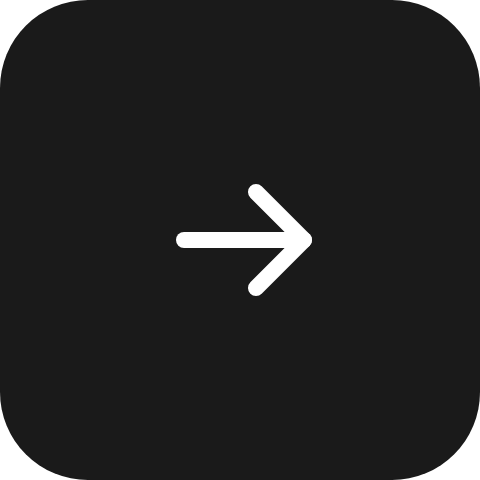

Draws its children like a [layer](/ui/components/stack-and-layer/) - every child across the whole box,
first one furthest back - then scales, rotates and shifts them together as one picture.

`ui.transform`

## Example

```csharp
new UiTransform
{
    Key = "needle",
    Rotation = UiValue.From(() => speed.Value * 1.8 - 90),
    OriginX = 0.5,
    OriginY = 0.9,
    Children = [new UiImage { Key = "needleArt", Source = needle }],
    Fallback = new UiTextRun { Key = "reading", Text = UiText.From(() => $"{speed.Value:0} km/h") },
}
```


A gauge needle pivoting near its bottom edge. Each update is a `set-properties` patch carrying `rotation`
alone; the reader redraws locally, with no new image per update.

## Rotating an icon

```csharp
new UiTransform { Key = "arrow", Rotation = 90, Children = [arrowIcon] }
```



`Rotation` is degrees, clockwise, about the pivot. The pivot defaults to the centre.

## Moving the pivot

```csharp
new UiTransform { Key = "hand", Rotation = 30, OriginX = 0.5, OriginY = 1.0, Children = [hand] }
```

```
     /        pivot at (0.5, 1.0):
    /         the hand turns about
   o          the middle of the bottom edge
```

`OriginX` and `OriginY` are fractions of the element's own width and height. A value outside `0..1`
puts the pivot outside the box.

## Scaling and nudging

```csharp
new UiTransform { Key = "art", Zoom = 1.2, OffsetX = 0.1, OffsetY = -0.05, Children = [artwork] }
```

Applied in a fixed order: `Zoom`, then `Rotation`, both about the pivot, then the offsets in the parent's
unrotated axes. These are the same keys a [button](/ui/components/button/) frames its artwork with; on a
button the artwork scales about its own centre within the ranges listed there, here it scales about the
pivot and any finite value is allowed.

## Nesting

```csharp
new UiTransform { Key = "dial", Rotation = dialAngle, Children = [face, new UiTransform { Key = "needle", Rotation = needleAngle, Children = [needle] }] }
```

Nested transforms compose.

## Properties

| Property | Values | Default | Meaning |
|---|---|---|---|
| `Rotation` (`rotation`) | `double`, degrees | `0` | The clockwise turn about the pivot. |
| `OriginX` (`originX`) | `double`, fraction of own width | `0.5` | Where the pivot sits across the box; outside `0..1` is outside the box. |
| `OriginY` (`originY`) | `double`, fraction of own height | `0.5` | Where the pivot sits down the box. |
| `Zoom` (`zoom`) | `double`, multiplier | `1` | Scales the content about the pivot; a value not greater than `0` means `1`. |
| `OffsetX` (`offsetX`) | `double`, fraction of own width | `0` | Shifts the content across, after zoom and rotation. |
| `OffsetY` (`offsetY`) | `double`, fraction of own height | `0` | Shifts the content down, after zoom and rotation. |
| `MainSize` (`mainSize`), `Fill` (`fill`), `Answer` (`answer`) | - | - | Shared with every container - see [Stack and layer](/ui/components/stack-and-layer/). |

## Events

None of its own.

## Children

Any element, any number. Transforms nest and compose.

## Layout

The transform is visual only. The node's own box, its size on the parent's main axis and its siblings are
laid out as if it were absent, and text inside it is fitted to its untransformed box. See
[Sizing](/ui/concepts/sizing/).

## Reader behaviour

- Apply `zoom`, then `rotation`, both about the pivot, then `offsetX`/`offsetY` in the parent's unrotated
  axes.
- Treat a `zoom` not greater than `0` as `1`; accept any finite value otherwise.
- Lay out and fit text as if the transform were absent.
- Clip nothing; an ancestor that clips, such as a tile or a button, still does.
- Presses hit the drawn shape. A `ui.slider` under a non-zero `rotation` has no defined pointer mapping.
- A reader that does not know `ui.transform` draws the node's `fallback`, so a gauge should carry one that
  still shows its reading:

```json
{
  "type": "ui.transform",
  "properties": { "rotation": 42, "originX": 0.5, "originY": 0.9 },
  "children": [{ "type": "ui.image", "properties": { "source": { "resourceId": "needle" } } }],
  "fallback": { "type": "ui.text", "properties": { "text": "42 km/h" } }
}
```

## See also

- [Stack and layer](/ui/components/stack-and-layer/)
- [Button](/ui/components/button/) - `zoom` and offsets on artwork
- [Slider](/ui/components/slider/)
- [Sizing](/ui/concepts/sizing/)
