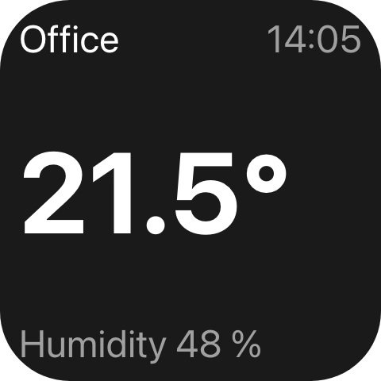
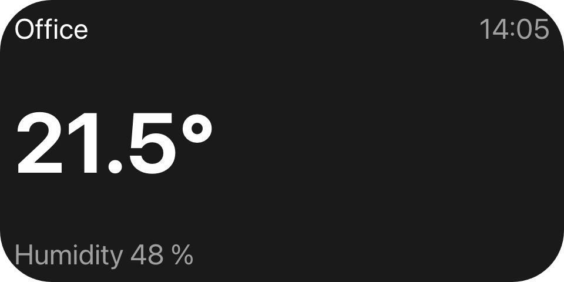
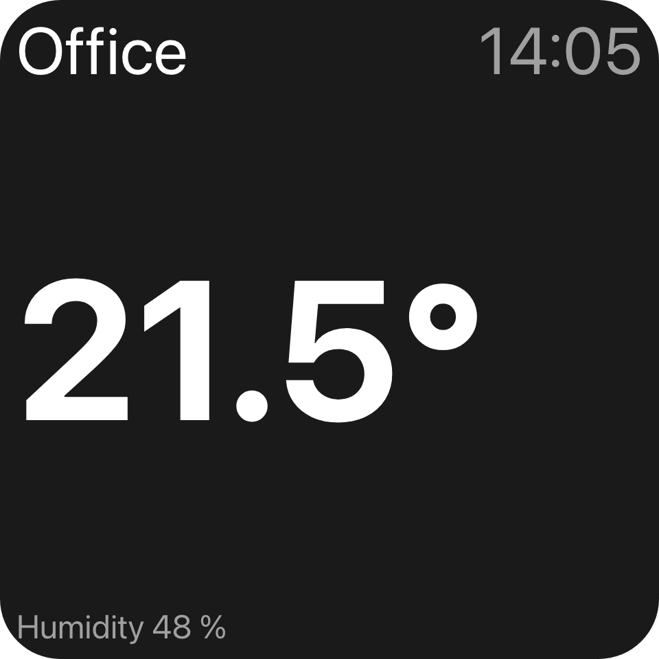
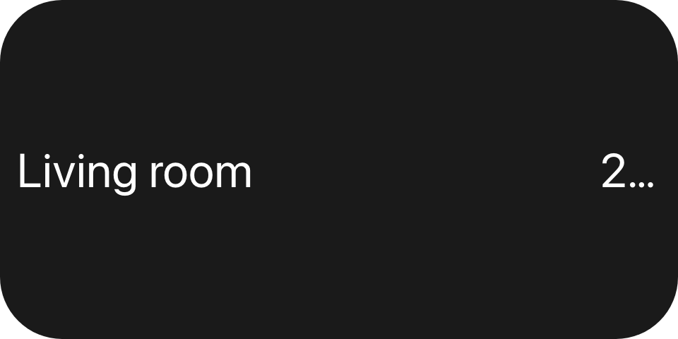
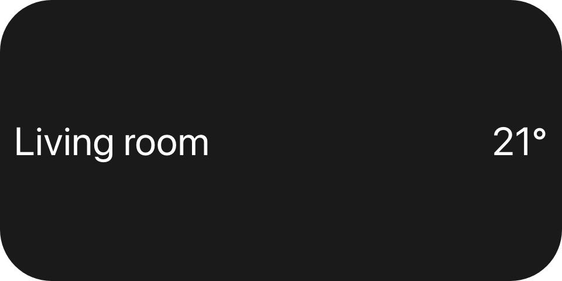

Every length is a fraction of the view's **basis** - the smaller side of its content box - so one tree is
correct at any size and a resize never costs a round-trip. (For device layout descriptors, see
[Layout providers](/features/layouts/).)

## Example

```csharp
new UiStack
{
    Key = "card",
    Justify = UiComponentJustify.SpaceBetween,
    Padding = safeArea,
    Children =
    [
        new UiStack
        {
            Key = "header",
            Direction = UiComponentDirections.Horizontal,
            Children =
            [
                new UiTextRun { Key = "room", Text = "Office", Size = 0.1, Fill = true },
                new UiTextRun { Key = "time", Text = "14:05", Size = 0.1, MainSize = 0.3, Align = UiComponentAlignments.End },
            ],
        },
        new UiTextRun { Key = "value", Text = "21.5°", Size = 0.3, Weight = UiComponentTextWeights.Bold },
        new UiTextRun { Key = "caption", Text = "Humidity 48 %", Size = UiSize.Capped(0.1, 12) },
    ],
}
```



A bare `double` is a fraction of the basis: `Size = 0.3` is a font 0.3 times the basis.

## One tree at three sizes





The same tree at 2x1 and 2x2. A 2x1 tile has the same basis as a 1x1 one, so only the filling header
grows. At 2x2 the basis doubles and so does every length - except the caption, whose cap stops it at 12
reference units.

## Capping a length

```csharp
Size = UiSize.FromBasis(0.144, 1.2)   // min(0.144 x basis, 1.2 x the stack's cross extent)
Size = UiSize.Capped(0.11, 13)        // min(0.11 x basis, 13 reference units)
```

`FromBasis(basis, maxOfCross)` stops a length outgrowing the row or column it sits in, such as a forecast
row's text once many rows share the height. `Capped(basis, extent)` stops it growing past a fixed size, so
a caption reads the same on a one-cell widget and a nine-cell one. A length carrying both caps resolves to
the smallest of the three.

The cap unit is `UiLength.Cell` (`120`): one deck cell in the reference space a deck widget is laid out in.
It is a definition, not a measurement - a reader lays the widget out in that space and scales the result to
the real cell - so it only has to agree across the wire, never with any device's pixels.

## Sharing a row: `Fill` and `MainSize`

```csharp
new UiTextRun { Key = "name", Text = "Living room", Size = 0.14, Fill = true },
new UiTextRun { Key = "temp", Text = "21°", Size = 0.14, MainSize = 0.3, Align = UiComponentAlignments.End },
```





`MainSize` is a child's extent along its parent's main axis; `Fill` takes whatever the siblings leave,
split evenly between filling children, and a child with a `MainSize` ignores `Fill`. A child with neither
is measured without a font: an image is its `Size`, a text is its line height across the stack and
**nothing along it**. So give every text in a row its own `MainSize` whenever a sibling fills - top
picture without it, bottom with it.

`Size` (the font) and `MainSize` (the slot) are different properties; set both on a text in a row.

## Gap and padding

```csharp
new UiStack { Key = "card", Padding = UiSize.FromBasis(0.06), Gap = UiSize.FromBasis(0.03), Children = [title, body] }
```

`Padding` insets every edge, `Gap` separates neighbours. Both are lengths like any other; absent means none.

## Frames and wrapping

```csharp
new UiModifier
{
    Key = "art",
    Fill = true,
    Frame = new UiFrame { MaxWidth = UiLength.OfBasis(0.6), AspectRatio = 1 },
    Child = new UiImage { Key = "cover", Source = cover },
}
```

A [modifier](/ui/components/modifier/) with a `Frame` fixes or clamps its own box and centres it in the
space it is given; `Padding` on a modifier insets its one child. Wrapping moves the child's slot to the
wrapper: `MainSize`, `Fill`, `ColumnSpan` and `RowSpan` go on the `UiModifier`, and a wrapped child that
sets them is rejected when the view is built. A filling wrapper's maximum clamps only its own size - the
space it gives up is not redistributed to its siblings.

## Reference

| Length | Resolves to |
|---|---|
| `0.2` / `UiSize.FromBasis(0.2)` / `UiLength.OfBasis(0.2)` | `0.2 x basis` |
| `UiSize.FromBasis(0.2, 0.5)` | `min(0.2 x basis, 0.5 x containing stack's cross extent)` |
| `UiSize.Capped(0.2, 20)` | `min(0.2 x basis, 20 reference units)` - `MaxOfCell = 20 / UiLength.Cell` |
| `UiSize.From(() => ...)` / `UiSize.Optional(...)` | computed each evaluation / may be absent |

| Property | On | Meaning |
|---|---|---|
| `Size` | text, image, time and progress text | Font size, or an image's extent. `MinSize` is the floor a text may shrink to before it ellipsizes. |
| `MainSize` | every element | Extent along the parent stack's main axis. Wins over `Fill`. |
| `Fill` | every element | Takes an even share of the parent's leftover main-axis space. |
| `Gap`, `Padding` | stack, button, list | Space between children, and inside every edge. |
| `Padding`, `Frame` | modifier | Inset of the one child, and the wrapper's own fixed or clamped box. |
| `Thickness` | slider, range and progress bar | Extent on the cross axis. |

Reader rules:

- A reader that cannot determine the containing stack's cross extent ignores `MaxOfCross` rather than
  guessing.
- `MaxOfCell` only means something where a deck cell grid exists. A reader laying a view out on anything
  else - a folder view, a browser window, a dialog - ignores it.
- `MainSize` and `Fill` mean nothing on a [layer](/ui/components/stack-and-layer/)'s children: each gets the
  whole box.

## See also

- [Stack and layer](/ui/components/stack-and-layer/)
- [Text](/ui/components/text/) - `Digits`, `MinSize`, wrapping
- [Chart](/ui/components/chart/) - normalised points and `PlotTop`
- [Theming](/ui/concepts/theming/)
