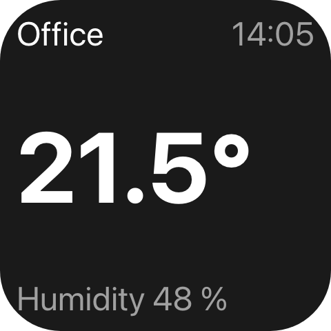
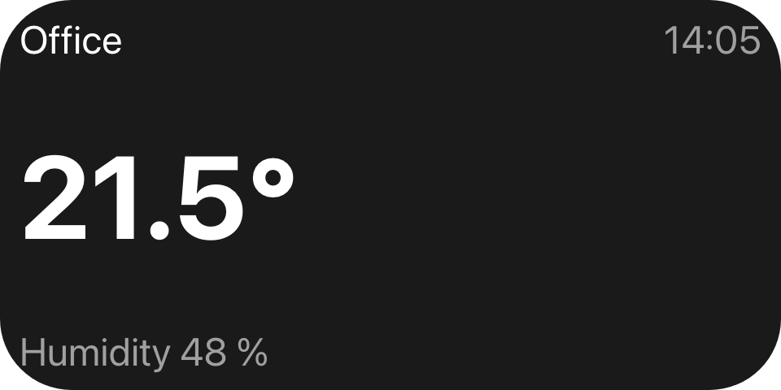
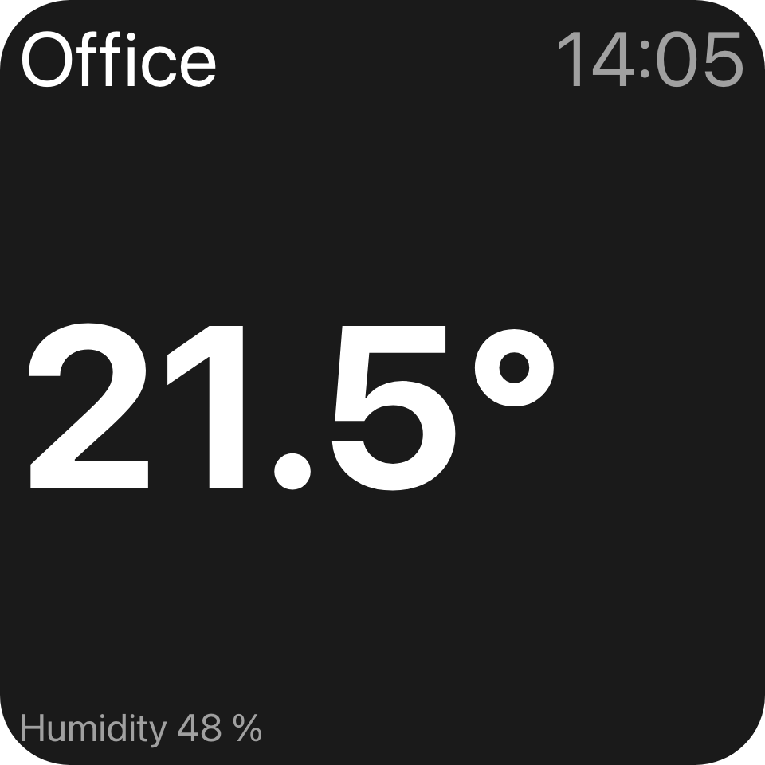
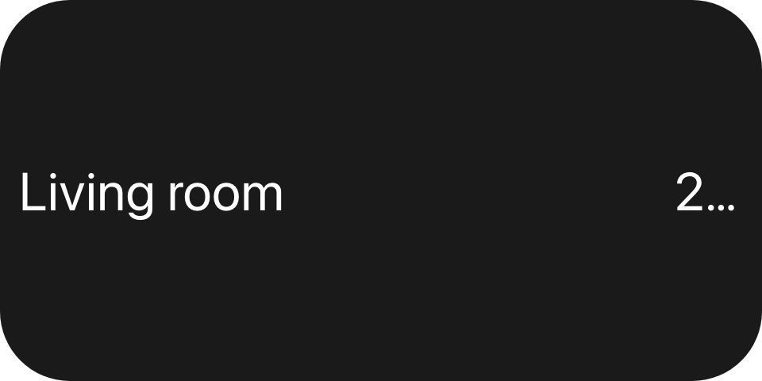
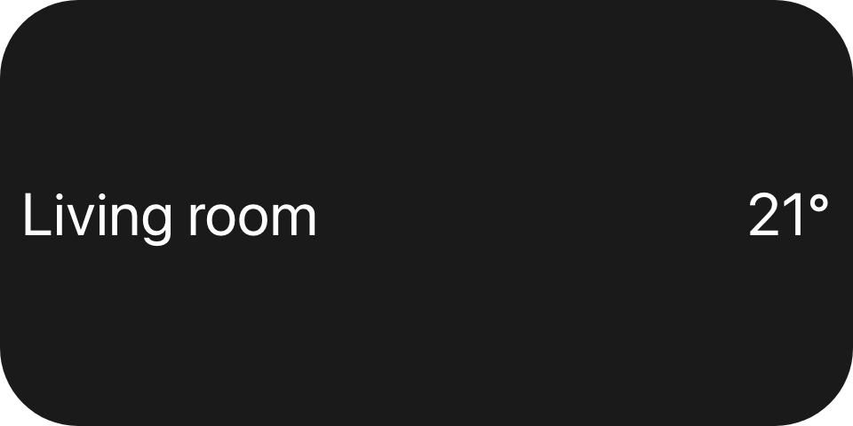

Every length is a fraction of the view's **basis** - the smaller side of its content box - so one tree is
correct at any size and a resize never costs a round-trip. (For device layout descriptors, see
[Layout providers](/features/layouts/).)

## Example

```csharp
new UiStack
{
    Key = "card",
    Justify = UiComponentJustify.SpaceBetween,
    Padding = safeArea,
    Children =
    [
        new UiStack
        {
            Key = "header",
            Direction = UiComponentDirections.Horizontal,
            Children =
            [
                new UiTextRun { Key = "room", Text = "Office", Size = 0.1, Fill = true },
                new UiTextRun { Key = "time", Text = "14:05", Size = 0.1, MainSize = 0.3, Align = UiComponentAlignments.End },
            ],
        },
        new UiTextRun { Key = "value", Text = "21.5°", Size = 0.3, Weight = UiComponentTextWeights.Bold },
        new UiTextRun { Key = "caption", Text = "Humidity 48 %", Size = UiSize.Capped(0.1, 12) },
    ],
}
```



A bare `double` is a fraction of the basis: `Size = 0.3` is a font 0.3 times the basis.

## One tree at three sizes





The same tree at 2x1 and 2x2. A 2x1 tile has the same basis as a 1x1 one, so only the filling header
grows. At 2x2 the basis doubles and so does every length - except the caption, whose cap stops it at 12
reference units.

## Capping a length

```csharp
Size = UiSize.FromBasis(0.144, 1.2)   // min(0.144 x basis, 1.2 x the stack's cross extent)
Size = UiSize.Capped(0.11, 13)        // min(0.11 x basis, 13 reference units)
```

`FromBasis(basis, maxOfCross)` stops a length outgrowing the row or column it sits in, such as a forecast
row's text once many rows share the height. `Capped(basis, extent)` stops it growing past a fixed size, so
a caption reads the same on a one-cell widget and a nine-cell one. A length carrying both caps resolves to
the smallest of the three.

The cap unit is `UiLength.Cell` (`120`): one deck cell in the reference space a deck widget is laid out in.
It is a definition, not a measurement - a reader lays the widget out in that space and scales the result to
the real cell - so it only has to agree across the wire, never with any device's pixels.

## Relative to the containing box

A fraction of the widget cannot size a part of a widget whose box depends on the widget's shape: a ring in a
grid of rings, whose stroke, icon and percentage have to scale with the ring. `UiLength.OfParent` is a
fraction of the **containing box** instead - the smaller side of the box the node's parent lays it out
within.

```csharp
new UiGrid
{
    Key = "rings",
    Columns = 4,                              // what a reader that cannot choose draws
    MinCellSize = UiLength.OfBasis(0.25),     // the reader chooses the columns
    Children = devices.Select(device => new UiLayer
    {
        Key = $"ring.{device.Id}",
        Children =
        [
            new UiGauge { Key = $"gauge.{device.Id}", Level = device.Level, Thickness = UiLength.OfParent(0.085, 0.01) },
            new UiIcon { Key = $"icon.{device.Id}", Icon = "battery", Size = UiLength.OfParent(0.3, 0.05) },
            new UiTextRun { Key = $"percent.{device.Id}", Text = $"{device.Percent} %", Size = UiLength.OfParent(0.18, 0.03) },
        ],
    }).ToArray(),
}
```

One tree draws the same rings at any widget size and shape, each device once: the plugin never learns the
size, and a resize costs no round-trip.

The containing box is, per parent:

| Parent | Containing box of its child |
|---|---|
| Grid | The cells the child spans, with the gaps between them |
| Layer, transform, responsive, first fit | The parent's own box |
| Stack | The stack's content box: its box minus its padding |
| Modifier | The modifier's frame box minus its padding |
| List | None - the scroll axis is open |

A length is `ParentFraction x min(width, height)` of that box in place of the `Basis` term, and
`MaxOfCross` and `MaxOfCell` still clamp the result. At the root of a view, a missing box counts as the
basis square.

**When the box is not definite.** Both sides of the containing box must be known. A child of a stack that
has neither `MainSize` nor `Fill` sits in an open main extent, so its children have no definite box; the
same goes for a list's children, and a grid under such a child. There the length resolves from `Basis`
against the widget instead, in measuring and in drawing alike. Give the node `MainSize` or `Fill` when a
length relative to its box is to work inside it.

**What older readers draw.** A reader that does not know `ofParent` ignores it and resolves `Basis` against
the widget, so pass the value that reads acceptably there as the second argument of
`UiLength.OfParent(fraction, fallbackBasis)`. The one-argument form uses the fraction itself, which on a part
of a small cell is far too large. There is no way to ask a reader whether it knows the member; for a real
older-reader picture, give the node a `Fallback` with a component version, as
[stack overflow](/ui/components/stack-and-layer/) does. When a helper copies a length, use `with` rather than
rebuilding it member by member, or the member is dropped.

## Sharing a row: `Fill` and `MainSize`

```csharp
new UiTextRun { Key = "name", Text = "Living room", Size = 0.14, Fill = true },
new UiTextRun { Key = "temp", Text = "21°", Size = 0.14, MainSize = 0.3, Align = UiComponentAlignments.End },
```





`MainSize` is a child's extent along its parent's main axis; `Fill` takes whatever the siblings leave,
split evenly between filling children, and a child with a `MainSize` ignores `Fill`. A child with neither
is measured without a font: an image is its `Size`, a text is its line height across the stack and
**nothing along it**. So give every text in a row its own `MainSize` whenever a sibling fills - top
picture without it, bottom with it.

`Size` (the font) and `MainSize` (the slot) are different properties; set both on a text in a row.

## When the children do not fit

A stack whose children ask for more than its box shrinks them to share the shortfall, so nothing leaves
the box. A stack that should keep its newest children whole instead - a chat feed, a log - sets
`Overflow = UiComponentOverflows.ClipStart`: its children keep their natural size, `Fill` on them is
ignored, and the first ones are cut off at the start. It still reports the sum of its children as its own
size, so give it `Fill` or a `MainSize` from its parent. It needs component version 2 and a fallback - see
[Stack and layer](/ui/components/stack-and-layer/#keeping-the-newest-children-at-the-end).

## Gap and padding

```csharp
new UiStack { Key = "card", Padding = UiSize.FromBasis(0.06), Gap = UiSize.FromBasis(0.03), Children = [title, body] }
```

`Padding` insets every edge, `Gap` separates neighbours. Both are lengths like any other; absent means none.

## Frames and wrapping

```csharp
new UiModifier
{
    Key = "art",
    Fill = true,
    Frame = new UiFrame { MaxWidth = UiLength.OfBasis(0.6), AspectRatio = 1 },
    Child = new UiImage { Key = "cover", Source = cover },
}
```

A [modifier](/ui/components/modifier/) with a `Frame` fixes or clamps its own box and centres it in the
space it is given; `Padding` on a modifier insets its one child. Wrapping moves the child's slot to the
wrapper: `MainSize`, `Fill`, `ColumnSpan` and `RowSpan` go on the `UiModifier`, and a wrapped child that
sets them is rejected when the view is built. A filling wrapper's maximum clamps only its own size - the
space it gives up is not redistributed to its siblings.

## Changing the layout with the size

Everything above scales one layout. When a 2x1 tile should put the icon beside the text instead of above it,
or a folder view should show more on a tablet than on a phone, give each size its own layout with
[`UiResponsive`](/ui/components/responsive/): the reader draws the one whose condition holds for the box, and
switches when the box changes. To choose by what the text needs rather than by the box, use
[`UiFirstFit`](/ui/components/first-fit/): the reader draws the first layout whose texts fit.

## Reference

| Length | Resolves to |
|---|---|
| `0.2` / `UiSize.FromBasis(0.2)` / `UiLength.OfBasis(0.2)` | `0.2 x basis` |
| `UiSize.FromBasis(0.2, 0.5)` | `min(0.2 x basis, 0.5 x containing stack's cross extent)` |
| `UiSize.Capped(0.2, 20)` | `min(0.2 x basis, 20 reference units)` - `MaxOfCell = 20 / UiLength.Cell` |
| `UiLength.OfParent(0.1, 0.01)` / `UiSize.FromParent(0.1, 0.01)` | `0.1 x` the smaller side of the containing box; `0.01 x basis` where that box is not definite or the reader does not know the member |
| `UiSize.From(() => ...)` / `UiSize.Optional(...)` | computed each evaluation / may be absent |

| Property | On | Meaning |
|---|---|---|
| `Size` | text, image, time and progress text | Font size, or an image's extent. `MinSize` is the floor a text may shrink to before it ellipsizes. |
| `MainSize` | every element | Extent along the parent stack's main axis. Wins over `Fill`. |
| `Fill` | every element | Takes an even share of the parent's leftover main-axis space. |
| `Gap`, `Padding` | stack, button, list | Space between children, and inside every edge. |
| `Padding`, `Frame` | modifier | Inset of the one child, and the wrapper's own fixed or clamped box. |
| `Thickness` | slider, range and progress bar | Extent on the cross axis. |

Reader rules:

- A reader that cannot determine the containing stack's cross extent ignores `MaxOfCross` rather than
  guessing.
- A reader that cannot determine a definite containing box, or whose parent is a list, resolves `ParentFraction`
  from `Basis` against the widget, and does so in measuring as well as in drawing.
- `MaxOfCell` only means something where a deck cell grid exists. A reader laying a view out on anything
  else - a folder view, a browser window, a dialog - ignores it.
- `MainSize` and `Fill` mean nothing on a [layer](/ui/components/stack-and-layer/)'s children: each gets the
  whole box.

## See also

- [Stack and layer](/ui/components/stack-and-layer/)
- [Text](/ui/components/text/) - `Digits`, `MinSize`, wrapping
- [Chart](/ui/components/chart/) - normalised points and `PlotTop`
- [Theming](/ui/concepts/theming/)
