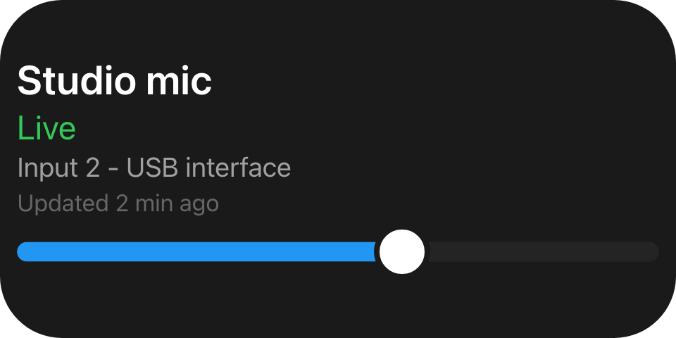
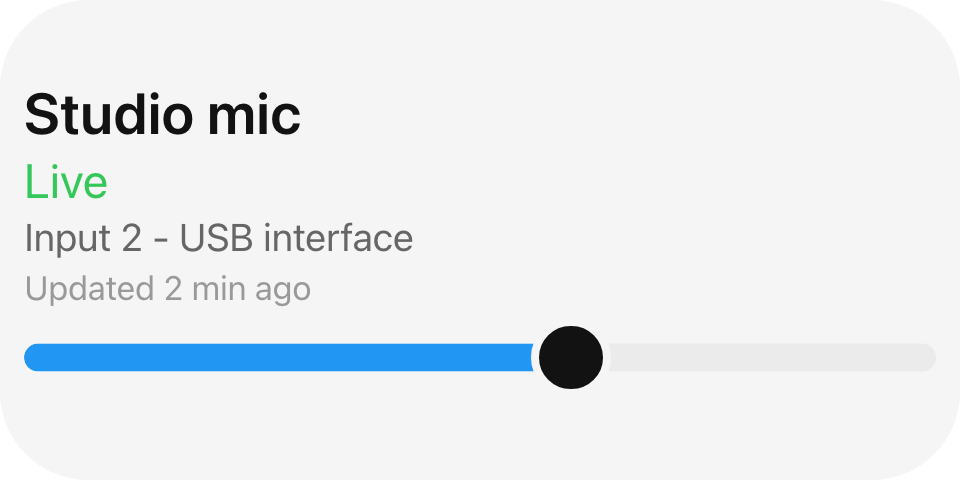

Name a **role** for anything the theme owns, and send a literal `#rrggbb` only for a colour that is data.

## Example

```csharp
new UiStack
{
    Key = "status",
    Justify = UiComponentJustify.Center,
    Gap = 0.03,
    Padding = safeArea,
    Children =
    [
        new UiTextRun { Key = "name", Text = "Studio mic", Size = 0.12, Weight = UiComponentTextWeights.SemiBold },
        new UiTextRun { Key = "state", Text = "Live", Size = 0.1, Color = "#34c759" },
        new UiTextRun { Key = "source", Text = "Input 2 - USB interface", Size = 0.08, Role = UiComponentTextRoles.Secondary },
        new UiTextRun { Key = "updated", Text = "Updated 2 min ago", Size = 0.07, Role = UiComponentTextRoles.Muted },
        new UiSlider { Key = "level", Level = 0.6, MainSize = 0.16, Thickness = UiSize.FromBasis(0.06) },
    ],
}
```





The same tree in the dark and light theme. Roles repaint with no help from your view; the literal green
does not; the slider has no `LevelColor`, so it paints the reader's own accent colour.

## Roles

| Role | Dark | Light | For |
|---|---|---|---|
| `UiComponentTextRoles.Primary` (`primary`) | `#ffffff` | `#121212` | The most prominent text. The default. |
| `UiComponentTextRoles.Secondary` (`secondary`) | `#a0a0a0` | `#666666` | Supporting detail. |
| `UiComponentTextRoles.Muted` (`muted`) | `#666666` | `#999999` | Incidental detail. |
| Accent (no role name - omit the colour) | user's choice | user's choice | The same in both themes. |

Values are the built-in themes' current tokens, shown for orientation: a reader resolves roles against its
own live theme, so do not copy them into your tree. Resolving the accent to hex and sending that would
freeze it against the reader's theme.

## Literal colours

```csharp
Color = "#34c759"        // accepted
Color = "#3c5"           // rejected: treated as absent
Color = "green"          // rejected: treated as absent
```

Send a literal only where the colour is data - a value's colour, or one a person picked - which must not
change when the reader switches theme. A reader accepts exactly `#` plus six hex digits and rejects any
other spelling rather than passing it to its styling layer, so the property behaves as if omitted.

| Property | Takes | Omitted means |
|---|---|---|
| `UiTextRun.Role` | a role | `primary` |
| `UiTextRun.Color` | `#rrggbb`, overrides `Role` | the role decides |
| `UiStack.Background`, `UiList.Background` | `#rrggbb` | paints nothing |
| `UiButton.Background` | `#rrggbb` | the reader's accent colour |
| `UiButton.BorderColor` | `#rrggbb` | the border style supplies its own colour |
| `UiSlider.LevelColor` | `#rrggbb` | the reader's accent colour |
| `UiChart.Color` | `#rrggbb` | the reader's accent colour |
| `UiProgressBar.StartColor`, `.EndColor` | `#rrggbb` | the reader's accent colour, each end on its own |
| `UiRangeBar.StartColor`, `.EndColor` | `#rrggbb` | no fill; the span needs both |
| `UiDynamicText.Role` / `.Color`, `UiProgressText.Role` | as `UiTextRun` | as `UiTextRun` |
| `UiClockDial.Color` | `#rrggbb` for the text-coloured marks | the marks keep the theme colours |
| `UiModifier.Background` | `#rrggbb`, or a linear or radial gradient of `#rrggbb` stops | the node's own background |
| `UiModifier.BorderColor` | `#rrggbb` | the reader's choice |

A gradient is data like any other literal: each stop is `#rrggbb` and none of them follows the theme.

A view paints no background unless a stack, list, button or modifier sets one; the surface behind it
belongs to the reader and follows its theme.

## Text

```csharp
new UiTextRun { Key = "title", Text = localizedTitle, Wrap = true, FontFace = fontId }
```

`Text` should be a localization reference, not a resolved string: `UiText` accepts a `LocalizedString`
and each client resolves it in its own language, so one shared session serves clients in different
languages and a language change is a client-side re-render.

Without `Wrap` a run stays on one line and ellipsizes, which is also what a reader that does not know the
key does. `FontFace` names a face in Macro Deck's font catalogue - an identifier, not a resource handle.
A reader holds the run back until the face is usable instead of swapping from a fallback, and shows it in
its default face if the face never arrives or cannot be resolved.

## See also

- [Localization](/features/localization/) - the catalogues `LocalizedString` draws from
- [Resources](/ui/reference/resources/) - how a `FontFace` identifier differs from a `UiResource`
- [Text](/ui/components/text/)
- [Sizing](/ui/concepts/sizing/)
