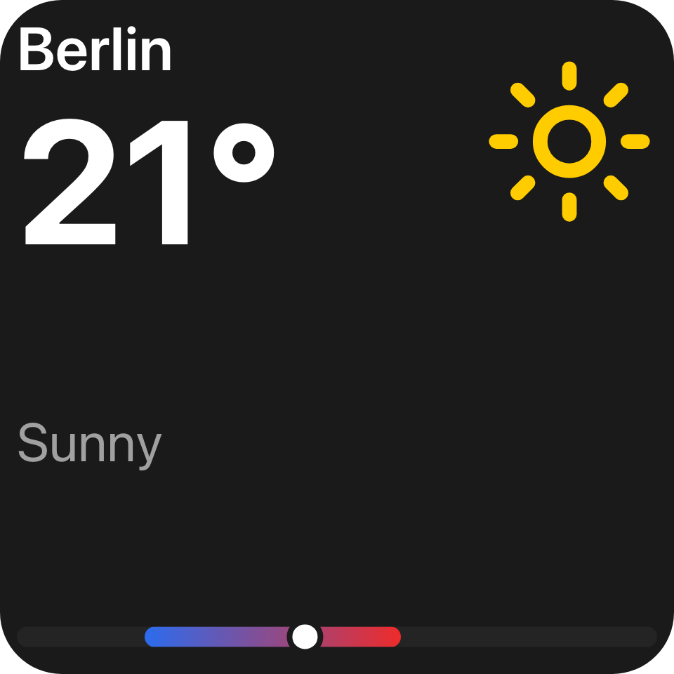

Macro Deck UI lets a plugin describe what a person sees and can act on - once, as a tree of keyed
elements - and Macro Deck renders that tree wherever it is needed: a config flow, an action's
configuration, a deck widget, a folder view or a modal dialog. The vocabulary is the same on every
surface; only the box it is drawn in changes.

## Install

```xml
<!-- Plugin project -->
<PackageReference Include="MacroDeck.Ui" Version="3.0.0" />

<!-- Test project -->
<PackageReference Include="MacroDeck.Ui.Testing" Version="3.0.0" />
```

| Package | What it is |
| --- | --- |
| `MacroDeck.Ui` | The declarative C# DSL and the reactive runtime. Use it to author a view. |
| `MacroDeck.Ui.Model` | The transport-neutral tree, event and patch contract. Use it directly only when you need the low-level contracts. |
| `MacroDeck.Ui.Testing` | Renders and asserts against a view headlessly. |

## A small view, end to end

```csharp
var muted = new UiState<bool>(false);

var tile = new UiButton
{
    Key = "mute",
    Justify = UiComponentJustify.Center,
    Background = UiValue.From(() => muted.Value ? "#ff3b30" : "#2c2c2e"),
    Events = [UiEventHandler.On(UiComponentEvents.Press, () => muted.Value = !muted.Value)],
    Children = [new UiTextRun { Key = "label", Text = UiText.From(() => muted.Value ? "Muted" : "Mute"), Size = 0.14 }],
};

var view = new UiView(request.Surface, tile);
```


A press flips `muted`; the button's face and label read it, so the view emits a patch for just those two
properties. `UiView` keeps the tree reactive; `UiViewBuilder.Build(surface, root)` makes a one-time tree
instead. Handing the view to Macro Deck is a separate step - see [Serving a view](/ui/views/sessions/). The
picture adds artwork to the same button - see [Button](/ui/components/button/).

## One vocabulary, two namespaces

Every node type is `ui.*` or `macrodeck.*`. A component is `macrodeck.*` when a reader cannot draw it from
the tree alone, because it must resolve a Macro Deck-defined reference - a time or a media position -
against its own clock. Everything else is `ui.*`, however Macro Deck-flavoured its styling. See
[ADR 0064](https://github.com/Macro-Deck-App/Macro-Deck/blob/main/engineering/decisions/0064-components-are-a-registry-over-two-namespaces.md).

## Where to go next



- **[Components](/ui/components/)** - the full `ui.*`/`macrodeck.*` catalog, one page per family.
- **[Views](/ui/views/)** - the surfaces a tree renders on: sessions, configuration, deck widgets, folder
  views, modals and the developer preview.
- **[Concepts](/ui/concepts/ui-model/)** - the tree/patch model, state and bindings, events, reactive
  updates, sizing and theming.
- **[Reference](/ui/reference/patches/)** - patch operations, resource handles and the compatibility
  contract across the three packages.

## See also

- [SDK reference](/reference/sdk-packages/)
- [Capabilities](/features/)
- [Testing plugins](/features/testing/)
- [ADR 0038](https://github.com/Macro-Deck-App/Macro-Deck/blob/main/engineering/decisions/0038-ui-model-and-declarative-dsl.md)
- [ADR 0065](https://github.com/Macro-Deck-App/Macro-Deck/blob/main/engineering/decisions/0065-the-component-profile-authoring-contracts.md)
