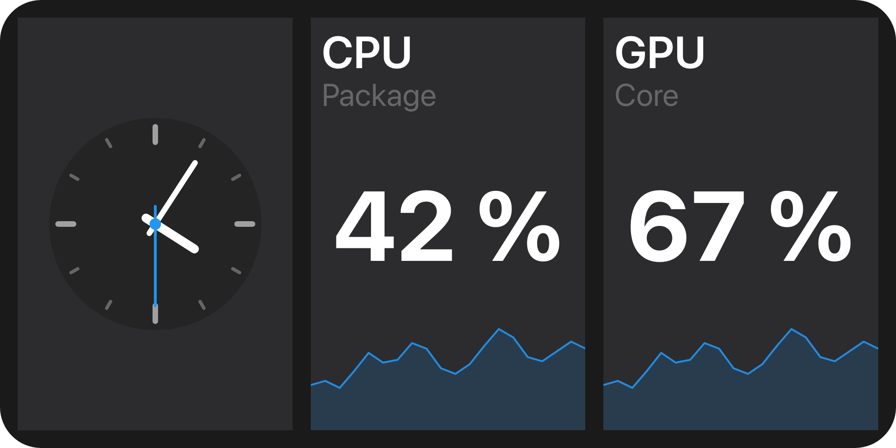

A folder view replaces a folder's widget grid with your own tree - a dashboard, a mixer, a monitoring
panel.

## Example

```csharp
public sealed class MonitorIntegration : IPluginIntegration, IFolderViewProvider, IUiProvider
{
    private string? _dashboard;

    public string ProviderName => "System monitor";

    public async Task InitializeAsync(IFolderViewProviderContext context, CancellationToken cancellationToken = default)
    {
        var registration = await context.RegisterFolderViewAsync(
            new FolderViewDescriptor(
                "dashboard",
                MyStrings.DashboardName(),
                MyStrings.DashboardDescription(),
                HasConfiguration: true),
            cancellationToken);

        _dashboard = registration.FolderViewId; // "com.example.monitor::dashboard"
    }

    public IReadOnlyList<UiSurfaceDeclaration> Surfaces { get; } =
    [
        new UiSurfaceDeclaration { Kind = UiSurfaceKinds.Folder, SessionMode = UiSessionModes.Shared },
        new UiSurfaceDeclaration { Kind = UiSurfaceKinds.Config, SessionMode = UiSessionModes.Exclusive },
    ];

    public Task<IUiSession?> CreateSessionAsync(UiSessionRequest request, CancellationToken cancellationToken)
    {
        var surface = request.Surface;
        var attributes = surface.Attributes;

        UiElement? root = surface.Kind switch
        {
            UiSurfaceKinds.Folder
                when attributes[UiFolderSurfaceAttributes.ViewId].GetString() == _dashboard
                => Dashboard(attributes[UiFolderSurfaceAttributes.Configuration]),
            UiSurfaceKinds.Config
                when attributes[UiConfigSurfaceAttributes.EntryPoint].GetString() == UiConfigEntryPoints.FolderViewConfig
                && attributes[UiConfigSurfaceAttributes.FolderViewId].GetString() == _dashboard
                => DashboardConfig(attributes[UiConfigSurfaceAttributes.FolderViewConfiguration]),
            _ => null,
        };

        return Task.FromResult<IUiSession?>(root is null ? null : new ViewSession(new UiView(surface, root)));
    }

    private static UiStack Dashboard(JsonElement configuration) => new()
    {
        Key = "dashboard",
        Direction = UiComponentDirections.Horizontal,
        Gap = 0.04,
        Padding = 0.04,
        Children =
        [
            new UiClockDial { Key = "clock", Value = UiValue.Of(UiTimeReference.InZone("Europe/Berlin")), Fill = true },
            Card("cpu", "CPU"),
            Card("gpu", "GPU"),
        ],
    };

    // IPluginIntegration members, Card and DashboardConfig omitted.
}
```



`ViewSession` is the adapter from [Serving a view](/ui/views/sessions/#example). A folder stays an ordinary
folder: its view is part of its configuration, picked like its name and changeable later without
touching anything else. Macro Deck's built-in view is the widget grid.

## Registering the view

```csharp
var registration = await context.RegisterFolderViewAsync(descriptor, cancellationToken);
// registration.FolderViewId == "com.example.monitor::dashboard"
```

The qualified id is what a folder stores. **Keep it stable across releases** - renaming it strands every
folder already using the view.

Registration is a push: register when you are ready, withdraw when you are not. `GetFolderViews()` only
lets Macro Deck recover its catalog after a reconnect, and is optional. There is no `ShutdownAsync` here:
release what `InitializeAsync` acquired in your integration's own `ShutdownAsync`, and Macro Deck
withdraws your views itself.

## Drawing the folder

```csharp
var viewId = attributes[UiFolderSurfaceAttributes.ViewId].GetString();
var configuration = attributes[UiFolderSurfaceAttributes.Configuration];
```

A `folder` surface carries `folderId`, `folderName`, `viewId` and `configuration`. The configuration
travels with the request because you cannot read Macro Deck's stored folders. Decline a view you do not
serve rather than guessing from the configuration's shape.

The tree is built from the same [components](/ui/components/) as a deck widget, with two consequences:

- **A folder view does not scroll.** Everything has to fit the box you are given.
- **Lengths are fractions of the box's smaller side.** A folder view is usually far wider than tall, so
  sizes track its height - see [Sizing](/ui/concepts/sizing/).

## Configuration

```csharp
UiSurfaceKinds.Config
    when attributes[UiConfigSurfaceAttributes.EntryPoint].GetString() == UiConfigEntryPoints.FolderViewConfig
```

With `HasConfiguration`, picking your view opens a `config` surface with the `folder-view-config` entry
point, inside the folder's own dialog rather than as a flow of its own. Build it with the
[configuration view](/ui/views/configuration/). It carries `folderId`, `folderViewId` and
`folderViewConfiguration`; `folderViewId` is the view being configured, which is not always the one the
folder currently stores - the user is choosing. The values are stored with the folder and handed back on
every later `folder` surface.

## Navigation is Macro Deck's

```csharp
new FolderViewDescriptor("mixer", "Mixer", Navigation: FolderViewNavigation.Hidden);
```

Macro Deck draws the back button and it always drives Macro Deck's own navigation stack - you cannot
redirect it and need not draw one. `Hidden` says your view has its own way out; it is a preference, not a
guarantee. Macro Deck still shows its button when the view is the only thing on screen and there is
somewhere to go back to, so a broken view can never trap anyone. At a root folder it draws no button,
whatever you asked for.

## When your integration is not running

```csharp
await context.UnregisterFolderViewAsync("dashboard", cancellationToken);
```

A folder keeps its view id and configuration whether or not anything provides them. Macro Deck renders a
placeholder naming the missing view, with links to the integrations page and the folder's settings. Nothing
is cleared, so re-enabling your integration brings the folder back exactly as it was - including after an
archive import on a machine without your plugin. Unregistering only stops the view being offered.

## Where a folder view can be chosen

The choice appears - in a folder's context menu and when creating one - only when more than one view is on
offer and the device claiming the profile can render one (`LayoutVisualCapabilities.CustomFolderViews`, see
[Layout providers](/features/layouts/)). A profile no device claims keeps the choice. So a registered view
may not be an option on some profile; nothing selects it there, so nothing opens a session for it.

## Over the plugin protocol

Registration is driven from the plugin side, so the host-to-provider direction of the
`folder-view-provider` capability only has to describe the provider and re-read its catalog after a
reconnect:

| Operation | Purpose |
| --- | --- |
| `describe` | The provider's declared name and its current catalog. |
| `folder-views` | The provider's current folder view catalog, re-read after a reconnect. |

Registering and withdrawing a view travels the other way as the `folder-views` host API:

| Operation | Purpose |
| --- | --- |
| `register` | Registers a folder view, or replaces one already registered under the same provider-local id. |
| `unregister` | Withdraws a folder view. Folders still using it keep their stored id and configuration and show a placeholder until it returns. |

The views themselves are served over the `ui` capability, like every other Macro Deck UI surface.

## See also

- [Widget types](/ui/views/widget-types/) - the same registration shape, one level down.
- [Layout providers](/features/layouts/)
- [Serving a view](/ui/views/sessions/)
- [Components](/ui/components/)
