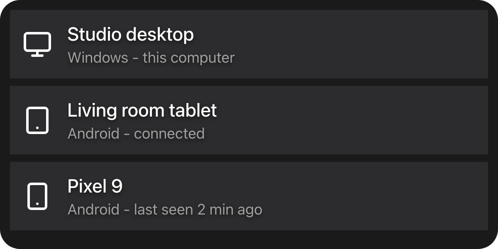

An action can put a dialog on the client that ran it and, when it needs one, wait for the answer.

## Example

```csharp
public async Task<ActionResult> ExecuteAsync(ActionExecutionContext context)
{
    if (context.Ui is null)
    {
        return ActionResult.Success();
    }

    var result = await context.Ui.ShowModalAsync<string>(
        context.OriginClientId,
        new ModalDefinition { ViewId = "device-picker", Title = MyStrings.SelectDevice() },
        context.CancellationToken);

    if (result.Cancelled)
    {
        return ActionResult.Success();
    }

    await TransferAsync(result.Value!, context.CancellationToken);
    return ActionResult.Success();
}
```

The dialog itself comes from your `IUiProvider`:

```csharp
public IReadOnlyList<UiSurfaceDeclaration> Surfaces { get; } =
[
    new UiSurfaceDeclaration { Kind = UiSurfaceKinds.Dialog, SessionMode = UiSessionModes.Exclusive },
];

public Task<IUiSession?> CreateSessionAsync(UiSessionRequest request, CancellationToken cancellationToken)
{
    var surface = request.Surface;
    if (surface.Kind != UiSurfaceKinds.Dialog
        || surface.Attributes[UiDialogSurfaceAttributes.ViewId].GetString() != "device-picker")
    {
        return Task.FromResult<IUiSession?>(null);
    }

    var picker = new UiList
    {
        Key = "devices",
        Gap = UiSize.FromBasis(0.015),
        Children = [.. _devices.Select(device => new UiButton
        {
            Key = device.Id,
            Answer = UiValue.Of(device.Id),
            Events = [UiEventHandler.On(UiComponentEvents.Press, () => { })],
            Children =
            [
                new UiTextRun { Key = "name", Text = device.Name, Size = UiSize.FromBasis(0.038) },
                new UiTextRun { Key = "detail", Text = device.Detail, Size = UiSize.FromBasis(0.03), Role = UiComponentTextRoles.Secondary },
            ],
        })],
    };

    return Task.FromResult<IUiSession?>(new ViewSession(new UiView(surface, picker)));
}
```



`ViewId` names one of your dialogs; Macro Deck opens a `dialog` surface for it against your provider.
`ViewSession` is the adapter from [Serving a view](/ui/views/sessions/#example). A `null` `context.Ui` means
the run was started by the backend - there is nobody to ask, which is not a failure.

## The dialog surface

A `dialog` surface carries `modalId`, `viewId` and whatever `Data` the action passed
(`UiDialogSurfaceAttributes`). Decline a `viewId` you do not serve rather than guessing. A dialog is
`exclusive`: it belongs to one client, so unlike a deck widget its tree may carry entered values.

## Completing a modal

```csharp
Answer = UiValue.Of(device.Id),
Events = [UiEventHandler.On(UiComponentEvents.Press, () => { })],
```

A pressed container that carries an `Answer` settles the dialog with that string. The client settles it
directly, so your session never sees that press. `Answer` works on any container that declares `press`;
it is an identifier, not a payload, so look anything else up on your side by it. At the protocol level,
a tree event named `modal.complete` also settles the dialog, with its payload as the value. Every other
event is routed to your session as usual.

`ShowModalAsync<T>` deserializes the value into `T`; a value that does not fit `T` is logged and reads as
a cancellation.

## Showing without waiting

```csharp
var opened = await context.Ui.ShowModalAsync(
    context.OriginClientId,
    new ModalDefinition
    {
        ViewId = "now-playing",
        Data = new Dictionary<string, JsonElement> { ["track"] = JsonSerializer.SerializeToElement("Nightcall") },
    },
    context.CancellationToken);
```

The non-generic overload is for a modal that shows something rather than asks something. It returns as
soon as the modal is open, with `true` if it opened.

## How a dialog is sized

Lengths are fractions of the box Macro Deck hands the dialog - see [Sizing](/ui/concepts/sizing/). The box
is a fixed size and does not grow to your tree, because a box that grew would feed the content's height
back into the basis it is measured against. A tree taller than its box scrolls vertically. It never
scrolls sideways: a tree wider than its box is an authoring mistake, and Macro Deck clips it.

## What bounds the wait

Check `Cancelled` before touching `Value`. **Everything that is not an explicit completion is a
cancellation** - the user dismissing it, the client disconnecting, the flow being cancelled, the session
faulting, the run reaching Macro Deck's maximum flow duration. So awaiting a modal cannot hang, and you
never have to tell "cancelled" from "never answered".

A flow that runs longer than a few seconds detaches and keeps running, which is what makes waiting on a
person viable. It still occupies one of the host's concurrent run slots while its modal is open, and a
client can only show a few modals at once. Do not hold a modal open as a substitute for a deck widget.

## See also

- [Serving a view](/ui/views/sessions/) - including the `modal.result` protocol operation.
- [List](/ui/components/list/)
- [Button](/ui/components/button/)
- [Events](/ui/concepts/events/)
