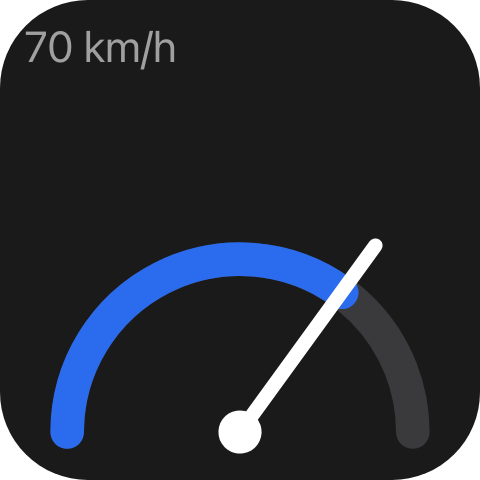

A widget type is a kind of tile a user can add to a deck, next to Macro Deck's six built-in ones.

## Example

```csharp
public sealed class GaugeIntegration : IPluginIntegration, IWidgetTypeProvider, IUiProvider
{
    private const string GaugeSchema = """
        {"type":"object","properties":{"unit":{"type":"string"}},"required":["unit"]}
        """;

    private string? _gaugeType;

    public string ProviderName => "Gauges";

    public async Task InitializeAsync(IWidgetTypeProviderContext context, CancellationToken cancellationToken = default)
    {
        var registration = await context.RegisterWidgetTypeAsync(
            new WidgetTypeDescriptor(
                "gauge",
                MyStrings.GaugeName(),
                MyStrings.GaugeDescription(),
                DefaultData: """{"unit":"km/h"}""",
                DataSchema: GaugeSchema,
                HasConfiguration: true),
            cancellationToken);

        _gaugeType = registration.WidgetTypeId; // "com.example.gauges::gauge"
    }

    public IReadOnlyList<UiSurfaceDeclaration> Surfaces { get; } =
    [
        new UiSurfaceDeclaration { Kind = UiSurfaceKinds.Widget, SessionMode = UiSessionModes.Shared },
        new UiSurfaceDeclaration { Kind = UiSurfaceKinds.Preview, SessionMode = UiSessionModes.Shared },
        new UiSurfaceDeclaration { Kind = UiSurfaceKinds.Config, SessionMode = UiSessionModes.Exclusive },
    ];

    public Task<IUiSession?> CreateSessionAsync(UiSessionRequest request, CancellationToken cancellationToken)
    {
        var surface = request.Surface;
        var attributes = surface.Attributes;

        UiElement? root = surface.Kind switch
        {
            UiSurfaceKinds.Widget or UiSurfaceKinds.Preview
                when attributes[UiWidgetSurfaceAttributes.WidgetType].GetString() == _gaugeType
                => GaugeView(70, attributes[UiWidgetSurfaceAttributes.Data].GetProperty("unit").GetString()!),
            UiSurfaceKinds.Config
                when attributes[UiConfigSurfaceAttributes.EntryPoint].GetString() == UiConfigEntryPoints.WidgetConfig
                && attributes[UiConfigSurfaceAttributes.WidgetType].GetString() == _gaugeType
                => GaugeConfig(attributes[UiConfigSurfaceAttributes.WidgetData]),
            _ => null,
        };

        return Task.FromResult<IUiSession?>(root is null ? null : new ViewSession(new UiView(surface, root)));
    }

    // IPluginIntegration members, GaugeView and GaugeConfig omitted.
}
```



`GaugeView` builds the dial from a [transform](/ui/components/transform/); `ViewSession` is the
adapter from [Serving a view](/ui/views/sessions/#example). Decline a type you do not serve rather than
guessing from the data's shape. A widget of your type is placed, moved, resized, exported and imported
like a built-in one, and drawn by the same UI runtime.

## Registering the type

```csharp
var registration = await context.RegisterWidgetTypeAsync(descriptor, cancellationToken);
// registration.WidgetTypeId == "com.example.gauges::gauge"
```

The qualified id is what every widget stores as its type. **Keep it stable across releases** - renaming it
strands every widget already on a deck - and never reuse it for a different widget.

Registration is a push: register when you are ready, and register again under the same local id to change
the name, default data, schema or configuration flag; placed widgets pick the new descriptor up untouched.
`GetWidgetTypes()` only lets Macro Deck recover its catalog after a reconnect, and is optional. There is no
`ShutdownAsync` here: release what `InitializeAsync` acquired in your integration's own `ShutdownAsync`,
and Macro Deck withdraws your types itself.

## Default data and schema

```csharp
DefaultData: """{"unit":"km/h"}""",
DataSchema: GaugeSchema,
```

`DefaultData` is the stored configuration a new widget starts with, as a JSON object; absent reads as
`{}`. `DataSchema` is a JSON Schema Macro Deck validates every save against, so configuration cannot write
a shape you cannot read back. It is optional for fixed data and **required when `HasConfiguration` is
true**. There is no icon: the picker draws a live sample instead.

## Drawing each tile

One session is opened per widget per viewer, so each tile sees only its own `data`. Push patches on the
session to update it; events its tree declares come back to that same session. Saved and draft data
arrive the same way, because you cannot read Macro Deck's stored widgets. By default a press runs nothing on
the host - a tile whose tree declares no events does nothing when pressed - unless the type
[runs the user's actions](#running-the-users-actions).

## The picker card

```csharp
UiSurfaceKinds.Preview // with attributes["sample"] == true
```

A picker card is a live `preview` surface with `sample: true`: draw a representative sample without
reading anything live. Serving it is optional - declining gets a card naming the type, and the type stays
pickable either way.

## Configuration

```csharp
UiSurfaceKinds.Config
    when attributes[UiConfigSurfaceAttributes.EntryPoint].GetString() == UiConfigEntryPoints.WidgetConfig
```

With `HasConfiguration`, editing a widget opens a `config` surface with the `widget-config` entry point.
Build it with the [widget configuration view](/ui/views/widget-configuration/), whose two regions Macro
Deck lays out around your tree. What the user enters is stored with the widget and handed back on every
later `widget` surface. No second contract is needed - one more surface on the same `IUiProvider`.

Without `HasConfiguration`, no `config` surface is ever opened for your type: editing one of its widgets
shows the preview and the JSON view, and nothing else.

## Running the user's actions

```csharp
new WidgetTypeDescriptor("battery", MyStrings.BatteryName(), DataSchema: BatterySchema, HasConfiguration: true)
{
    SupportsFlows = true,
}
```

A widget that only shows information can still work like a button. With `SupportsFlows`, Macro Deck runs the
widget's own action flows when its tile is pressed, the way it does for its built-in widgets: Short Press,
Long Press, Double Tap, Touch Start and Touch End each run the flow bound to that trigger. The flows come
from the top-level `flows` key of the widget's stored data, so give the user the actions editor bound
there in your configuration tree, and let your `DataSchema` allow the key:

```csharp
new UiActionsListEditor { Key = "flows", Binding = Bind.To(flows), CanRun = true }
```

```json
{"type":"object","properties":{"flows":{"type":"array"}}}
```

The [widget configuration view](/ui/views/widget-configuration/#reaching-an-editor-macro-deck-already-has)
covers the editor. Your tree keeps priority: a press that one of its controls declares is sent to that
control, as without the flag, and runs no flow.

- **Hardware decks never produce a Double Tap** for a widget of your type, only for built-in ones: a
  Double Tap flow runs from the desktop app and the web client. Set `UiActionsListEditor.Triggers` to the
  press tabs you want if that would confuse your users.
- **An older Macro Deck ignores the flag**, and presses of your widget run nothing there, as before.
- **While your type is not registered** - your plugin stopped or not installed - Macro Deck cannot tell
  that the type opted in, and a press of its widget is refused as it is for any unknown type.

The default is `false`, and a type that leaves it unset behaves exactly as described above.

## Standard appearance

```csharp
new WidgetTypeDescriptor("frame", MyStrings.FrameName(), DataSchema: FrameSchema, HasConfiguration: true)
{
    AppearanceProperties =
    [
        WidgetAppearanceProperty.BackgroundColor, WidgetAppearanceProperty.Label,
        WidgetAppearanceProperty.LabelColor, WidgetAppearanceProperty.Font,
    ],
}
```

A widget of your type can share the appearance settings of Macro Deck's own widgets. Every type gets a
**border**: Macro Deck draws the ring around the tile from the `border` key of the widget's stored data, and
the Set Border action writes it, with or without a declaration. `AppearanceProperties` adds any of
`BackgroundColor`, `Label`, `LabelColor`, `Font` and `AccentColor`. For each one you list, the widget appearance
actions (Set Background Color, Set Label, Set Label Color, Set Label Font, Set Accent Color) accept a widget of your
type and write the value to the stored data, under these keys:

| Key | Property | Value |
| --- | --- | --- |
| `border` | `Border`, `BorderColor` | `{ "style": "...", "color": "#rrggbb" }`. `style` is `off`, `static`, `heartbeat`, `breathing`, `blink`, `comet`, `ants`, `hue-shift` or `rgb`; without `color` the ring uses its default colour |
| `backgroundColor` | `BackgroundColor` | `#rrggbb` |
| `label` | `Label` | The text as entered |
| `labelColor` | `LabelColor` | `#rrggbb` |
| `fontFaceId` | `Font` | A face id from the host's font catalogue (the `macrodeck.fonts` option source) |
| `fontSize` | `Font` | Size as a whole-number percentage |
| `textAlign` | `Font` | `left`, `center` or `right` |
| `labelPosition` | `Font` | `top`, `center` or `bottom` |
| `accentColor` | `AccentColor` | `#rrggbb` |

`UiWidgetAppearanceKeys` holds the names. Clearing a setting removes its key. Other values of
`WidgetAppearanceProperty`, such as `Icon`, are ignored for a provider's type.

Macro Deck draws only the border. Draw the rest yourself: the change reopens your widget's session with the
new data, and `UiWidgetAppearance.Read` gives you the values:

```csharp
attributes.TryGetValue(UiWidgetSurfaceAttributes.Data, out var data);
var appearance = UiWidgetAppearance.Read(data);

var root = new UiButton
{
    Key = "frame",
    Background = appearance.BackgroundColor ?? "#1f2937",
    Children = [new UiTextRun { Key = "caption", Text = appearance.Label ?? string.Empty, Color = appearance.LabelColor ?? "#ffffff" }],
};
```

Your `DataSchema` has to allow the keys you declare. A property is offered for a widget only if the schema
accepts a plain sample value under its keys (`#000000`, `Label`, a font id with size 12, `center`), so keep
patterns, enums and ranges on these keys permissive, and a value your schema rejects, such as a label that fails a `pattern`, makes the action fail
instead of storing data your configuration could no longer save:

```json
{
  "type": "object",
  "properties": {
    "border": { "type": "object" },
    "backgroundColor": { "type": "string" },
    "label": { "type": "string" },
    "labelColor": { "type": "string" },
    "fontFaceId": { "type": "string" },
    "fontSize": { "type": "number" },
    "textAlign": { "type": "string" },
    "labelPosition": { "type": "string" },
    "accentColor": { "type": "string" }
  }
}
```

The [widget configuration view](/ui/views/widget-configuration/#standard-appearance-fields) has ready-made
fields for the same keys.

- **The label is stored as entered.** It may contain a `{{ ... }}` variable template, which Macro Deck
  renders only for its own Action Button. Show the text as it is, or render it yourself.
- **Hardware devices read these keys too.** A device plugin receives `label`, `labelColor`,
  `backgroundColor`, `fontSize`, `textAlign` and `labelPosition` for every widget, but not the font face.
- **Every change reopens your widget's session** with the new data, so a flow that changes an appearance
  setting every second rebuilds your tree every second.
- **While your type is not registered** - your plugin stopped, or still starting - its widgets offer the
  border only, and the other actions fail for them.
- **An older Macro Deck ignores the declaration** and offers the border only, as before.

## When your integration is not running

```csharp
await context.UnregisterWidgetTypeAsync("gauge", cancellationToken);
```

A widget keeps its type and data whether or not anything provides them - stored, exported and re-imported
unchanged, including on a machine where your plugin is not installed yet. When the type comes back, every
widget of it returns exactly as it was. Unregistering only stops the type being offered in the picker.
Macro Deck keeps your catalog entry across a mere disconnect, so a restarting plugin does not leave its
widgets nameless; the entry goes only when the integration is uninstalled or stopped.

## Over the plugin protocol

Registration is driven from the plugin side, so the host-to-provider direction of the
`widget-type-provider` capability only has to describe the provider and re-read its catalog after a
reconnect:

| Operation | Purpose |
| --- | --- |
| `describe` | The provider's declared name and its current catalog. |
| `widget-types` | The provider's current widget type catalog, re-read after a reconnect. |

Registering and withdrawing a type travels the other way as the `widget-types` host API:

| Operation | Purpose |
| --- | --- |
| `register` | Registers a widget type, or replaces one already registered under the same provider-local id. |
| `unregister` | Withdraws a widget type. Widgets already using it keep their stored type and data and wait for it to return. |

The widgets themselves are drawn, previewed and configured over the `ui` capability, like every other
Macro Deck UI surface.

## See also

- [Deck widget views](/ui/views/widget/) - the attribute keys in full.
- [Configuring a widget](/ui/views/widget-configuration/) - the two-region configuration tree.
- [Folder views](/ui/views/folder-views/) - the same registration shape, one level up.
- [Serving a view](/ui/views/sessions/)
