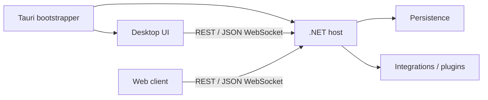

# Architecture

Macro Deck 3 consists of a .NET host, its clients, and a Tauri bootstrapper. The host owns application state and business logic. Clients render state and send commands. The bootstrapper manages the native window and host process.

## Components

The host under `host/src/` is authoritative for durable state, runtime state, integrations, authentication, transports, and background work. First-party clients must not maintain a second authoritative model.

The Angular workspace under `ui/angular/` contains the reusable `shared` library and the desktop configuration UI. The public web client under `ui/web-client/` uses no framework. Both consume `ui/runtime/`, the framework-free package that owns the domain models, the UI model, the host wire protocol and the shared stylesheets.

The Tauri bootstrapper under `ui/bootstrapper/` is the installed entry point. Packaged builds start or adopt the host, wait for it to become available, and open the desktop UI. Native window, updater, file-dialog, and shell integration belong here; application state does not.

## Host layering

The host separates Domain, Application, Infrastructure, and Host responsibilities. Dependencies point inward:

- Domain contains core models and rules.
- Application contains use cases, handlers, and contracts.
- Infrastructure implements persistence and external technical concerns.
- Host contains startup, REST/JSON WebSocket transports, and process integration.

Built-in integrations live in `MacroDeckHost.Integrations`. Code depends on narrow SDK capabilities or explicit ports rather than concrete integration implementations.

## Transports

REST and the UI JSON WebSocket handle first-party operations and live updates. Controllers and transport dispatchers translate messages and delegate work rather than containing business logic.

Out-of-process plugins use a separate versioned HTTP/WebSocket JSON protocol. Its contracts live in `protocol/src/MacroDeck.Plugin.Protocol`; the host implementation and plugin SDK must evolve without breaking older plugin consumers. See [ADR 0026](decisions/0026-plugin-protocol-and-sdk-boundary.md) and the [public protocol documentation](https://docs.macro-deck.app/reference/protocol/).

Internal transport/security notes are under [api/](api/).

## Trust model

The desktop UI uses a trusted loopback listener. Remote clients use the public listener and normal authentication. Loopback address alone is not sufficient to grant trust; the listeners are deliberately separated.

Transport shortcuts such as Android ADB reverse tunnels must terminate on the public listener so they cannot inherit desktop-loopback trust. See [ADR 0030](decisions/0030-android-usb-connections-over-adb.md).

The public listener can use HTTP or HTTPS according to the resolved network configuration. See [ADR 0040](decisions/0040-public-listeners-and-tls.md).

The host advertises its plain-HTTP public listener on the LAN as `_macrodeck._tcp` through the operating system's own mDNS responder, so the companion app finds it without scanning. See [ADR 0082](decisions/0082-lan-discovery-uses-the-platform-responder.md).

Backup archives concentrate the same secrets this trust boundary protects - the Data Protection key ring, the TLS and token signing keys, and every stored secret - encrypted under a key stored only on this installation. Backup download, import, and restore are therefore loopback-only, the same restriction setup and plugin pairing already have. The key ring itself is wrapped by a key held in the platform keystore and escrowed under that same recovery key, so the recovery key is the one root both an archive and the live installation depend on. See [ADR 0047](decisions/0047-secrets-backups-and-restore.md).

## Persistence and state changes

Durable changes should validate, update the owning model/service, persist consistently, update runtime state, and publish the resulting event without leaving memory and storage divergent.

Portable import/export formats are public/versioned contracts and remain independent of the internal persistence layout.

## Cloud identity

The Macro Deck Connect session is host-owned like any other durable state. Its contracts live in the
Application layer, its OIDC client, credential store and refresh state machine in Infrastructure, and
clients read a snapshot over REST and re-read it when the host says the state changed.

Sign-in uses the device code grant, which carries no redirect URI, so it can be started from wherever
the desktop UI is being used rather than only from a browser on the host machine.

Account services are never on the critical path. The host starts, renders the signed-in account from
cached profile data, and refreshes in the background; an unreachable Identity marks the session
offline and changes nothing else. See [ADR 0054](decisions/0054-connect-session-is-a-host-owned-refresh-credential.md).

## Background work

Long-running work belongs in hosted services or integration-owned lifecycle components. It must support cancellation, avoid unbounded polling, isolate provider failures, and release resources during shutdown.

## Decisions

Project-wide choices that are costly to reverse are recorded in [Architecture Decision Records](decisions/README.md). ADRs document the reason for a constraint, the chosen direction, and its consequences. Local implementation detail belongs in code, tests, or the relevant guide.
