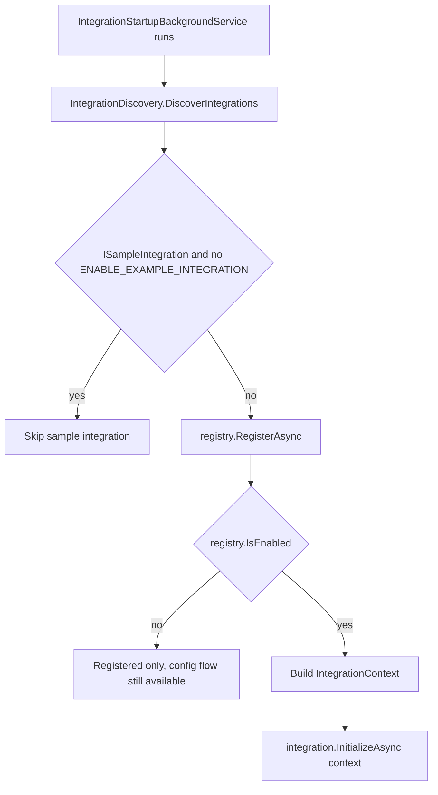
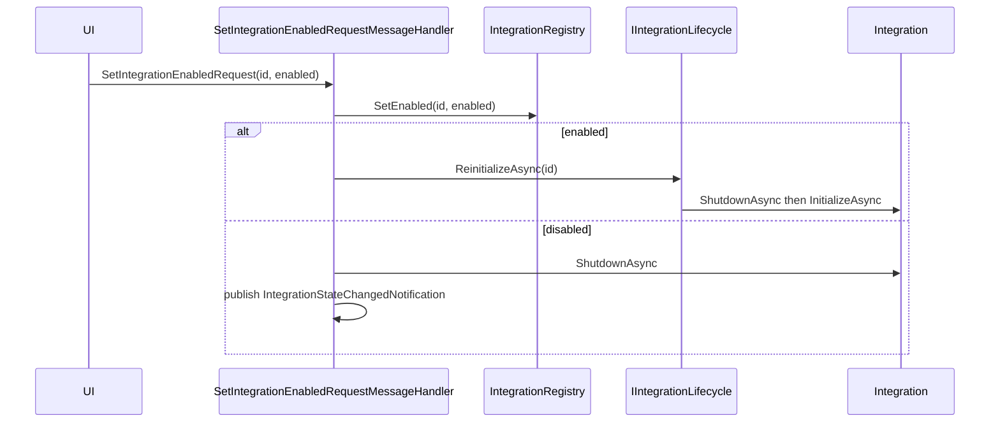

# Contributing an integration

A hands-on guide to building a new built-in integration for Macro Deck 3 - the integration class, opting into host capabilities, discovery and lifecycle, config flows, and the testing rules a contribution must satisfy.

A hands-on guide to building a new built-in integration for Macro Deck 3. It covers the integration class, opting into host capabilities, how the host discovers and runs integrations, configuration flows, and the testing and architecture rules a contribution must satisfy.

Built-in integrations live in `host/src/MacroDeckHost.Integrations` and are compiled against the Integration SDK in `sdk/src/MacroDeck.Sdk`. If you are new to the SDK contracts, start with the plugin overview in the [Introduction](https://docs.macro-deck.app/introduction/getting-started/) and keep the [SDK reference](https://docs.macro-deck.app/reference/sdk-packages/) open for the exact type signatures.

An integration is a plain class that implements [`IIntegration`](https://github.com/Macro-Deck-App/Macro-Deck/blob/main/sdk/src/MacroDeck.Sdk/IIntegration.cs) and, optionally, one or more capability provider interfaces. The host never holds a compile-time reference to any concrete integration: everything is discovered by reflection at startup. The project already ships several worked examples under `host/src/MacroDeckHost.Integrations` (`Spotify`, `Obs`, `Discord`, `Streamerbot`, `Twitch`, `Keyboard`, `Mouse`, `Deck`, `Scripts`, `SinusBot`, `System`, `Weather`, `Http`, `Example`).

> Scope: this page is about adding an integration that uses capabilities the host already understands. Adding a brand new capability (a new provider interface plus its host registry) is a separate exercise that mirrors `IMusicPlayerProvider` / `MusicPlayerRegistry`; see the [capabilities reference](https://docs.macro-deck.app/features/).

---

## Where an integration lives

New integrations must be implemented inside the `MacroDeckHost.Integrations` project. That project references only the SDK and a small set of integration-specific NuGet packages:

```xml
<ProjectReference Include="..\..\..\sdk\src\MacroDeck.Sdk\MacroDeck.Sdk.csproj" />
```

See [`MacroDeckHost.Integrations.csproj`](https://github.com/Macro-Deck-App/Macro-Deck/blob/main/host/src/MacroDeckHost.Integrations/MacroDeckHost.Integrations.csproj). Two other project settings matter for integration authors:

- `*.svg` and `*.png` files are compiled in as `EmbeddedResource`. Brand icons are loaded from the assembly at runtime rather than from disk (see Step 5).
- `InternalsVisibleTo` is granted to `MacroDeckHost.Tests.UnitTests`, so internal helpers can be tested directly.

Put your integration in its own folder, for example `host/src/MacroDeckHost.Integrations/MyThing/`, and keep all of its types (actions, config flow, clients) inside that folder.

---

## Step 1: The integration class

Create one class that implements `IIntegration` and annotate it with `[MacroDeckIntegration]`. The [Example integration](https://github.com/Macro-Deck-App/Macro-Deck/blob/main/host/src/MacroDeckHost.Integrations/Example/ExampleIntegration.cs) is the minimal template.

```csharp
[MacroDeckIntegration]
public class ExampleIntegration : IIntegration, IVariableProvider, IConfigFlowProvider, ISampleIntegration
{
	public string Id => "app.macro-deck.example";
	public LocalizedText Name => "Example Integration";
	public string Version => "1.0.0";
	public bool IsInitialized { get; private set; }

	public IReadOnlyList<IActionDefinition> Actions { get; } = [ /* ... */ ];

	public Task InitializeAsync(IIntegrationContext context)
	{
		IsInitialized = true;
		return Task.CompletedTask;
	}

	public Task ShutdownAsync() => Task.CompletedTask;
}
```

The `IIntegration` contract ([`IIntegration.cs`](https://github.com/Macro-Deck-App/Macro-Deck/blob/main/sdk/src/MacroDeck.Sdk/IIntegration.cs)) is:

| Member | Purpose |
| --- | --- |
| `Id` | Stable, globally unique id. Use reverse-DNS style, e.g. `app.macro-deck.weather`. This id namespaces the integration's variables, config entries, and provider-local ids. |
| `Name` | Human-readable name shown in the UI. |
| `Version` | Integration version string. |
| `Actions` | The action definitions this integration exposes (may be empty). |
| `InitializeAsync(context)` | Called by the host when the integration is loaded. Set up clients, load config, start background loops. |
| `ShutdownAsync()` | Called when the integration is unloaded (disabled, reconfigured, or host shutdown). Stop and dispose everything you started. |
| `IsInitialized` | Reports whether initialization completed. |

Important details:

- `[MacroDeckIntegration]` ([`MacroDeckIntegrationAttribute.cs`](https://github.com/Macro-Deck-App/Macro-Deck/blob/main/sdk/src/MacroDeck.Sdk/MacroDeckIntegrationAttribute.cs)) is a bare discovery marker with no constructor arguments. The id, name, and version are the `Id`, `Name`, and `Version` properties, not attribute parameters.
- The class must have a public parameterless constructor. The host instantiates it with `Activator.CreateInstance`, so constructor injection is not available; resolve runtime dependencies through the `IIntegrationContext` passed to `InitializeAsync` instead.
- `ISampleIntegration` ([`ISampleIntegration.cs`](https://github.com/Macro-Deck-App/Macro-Deck/blob/main/sdk/src/MacroDeck.Sdk/ISampleIntegration.cs)) is only for demo integrations. It keeps the class from loading in normal runs (see Step 3). Do not implement it on a real integration.
- Expose the id as a `public const string IntegrationId` and return it from `Id`. Config entry ids, provider-local ids and the integration's logger all reference it, and a literal repeated across files is how those drift apart.

**Log through your own logger.** Do not call Serilog's static `Log`: obtain the integration's logger from `IntegrationLog` so every entry carries the integration id and the log viewer can group by integration.

```csharp
private static readonly ILogger _logger =
	IntegrationLog.For<ExampleIntegration>(ExampleIntegration.IntegrationId);
```

See [Logging in the SDK reference](https://docs.macro-deck.app/reference/sdk-packages/#logging) for the full surface.

---

## Step 2: Opt into capabilities

A capability is a provider interface the integration also implements. The host discovers capabilities the same way it discovers integrations: it enumerates enabled integrations and filters by interface. You never register a capability manually; implementing the interface is enough for the corresponding host registry to pick it up.

| I want to add | Implement | Host component that picks it up |
| --- | --- | --- |
| Variables - a small declared set, a browsable runtime catalog, or both | [`IVariableProvider`](https://github.com/Macro-Deck-App/Macro-Deck/blob/main/sdk/src/MacroDeck.Sdk/Variables/IVariableProvider.cs) | `VariableRegistry` plus variable polling; `VariableCatalogProviders` for the catalog half |
| A music player (typically one per configured account) | [`IMusicPlayerProvider`](https://github.com/Macro-Deck-App/Macro-Deck/blob/main/sdk/src/MacroDeck.Sdk/MusicPlayer/IMusicPlayerProvider.cs) | `MusicPlayerRegistry` |
| A weather station (one per configured location) | [`IWeatherProvider`](https://github.com/Macro-Deck-App/Macro-Deck/blob/main/sdk/src/MacroDeck.Sdk/Weather/IWeatherProvider.cs) | `WeatherRegistry` |
| A multi-step setup UI | [`IConfigFlowProvider`](https://github.com/Macro-Deck-App/Macro-Deck/blob/main/sdk/src/MacroDeck.Sdk/ConfigFlow/IConfigFlowProvider.cs) | `ConfigFlowManager` |
| A brand icon | [`IIntegrationIconProvider`](https://github.com/Macro-Deck-App/Macro-Deck/blob/main/sdk/src/MacroDeck.Sdk/IIntegrationIconProvider.cs) | Host icon media endpoint; registries expose a `hasIcon` flag |
| Health/issue badges plus a fix action | [`IIntegrationIssueProvider`](https://github.com/Macro-Deck-App/Macro-Deck/blob/main/sdk/src/MacroDeck.Sdk/Issues/IIntegrationIssueProvider.cs) | `IntegrationIssueService` |
| Read-only ready-made profiles | [`IProfileProvider`](https://github.com/Macro-Deck-App/Macro-Deck/blob/main/sdk/src/MacroDeck.Sdk/Profiles/IProfileProvider.cs) | `ProfileRegistry` |
| Actions on buttons | `IActionDefinition` entries in `IIntegration.Actions` | `IntegrationRegistry.FindAction` plus the action executor |

The host registries live under `host/src/MacroDeckHost.Application` (for example `MusicPlayer/MusicPlayerRegistry.cs`, `Weather/WeatherRegistry.cs`, `Variables/VariableRegistry.cs`, `Profiles/ProfileRegistry.cs`, `Integrations/IntegrationIssueService.cs`). Each of them enumerates `IIntegrationRegistry.Integrations`, filters by the capability interface, and only considers integrations that are currently enabled.

Deck navigation is not a provider interface: every integration receives an `IDeckNavigator` through `IIntegrationContext.Deck` and can use it directly. The same is true of scripts - `IIntegrationContext.Scripts` lists the user's scripts and runs one to completion.

Capabilities compose freely. `ExampleIntegration` is both an `IVariableProvider` and an `IConfigFlowProvider`; `WeatherIntegration` is an `IWeatherProvider`, `IVariableProvider`, `IConfigFlowProvider`, and `IIntegrationIconProvider` at once. For the per-capability contracts (method signatures, lifecycle, threading expectations) see the [capabilities reference](https://docs.macro-deck.app/features/).

---

## Step 3: How the host discovers and runs an integration

Discovery and lifecycle are driven by [`IntegrationStartupBackgroundService`](https://github.com/Macro-Deck-App/Macro-Deck/blob/main/host/src/MacroDeckHost.Infrastructure/BackgroundServices/IntegrationStartupBackgroundService.cs), a hosted service that runs once the host is ready.



1. Discovery. [`IntegrationDiscovery.DiscoverIntegrations`](https://github.com/Macro-Deck-App/Macro-Deck/blob/main/host/src/MacroDeckHost.Integrations/IntegrationDiscovery.cs) reflects over the `MacroDeckHost.Integrations` assembly and selects every non-abstract class that carries `[MacroDeckIntegration]` and implements `IIntegration`, then instantiates each with `Activator.CreateInstance`. This is why the parameterless constructor and the attribute are mandatory.
2. Sample gate. Integrations that implement `ISampleIntegration` are dropped unless the `ENABLE_EXAMPLE_INTEGRATION` environment variable is `true`.
3. Registration. Each discovered integration is added to the [`IntegrationRegistry`](https://github.com/Macro-Deck-App/Macro-Deck/blob/main/host/src/MacroDeckHost.Application/Integrations/IntegrationRegistry.cs) through `RegisterAsync`. Registration happens even for disabled integrations so that a config flow can still run for an integration the user has not enabled yet.
4. Conditional initialization. If `IsEnabled(id)` is true, the service builds an `IntegrationContext` (variable API, config access, deck navigator) and calls `InitializeAsync`. Disabled integrations are registered but not initialized.

### Enabled state and configuration persistence

There are two distinct stores, and it is worth keeping them apart:

- Enabled/disabled state is a small key-value map persisted to `integration-states.json` in the data directory by [`JsonIntegrationStateStore`](https://github.com/Macro-Deck-App/Macro-Deck/blob/main/host/src/MacroDeckHost.Infrastructure/Persistence/JsonIntegrationStateStore.cs). `IntegrationRegistry.IsEnabled` / `SetEnabled` read and write this.
- Config entries (the values a user submits through a config flow) are persisted in the SQLite database by [`IntegrationConfigStore`](https://github.com/Macro-Deck-App/Macro-Deck/blob/main/host/src/MacroDeckHost.Infrastructure/Integrations/IntegrationConfigStore.cs), keyed by integration id, with secret fields stored encrypted.

The default enabled state, when the user has made no explicit choice, is computed in `IntegrationRegistry.IsEnabled`:

- An `ISystemIntegration` derives its state from `IsActive` (it is never toggled or persisted).
- Otherwise, an integration that implements `IConfigFlowProvider` starts disabled (it needs setup first); an integration without a config flow starts enabled.
- An integration can opt out of that with `[MacroDeckIntegration(EnabledByDefault = false)]`. Use it when the integration needs no configuration but still cannot work unless something else is installed on the machine - Voicemeeter, which would otherwise report "not available" as an error on every Windows machine that does not run it. The opt-out only decides the default; once the user has enabled it, the stored choice wins.

### Enable and disable at runtime

The UI toggles an integration through [`SetIntegrationEnabledRequestMessageHandler`](https://github.com/Macro-Deck-App/Macro-Deck/blob/main/host/src/MacroDeckHost.Application/Ui/Handlers/SetIntegrationEnabledRequestMessageHandler.cs).



Enabling runs `IIntegrationLifecycle.ReinitializeAsync`, implemented by [`IntegrationLifecycle`](https://github.com/Macro-Deck-App/Macro-Deck/blob/main/host/src/MacroDeckHost.Infrastructure/Integrations/IntegrationLifecycle.cs), which shuts the integration down and re-initializes it with a fresh context so it picks up the latest config. The same reinitialize path is used after a config entry changes, which is why `InitializeAsync` and `ShutdownAsync` must be idempotent and safe to call repeatedly.

### The integrationId::localId convention

A provider that exposes several instances (music players, weather stations, virtual profiles) gives each instance a provider-local id. The host registries prefix these with the integration id and a `::` separator, producing a globally unique id of the form `integrationId::localId`. `MusicPlayerRegistry` builds these ids when enumerating instances and splits them back apart when resolving one:

```
app.macro-deck.weather::<entryId>    ->   integration "app.macro-deck.weather", station "<entryId>"
```

Inside your provider you only ever deal with the local id; the host handles the prefixing and routing.

---

## Step 4: Configuration UI (config flow)

To let a user configure your integration, implement `IConfigFlowProvider` and return an `IConfigFlow` from `CreateConfigFlow()`. A config flow is a Home-Assistant style, multi-step form: the host calls `StartAsync` for the first step and `SubmitAsync` for each submitted step, and the flow either advances, re-displays with errors, or completes. The host creates one flow instance per setup session, so the flow may keep per-session state in instance fields.

`IConfigFlowProvider.AllowsMultipleConfigurations` controls whether more than one configuration entry may be created (return `false` for a single-account integration such as one Spotify login). When a flow completes, its values become a config entry in SQLite; at runtime the integration reads them back through `IIntegrationContext.Config` ([`IIntegrationConfig`](https://github.com/Macro-Deck-App/Macro-Deck/blob/main/sdk/src/MacroDeck.Sdk/ConfigFlow/IIntegrationConfig.cs)), which exposes `GetEntriesAsync`, `GetStringAsync`, `GetSecretAsync`, `SetStringAsync`, and `SetSecretAsync`. `WeatherIntegration.LoadStations` shows the read side: it enumerates entries and reads each field by key.

**Re-running the flow of a single-configuration integration reconfigures its one entry in place**, keeping the entry id: `ConfigFlowManager.StartAsync` adopts the existing entry and completion calls `IIntegrationConfigStore.Replace` instead of `Create` (which also deletes the secrets the previous values referenced but the new ones do not). This is what makes re-authentication safe - an entry id is part of the ids other subsystems hand out (a music player instance is `<integrationId>::<entryId>`, see the [capabilities reference](https://docs.macro-deck.app/features/)), so a fresh id would leave every widget that selected that instance pointing at nothing. The integration is stopped before its values are rewritten, so a write it still has in flight against the same entry (a rotated OAuth token) cannot land afterwards and overwrite the new credentials. Multi-configuration integrations are unaffected: each completed flow adds an entry.

For OAuth providers, the flow context ([`IConfigFlowContext`](https://github.com/Macro-Deck-App/Macro-Deck/blob/main/sdk/src/MacroDeck.Sdk/ConfigFlow/IConfigFlowContext.cs)) exposes an [`IOAuthSession`](https://github.com/Macro-Deck-App/Macro-Deck/blob/main/sdk/src/MacroDeck.Sdk/ConfigFlow/IOAuthSession.cs). The host owns the redirect endpoint, so the flow only builds the provider-specific authorize URL (using `OAuth.RedirectUri` and `OAuth.State`) and later reads `OAuth.AuthorizationCode`. The browser redirect lands on [`OAuthCallbackController`](https://github.com/Macro-Deck-App/Macro-Deck/blob/main/host/src/MacroDeckHost/Api/Controllers/OAuthCallbackController.cs) at `api/integrations/oauth/callback` on the public port in effect (`7193` by default in Development, `8193` in Production/Beta, whatever is configured in Settings > Network, or `MACRO_DECK_PORT`), which correlates the callback by `state` and resumes the flow. Changing the port changes the redirect URI a provider has to accept, so a provider registration made against the old port has to be updated. The scheme can change too: with HTTPS set to replace the public HTTP listener there is no `http://` endpoint left, and the redirect URI becomes `https://127.0.0.1:<port>/api/integrations/oauth/callback` - which some providers refuse for a loopback address. Enabling HTTPS as an *additional* listener keeps the redirect URI on `http://` ([ADR 0040](https://github.com/Macro-Deck-App/Macro-Deck/blob/main/engineering/decisions/0040-public-listeners-and-tls.md)).

The config flow types, step and field shapes, and OAuth details are documented in full in [Setup flows](https://docs.macro-deck.app/features/setup-flows/) and the [SDK reference](https://docs.macro-deck.app/reference/sdk-packages/).

---

## Step 5: Variables, actions, icons, and issues

Short pointers; the mechanics of each are in the [capabilities reference](https://docs.macro-deck.app/features/).

- Variables. Declare `Variables` with `VariableDefinition.Eager(...)` (name, type, decimal places, refresh interval) and return current values from `ReadAsync`, keyed by the definition's `ResolvedId` rather than by its name. Return `VariableReading.Unavailable` to mark a variable unavailable. Attach a `Unit` and a `SemanticKind` to any number that has one, so every consumer formats it the same way instead of each widget being configured again, and return `Min`/`Max`/`Step` from `ReadAsync` when they can change with the value. Declare `Write` and implement `SetValueAsync` when the integration can set the value as well as read it - that, not an action, is what a Slider binds to. The eager set is bounded at `VariableLimits.MaxEagerVariablesPerProvider`; a set too large to declare goes behind `SupportsCatalog` and `DiscoverAsync` instead. See `ExampleIntegration` and `WeatherIntegration` for the eager pattern, the OBS and Home Assistant integrations for a provider serving both halves at once, and the [capabilities reference](https://docs.macro-deck.app/features/#variables) for the contract.
- Actions. Add `IActionDefinition` instances to the `Actions` property. The host resolves them with `IntegrationRegistry.FindAction(integrationId, actionId)` and runs them through the action executor. See the `Example` integration's action definitions for parameter handling. Parse every string-valued parameter with `CultureInfo.InvariantCulture`: a variable-backed value arrives as wire text, and a current-culture parse reads `"41.6"` as `416` under a culture that uses `.` as the group separator, so the action misbehaves only for some users. `MouseActionValues.ReadInt` and `SystemActionValues` are the reference.
- Icons. Ship an SVG or PNG as an embedded resource and return its bytes plus MIME type from `IIntegrationIconProvider`. `WeatherIntegration.LoadIcon` loads it from the assembly manifest at startup and caches it.
- Issues. Implement `IIntegrationIssueProvider` to surface health badges (missing permission, bad credentials, disconnected service) and a resolution action. `GetIssuesAsync` must be cheap because it is both polled and broadcast to clients; do the real work in `ResolveIssueAsync`.

---

## Step 6: Testing (mandatory)

Tests are required for every added, modified, refactored, or fixed integration behavior. Unit tests live under `host/tests/MacroDeckHost.Tests.UnitTests`, with a folder per integration. Existing folders you can model your tests on:

| Integration | Test folder |
| --- | --- |
| OBS | `host/tests/MacroDeckHost.Tests.UnitTests/Obs` |
| Spotify | `host/tests/MacroDeckHost.Tests.UnitTests/Spotify` |
| System | `host/tests/MacroDeckHost.Tests.UnitTests/System` |
| SinusBot | `host/tests/MacroDeckHost.Tests.UnitTests/SinusBot` |
| Streamer.bot | `host/tests/MacroDeckHost.Tests.UnitTests/Streamerbot` |
| Twitch | `host/tests/MacroDeckHost.Tests.UnitTests/Twitch` |
| Weather | `host/tests/MacroDeckHost.Tests.UnitTests/Weather` |
| Keyboard | `host/tests/MacroDeckHost.Tests.UnitTests/Keyboard` |
| HTTP | `host/tests/MacroDeckHost.Tests.UnitTests/Http` |

These folders show the useful patterns: a fake client for the external service (`FakeObsClient`, `FakeSinusBotClient`, `FakeStreamerbotClient`, `FakeTwitchHelixClient`, `FakeKeyboardInputProvider`), config flow tests (`ObsConfigFlowTests`, `WeatherConfigFlowTests`, `SinusBotConfigFlowTests`, `StreamerbotConfigFlowTests`, `TwitchConfigFlowTests`), action tests (`ObsActionsTests`, `ApplicationActionsTests`), and OS-specific parser tests (`LinuxMetricsParserTests`, `MacOSIoRegParserTests`, `NvidiaSmiParserTests`). A shared `FakeIntegration` at the test project root is available when you need a stand-in integration.

Run the integration tests with:

```bash
dotnet test host/tests/MacroDeckHost.Tests.UnitTests
dotnet test --filter "FullyQualifiedName~Weather"
```

More on the test setup and commands is in [building and testing](https://github.com/Macro-Deck-App/Macro-Deck/blob/main/engineering/development/building-and-testing.md).

---

## Architectural rules recap

Every integration contribution has to satisfy these constraints, all enforced by review:

- Location. New integrations live in `MacroDeckHost.Integrations`, in their own folder. Do not add integration logic to the host, application, or infrastructure projects.
- No bypassing SDK abstractions. Talk to the host only through `IIntegrationContext` (variables, config, deck) and the SDK provider interfaces. Do not reach into host internals or persistence directly.
- Cross-platform. Macro Deck 3 runs on Linux, Windows, and macOS. Guard any OS-specific code (paths, process APIs, native calls) behind a platform check and use `Path.Combine` rather than hardcoded separators. The `System` integration's per-OS parsers and their tests are the reference for this.
- Resource-conscious. The host is a long-lived background process. Prefer event-driven work over busy-polling, justify any timer interval, and dispose every timer, subscription, and background loop in `ShutdownAsync`. `WeatherIntegration` is the model: a single long-interval `PeriodicTimer` driven loop, a `CancellationTokenSource` that is cancelled and awaited on shutdown, and `IDisposable` cleanup.

The full coding conventions (nullability, `Result<T, E>`, naming, formatting) are in [coding style](https://github.com/Macro-Deck-App/Macro-Deck/blob/main/engineering/development/coding-style.md).

---

## Full worked example

For an end-to-end build that touches discovery, a config flow, a capability provider, variables, an embedded icon, and a background refresh loop, follow the Weather integration walkthrough. It is the second complete capability example in the codebase and the recommended template for a new integration.
